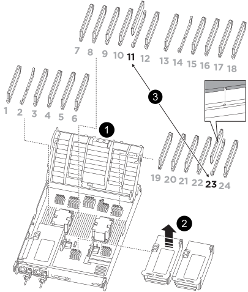

= 
:allow-uri-read: 

.단계
. 해당 라이저의 잠금 래치를 풀어 NVDIMM에 접근한 다음 라이저를 제거하십시오.
+

+
[cols="1,4"]
|===

 a| 
image:../media/icon_round_1.png["설명선 번호 1"]
 a| 
에어 덕트 커버

 a| 
image:../media/icon_round_2.png["설명선 번호 2"]
 a| 
라이저 2

 a| 
image:../media/icon_round_3.png["설명선 번호 3"]
 a| 
슬롯 11 및 23의 NVDIMM

|===
. NVDIMM을 교체 컨트롤러 모듈에 올바른 방향으로 삽입할 수 있도록 소켓에 있는 NVDIMM의 방향을 기록해 두십시오.
. NVDIMM의 양쪽에 있는 두 NVDIMM 이젝터 탭을 천천히 밀어서 슬롯에서 NVDIMM을 꺼낸 다음 소켓에서 NVDIMM을 밀어내어 한쪽에 둡니다.
+

NOTE: NVDIMM 회로 보드의 구성 요소에 압력이 가해질 수 있으므로 NVDIMM의 가장자리를 조심스럽게 잡습니다.

. 정전기 방지 포장용 백에서 교체용 NVDIMM을 꺼내고 NVDIMM을 모서리에 맞춰 잡은 다음 슬롯에 맞춥니다.
+
NVDIMM의 핀 사이의 노치가 소켓의 탭과 일직선이 되어야 합니다.

. NVDIMM을 설치할 슬롯을 찾습니다.
. NVDIMM을 슬롯에 똑바로 삽입합니다.
+
NVDIMM은 슬롯에 단단히 장착되지만 쉽게 장착할 수 있습니다. 그렇지 않은 경우 NVDIMM을 슬롯에 재정렬하고 다시 삽입합니다.

+

NOTE: NVDIMM이 균일하게 정렬되어 슬롯에 완전히 삽입되었는지 육안으로 검사합니다.

. 이젝터 탭이 NVDIMM 끝 부분의 노치 위에 끼워질 때까지 NVDIMM의 상단 가장자리를 조심스럽게 단단히 누릅니다.
. 컨트롤러 모듈에서 분리한 라이저를 모두 재설치합니다.
. 에어 덕트를 닫습니다.

