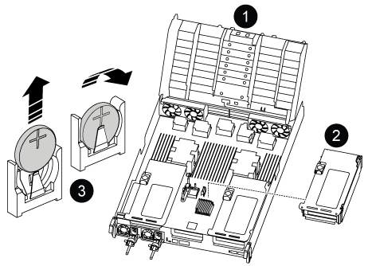

= 
:allow-uri-read: 

RTC 배터리 교체 절차는 컨트롤러가 오리지널 모델인지 VER2 모델인지에 따라 다릅니다.  아래 탭을 사용하여 컨트롤러 모델에 맞는 지침을 선택하십시오.

.이 작업에 대해
오리지널 컨트롤러의 경우 배터리는 라이저 2(중간 라이저) 아래에 있으며, VER2 컨트롤러의 경우 DIMM 슬롯 근처에 있습니다.

[role="tabbed-block"]
====
.원래 컨트롤러
--
.단계
. 컨트롤러 모듈에서 PCIe 라이저 2(중간 라이저)를 분리합니다.
+
.. PCIe 카드에 있을 수 있는 SFP 또는 QSFP 모듈을 모두 분리합니다.
.. 라이저 왼쪽의 라이저 잠금 래치를 팬 모듈 쪽으로 돌립니다.
+
라이저가 컨트롤러 모듈에서 약간 위로 올라갑니다.

.. 라이저를 위로 들어 올리고 팬을 향해 이동시키고 라이저의 판금 립이 컨트롤러 모듈의 모서리에서 분리되도록 한 다음, 라이저를 컨트롤러 모듈에서 들어 올린 다음 안정적이고 평평한 표면에 놓습니다.
+
image::../media/drw_a800_riser_2_3_remove.png[라이저 2를 분리합니다]

+
[cols="1,4"]
|===

 a| 
image:../media/icon_round_1.png["설명선 번호 1"]
 a| 
에어 덕트

 a| 
image:../media/icon_round_2.png["설명선 번호 2"]
 a| 
라이저 2(중앙 라이저) 잠금 래치

|===

. 라이저 2에서 RTC 배터리를 찾습니다.
+

+
[cols="1,4"]
|===

 a| 
image:../media/icon_round_1.png["설명선 번호 1"]
 a| 
에어 덕트

 a| 
image:../media/icon_round_2.png["설명선 번호 2"]
 a| 
라이저 2

 a| 
image:../media/icon_round_3.png["설명선 번호 3"]
 a| 
RTC 배터리 및 하우징

|===
. 배터리를 홀더에서 조심스럽게 밀어내고 홀더에서 돌린 다음 홀더에서 들어 꺼냅니다.
+

NOTE: 배터리함을 홀더에서 분리할 때 배터리의 극성에 유의하십시오. 배터리에는 플러스 기호가 표시되어 있으며 홀더에 올바르게 위치해야 합니다. 홀더 근처에 있는 더하기 기호는 배터리를 어떻게 배치해야 하는지 알려줍니다.

. 정전기 방지 운송용 백에서 교체용 배터리를 제거합니다.
. RTC 배터리의 극성을 확인한 다음 배터리를 비스듬히 기울이고 아래로 눌러 홀더에 삽입합니다.
. 배터리를 육안으로 검사하여 홀더가 완전히 장착되어 있고 극성이 올바른지 확인하십시오.
. 라이저를 컨트롤러 모듈에 설치합니다.
+
.. 라이저의 립을 컨트롤러 모듈 판금의 밑면에 맞춥니다.
.. 라이저를 컨트롤러 모듈의 핀을 따라 이동한 다음 라이저를 컨트롤러 모듈에 내려 놓습니다.
.. 잠금 래치를 아래로 돌려 잠금 위치로 클릭합니다.
+
잠금 래치가 잠기면 잠금 래치가 라이저 윗면과 맞닿고 라이저는 컨트롤러 모듈에 똑바로 앉습니다.

.. PCIe 카드에서 제거된 SFP 모듈을 모두 재장착합니다.

--
.VER2 컨트롤러
--
.단계
. DIMM 근처에서 RTC 배터리를 찾습니다.
+
image::../media/drw_a800_rtc_battery_replace_v2.png[RTC 배터리를 탈거한 후 교체합니다]

+
[cols="1,4"]
|===

 a| 
image:../media/icon_round_1.png["설명선 번호 1"]
 a| 
에어 덕트

 a| 
image:../media/icon_round_2.png["설명선 번호 2"]
 a| 
RTC 배터리 및 하우징

|===
. 배터리를 홀더에서 조심스럽게 밀어내고 홀더에서 돌린 다음 홀더에서 들어 꺼냅니다.
+

NOTE: 배터리함을 홀더에서 분리할 때 배터리의 극성에 유의하십시오. 배터리에는 플러스 기호가 표시되어 있으며 홀더에 올바르게 위치해야 합니다. 홀더 근처에 있는 더하기 기호는 배터리를 어떻게 배치해야 하는지 알려줍니다.

. 정전기 방지 운송용 백에서 교체용 배터리를 제거합니다.
. RTC 배터리의 극성을 확인한 다음 배터리를 비스듬히 기울이고 아래로 눌러 홀더에 삽입합니다.
. 배터리를 육안으로 검사하여 홀더가 완전히 장착되어 있고 극성이 올바른지 확인하십시오.

--
====