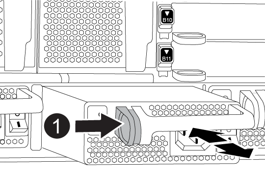
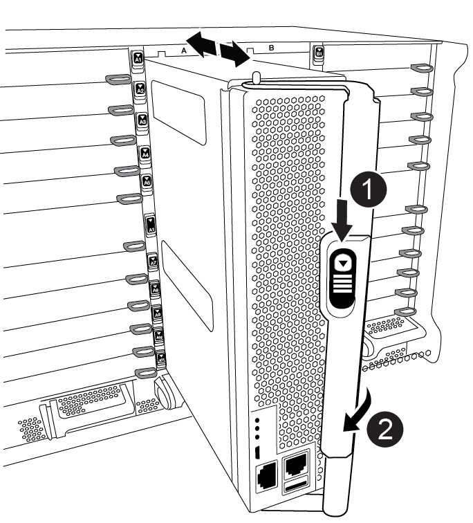

= 1단계: 전원 공급 장치를 분리합니다
:allow-uri-read: 

섀시를 교체하려면 손상된 섀시에서 구성 요소를 분리하여 교체 섀시에 설치해야 합니다.

== 1단계: 전원 공급 장치를 분리합니다

섀시 교체 시 전원 공급 장치를 분리할 때는 손상된 섀시 뒷면에서 전원 공급 장치 4개를 끄고 분리한 다음 분리합니다.

. 아직 접지되지 않은 경우 올바르게 접지하십시오.
. 전원 공급 장치를 끄고 전원 케이블을 뽑습니다.
+
.. 전원 공급 장치의 전원 스위치를 끕니다.
.. 전원 케이블 고정 장치를 연 다음 전원 공급 장치에서 전원 케이블을 뽑습니다.
.. 전원에서 전원 케이블을 뽑습니다.

. 전원 공급 장치 손잡이의 테라 코타 잠금 단추를 누른 상태에서 전원 공급 장치를 섀시에서 당겨 빼냅니다.
+

NOTE: 전원 공급 장치를 분리할 때는 항상 두 손을 사용하여 무게를 지탱하십시오.

+
.애니메이션 - PSU 제거/설치
video::6d0eee92-72e2-4da4-a4fa-adf9016b57ff[panopto]
+

+
[cols="10,90"]
|===

 a| 
image:../media/legend_icon_01.png["설명선 번호 1"]
 a| 
잠금 버튼

|===
. 나머지 전원 공급 장치에 대해 위의 단계를 반복합니다.

== 2단계: 팬을 분리합니다

섀시를 교체할 때 섀시 전면에 있는 6개의 팬 모듈을 분리해야 합니다.

. 아직 접지되지 않은 경우 올바르게 접지하십시오.
. 베젤의 양 측면에 있는 입구를 잡은 다음 섀시 프레임의 볼 스터드에서 베젤이 분리될 때까지 양손으로 베젤을 분리합니다(필요한 경우).
. 팬 모듈의 테라 코타 잠금 버튼을 누르고 팬 모듈을 섀시에서 똑바로 당겨 빼냅니다. 이때 다른 손으로 팬 모듈을 받칩니다.
+

NOTE: 팬 모듈이 단락되었습니다. 팬 모듈이 갑자기 섀시에서 떨어져 다치지 않도록 항상 다른 손으로 팬 모듈의 하단을 지지하십시오.

+
.애니메이션 - 팬 제거/설치
video::3c3c8d93-b48e-4554-87c8-adf9016af819[panopto]
+
image::../media/drw_a900_remove_install_fan.png[팬 분리 또는 설치]

+
[cols="10,90"]
|===

 a| 
image:../media/legend_icon_01.png["설명선 번호 1"]
 a| 
테라 코타 잠금 버튼

 a| 
image:../media/legend_icon_02.png["설명선 번호 2"]
 a| 
팬을 섀시 안쪽으로/밖으로 밉니다

|===
. 팬 모듈을 따로 보관해 둡니다.
. 나머지 팬 모듈에 대해 위의 단계를 반복합니다.

== 3단계: 컨트롤러 모듈을 분리합니다

섀시를 교체하려면 손상된 섀시에서 컨트롤러 모듈 또는 모듈을 분리해야 합니다.

. 아직 접지되지 않은 경우 올바르게 접지하십시오.
. 손상된 컨트롤러 모듈에서 케이블을 뽑고 케이블이 연결된 위치를 추적합니다.
. 캠 손잡이의 테라 코타 잠금 버튼이 잠금 해제될 때까지 아래로 밉니다.
+
.애니메이션 - 컨트롤러를 제거합니다
video::256721fd-4c2e-40b3-841a-adf2000df5fa[panopto]
+

+
[cols="10,90"]
|===

 a| 
image:../media/legend_icon_01.png["설명선 번호 1"]
 a| 
캠 핸들 잠금 버튼

 a| 
image:../media/legend_icon_02.png["설명선 번호 2"]
 a| 
캠 핸들

|===
. 캠 핸들을 돌려 컨트롤러 모듈을 섀시에서 완전히 분리한 다음 컨트롤러 모듈을 섀시 밖으로 밉니다.
+
컨트롤러 모듈 하단을 섀시 밖으로 밀어낼 때 지지하는지 확인합니다.

. 컨트롤러 모듈을 안전한 곳에 따로 두고 섀시 슬롯을 기록해 두어 교체 섀시의 동일한 슬롯에 설치할 수 있도록 합니다.
. 섀시에 다른 컨트롤러 모듈이 있는 경우 이 단계를 반복합니다.

== 4단계: I/O 모듈을 분리합니다

NVRAM 모듈을 포함하여 손상된 섀시에서 I/O 모듈을 분리하려면 특정 단계를 수행하십시오.

. 아직 접지되지 않은 경우 올바르게 접지하십시오.
. 대상 I/O 모듈과 연결된 모든 케이블을 뽑습니다.
+
케이블을 어디에 연결했는지 알 수 있도록 케이블에 레이블을 지정해야 합니다.

. 섀시에서 대상 I/O 모듈을 분리합니다.
+
.. 문자 및 번호가 매겨진 캠 잠금 버튼을 누르십시오.
+
캠 잠금 버튼이 섀시에서 멀어져 있습니다.

.. 캠 래치가 수평 위치에 올 때까지 아래로 돌립니다.
+
I/O 모듈이 섀시에서 분리되어 I/O 슬롯에서 약 1.3cm 정도 이동합니다.

.. 모듈 면의 측면에 있는 당김 탭을 당겨 섀시에서 I/O 모듈을 분리합니다.
+
입출력 모듈이 있던 슬롯을 추적해야 합니다.

+
.애니메이션 - I/O 모듈 제거/설치
video::3a5b1f6e-15ec-40b4-bb2a-adf9016af7b6[panopto]
+
image:../media/drw_a900_remove_PCIe_module.png["PCIe 모듈 분리"]

+
[cols="10,90"]
|===

 a| 
image:../media/legend_icon_01.png["설명선 번호 1"]
 a| 
문자 및 숫자 I/O 캠 래치

 a| 
image:../media/legend_icon_02.png["설명선 번호 2"]
 a| 
I/O 캠 래치가 완전히 잠금 해제되었습니다

|===
. 입출력 모듈을 따로 보관해 둡니다.
. 손상된 섀시의 나머지 I/O 모듈에 대해 위의 단계를 반복합니다.

== 5단계: 디스테이징 컨트롤러 전원 모듈을 분리합니다

손상된 섀시 전면에서 2개의 디스테이징 컨트롤러 전원 모듈을 분리합니다.

. 아직 접지되지 않은 경우 올바르게 접지하십시오.
. 모듈 손잡이의 테라 코타 잠금 버튼을 누른 다음 DCPM을 섀시 밖으로 밀어냅니다.
+
.애니메이션 - DCPM 탈거/장착
video::ade18276-5dbc-4b91-9a0e-adf9016b4e55[panopto]
+
image::../media/drw_a900_remove_NV_battery.png[drw a900 NV 배터리를 제거합니다]

+
[cols="10,90"]
|===

 a| 
image:../media/legend_icon_01.png["설명선 번호 1"]
 a| 
DCPM 테라코타 잠금 버튼

|===
. DCPM을 안전한 장소에 두고 나머지 DCPM에 대해 이 단계를 반복합니다.

== 6단계: USB LED 모듈을 분리합니다

USB LED 모듈을 분리합니다.

.애니메이션 - USB를 제거/설치합니다
video::eb715462-cc20-454f-bcf9-adf9016af84e[panopto]
image::../media/drw_a900_remove_replace_LED_mod.png[drw a900 제거 LED 모드 교체]

[cols="10,90"]
|===

 a| 
image:../media/legend_icon_01.png["설명선 번호 1"]
 a| 
모듈을 꺼냅니다.

 a| 
image:../media/legend_icon_02.png["설명선 번호 2"]
 a| 
섀시 밖으로 밀어냅니다.

|===
. 손상된 섀시의 전면에서 DCPM 베이 바로 아래에 있는 USB LED 모듈을 찾습니다.
. 모듈 오른쪽에 있는 검은색 잠금 버튼을 눌러 섀시에서 모듈을 분리한 다음 손상된 섀시에서 모듈을 밀어 꺼냅니다.
. 모듈을 안전한 곳에 둡니다.

== 7단계: 섀시를 제거합니다

교체 섀시를 설치하려면 먼저 장비 랙 또는 시스템 캐비닛에서 기존 섀시를 분리해야 합니다.

. 섀시 장착 지점에서 나사를 분리합니다.
+

NOTE: 시스템이 시스템 캐비닛에 있는 경우 리어 타이 다운 브래킷을 분리해야 할 수 있습니다.

. 2-3명이 작업할 경우 손상된 섀시를 시스템 캐비닛의 랙 레일 또는 장비 랙의 _L_브라켓에서 밀어 분리한 다음 옆에 둡니다.
. 아직 접지되지 않은 경우 올바르게 접지하십시오.
. 2-3명의 직원을 사용하여 섀시를 시스템 캐비닛의 랙 레일 또는 장비 랙의 _L_브라켓에 부착하여 교체 섀시를 장비 랙 또는 시스템 캐비닛에 설치합니다.
. 섀시를 장비 랙 또는 시스템 캐비닛에 완전히 밀어 넣습니다.
. 손상된 섀시에서 분리한 나사를 사용하여 섀시의 전면을 장비 랙 또는 시스템 캐비닛에 고정합니다.
. 섀시 후면을 장비 랙 또는 시스템 캐비닛에 고정합니다.
. 케이블 관리 브래킷을 사용하는 경우 손상된 섀시에서 분리한 다음 교체용 섀시에 설치합니다.

== 8단계: 디스테이징 컨트롤러 전원 모듈을 설치합니다

교체 섀시가 랙 또는 시스템 캐비닛에 설치된 경우 디스테이징 컨트롤러 전원 모듈을 다시 설치해야 합니다.

. 아직 접지되지 않은 경우 올바르게 접지하십시오.
. DCPM의 끝을 섀시 구멍에 맞춘 다음 딸깍 소리가 나면서 제자리에 고정될 때까지 조심스럽게 섀시에 밀어 넣습니다.
+

NOTE: 모듈 및 슬롯은 키 입력되어 있습니다. 모듈을 입구에 강제로 밀어 넣지 마십시오. 모듈이 쉽게 들어가지 않으면 모듈을 다시 정렬하고 섀시에 밀어 넣습니다.

. 나머지 DCPM에 대해 이 단계를 반복합니다.

== 9단계: 섀시에 팬을 설치합니다

섀시를 교체할 때 팬 모듈을 설치하려면 특정 작업 순서를 수행해야 합니다.

. 아직 접지되지 않은 경우 올바르게 접지하십시오.
. 교체용 팬 모듈의 가장자리를 섀시의 입구에 맞춘 다음 제자리에 고정될 때까지 섀시에 밀어 넣습니다.
+
활성 시스템에 팬 모듈이 성공적으로 섀시에 삽입되면 황색 주의 LED가 네 번 깜박입니다.

. 나머지 팬 모듈에 대해 이 단계를 반복합니다.
. 베젤을 볼 스터드에 맞춘 다음 베젤을 볼 스터드에 부드럽게 밀어 넣습니다.

== 10단계: 입출력 모듈 설치

손상된 섀시의 NVRAM 모듈을 비롯한 I/O 모듈을 설치하려면 특정 단계를 수행하십시오.

교체 섀시의 해당 슬롯에 I/O 모듈을 설치할 수 있도록 섀시가 설치되어 있어야 합니다.

. 아직 접지되지 않은 경우 올바르게 접지하십시오.
. 교체용 섀시를 랙 또는 캐비닛에 설치한 후, I/O 모듈을 문자 및 번호가 매겨진 I/O 캠 래치가 맞물릴 때까지 슬롯에 부드럽게 밀어 넣어 교체 섀시의 해당 슬롯에 I/O 모듈을 설치합니다. 그런 다음 I/O 캠 래치를 끝까지 밀어 모듈을 제자리에 고정합니다.
. 필요에 따라 입출력 모듈을 다시 장착합니다.
. 옆에 둔 나머지 I/O 모듈에 대해 앞의 단계를 반복합니다.
+

NOTE: 손상된 섀시에 빈 I/O 패널이 있는 경우 지금 교체 섀시로 이동하십시오.

== 11단계: 전원 공급 장치를 설치합니다

섀시를 교체할 때 전원 공급 장치를 설치하려면 교체용 섀시에 전원 공급 장치를 설치하고 전원에 연결해야 합니다.

. 아직 접지되지 않은 경우 올바르게 접지하십시오.
. 전원 공급 장치 로커가 꺼짐 위치에 있는지 확인합니다.
. 양손으로 전원 공급 장치의 가장자리를 시스템 섀시의 입구에 맞춘 다음 전원 공급 장치가 제자리에 고정될 때까지 조심스럽게 섀시에 밀어 넣습니다.
+
전원 공급 장치는 키 입력 방식이며 한 방향으로만 설치할 수 있습니다.

+

IMPORTANT: 전원 공급 장치를 시스템에 밀어 넣을 때 과도한 힘을 가하지 마십시오. 커넥터가 손상될 수 있습니다.

. 전원 케이블을 다시 연결하고 전원 케이블 잠금 장치를 사용하여 전원 공급 장치에 고정합니다.
+

IMPORTANT: 전원 공급 장치에는 전원 케이블만 연결하십시오. 이때 전원 케이블을 전원에 연결하지 마십시오.

. 나머지 전원 공급 장치에 대해 위의 단계를 반복합니다.

== 12단계: USB LED 모듈을 설치합니다

교체용 섀시에 USB LED 모듈을 설치합니다.

. 교체용 섀시 전면에서 DCPM 베이 바로 아래에 있는 USB LED 모듈 슬롯을 찾습니다.
. 모듈의 모서리를 USB LED 베이에 맞추고 딸깍 소리가 나면서 제자리에 고정될 때까지 모듈을 조심스럽게 섀시에 밀어 넣습니다.

== 13단계: 컨트롤러를 설치합니다

컨트롤러 모듈 및 기타 구성 요소를 교체 섀시에 설치한 후 부팅합니다.

. 아직 접지되지 않은 경우 올바르게 접지하십시오.
. 전원 공급 장치를 다른 전원에 연결한 다음 전원을 켭니다.
. 컨트롤러 모듈의 끝을 섀시의 입구에 맞춘 다음 컨트롤러 모듈을 반쯤 조심스럽게 시스템에 밀어 넣습니다.
+

NOTE: 지시가 있을 때까지 컨트롤러 모듈을 섀시에 완전히 삽입하지 마십시오.

. 콘솔을 컨트롤러 모듈에 다시 연결하고 관리 포트를 다시 연결합니다.
. 캠 핸들을 열린 위치에 둔 상태에서 컨트롤러 모듈을 섀시에 밀어 넣고 미드플레인과 완전히 연결될 때까지 컨트롤러 모듈을 단단히 밀어 넣은 다음 딸깍 소리가 나면서 잠금 위치에 고정될 때까지 캠 핸들을 닫습니다.
+

IMPORTANT: 컨트롤러 모듈을 섀시에 밀어 넣을 때 과도한 힘을 가하지 마십시오. 커넥터가 손상될 수 있습니다.

+
컨트롤러 모듈이 섀시에 완전히 장착되면 바로 부팅이 시작됩니다.

. 이전 단계를 반복하여 두 번째 컨트롤러를 교체 섀시에 설치합니다.
. 각 컨트롤러를 부팅합니다.

