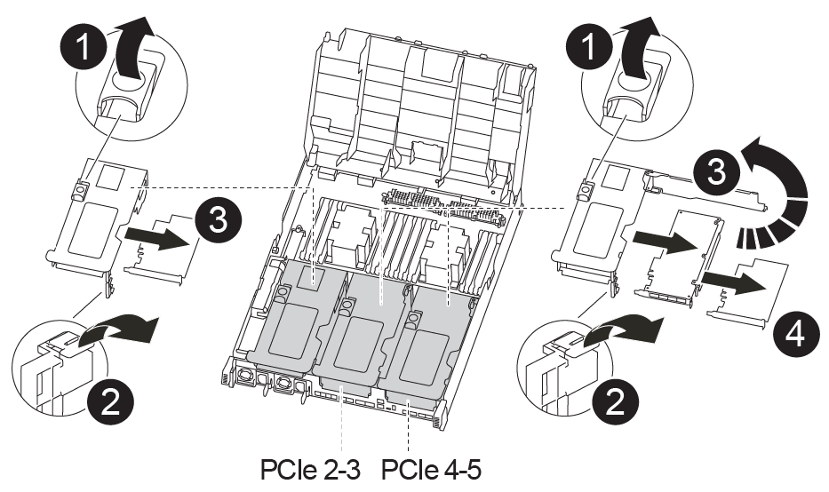

= 
:allow-uri-read: 

컨트롤러 교체 프로세스의 일부로 PCIe 라이저 및 메자닌 카드를 손상된 컨트롤러 모듈에서 교체 컨트롤러 모듈로 이동해야 합니다.

다음 애니메이션, 그림 또는 기록된 단계를 사용하여 장애가 있는 컨트롤러 모듈에서 교체 컨트롤러 모듈로 PCIe 라이저 및 메자닌 카드를 이동할 수 있습니다.

이동 PCIe 라이저 1 및 2(왼쪽 및 가운데 라이저):

.애니메이션 - PCI 라이저 1과 2를 이동합니다
video::f4ee1d4d-6029-4fe6-a063-aad9012f170b[panopto]
메자닌 카드 및 라이저 3(오른쪽 라이저) 이동:

.애니메이션 - 메자닌 카드 및 라이저 3을 이동합니다
video::b0c3b575-3434-4e00-a421-aad9012f2e9e[panopto]

[cols="10,90"]
|===

 a| 
image:../media/icon_round_1.png["설명선 번호 1"]
 a| 
라이저 잠금 래치

 a| 
image:../media/icon_round_2.png["설명선 번호 2"]
 a| 
PCI 카드 잠금 래치

 a| 
image:../media/icon_round_3.png["설명선 번호 3"]
 a| 
PCI 잠금 플레이트

 a| 
image:../media/icon_round_4.png["설명선 번호 4"]
 a| 
PCI 카드

|===
.단계
. PCIe 라이저 1과 2를 손상된 컨트롤러 모듈에서 교체 컨트롤러 모듈로 이동합니다.
+
.. PCIe 카드에 있을 수 있는 SFP 또는 QSFP 모듈을 모두 분리합니다.
.. 라이저 왼쪽의 라이저 잠금 래치를 위로 돌려 공기 덕트 쪽으로 돌립니다.
+
라이저가 컨트롤러 모듈에서 약간 위로 올라갑니다.

.. 라이저를 들어 올린 다음 교체용 컨트롤러 모듈로 이동합니다.
.. 라이저를 라이저 소켓의 측면에 있는 핀에 맞춘 다음, 라이저를 핀 아래로 내리고 라이저를 마더보드의 소켓에 똑바로 밀어 넣은 다음 래치를 라이저의 판금과 같은 높이로 돌립니다.
.. 라이저 번호 2에 대해 이 단계를 반복합니다.

. 라이저 번호 3을 분리하고 메자닌 카드를 분리한 다음 두 카드를 모두 교체 컨트롤러 모듈에 설치합니다.
+
.. PCIe 카드에 있을 수 있는 SFP 또는 QSFP 모듈을 모두 분리합니다.
.. 라이저 왼쪽의 라이저 잠금 래치를 위로 돌려 공기 덕트 쪽으로 돌립니다.
+
라이저가 컨트롤러 모듈에서 약간 위로 올라갑니다.

.. 라이저를 들어 올린 다음 안정적이고 평평한 곳에 둡니다.
.. 메자닌 카드의 손잡이 나사를 풀고 카드를 소켓에서 직접 조심스럽게 들어 올린 다음 교체용 컨트롤러 모듈로 이동합니다.
.. 교체 컨트롤러에 메자닌(메자닌)를 설치하고 나비 나사로 고정합니다.
.. 교체용 컨트롤러 모듈에 세 번째 라이저를 설치합니다.

