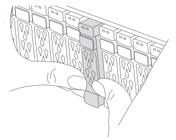
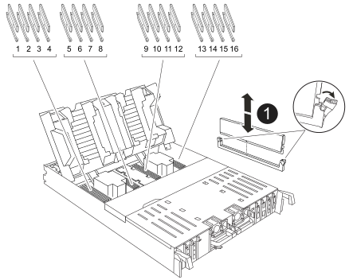

= 1단계: 컨트롤러 모듈을 분리합니다
:allow-uri-read: 

컨트롤러를 교체하려면 손상된 컨트롤러를 분리하고 FRU 구성 요소를 손상된 컨트롤러 모듈에서 교체용 컨트롤러 모듈로 이동한 다음 섀시에 교체용 컨트롤러 모듈을 설치한 다음 시스템을 유지 관리 모드로 부팅해야 합니다.

== 1단계: 컨트롤러 모듈을 분리합니다

컨트롤러 모듈을 교체하거나 컨트롤러 모듈 내부에 있는 구성요소를 교체할 때 섀시에서 컨트롤러 모듈을 분리해야 합니다.

. 섀시 앞면에서 엄지 손가락으로 각 드라이브를 단단히 눌러 정지가 느껴질 때까지 밀어넣습니다. 이렇게 하면 드라이브가 섀시 중앙판에 단단히 고정됩니다.
+

. 장애가 있는 컨트롤러 모듈 후면의 슬롯 4/5에 있는 상태 LED가 꺼져 있는지 황색 NVRAM을 확인합니다. NV 아이콘을 찾습니다.
+
image::../media/drw_a1K-70-90_nvram-led_ieops-1463.svg[NVRAM 주의 및 상태 LED 위치 그래픽]

+
[cols="1,4"]
|===

 a| 
image:../media/legend_icon_01.svg["설명선 번호 1, 너비 = 30px"]
 a| 
NVRAM 상태 LED

 a| 
image:../media/legend_icon_02.svg["설명선 번호 1, 너비 = 30px"]
 a| 
NVRAM 주의 LED

|===
+

NOTE: NVRAM 상태 LED가 깜박이는 경우 컨트롤러 모듈이 올바르게 전환되지 않았거나 중지되었음을 의미할 수 있습니다(커밋되지 않은 데이터). 손상된 컨트롤러 모듈이 파트너 컨트롤러 모듈에 의해 성공적으로 인수되지 않은 경우 이 절차를 계속하기 전에 에 문의하십시오 https://mysupport.netapp.com/site/global/dashboard["NetApp 지원"] .

+
손상된 컨트롤러 모듈에서 NVRAM 상태 LED의 일반적인 동작은 다음과 같습니다.

+
** 컨트롤러 모듈에서 전원이 제거되고 스토리지 시스템이 "반환 대기 중" 상태이거나 컨트롤러 모듈이 테이크오버되거나 제대로 중지되지 않은 경우(커밋되지 않은 데이터) NVRAM 상태 LED가 깜박입니다.
** 컨트롤러 모듈이 섀시에서 분리되면 NVRAM 상태 LED가 깜박이며 컨트롤러 모듈이 제대로 전환되지 않거나 정지될 수 있습니다(커밋되지 않은 데이터). 컨트롤러 모듈이 파트너 컨트롤러 모듈이나 손상된 컨트롤러 모듈에 의해 완전히 테이크오버되었는지 확인합니다. `waiting for giveback` 그런 다음 깜박이는 LED를 무시할 수 있으며 컨트롤러 모듈을 섀시에서 분리할 수 있습니다.

. 아직 접지되지 않은 경우 올바르게 접지하십시오.
. 컨트롤러 모듈 전원 공급 장치(PSU)에서 컨트롤러 모듈 전원 공급 장치 케이블을 뽑습니다.
+

NOTE: 시스템에 DC 전원이 있는 경우 PSU에서 전원 블록을 분리합니다.

. 컨트롤러 모듈에서 시스템 케이블과 SFP 및 QSFP 모듈(필요한 경우)을 뽑아 케이블이 연결된 위치를 추적합니다.
+
케이블 관리 장치에 케이블을 남겨 두면 케이블 관리 장치를 다시 설치할 때 케이블이 정리됩니다.

. 컨트롤러 모듈에서 케이블 관리 장치를 분리합니다.
. 양쪽 잠금 래치를 아래로 누른 다음 두 래치를 동시에 아래로 돌립니다.
+
컨트롤러 모듈이 섀시에서 약간 꺼냅니다.

+
image::../media/drw_a70-90_pcm_remove_replace_ieops-1365.svg[컨트롤러 분리 그래픽]

+
[cols="1,4"]
|===

 a| 
image:../media/legend_icon_01.svg["설명선 번호 1, 너비 = 30px"]
| 잠금 래치 

 a| 
image:../media/legend_icon_02.svg["설명선 번호 2, 너비 = 30px"]
 a| 
잠금 핀

|===
. 컨트롤러 모듈을 섀시에서 밀어 꺼내고 평평하고 안정적인 표면에 놓습니다.
+
컨트롤러 모듈 하단을 섀시 밖으로 밀어낼 때 지지하는지 확인합니다.

== 2단계: 전원 공급 장치를 이동합니다

전원 공급 장치를 교체 컨트롤러로 이동합니다.

. 잠금 탭을 누른 상태에서 컨트롤러 모듈에서 전원 공급 장치를 당겨 빼낼 수 있도록 캠 핸들을 돌립니다.
+

CAUTION: 전원 공급 장치가 단락되었습니다. 컨트롤러 모듈에서 분리할 때 컨트롤 모듈이 갑자기 흔들리지 않고 다치지 않도록 항상 두 손을 사용하여 지지하십시오.

+
image::../media/drw_a70-90_psu_remove_replace_ieops-1368.svg[PSU를 제거합니다]

+
[cols="1,4"]
|===

 a| 
image::../media/legend_icon_01.svg[설명선 번호 1]
| 테라코타 PSU 잠금 탭 

 a| 
image::../media/legend_icon_02.svg[설명선 번호 2]
 a| 
전원 공급 장치

|===
. 전원 공급 장치를 새 컨트롤러 모듈로 이동한 다음 설치합니다.
. 양손으로 전원 공급 장치의 가장자리를 컨트롤러 모듈의 입구에 맞춘 다음 잠금 탭이 딸깍 소리가 나면서 제자리에 고정될 때까지 전원 공급 장치를 컨트롤러 모듈에 부드럽게 밀어 넣습니다.
+
전원 공급 장치는 내부 커넥터에만 제대로 연결되어 한 방향으로만 제자리에 고정됩니다.

+

NOTE: 내부 커넥터의 손상을 방지하려면 전원 공급 장치를 시스템에 밀어 넣을 때 과도한 힘을 가하지 마십시오.

== 3단계: 팬을 이동합니다

팬 모듈을 교체용 컨트롤러 모듈로 이동합니다.

. 팬 모듈 측면에 있는 잠금 탭을 잡고 팬 모듈을 컨트롤러 모듈 밖으로 똑바로 들어 올려 팬 모듈을 분리합니다.
+
image::../media/drw_a70-90_fan_remove_replace_ieops-1366.svg[팬을 분리합니다]

+
[cols="1,4"]
|===

 a| 
image::../media/legend_icon_01.svg[설명선 번호 1]
 a| 
팬 잠금 탭

 a| 
image::../media/legend_icon_02.svg[설명선 번호 2]
 a| 
팬 모듈

|===
. 팬 모듈을 교체용 컨트롤러 모듈로 옮긴 다음 팬 모듈의 가장자리를 컨트롤러 모듈의 입구에 맞춘 다음 잠금 래치가 제자리에 고정될 때까지 팬 모듈을 컨트롤러 모듈로 밀어 넣습니다.
. 나머지 팬 모듈에 대해 이 단계를 반복합니다.

== 4단계: NV 배터리를 이동합니다

NV 배터리를 교체 컨트롤러 모듈로 이동합니다.

. 컨트롤러 모듈 중간에 있는 에어 덕트 커버를 열고 NV 배터리를 찾습니다.
+
image::../media/drw_a70-90_remove_replace_nvmembat_ieops-1369.svg[NV 배터리를 이동합니다]

+
[cols="1,4"]
|===

 a| 
image::../media/legend_icon_01.svg[설명선 번호 1]
| NV 배터리 에어 덕트 

 a| 
image::../media/legend_icon_02.svg[설명선 번호 2]
 a| 
NV 배터리 팩 플러그

|===
+
*주의:* 시스템을 중지하면 콘텐츠를 플래시 메모리로 디스테이징하는 동안 NV 모듈 LED가 깜박입니다. 디스테이징이 완료되면 LED가 꺼집니다.

. 배터리를 들어 올려 배터리 플러그에 접근합니다.
. 배터리 플러그의 전면에 있는 클립을 눌러 소켓에서 플러그를 분리한 다음 소켓에서 배터리 케이블을 뽑습니다.
. 에어 덕트 및 컨트롤러 모듈에서 배터리를 들어 올립니다.
. 배터리 팩을 교체용 컨트롤러 모듈로 이동한 다음 교체용 컨트롤러 모듈에 설치합니다.
+
.. 교체용 컨트롤러 모듈에서 NV 배터리 공기 덕트를 엽니다.
.. 배터리 플러그를 소켓에 꽂고 플러그가 제자리에 잠겼는지 확인하십시오.
.. 배터리 팩을 슬롯에 삽입하고 배터리 팩을 단단히 눌러 제자리에 고정되었는지 확인합니다.
.. NV 배터리 에어 덕트를 닫으십시오.

== 5단계: 시스템 DIMM을 이동합니다

DIMM을 교체용 컨트롤러 모듈로 이동합니다.

. 컨트롤러 상단에 있는 컨트롤러 에어 덕트를 엽니다.
+
.. 에어 덕트 끝의 오목한 부분에 손가락을 삽입합니다.
.. 에어 덕트를 들어 올려 최대한 위로 돌립니다.

. 마더보드에서 시스템 DIMM을 찾습니다.
+

+
[cols="1,4"]
|===

 a| 
image::../media/legend_icon_01.svg[설명선 번호 1]
| 시스템 DIMM입니다 
|===
. DIMM을 올바른 방향으로 교체 컨트롤러 모듈에 삽입할 수 있도록 소켓에 있는 DIMM의 방향을 기록해 두십시오.
. DIMM의 양쪽에 있는 두 개의 DIMM 이젝터 탭을 천천히 밀어 슬롯에서 DIMM을 꺼낸 다음 슬롯에서 DIMM을 밀어 꺼냅니다.
+

NOTE: DIMM 회로 보드의 구성 요소에 압력이 가해질 수 있으므로 DIMM의 가장자리를 조심스럽게 잡으십시오.

. DIMM을 설치할 교체용 컨트롤러 모듈에서 슬롯을 찾습니다.
. DIMM을 슬롯에 똑바로 삽입합니다.
+
DIMM은 슬롯에 단단히 장착되지만 쉽게 장착할 수 있습니다. 그렇지 않은 경우 DIMM을 슬롯에 재정렬하고 다시 삽입합니다.

+

NOTE: DIMM이 균일하게 정렬되어 슬롯에 완전히 삽입되었는지 육안으로 검사합니다.

. 이젝터 탭이 DIMM 끝 부분의 노치 위에 끼워질 때까지 DIMM의 상단 가장자리를 조심스럽게 단단히 누릅니다.
. 나머지 DIMM에 대해 이 단계를 반복합니다.
. 컨트롤러 공기 덕트를 닫습니다.

== 6단계: 입출력 모듈을 이동합니다

입출력 모듈을 교체용 컨트롤러 모듈로 이동합니다.

image::../media/drw_a70_90_io_remove_replace_ieops-1532.svg[입출력 모듈을 분리합니다]

[cols="1,4"]
|===

 a| 
image::../media/legend_icon_01.svg[설명선 번호 1]
| I/O 모듈 캠 레버 
|===
. 대상 I/O 모듈의 케이블을 뽑습니다.
+
케이블을 어디에 연결했는지 알 수 있도록 케이블에 레이블을 지정해야 합니다.

. 케이블 관리 ARM 안쪽에 있는 단추를 당기고 아래로 돌려 케이블 관리 ARM를 아래로 돌립니다.
. 컨트롤러 모듈에서 I/O 모듈을 분리합니다.
+
.. 대상 I/O 모듈 캠 래치 버튼을 누릅니다.
+
캠 레버가 컨트롤러 모듈에서 멀리 이동합니다.

.. 캠 래치를 최대한 아래로 돌립니다. 수평 모듈의 경우 캠을 모듈에서 최대한 멀리 돌립니다.
.. 손가락을 캠 레버 입구에 넣고 모듈을 컨트롤러 모듈에서 당겨 모듈을 분리합니다.
+
입출력 모듈이 있던 슬롯을 추적해야 합니다.

.. I/O 캠 래치가 I/O 캠 핀과 맞물리기 시작할 때까지 I/O 모듈을 슬롯에 부드럽게 밀어 넣은 다음 I/O 캠 래치를 위로 끝까지 밀어 모듈을 제자리에 잠급니다.

. 이 단계를 반복하여 슬롯 6 및 7에 있는 모듈을 제외한 나머지 입출력 모듈을 교체용 컨트롤러 모듈로 이동합니다.
+

NOTE: 슬롯 6 및 7에서 입출력 모듈을 이동하려면 이러한 입출력 모듈이 포함된 캐리어를 장애가 있는 컨트롤러 모듈에서 교체용 컨트롤러 모듈로 이동해야 합니다.

. 슬롯 6 및 7에 있는 I/O 모듈이 포함된 캐리어를 교체용 컨트롤러 모듈로 이동합니다.
+
.. 캐리어 핸들의 맨 오른쪽 손잡이에 있는 버튼을 누릅니다. .. 손상된 컨트롤러 모듈에서 캐리어를 밀어 꺼냅니다. 손상된 컨트롤러 모듈과 같은 위치에 있는 교체용 컨트롤러 모듈에 캐리어를 삽입합니다.
.. 캐리어가 제자리에 잠길 때까지 캐리어를 교체용 컨트롤러 모듈 안으로 부드럽게 밀어 넣습니다.

== 7단계: 시스템 관리 모듈을 이동합니다

시스템 관리 모듈을 교체용 컨트롤러 모듈로 이동합니다.

image::../media/drw_a70-90_sys-mgmt_replace_ieops-1373.svg[시스템 관리 모듈을 교체합니다]

[cols="1,4"]
|===

 a| 
image::../media/legend_icon_01.svg[설명선 번호 1]
 a| 
시스템 관리 모듈 캠 래치

 a| 
image::../media/legend_icon_02.svg[설명선 번호 2]
 a| 
부트 미디어 잠금 버튼

 a| 
image::../media/legend_icon_03.svg[설명선 번호 3]
 a| 
교체 시스템 관리 모듈

|===
. 손상된 컨트롤러 모듈에서 시스템 관리 모듈을 분리합니다.
+
.. 시스템 관리 캠 버튼을 누릅니다. 캠 레버가 섀시에서 멀어집니다.
.. 캠 레버를 완전히 아래로 돌립니다.
.. 손가락을 캠 레버에 대고 모듈을 똑바로 당겨 시스템에서 빼냅니다.

. 시스템 관리 모듈을 장애가 있는 컨트롤러 모듈의 슬롯과 동일한 슬롯에 있는 교체 컨트롤러 모듈에 설치합니다.
+
.. 시스템 관리 모듈의 가장자리를 시스템 입구에 맞추고 컨트롤러 모듈에 부드럽게 밀어 넣습니다.
.. 캠 래치가 I/O 캠 핀과 맞물리기 시작할 때까지 모듈을 슬롯에 부드럽게 밀어 넣은 다음 캠 래치를 위로 끝까지 돌려 모듈을 제자리에 잠급니다.

== 8단계: NVRAM 모듈을 이동합니다

NVRAM 모듈을 교체용 컨트롤러 모듈로 이동합니다.

image::../media/drw_a70-90_nvram12_remove_replace_ieops-1370.svg[NVRAM12 모듈 및 DIMM을 분리합니다]

[cols="1,4"]
|===

 a| 
image:../media/legend_icon_01.svg["설명선 번호 1, 너비 = 30px"]
| 캠 잠금 버튼 

 a| 
image:../media/legend_icon_02.svg["설명선 번호 2, 너비 = 30px"]
 a| 
DIMM 잠금 탭

|===
. 손상된 컨트롤러 모듈에서 NVRAM 모듈을 분리합니다.
+
.. 캠 래치 버튼을 누릅니다.
+
캠 버튼이 섀시에서 멀어져 있습니다.

.. 캠 래치를 끝까지 돌립니다.
.. 캠 레버 입구에 손가락을 넣고 엔클로저 밖으로 모듈을 당겨 엔클로저에서 NVRAM 모듈을 분리합니다.

. NVRAM 모듈을 교체용 컨트롤러 모듈의 슬롯 4/5에 설치합니다.
+
.. 모듈을 슬롯 4/5의 섀시 입구 가장자리에 맞춥니다.
.. 모듈을 조심스럽게 슬롯에 완전히 밀어 넣은 다음 캠 래치를 위로 끝까지 밀어 모듈을 제자리에 잠급니다.

== 9단계: 컨트롤러 모듈을 설치합니다

컨트롤러 모듈을 다시 설치하고 재부팅합니다.

. 공기 덕트를 끝까지 돌려 완전히 닫혔는지 확인합니다.
+
컨트롤러 모듈 판금과 수평을 이루어야 합니다.

. 컨트롤러 모듈의 끝을 섀시의 입구에 맞춘 다음 컨트롤러 모듈을 반쯤 조심스럽게 시스템에 밀어 넣습니다.
+

NOTE: 지시가 있을 때까지 컨트롤러 모듈을 섀시에 완전히 삽입하지 마십시오.

. 필요에 따라 시스템을 다시 연결합니다.
+
트랜시버(QSFP 또는 SFP)를 제거한 경우 광섬유 케이블을 사용하는 경우 트랜시버를 다시 설치해야 합니다.

. 컨트롤러 모듈 재설치를 완료합니다.
+
.. 컨트롤러 모듈이 중앙판과 만나 완전히 장착될 때까지 섀시 안으로 단단히 밀어 넣습니다.
+
컨트롤러 모듈이 완전히 장착되면 잠금 래치가 상승합니다.

+

NOTE: 커넥터가 손상되지 않도록 컨트롤러 모듈을 섀시에 밀어 넣을 때 과도한 힘을 가하지 마십시오.

+
.. 잠금 래치를 위쪽으로 돌려 잠금 위치에 놓습니다.

. 전원 코드를 전원 공급 장치에 연결합니다.
+

NOTE: DC 전원 공급 장치가 있는 경우 컨트롤러 모듈이 섀시에 완전히 장착된 후 전원 공급 장치에 전원 블록을 다시 연결합니다.

+
전원이 복원되면 컨트롤러 모듈이 부팅됩니다. LOADER 프롬프트로 부팅되는 경우 명령을 사용하여 컨트롤러를 `boot_ontap` 재부팅합니다.

. 'storage failover modify -node local -auto-반환 true' 명령을 사용하여 자동 반환 기능을 해제한 경우 이 반환 기능을 복구합니다.
. AutoSupport가 설정된 경우 명령을 사용하여 자동 케이스 생성을 복원/억제 `system node autosupport invoke -node * -type all -message MAINT=END` 해제합니다.
. 케이블 관리 장치를 다시 설치하고 컨트롤러를 다시 연결하십시오.

