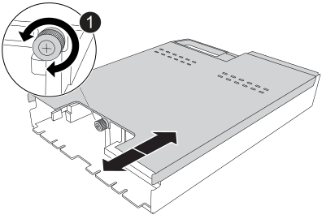

= 1단계: 손상된 컨트롤러를 종료합니다
:allow-uri-read: 

NVRAM12-EX 모듈은 NVRAM12 하드웨어와 현장 교체 가능한 DIMM으로 구성됩니다. 고장난 NVRAM12-EX 모듈, DIMM 또는 NVRAM12-EX 모듈 내부의 NVRAM 배터리를 교체할 수 있습니다.

.시작하기 전에
* 교체 부품이 있는지 확인합니다. 장애가 발생한 구성 요소는 NetApp로부터 받은 교체 구성 요소로 교체해야 합니다.
* 스토리지 시스템의 다른 모든 구성 요소가 제대로 작동하는지 확인하고, 작동하지 않는 경우 에 문의하십시오 https://support.netapp.com["NetApp 지원"].
+

NOTE: NVRAM12-EX 모듈을 교체하기 전에, 교체 작업을 진행하기 전에 손상된 컨트롤러의 전원을 반드시 끄십시오.

== 1단계: 손상된 컨트롤러를 종료합니다

컨트롤러를 종료하거나 손상된 컨트롤러를 인수합니다.

손상된 컨트롤러의 기능을 인계받아 중지시키면 정상적인 컨트롤러가 손상된 컨트롤러의 스토리지에서 데이터를 계속 제공할 수 있습니다. 이를 위해 AutoSupport에서 자동 케이스 생성을 억제하고 자동 반환 기능을 비활성화한 다음 손상된 컨트롤러를 LOADER 프롬프트로 전환합니다. LOADER 프롬프트는 FRU를 교체할 수 있는 안전한 중지 상태입니다.

.이 작업에 대해
* 4개 이상의 노드가 있는 클러스터가 있는 경우 쿼럼에 있어야 합니다.  노드에 대한 클러스터 정보를 보려면 다음을 사용하세요. `cluster show` 명령.  자세한 내용은 `cluster show` 명령, 참조link:https://docs.netapp.com/us-en/ontap/system-admin/display-nodes-cluster-task.html["ONTAP 클러스터에서 노드 수준 세부 정보 보기"^] .
* 클러스터가 쿼럼에 포함되지 않았거나 손상된 컨트롤러를 제외한 모든 컨트롤러의 상태 또는 적격성이 거짓으로 표시되는 경우 손상된 컨트롤러를 종료하기 전에 문제를 해결해야 합니다. 보다 link:https://docs.netapp.com/us-en/ontap/system-admin/synchronize-node-cluster-task.html?q=Quorum["노드를 클러스터와 동기화합니다"^] .

.단계
. AutoSupport가 활성화된 경우 AutoSupport 메시지를 호출하여 자동 케이스 생성을 억제합니다.
+
`system node autosupport invoke -node * -type all -message MAINT=<# of hours>h`

+
다음 AutoSupport 메시지는 2시간 동안 자동 케이스 생성을 억제합니다.

+
`cluster1:> system node autosupport invoke -node * -type all -message MAINT=2h`

. 손상된 컨트롤러의 콘솔에서 자동 반환을 비활성화합니다.
+
`storage failover modify -node impaired-node -auto-giveback-of false`

+

NOTE: _자동 환불을 비활성화하시겠습니까?_라는 메시지가 표시되면 다음을 입력하세요. `y` .

. 손상된 컨트롤러를 로더 프롬프트로 가져가십시오.
+
[cols="1,2"]
|===
| 손상된 컨트롤러가 표시되는 경우... | 그러면... 

 a| 
LOADER 메시지가 표시됩니다
 a| 
다음 단계로 이동합니다.

 a| 
시스템 프롬프트 또는 암호 프롬프트
 a| 
건강한 컨트롤러로부터 손상된 컨트롤러를 인수하거나 중단합니다.
`storage failover takeover -ofnode _impaired_node_name_ -halt _true_`

_-halt true_ 매개변수는 손상된 노드를 LOADER 프롬프트로 가져옵니다.

|===

== 2단계: NVRAM12-EX 모듈, NVRAM DIMM 또는 NVRAM 배터리 교체

다음 옵션을 사용하여 NVRAM12-EX 모듈, NVRAM DIMM 또는 NVRAM 배터리를 교체하십시오.

컨트롤러 모듈을 교체하거나 컨트롤러 모듈 내부의 구성 요소를 교체할 때 엔클로저에서 컨트롤러 모듈을 분리해야 합니다.

[role="tabbed-block"]
====
.옵션 1: NVRAM12-EX 모듈 교체
--
NVRAM12-EX 모듈을 교체하려면 엔클로저의 슬롯 6/7에서 해당 모듈을 찾고 특정 단계 순서를 따르십시오.

. 시스템의 슬롯 4/5에 있는 NVRAM 상태 LED와 슬롯 6/7에 있는 NVRAM12-EX 상태 LED를 확인하십시오.  컨트롤러 모듈의 전면 패널에도 NVRAM LED가 있습니다.  NV 아이콘을 찾으십시오.
+
image::../media/drw_a1K-70-90_nvram-led_ieops-1463.svg[NVRAM 주의 및 상태 LED 위치 그래픽]

+
[cols="1,4"]
|===

2+| *NVRAM* 

 a| 
image:../media/icon_round_1.png["설명선 번호 1"]
 a| 
NVRAM 상태 LED

 a| 
image:../media/icon_round_2.png["설명선 번호 2"]
 a| 
NVRAM 주의 LED

|===
+
image::../media/drw_afx_emr_nvram-led_ieops-2962.svg[NVRAM12-EX 주의 및 상태 LED 위치 그래픽]

+
[cols="1,4"]
|===

2+| *NVRAM12-EX* 

 a| 
image:../media/icon_round_1.png["설명선 번호 1"]
 a| 
NVRAM12-EX 상태 LED

 a| 
image:../media/icon_round_2.png["설명선 번호 2"]
 a| 
NVRAM12-EX 주의 LED

|===
+
** NV LED가 꺼져 있는 경우 다음 단계로 이동합니다.
** NV LED가 깜박이는 경우 깜박임이 멈출 때까지 기다립니다. 깜박임이 5분 이상 지속될 경우 기술 지원 부서에 문의하십시오.

. 아직 접지되지 않은 경우 올바르게 접지하십시오.
. 컨트롤러의 PSU에서 전원 공급 케이블을 분리합니다.
. 용지함 끝에 있는 핀을 살짝 당기고 용지함을 아래로 돌려 케이블 관리 트레이를 아래로 돌립니다.
. 손상된 NVRAM12-EX 모듈을 엔클로저에서 제거합니다.
+
.. 잠금 캠 버튼을 누릅니다.
.. 손상된 NVRAM12-EX 모듈을 엔클로저에서 잡아당겨 제거하십시오.
+
image::../media/drw_afx_emr_nv12l_remove_replace_ieops-2879.svg[NVRAM12-EX 모듈을 제거합니다]

+
[cols="1,4"]
|===

 a| 
image:../media/icon_round_1.png["설명선 번호 1"]
| 캠 잠금 버튼 
|===

. NVRAM12-EX 모듈을 안정적인 표면에 놓으십시오.
. 손가락이나 드라이버를 사용하여 덮개에 있는 엄지나사 하나를 풀고 덮개를 들어 올려 NVRAM12-EX 모듈의 덮개를 엽니다.
+

+
[cols="1,4"]
|===

 a| 
image:../media/icon_round_1.png["설명선 번호 1"]
| NVRAM12-EX 커버용 엄지나사 
|===
. 손상된 NVRAM12-EX 모듈에서 DIMM을 하나씩 제거한 후 교체용 NVRAM12-EX 모듈에 설치하십시오.
+
image::../media/drw_afx_emr_nv12l_remove_dimms_ieops-2883.svg[NVRAM12-EX DIMM 제거]

+
[cols="1,4"]
|===

 a| 
image:../media/icon_round_1.png["설명선 번호 1"]
| DIMM 잠금 탭 
|===
. NVRAM12-EX 모듈에서 배터리를 분리하십시오.
+
.. 배터리 플러그 앞면의 클립을 눌러 소켓에서 플러그를 분리합니다.
.. 소켓에서 배터리 케이블을 분리합니다.

. 분리된 배터리를 위로 들어 올려 모듈에서 제거하십시오.
+
image::../media/drw_afx_emr_nv12l_remove_battery_ieops-2919.svg[NVRAM12-EX 배터리 제거]

+
[cols="1,4"]
|===

 a| 
image:../media/icon_round_1.png["설명선 번호 1"]
| NVRAM12-EX 배터리 연결 클립 
|===
. 교체용 NVRAM12-EX 모듈에 배터리를 설치합니다.
+
.. 배터리 연결 클립을 소켓에 꽂고 플러그가 제자리에 제대로 고정되었는지 확인하십시오.
.. 배터리 팩을 슬롯에 삽입하고 배터리 팩을 단단히 눌러 제자리에 고정되었는지 확인합니다.

. NVRAM12-EX 모듈의 덮개를 나사 구멍에 맞춰 끼운 후 엄지 나사로 고정하여 설치하십시오.
. 교체용 NVRAM12-EX 모듈을 엔클로저에 설치합니다.
+
.. 모듈을 슬롯 6/7의 엔클로저 개구부 가장자리에 맞춰 정렬합니다.
.. 모듈을 슬롯에 끝까지 부드럽게 밀어 넣어 제자리에 고정하십시오.

. 케이블 관리 트레이를 닫힘 위치까지 돌립니다.

--
.옵션 2: NVRAM DIMM을 교체합니다
--
NVRAM12-EX 모듈의 NVRAM DIMM을 교체하려면 NVRAM12-EX 모듈을 제거한 다음 교체할 DIMM을 장착해야 합니다.

. 시스템의 슬롯 4/5에 있는 NVRAM 상태 LED와 슬롯 6/7에 있는 NVRAM12-EX 상태 LED를 확인하십시오.  컨트롤러 모듈의 전면 패널에도 NVRAM LED가 있습니다.  NV 아이콘을 찾으십시오.
+
image::../media/drw_a1K-70-90_nvram-led_ieops-1463.svg[NVRAM 주의 및 상태 LED 위치 그래픽]

+
[cols="1,4"]
|===

2+| *NVRAM* 

 a| 
image:../media/icon_round_1.png["설명선 번호 1"]
 a| 
NVRAM 상태 LED

 a| 
image:../media/icon_round_2.png["설명선 번호 2"]
 a| 
NVRAM 주의 LED

|===
+
image::../media/drw_afx_emr_nvram-led_ieops-2962.svg[NVRAM12-EX 주의 및 상태 LED 위치 그래픽]

+
[cols="1,4"]
|===

2+| *NVRAM12-EX* 

 a| 
image:../media/icon_round_1.png["설명선 번호 1"]
 a| 
NVRAM12-EX 상태 LED

 a| 
image:../media/icon_round_2.png["설명선 번호 2"]
 a| 
NVRAM12-EX 주의 LED

|===
+
** NV LED가 꺼져 있는 경우 다음 단계로 이동합니다.
** NV LED가 깜박이는 경우 깜박임이 멈출 때까지 기다립니다. 깜박임이 5분 이상 지속될 경우 기술 지원 부서에 문의하십시오.

. 아직 접지되지 않은 경우 올바르게 접지하십시오.
. PSU에서 전원 공급 케이블을 분리합니다.
. 용지함 끝에 있는 핀을 살짝 당기고 용지함을 아래로 돌려 케이블 관리 트레이를 아래로 돌립니다.
. 대상 NVRAM12-EX 모듈을 엔클로저에서 제거합니다.
+
.. 잠금 캠 버튼을 누릅니다.
.. 손상된 NVRAM12-EX 모듈을 엔클로저에서 잡아당겨 제거하십시오.
+
image::../media/drw_afx_emr_nv12l_remove_replace_ieops-2879.svg[NVRAM12-EX 모듈을 제거합니다]

+
[cols="1,4"]
|===

 a| 
image:../media/icon_round_1.png["설명선 번호 1"]
| 캠 잠금 버튼 
|===

. NVRAM12-EX 모듈을 안정적인 표면에 놓으십시오.
. 손가락이나 드라이버를 사용하여 덮개에 있는 엄지나사 하나를 풀고 덮개를 들어 올려 NVRAM12-EX 모듈의 덮개를 엽니다.
+

+
[cols="1,4"]
|===

 a| 
image:../media/icon_round_1.png["설명선 번호 1"]
| NVRAM12-EX 커버용 엄지나사 
|===
. NVRAM12-EX 모듈 내부에서 교체할 DIMM을 찾으십시오.
+

NOTE: NVRAM12-EX 모듈 측면에 있는 FRU 맵 라벨을 참조하여 DIMM 슬롯 1과 2의 위치를 확인하십시오.

. DIMM 잠금 탭을 누르고 소켓에서 DIMM을 들어올려 DIMM을 분리합니다.
+
image::../media/drw_afx_emr_nv12l_remove_dimms_ieops-2883.svg[NVRAM12-EX DIMM 제거]

+
[cols="1,4"]
|===

 a| 
image:../media/icon_round_1.png["설명선 번호 1"]
| DIMM 잠금 탭 
|===
. DIMM을 소켓에 맞추고 잠금 탭이 제자리에 잠길 때까지 DIMM을 소켓에 부드럽게 밀어 넣어 교체 DIMM을 설치합니다.
. NVRAM12-EX 모듈의 덮개를 나사 구멍에 맞춰 끼운 후 엄지 나사로 고정하여 설치하십시오.
. NVRAM12-EX 모듈을 엔클로저에 설치합니다:
+
.. 모듈을 슬롯에 완전히 밀어 넣어 고정하십시오.

. 케이블 관리 트레이를 닫힘 위치까지 돌립니다.

--
.옵션 3: NVRAM 배터리 교체
--
NVRAM12-EX 모듈의 NVRAM DIMM을 교체하려면 NVRAM12-EX 모듈을 제거한 다음 배터리를 교체해야 합니다.

. 시스템의 슬롯 4/5에 있는 NVRAM 상태 LED와 슬롯 6/7에 있는 NVRAM12-EX 상태 LED를 확인하십시오.  컨트롤러 모듈의 전면 패널에도 NVRAM LED가 있습니다.  NV 아이콘을 찾으십시오.
+
image::../media/drw_a1K-70-90_nvram-led_ieops-1463.svg[NVRAM 주의 및 상태 LED 위치 그래픽]

+
[cols="1,4"]
|===

2+| *NVRAM* 

 a| 
image:../media/icon_round_1.png["설명선 번호 1"]
 a| 
NVRAM 상태 LED

 a| 
image:../media/icon_round_2.png["설명선 번호 2"]
 a| 
NVRAM 주의 LED

|===
+
image::../media/drw_afx_emr_nvram-led_ieops-2962.svg[NVRAM12-EX 주의 및 상태 LED 위치 그래픽]

+
[cols="1,4"]
|===

2+| *NVRAM12-EX* 

 a| 
image:../media/icon_round_1.png["설명선 번호 1"]
 a| 
NVRAM12-EX 상태 LED

 a| 
image:../media/icon_round_2.png["설명선 번호 2"]
 a| 
NVRAM12-EX 주의 LED

|===
+
** NV LED가 꺼져 있는 경우 다음 단계로 이동합니다.
** NV LED가 깜박이는 경우 깜박임이 멈출 때까지 기다립니다. 깜박임이 5분 이상 지속될 경우 기술 지원 부서에 문의하십시오.

. 아직 접지되지 않은 경우 올바르게 접지하십시오.
. PSU에서 전원 공급 케이블을 분리합니다.
. 용지함 끝에 있는 핀을 살짝 당기고 용지함을 아래로 돌려 케이블 관리 트레이를 아래로 돌립니다.
. 대상 NVRAM12-EX 모듈을 엔클로저에서 제거합니다.
+
.. 잠금 캠 버튼을 누릅니다.
.. 손상된 NVRAM12-EX 모듈을 엔클로저에서 잡아당겨 제거하십시오.
+
image::../media/drw_afx_emr_nv12l_remove_replace_ieops-2879.svg[NVRAM12-EX 모듈을 제거합니다]

+
[cols="1,4"]
|===

 a| 
image:../media/icon_round_1.png["설명선 번호 1"]
| 캠 잠금 버튼 
|===

. NVRAM12-EX 모듈을 안정적인 표면에 놓으십시오.
. 손가락이나 드라이버를 사용하여 덮개에 있는 엄지나사 하나를 풀고 덮개를 들어 올려 NVRAM12-EX 모듈의 덮개를 엽니다.
+

+
[cols="1,4"]
|===

 a| 
image:../media/icon_round_1.png["설명선 번호 1"]
| NVRAM12-EX 커버용 엄지나사 
|===
. NVRAM12-EX 모듈에서 배터리를 분리하십시오.
+
.. 배터리 플러그 앞면의 클립을 눌러 소켓에서 플러그를 분리합니다.
.. 소켓에서 배터리 케이블을 분리합니다.

. 분리된 배터리를 위로 들어 올려 모듈에서 제거하십시오.
+
image::../media/drw_afx_emr_nv12l_remove_battery_ieops-2919.svg[NVRAM12-EX 배터리 제거]

+
[cols="1,4"]
|===

 a| 
image:../media/icon_round_1.png["설명선 번호 1"]
| NVRAM12-EX 배터리 연결 클립 
|===
. 교체용 배터리를 포장에서 꺼냅니다.
. 교체용 배터리 팩을 NVRAM12-EX 모듈에 설치하십시오.
+
.. 배터리 연결 클립을 소켓에 꽂고 플러그가 제자리에 제대로 고정되었는지 확인하십시오.
.. 배터리 팩을 슬롯에 삽입하고 배터리 팩을 단단히 눌러 제자리에 고정되었는지 확인합니다.

. NVRAM12-EX 모듈의 덮개를 나사 구멍에 맞춰 끼운 후 엄지 나사로 고정하여 설치하십시오.
. NVRAM12-EX 모듈을 엔클로저에 설치합니다:
+
.. 모듈을 슬롯에 완전히 밀어 넣어 고정하십시오.

. 케이블 관리 트레이를 닫힘 위치까지 돌립니다.

--
====

== 3단계: 컨트롤러를 재부팅합니다

FRU를 교체한 후에는 컨트롤러 모듈을 재부팅해야 합니다.

. 전원 케이블을 PSU에 다시 꽂으세요.
+
일반적으로 LOADER 프롬프트에서 시스템이 재부팅되기 시작합니다.

. 입력하다 `bye` LOADER 프롬프트에서.

== 4단계: NVRAM12-EX 교체 완료

NVRAM12-EX 교체를 완료하려면 다음 단계를 수행하십시오.

.단계
. 정상 컨트롤러에서 새 파트너 시스템 ID가 자동으로 할당되었는지 확인하세요.
`_storage failover show_`
+
명령 출력에서 스토리지 교체의 현재 상태를 나타내는 메시지를 볼 수 있습니다. 다음 예에서는  `node2`교체가 완료되었으며 현재 상태가  `In takeover`으로 표시됩니다.

+
[listing]
----
node1:> storage failover show
                                    Takeover
Node              Partner           Possible     State Description
------------      ------------      --------     -------------------------------------
node1             node2             false        In takeover
node2             node1             -            Waiting for giveback
----
. 컨트롤러를 다시 제공합니다.
+
.. 정상 작동하는 컨트롤러에서 교체된 컨트롤러의 스토리지를 반환하십시오. `_storage failover giveback -ofnode impaired_node_name_`
+
컨트롤러가 스토리지를 다시 가져와 부팅을 완료합니다.

+

NOTE: 기브백이 거부되면 거부권을 재정의할 수 있습니다.

+
자세한 내용은 를 참조하십시오 https://docs.netapp.com/us-en/ontap/high-availability/ha_manual_giveback.html#if-giveback-is-interrupted["수동 반환 명령"^] 거부권을 무효화하기 위한 주제.

.. 기브백이 완료된 후 HA 쌍이 정상 상태이고 테이크오버가 가능한지 확인합니다. _ 스토리지 페일오버 show _
+
'storage failover show' 명령의 출력에는 파트너 메시지에서 변경된 시스템 ID가 포함되지 않아야 합니다.

. 각 컨트롤러에 대해 예상 볼륨이 있는지 확인하세요.
+
`vol show -node node-name`

. 콘솔 메시지가 중지되면 <enter> 키를 누릅니다.
+
** _로그인_ 프롬프트가 표시되면 다음 단계로 넘어가세요.
** 로그인 프롬프트가 나타나지 않으면 파트너 노드에 로그인하세요.

. 반환 보고서가 완료된 후 5분 동안 기다린 다음 페일오버 상태와 반환 상태를 확인합니다.
+
`storage failover show`그리고 `storage failover show-giveback`

+

NOTE: 다음 명령은 진단 모드 권한 수준에서만 사용할 수 있습니다.

. 자동 반환이 비활성화된 경우 다시 활성화하십시오.
+
`storage failover modify -node local -auto-giveback-of true`

. AutoSupport가 활성화된 경우 자동 케이스 생성을 복원/억제 해제:
+
`system node autosupport invoke -node * -type all -message MAINT=END`

== 5단계: 장애가 발생한 부품을 NetApp에 반환

키트와 함께 제공된 RMA 지침에 설명된 대로 오류가 발생한 부품을 NetApp에 반환합니다.  https://mysupport.netapp.com/site/info/rma["부품 반환 및 교체"]자세한 내용은 페이지를 참조하십시오.
