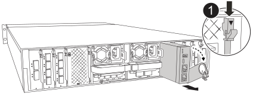

= 1단계: 손상된 컨트롤러를 종료합니다
:allow-uri-read: 

슬롯 8 왼쪽, 컨트롤러 뒷면에 위치한 시스템 관리 모듈에는 시스템 관리를 위한 온보드 구성 요소와 외부 관리를 위한 포트가 포함되어 있습니다.  손상된 시스템 관리 모듈을 교체하거나 부트 미디어를 교체하려면 대상 컨트롤러를 종료하고 전원을 꺼야 합니다.

시스템 관리 모듈에는 다음과 같은 온보드 구성 요소가 있습니다.

* 부팅 미디어를 사용하면 컨트롤러 모듈을 분리하지 않고도 부팅 미디어를 교체할 수 있습니다.
* BMC
* 관리 스위치

시스템 관리 모듈에는 외부 관리를 위한 다음과 같은 포트도 포함되어 있습니다.

* RJ45 시리얼
* USB 시리얼(Type-C)
* USB Type-A(부팅 복구)
* e0M 및 BMC 네트워크 액세스를 위한 RJ45 이더넷 서비스 포트

.시작하기 전에
* 다른 모든 시스템 구성 요소가 제대로 작동하는지 확인합니다.
* 파트너 컨트롤러가 손상된 컨트롤러를 인계할 수 있는지 확인합니다.
* 장애가 발생한 구성 요소를 NetApp로부터 받은 교체 구성 요소로 교체해야 합니다.

.이 작업에 대해
이 절차에서는 다음과 같은 용어를 사용합니다.

* 손상된 컨트롤러는 유지 관리를 수행하는 컨트롤러입니다.
* 정상적인 컨트롤러는 손상된 컨트롤러의 HA 파트너입니다.

== 1단계: 손상된 컨트롤러를 종료합니다

컨트롤러를 종료하거나 손상된 컨트롤러를 인수합니다.

손상된 컨트롤러를 종료하려면 컨트롤러의 상태를 확인하고 필요한 경우 컨트롤러의 스토리지 장애 조치 인수를 수행하여 정상 컨트롤러가 손상된 컨트롤러 스토리지에서 데이터를 계속 제공할 수 있도록 해야 합니다.

.이 작업에 대해
* 4개 이상의 노드가 있는 클러스터가 있는 경우 쿼럼에 있어야 합니다.  노드에 대한 클러스터 정보를 보려면 다음을 사용하세요. `cluster show` 명령.  자세한 내용은 `cluster show` 명령, 참조link:https://docs.netapp.com/us-en/ontap/system-admin/display-nodes-cluster-task.html["ONTAP 클러스터에서 노드 수준 세부 정보 보기"^] .
* 클러스터가 쿼럼에 포함되지 않았거나 손상된 컨트롤러를 제외한 모든 컨트롤러의 상태 또는 적격성이 거짓으로 표시되는 경우 손상된 컨트롤러를 종료하기 전에 문제를 해결해야 합니다. 보다 link:https://docs.netapp.com/us-en/ontap/system-admin/synchronize-node-cluster-task.html?q=Quorum["노드를 클러스터와 동기화합니다"^] .

.단계
. AutoSupport가 활성화된 경우 AutoSupport 메시지를 호출하여 자동 케이스 생성을 억제합니다.
+
`system node autosupport invoke -node * -type all -message MAINT=<# of hours>h`

+
다음 AutoSupport 메시지는 2시간 동안 자동 케이스 생성을 억제합니다.

+
`cluster1:> system node autosupport invoke -node * -type all -message MAINT=2h`

. 손상된 컨트롤러의 콘솔에서 자동 반환을 비활성화합니다.
+
`storage failover modify -node impaired-node -auto-giveback-of false`

+

NOTE: _자동 환불을 비활성화하시겠습니까?_라는 메시지가 표시되면 다음을 입력하세요. `y` .

+
.. ONTAP 버전 9.17.1을 실행 중이고 손상된 컨트롤러를 가동할 수 없거나 이미 인수된 경우 손상된 컨트롤러를 부팅하기 전에 정상 컨트롤러에서 HA 상호 연결 링크를 끊어야 합니다.  이렇게 하면 손상된 컨트롤러가 자동으로 반환하는 것을 방지할 수 있습니다.
+
`system ha interconnect link off -node healthy-node -link 0`

+
`system ha interconnect link off -node healthy-node -link 1`

+

NOTE: ONTAP 버전 9.17.1을 실행하지 않는 경우 위 단계를 건너뛰고 3단계로 이동하세요.

. 손상된 컨트롤러를 로더 프롬프트로 가져가십시오.
+
[cols="1,2"]
|===
| 손상된 컨트롤러가 표시되는 경우... | 그러면... 

 a| 
LOADER 메시지가 표시됩니다
 a| 
다음 단계로 이동합니다.

 a| 
시스템 프롬프트 또는 암호 프롬프트
 a| 
건강한 컨트롤러로부터 손상된 컨트롤러를 인수하거나 중단합니다.
`storage failover takeover -ofnode _impaired_node_name_ -halt _true_`

_-halt true_ 매개변수는 손상된 노드를 LOADER 프롬프트로 가져옵니다.

|===

== 2단계: 손상된 시스템 관리 모듈을 교체합니다

손상된 시스템 관리 모듈을 교체합니다.

. 시스템 관리 모듈을 분리합니다.
+

NOTE: 계속하기 전에 NVRAM 디스테이징이 완료되었는지 확인하십시오. NV 모듈의 LED가 꺼지면 NVRAM가 디스테이징됩니다. LED가 깜박이는 경우 깜박임이 멈출 때까지 기다립니다. 깜박임이 5분 이상 지속될 경우 기술 지원 부서에 문의하십시오.

+

+
[cols="1,4"]
|===

 a| 
image::../media/icon_round_1.png[설명선 번호 1]
 a| 
시스템 관리 모듈 캠 래치

|===
+
.. 아직 접지되지 않은 경우 올바르게 접지하십시오.
.. PSU에서 전원 공급 케이블을 분리합니다.
.. 시스템 관리 모듈에 연결된 모든 케이블을 제거합니다.  모듈을 다시 설치할 때 올바른 포트에 다시 연결할 수 있도록 케이블이 연결된 위치에 라벨을 붙이세요.
.. 케이블 관리 트레이 안쪽의 양쪽에 있는 단추를 당겨 케이블 관리 트레이를 아래로 돌린 다음 트레이를 아래로 돌립니다.
.. 시스템 관리 모듈의 캠 버튼을 누릅니다.
.. 캠 레버를 아래로 최대한 돌립니다.
.. 캠 레버의 구멍에 손가락을 넣고 모듈을 시스템에서 똑바로 잡아당깁니다.
.. 부팅 미디어에 접근하려면 시스템 관리 모듈을 정전기 방지 매트 위에 놓으세요.

. 부팅 미디어를 교체 시스템 관리 모듈로 이동합니다.
+
image::../media/drw_a1k_boot_media_remove_replace_ieops-1377.svg[부팅 미디어를 교체합니다]

+
[cols="1,4"]
|===

 a| 
image::../media/icon_round_1.png[설명선 번호 1]
 a| 
시스템 관리 모듈 캠 래치

 a| 
image::../media/icon_round_2.png[설명선 번호 2]
 a| 
부트 미디어 잠금 버튼

 a| 
image::../media/icon_round_3.png[설명선 번호 3]
 a| 
미디어를 부팅합니다

|===
+
.. 손상된 시스템 관리 모듈에서 파란색 부팅 미디어 잠금 버튼을 누릅니다.
.. 부팅 미디어를 위로 돌려 소켓에서 꺼냅니다.

. 교체 시스템 관리 모듈에 부팅 미디어를 설치합니다.
+
.. 부트 미디어의 가장자리를 소켓 하우징에 맞춘 다음 조심스럽게 소켓에 똑바로 밀어 넣습니다.
.. 부트 미디어가 잠금 단추에 닿을 때까지 아래로 돌립니다.
.. 파란색 잠금을 누르고 부트 미디어를 아래로 완전히 돌린 다음 파란색 잠금 버튼을 놓습니다.

. 교체용 시스템 관리 모듈을 인클로저에 설치합니다.
+
.. 교체 시스템 관리 모듈의 가장자리를 시스템 입구에 맞추고 컨트롤러 모듈에 부드럽게 밀어 넣습니다.
.. 캠 래치가 I/O 캠 핀과 맞물리기 시작할 때까지 모듈을 슬롯에 부드럽게 밀어 넣은 다음 캠 래치를 위로 끝까지 돌려 모듈을 제자리에 잠급니다.

. 케이블 관리 ARM를 닫힘 위치까지 돌립니다.
. 시스템 관리 모듈을 재구성합니다.

== 3단계: 컨트롤러 모듈을 재부팅합니다

컨트롤러 모듈을 재부팅합니다.

. 전원 케이블을 PSU에 다시 꽂으세요.
+
시스템은 일반적으로 LOADER 프롬프트로 재부팅됩니다.

. LOADER 프롬프트에서 _bye_를 입력합니다.
. 콘솔 메시지가 중지되면 <enter> 키를 누릅니다.
+
** _로그인_ 프롬프트가 표시되면 다음 단계로 넘어가세요.
** 로그인 프롬프트가 나타나지 않으면 파트너 노드에 로그인하세요.

. override-destination-checks 옵션을 사용하여 루트만 반환:
+
`storage failover giveback -ofnode impaired-node -only-root true -override -destination-checks true`

+

NOTE: 다음 명령은 진단 모드 권한 수준에서만 사용할 수 있습니다.  권한 수준에 대한 자세한 내용은 다음을 참조하세요.link:https://docs.netapp.com/us-en/ontap/system-admin/administrative-privilege-levels-concept.html["ONTAP CLI 명령에 대한 권한 수준을 이해합니다."^] .

+
오류가 발생하면 에 문의하십시오 https://support.netapp.com["NetApp 지원"].

. 반환 보고서가 완료된 후 5분간 기다린 다음 장애 조치 및 반환 상태를 확인하세요.
+
`storage failover show`그리고 `storage failover show-giveback`

+

NOTE: 다음 명령은 진단 모드 권한 수준에서만 사용할 수 있습니다.

. HA 인터커넥트 링크가 끊어진 경우 다시 연결하세요.
+
`system ha interconnect link on -node healthy-node -link 0`

+
`system ha interconnect link on -node healthy-node -link 1`

. 손상된 컨트롤러를 다시 설치하여 정상 작동으로 되돌립니다.
+
'Storage failover 반환 - ofnode_impaired_node_name_'

. 자동 환불이 비활성화된 경우 다시 활성화하세요. `storage failover modify -node local -auto-giveback-of true` .
. AutoSupport가 활성화된 경우 자동 케이스 생성을 복원/억제 해제: `system node autosupport invoke -node * -type all -message MAINT=END`

== 4단계: 라이센스를 설치하고 제품 번호를 등록합니다

시스템 관리 모듈을 교체하면 컨트롤러의 시스템 일련 번호(SSN)가 변경됩니다.  손상된 노드가 표준(노드 잠금) 라이선스가 필요한 ONTAP 기능을 사용하고 있는 경우 노드에 대한 새 라이선스를 설치해야 합니다.  표준 라이선스가 있는 기능의 경우 클러스터의 각 노드는 해당 기능에 대한 자체 키를 가져야 합니다.

.이 작업에 대해
라이센스 키를 설치할 때까지 표준 라이센스가 필요한 기능을 노드에서 계속 사용할 수 있습니다. 그러나 이 기능에 대한 라이센스가 있는 클러스터에서 노드가 유일한 노드인 경우에는 해당 기능에 대한 구성을 변경할 수 없습니다. 또한 노드에서 라이센스가 없는 기능을 사용하면 라이센스 계약을 준수하지 않을 수 있으므로 가능한 한 빨리 노드에 대한 교체 라이센스 키를 설치해야 합니다.

.시작하기 전에
새로운 시스템 일련 번호에 대한 NetApp 라이선스 파일(NLF)이 필요합니다.  NetApp 라이선스 파일에 대한 자세한 내용은 다음을 참조하세요.link:https://kb.netapp.com/on-prem/ontap/Ontap_OS/OS-KBs/ONTAP_9.10.1_and_later_licensing_overview["ONTAP 9.10.1 이상 라이선스 개요"^] .

라이선스 키를 설치하기까지 90일이 주어지며, 그 이후에는 모든 기존 라이선스가 무효화됩니다.  유효한 라이선스 키를 설치한 후 유예 기간이 종료되기 전까지 24시간 내에 모든 키를 설치해야 합니다.

NOTE: 시스템이 처음에 ONTAP 9.15.1 이상을 실행 중이었다면 다음 문서에 나와 있는 절차를 사용하십시오.link:https://kb.netapp.com/on-prem/ontap/OHW/OHW-KBs/Post_Motherboard_Replacement_Process_to_update_Licensing_on_a_AFF_FAS_system["AFF/FAS 시스템의 라이센스 업데이트를 위한 마더보드 교체 후 프로세스"^] .  시스템의 초기 ONTAP 릴리스가 확실하지 않은 경우 다음을 참조하세요.link:https://hwu.netapp.com["NetApp Hardware Universe를 참조하십시오"^] 자세한 내용은.

.단계
. 새 라이센스 키가 필요한 경우 에서 교체용 라이센스 키를 받으십시오 https://mysupport.netapp.com/site/global/dashboard["NetApp Support 사이트"] My Support(내 지원) 섹션에서 Software licenses(소프트웨어 라이센스) 를 선택합니다.
+

NOTE: 필요한 새 라이센스 키는 자동으로 생성되어 파일의 이메일 주소로 전송됩니다. 30일 이내에 라이센스 키가 포함된 이메일을 받지 못한 경우 기술 지원 부서에 문의하십시오.

. ONTAP 시스템 관리자를 통해 각 라이선스 키를 설치합니다.
+
자세한 내용은 다음을 참조하세요. link:https://docs.netapp.com/us-en/ontap/task_admin_enable_new_features.html["ONTAP System Manager를 사용하여 라이센스 키를 추가하여 새로운 기능을 활성화하세요."^] .

. 필요한 경우 이전 라이센스를 제거합니다.
+
.. 미사용 라이선스 확인:'라이선스 정리 - 미사용 - 시뮬레이션
.. 목록이 올바르면 사용하지 않는 사용권의 'license clean-up-unused'를 삭제합니다

. NetApp Support에 시스템 일련 번호를 등록합니다.
+
** AutoSupport가 활성화된 경우 AutoSupport 메시지를 전송하여 일련 번호를 등록합니다.
** AutoSupport가 활성화되어 있지 않으면 를 호출합니다 https://mysupport.netapp.com["NetApp 지원"] 일련 번호를 등록합니다.

== 5단계: 장애가 발생한 부품을 NetApp에 반환

키트와 함께 제공된 RMA 지침에 설명된 대로 오류가 발생한 부품을 NetApp에 반환합니다.  https://mysupport.netapp.com/site/info/rma["부품 반환 및 교체"]자세한 내용은 페이지를 참조하십시오.
