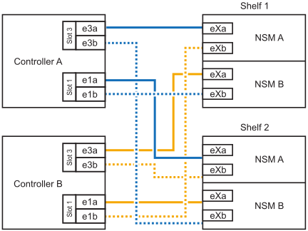

= 
:allow-uri-read: 

.시작하기 전에
* 를 검토해야 link:requirements-hot-add-shelf.html["핫 추가 요구사항 및 모범 사례"]합니다.
* 에서 해당 절차를 완료해야 link:prepare-hot-add-shelf.html["핫 애드 준비 - 쉘프 추가"]합니다.
* 에 설명된 대로 쉘프를 설치하고 전원을 켠 후 쉘프 ID를 설정해야 합니다. link:prepare-hot-add-shelf.html["핫 애드용 쉘프를 설치합니다"]

.이 작업에 대해
* 이 절차에서는 HA 쌍에 내부 스토리지만(외부 쉘프 없음), 각 컨트롤러에 핫 애드까지 2개의 추가 쉘프와 RoCE 지원 I/O 모듈 2개를 있다고 가정합니다.
* 이 절차에서는 다음과 같은 핫 애드 시나리오에 대해 설명합니다.
+
** 각 컨트롤러에 RoCE 지원 I/O 모듈 1개를 통해 첫 번째 쉘프를 HA 쌍에 핫 추가할 수 있습니다.
** 각 컨트롤러에 RoCE 지원 I/O 모듈 2개를 통해 첫 번째 쉘프를 HA 쌍에 핫 추가할 수 있습니다.
** 각 컨트롤러에 RoCE 지원 I/O 모듈 2개를 통해 두 번째 쉘프를 HA 쌍에 핫 추가할 수 있습니다.

* 이러한 시스템은 NSM100 모듈 장착 NS224 쉘프 및 NSM100B 모듈 장착 NS224 쉘프 모두와 호환됩니다. 컨트롤러를 올바른 포트에 연결하려면 각 다이어그램의 "X"를 모듈에 맞는 포트 번호로 교체하십시오.
+
[cols="1,4"]
|===
| 모듈 유형 | 포트 레이블 지정 

 a| 
NSM100를 참조하십시오
 a| 
"0"

예: e0a

 a| 
NSM100B를 참조하십시오
 a| 
"1"

예: e1A

|===

.단계
. 각 컨트롤러 모듈에서 RoCE 지원 포트 한 세트(RoCE 지원 I/O 모듈 1개)를 사용하여 쉘프 하나를 핫 추가할 때, HA 쌍에서 유일한 NS224 쉘프인 경우, 다음 하위 단계를 완료하십시오.
+
그렇지 않으면 다음 단계로 이동합니다.

+

NOTE: 이 단계에서는 슬롯 3에 RoCE 지원 I/O 모듈을 설치했다고 가정합니다.

+
.. 케이블 쉘프 NSM A 포트 Exa에서 컨트롤러 A 슬롯 3 포트 A(e3a)에 연결합니다.
.. 케이블 쉘프 NSM A 포트 EXB를 컨트롤러 B 슬롯 3 포트 b(e3b)에 연결합니다.
.. 케이블 쉘프 NSM B 포트 Exa에서 컨트롤러 B 슬롯 3 포트 A(e3A)까지 지원합니다.
.. 케이블 쉘프 NSM B 포트 EXB를 컨트롤러 A 슬롯 3 포트 b(e3b)에 연결합니다.
+
다음 그림에서는 각 컨트롤러 모듈에 1개의 RoCE 가능 I/O 모듈을 사용한 1개의 핫 추가 쉘프에 대한 케이블 연결을 보여 줍니다.

+
image::../media/drw_ns224_g_1shelf_1card_ieops-2002.svg[AFF/ASA A30용 케이블 연결,452px,AFF/ASA A50]

. 각 컨트롤러 모듈에서 2개의 RoCE 가능 포트 세트(RoCE 가능 I/O 모듈 2개)를 사용하여 하나 또는 2개의 쉘프를 핫 추가할 경우, 해당 하위 단계를 완료하십시오.
+

NOTE: 이 단계에서는 슬롯 3 및 1에 RoCE 지원 I/O 모듈을 설치했다고 가정합니다.

+
[cols="1,3"]
|===
| 쉘프 | 케이블 연결 

 a| 
쉘프 1
 a| 
.. 케이블 NSM A 포트 Exa를 컨트롤러 A 슬롯 3 포트 A(e3a)에 연결합니다.
.. NSM A 포트 EXB를 컨트롤러 B 슬롯 1 포트 b(e1b)에 케이블로 연결합니다.
.. 케이블 NSM B 포트 Exa를 컨트롤러 B 슬롯 3 포트 A(e3A)에 연결합니다.
.. NSM B 포트 EXB를 컨트롤러 A 슬롯 1 포트 b(e1b)에 케이블로 연결합니다.
.. 두 번째 쉘프를 핫 추가하는 경우 "shelf 2" 하위 단계를 완료하고, 그렇지 않으면 3단계로 이동합니다.

다음 그림은 각 컨트롤러 모듈에서 RoCE 지원 I/O 모듈 2개를 사용하는 핫 애드 쉘프 1개의 케이블 연결을 보여줍니다.

image::../media/drw_ns224_g_1shelf_2card_ieops-2005.svg[AFF/ASA A30용 케이블 연결,452px,AFF/ASA A50]

 a| 
쉘프 2
 a| 
.. 케이블 NSM A 포트 Exa를 컨트롤러 A 슬롯 1 포트 A(E1A)에 연결합니다.
.. NSM A 포트 EXB를 컨트롤러 B 슬롯 3 포트 b(e3b)에 케이블로 연결합니다.
.. 케이블 NSM B 포트 Exa를 컨트롤러 B 슬롯 1 포트 A(E1A)에 연결합니다.
.. NSM B 포트 EXB를 컨트롤러 A 슬롯 3 포트 b(e3b)에 연결합니다.
.. 3단계로 이동합니다.

다음 그림은 각 컨트롤러 모듈에 있는 RoCE 지원 I/O 모듈 2개를 사용하여 2개의 핫 애드 쉘프용 케이블 연결을 보여줍니다.

|===
. 를 사용하여 핫 애드 쉘프가 올바르게 연결되었는지 확인합니다 https://mysupport.netapp.com/site/tools/tool-eula/activeiq-configadvisor["Active IQ Config Advisor"^].
+
케이블 연결 오류가 발생하면 제공된 수정 조치를 따르십시오.

.다음 단계
이 절차를 준비하는 과정에서 자동 드라이브 할당을 사용하지 않도록 설정한 경우 드라이브 소유권을 수동으로 할당하고 필요한 경우 자동 드라이브 할당을 다시 활성화해야 합니다. 로 이동합니다. link:complete-hot-add-shelf.html["핫 애드 완료"]

그렇지 않으면 핫 애드 쉘프 절차가 완료됩니다.
