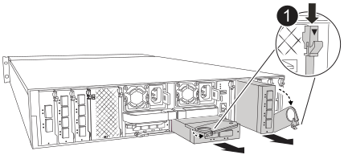

= 입출력 모듈 추가 - AFF A1K
:allow-uri-read: 
:icons: font
:imagesdir: ../media/

[role="lead"]
빈 슬롯이 있는 스토리지 시스템에 새 입출력 모듈을 추가하거나 완전히 채워진 스토리지 시스템에서 새 입출력 모듈을 교체하여 스토리지 시스템에 입출력 모듈을 추가할 수 있습니다.

.시작하기 전에
* 에서 새 입출력 모듈이 사용 중인 스토리지 시스템 및 ONTAP 버전과 호환되는지 https://hwu.netapp.com/["NetApp Hardware Universe를 참조하십시오"^] 확인하십시오.
* 여러 슬롯을 사용할 수 있는 경우 에서 슬롯 우선 순위를 확인합니다 https://hwu.netapp.com/["NetApp Hardware Universe를 참조하십시오"^] 입출력 모듈에 사용할 수 있는 최상의 모듈을 사용하십시오.
* 다른 모든 구성 요소가 제대로 작동하는지 확인합니다.

== 옵션 1: 빈 슬롯이 있는 스토리지 시스템에 입출력 모듈을 추가합니다

스토리지 시스템의 빈 모듈 슬롯에 입출력 모듈을 추가할 수 있습니다.

=== 1단계: 장애가 있는 노드를 종료합니다

다음 옵션 중 하나를 사용하여 컨트롤러를 종료하거나 손상된 컨트롤러를 인수합니다.

[role="tabbed-block"]
====
.옵션 1: 대부분의 시스템
--
손상된 컨트롤러를 종료하려면 컨트롤러 상태를 확인하고, 필요한 경우 정상적인 컨트롤러가 손상된 컨트롤러 스토리지에서 데이터를 계속 제공할 수 있도록 컨트롤러를 인수해야 합니다.

.이 작업에 대해
노드가 2개 이상인 클러스터가 있는 경우 쿼럼에 있어야 합니다. 클러스터가 쿼럼에 없거나 정상 컨트롤러에 자격 및 상태에 대해 FALSE가 표시되는 경우 손상된 컨트롤러를 종료하기 전에 문제를 해결해야 합니다(참조) link:https://docs.netapp.com/us-en/ontap/system-admin/synchronize-node-cluster-task.html?q=Quorum["노드를 클러스터와 동기화합니다"^].

.단계
. AutoSupport가 활성화된 경우 AutoSupport 메시지 명령을 호출하여 자동 케이스 생성을 억제합니다. `system node autosupport invoke -node * -type all -message MAINT=number_of_hours_downh`
+
다음 AutoSupport 명령은 2시간 동안 자동 케이스 생성을 억제합니다. `cluster1:*> system node autosupport invoke -node * -type all -message MAINT=2h`

. 정상적인 컨트롤러의 콘솔에서 'Storage failover modify – node local - auto-반환 false'를 자동으로 반환합니다
. 손상된 컨트롤러를 로더 프롬프트로 가져가십시오.
+
[cols="1,2"]
|===
| 손상된 컨트롤러가 표시되는 경우... | 그러면... 

 a| 
LOADER 메시지가 표시됩니다
 a| 
다음 단계로 이동합니다.

 a| 
"기백을 기다리는 중...
 a| 
Ctrl-C를 누른 다음 메시지가 나타나면 y를 누릅니다.

 a| 
시스템 프롬프트 또는 암호 프롬프트(시스템 암호 입력)
 a| 
정상적인 컨트롤러에서 손상된 컨트롤러를 중지하거나 인계합니다. `storage failover takeover -ofnode _impaired_node_name_`

손상된 컨트롤러에 기브백을 기다리는 중... 이 표시되면 Ctrl-C를 누른 다음 y를 응답합니다.

|===

--
.옵션 2: 컨트롤러가 MetroCluster에 있습니다
--
손상된 컨트롤러를 종료하려면 컨트롤러 상태를 확인하고, 필요한 경우 정상적인 컨트롤러가 손상된 컨트롤러 스토리지에서 데이터를 계속 제공할 수 있도록 컨트롤러를 인수해야 합니다.

* 노드가 2개 이상인 클러스터가 있는 경우 쿼럼에 있어야 합니다. 클러스터가 쿼럼에 없거나 정상 컨트롤러에 자격 및 상태에 대해 FALSE가 표시되는 경우 손상된 컨트롤러를 종료하기 전에 문제를 해결해야 합니다(참조) link:https://docs.netapp.com/us-en/ontap/system-admin/synchronize-node-cluster-task.html?q=Quorum["노드를 클러스터와 동기화합니다"^].
* MetroCluster 설정이 있는 경우 MetroCluster 설정 상태가 구성되어 있고 해당 노드가 설정 및 정상 상태('MetroCluster node show')인지 확인해야 합니다.

.단계
. AutoSupport가 활성화된 경우 'system node AutoSupport invoke -node * -type all-message MAINT=number_of_hours_downh' AutoSupport 메시지를 호출하여 자동 케이스 생성을 억제합니다
+
다음 AutoSupport 메시지는 두 시간 동안 자동 케이스 생성을 억제합니다: ' cluster1: * > system node AutoSupport invoke - node * -type all-message MAINT=2h'

. 정상적인 컨트롤러의 콘솔에서 'Storage failover modify – node local - auto-반환 false'를 자동으로 반환합니다
. 손상된 컨트롤러를 로더 프롬프트로 가져가십시오.
+
[cols="1,2"]
|===
| 손상된 컨트롤러가 표시되는 경우... | 그러면... 

 a| 
LOADER 메시지가 표시됩니다
 a| 
다음 단계로 이동합니다.

 a| 
반환 대기 중...
 a| 
Ctrl-C를 누른 다음 메시지가 나타나면 y를 누릅니다.

 a| 
시스템 프롬프트 또는 암호 프롬프트(시스템 암호 입력)
 a| 
정상적인 컨트롤러 'storage failover takeover -ofnode_impaired_node_name_'에서 손상된 컨트롤러를 인수하거나 중단합니다

손상된 컨트롤러에 기브백을 기다리는 중... 이 표시되면 Ctrl-C를 누른 다음 y를 응답합니다.

|===

--
====

=== 2단계: 입출력 모듈 추가

. 아직 접지되지 않은 경우 올바르게 접지하십시오.
. 컨트롤러에서 PSU(전원 공급 장치) 케이블을 뽑습니다.
+

NOTE: 기억 장치 시스템에 DC PSU가 있는 경우, PSU에서 전원 케이블 블록을 분리하십시오.

. 케이블 관리 트레이 안쪽에 있는 버튼을 당기고 아래로 돌려 케이블 관리 트레이를 아래로 돌립니다.
. 캐리어에서 타겟 슬롯 블랭킹 모듈을 탈거하십시오.
+

NOTE: 다음 그림에서는 수평 및 수직 I/O 모듈 분리를 보여 줍니다. 일반적으로 하나의 입출력 모듈만 제거합니다.

+

+
[cols="1,4"]
|===

 a| 
image:../media/legend_icon_01.png["설명선 번호 1"]
| 캠 잠금 버튼 
|===
+
.. 대상 슬롯에서 블랭킹 모듈의 캠 래치를 누르십시오.
.. 캠 래치를 최대한 아래로 돌립니다. 수평 모듈의 경우 캠을 모듈에서 최대한 멀리 돌립니다.
.. 캠 레버 입구에 손가락을 넣고 엔클로저 밖으로 모듈을 당겨 엔클로저에서 모듈을 분리합니다.

. 입출력 모듈을 설치합니다.
+
.. I/O 모듈을 인클로저 슬롯 입구의 가장자리에 맞춥니다.
.. 모듈을 인클로저 끝까지 슬롯에 부드럽게 밀어 넣은 다음 캠 래치를 위로 끝까지 돌려 모듈을 제자리에 잠급니다.

. I/O 모듈에 케이블을 연결합니다.
+
입출력 모듈이 NIC인 경우 모듈을 데이터 스위치에 연결합니다.

+
I/O 모듈이 스토리지 모듈인 경우 NS224 쉘프에 케이블을 연결합니다.

+

NOTE: 사용하지 않는 I/O 슬롯에 열 문제가 발생하지 않도록 보호물이 설치되어 있는지 확인합니다.

. 케이블 관리 트레이를 닫힘 위치까지 돌립니다.
. LOADER 프롬프트에서 컨트롤러를 재부팅합니다. _bye_
+

NOTE: 이렇게 하면 PCIe 카드 및 기타 구성 요소가 다시 초기화되고 노드가 재부팅됩니다.

. 파트너 컨트롤러에서 컨트롤러를 반납합니다. -ofnode target_node_name_
. 컨트롤러 B에 대해 이 단계를 반복합니다
. 'storage failover modify -node local -auto-반환 true' 명령을 사용하여 자동 반환 기능을 해제한 경우 이 반환 기능을 복구합니다.
. AutoSupport가 설정된 경우 명령을 사용하여 자동 케이스 생성을 복원/억제 `system node autosupport invoke -node * -type all -message MAINT=END` 해제합니다.
. 스토리지 I/O 모듈을 설치한 경우 에 설명된 대로 NS224 쉘프를 설치하고 연결합니다. https://docs.netapp.com/us-en/ontap-systems/ns224/hot-add-shelf.html["쉘프를 핫 추가합니다"^]

== 옵션 2: 빈 슬롯이 없는 스토리지 시스템에 입출력 모듈을 추가합니다

기존 입출력 모듈을 제거하고 다른 입출력 모듈로 교체하여 완전히 채워진 시스템의 입출력 슬롯에서 입출력 모듈을 변경할 수 있습니다.

. 다음과 같은 경우:
+
[cols="1,2"]
|===
| 교체 중... | 그러면... 

 a| 
같은 수의 포트가 있는 NIC 입출력 모듈
 a| 
LIF는 컨트롤러 모듈이 종료되면 자동으로 마이그레이션됩니다.

 a| 
포트 수가 적은 NIC 입출력 모듈
 a| 
선택한 LIF를 다른 홈 포트에 영구적으로 재할당합니다. System Manager를 사용하여 LIF를 영구적으로 이동하는 방법에 대한 자세한 내용은 를 참조하십시오. https://docs.netapp.com/ontap-9/topic/com.netapp.doc.onc-sm-help-960/GUID-208BB0B8-3F84-466D-9F4F-6E1542A2BE7D.html["LIF 마이그레이션"^]

 a| 
스토리지 입출력 모듈이 있는 NIC 입출력 모듈
 a| 
에 설명된 대로 System Manager를 사용하여 LIF를 다른 홈 포트로 영구적으로 마이그레이션합니다 https://docs.netapp.com/ontap-9/topic/com.netapp.doc.onc-sm-help-960/GUID-208BB0B8-3F84-466D-9F4F-6E1542A2BE7D.html["LIF 마이그레이션"^].

|===

=== 1단계: 장애가 있는 노드를 종료합니다

다음 옵션 중 하나를 사용하여 컨트롤러를 종료하거나 손상된 컨트롤러를 인수합니다.

[role="tabbed-block"]
====
.옵션 1: 대부분의 시스템
--
손상된 컨트롤러를 종료하려면 컨트롤러 상태를 확인하고, 필요한 경우 정상적인 컨트롤러가 손상된 컨트롤러 스토리지에서 데이터를 계속 제공할 수 있도록 컨트롤러를 인수해야 합니다.

.이 작업에 대해
노드가 2개 이상인 클러스터가 있는 경우 쿼럼에 있어야 합니다. 클러스터가 쿼럼에 없거나 정상 컨트롤러에 자격 및 상태에 대해 FALSE가 표시되는 경우 손상된 컨트롤러를 종료하기 전에 문제를 해결해야 합니다(참조) link:https://docs.netapp.com/us-en/ontap/system-admin/synchronize-node-cluster-task.html?q=Quorum["노드를 클러스터와 동기화합니다"^].

.단계
. AutoSupport가 활성화된 경우 AutoSupport 메시지 명령을 호출하여 자동 케이스 생성을 억제합니다. `system node autosupport invoke -node * -type all -message MAINT=number_of_hours_downh`
+
다음 AutoSupport 명령은 2시간 동안 자동 케이스 생성을 억제합니다. `cluster1:*> system node autosupport invoke -node * -type all -message MAINT=2h`

. 정상적인 컨트롤러의 콘솔에서 'Storage failover modify – node local - auto-반환 false'를 자동으로 반환합니다
. 손상된 컨트롤러를 로더 프롬프트로 가져가십시오.
+
[cols="1,2"]
|===
| 손상된 컨트롤러가 표시되는 경우... | 그러면... 

 a| 
LOADER 메시지가 표시됩니다
 a| 
다음 단계로 이동합니다.

 a| 
"기백을 기다리는 중...
 a| 
Ctrl-C를 누른 다음 메시지가 나타나면 y를 누릅니다.

 a| 
시스템 프롬프트 또는 암호 프롬프트(시스템 암호 입력)
 a| 
정상적인 컨트롤러에서 손상된 컨트롤러를 중지하거나 인계합니다. `storage failover takeover -ofnode _impaired_node_name_`

손상된 컨트롤러에 기브백을 기다리는 중... 이 표시되면 Ctrl-C를 누른 다음 y를 응답합니다.

|===

--
.옵션 2: 컨트롤러가 MetroCluster에 있습니다
--

NOTE: 시스템이 2노드 MetroCluster 구성인 경우 이 절차를 사용하지 마십시오.

손상된 컨트롤러를 종료하려면 컨트롤러 상태를 확인하고, 필요한 경우 정상적인 컨트롤러가 손상된 컨트롤러 스토리지에서 데이터를 계속 제공할 수 있도록 컨트롤러를 인수해야 합니다.

* 노드가 2개 이상인 클러스터가 있는 경우 쿼럼에 있어야 합니다. 클러스터가 쿼럼에 없거나 정상 컨트롤러에 자격 및 상태에 대해 FALSE가 표시되는 경우 손상된 컨트롤러를 종료하기 전에 문제를 해결해야 합니다(참조) link:https://docs.netapp.com/us-en/ontap/system-admin/synchronize-node-cluster-task.html?q=Quorum["노드를 클러스터와 동기화합니다"^].
* MetroCluster 설정이 있는 경우 MetroCluster 설정 상태가 구성되어 있고 해당 노드가 설정 및 정상 상태('MetroCluster node show')인지 확인해야 합니다.

.단계
. AutoSupport가 활성화된 경우 AutoSupport 명령을 호출하여 자동 케이스 생성을 억제합니다. `system node autosupport invoke -node * -type all -message MAINT=number_of_hours_downh`
+
다음 AutoSupport 명령은 2시간 동안 자동 케이스 생성을 억제합니다. `cluster1:*> system node autosupport invoke -node * -type all -message MAINT=2h`

. 정상적인 컨트롤러의 콘솔에서 'Storage failover modify – node local - auto-반환 false'를 자동으로 반환합니다
. 손상된 컨트롤러를 로더 프롬프트로 가져가십시오.
+
[cols="1,2"]
|===
| 손상된 컨트롤러가 표시되는 경우... | 그러면... 

 a| 
LOADER 메시지가 표시됩니다
 a| 
다음 단계로 이동합니다.

 a| 
반환 대기 중...
 a| 
Ctrl-C를 누른 다음 메시지가 나타나면 y를 누릅니다.

 a| 
시스템 프롬프트 또는 암호 프롬프트(시스템 암호 입력)
 a| 
정상적인 컨트롤러에서 손상된 컨트롤러를 중지하거나 인계합니다. `storage failover takeover -ofnode _impaired_node_name_`

손상된 컨트롤러에 기브백을 기다리는 중... 이 표시되면 Ctrl-C를 누른 다음 y를 응답합니다.

|===

--
====

=== 2단계: 입출력 모듈 교체

. 아직 접지되지 않은 경우 올바르게 접지하십시오.
. 컨트롤러에서 PSU 케이블을 뽑습니다.
+

NOTE: 기억 장치 시스템에 DC PSU가 있는 경우, PSU에서 전원 케이블 블록을 분리하십시오.

. 대상 I/O 모듈의 케이블을 뽑습니다.
. 케이블 관리 트레이 안쪽에 있는 버튼을 당기고 아래로 돌려 케이블 관리 트레이를 아래로 돌립니다.
. 섀시에서 대상 I/O 모듈을 분리합니다.
+

NOTE: 다음 그림에서는 수평 및 수직 I/O 모듈 분리를 보여 줍니다. 일반적으로 하나의 입출력 모듈만 제거합니다.

+

+
[cols="1,4"]
|===

 a| 
image:../media/legend_icon_01.png["설명선 번호 1"]
| 캠 잠금 버튼 
|===
+
.. 캠 래치 버튼을 누릅니다.
+
캠 래치가 섀시에서 멀어 집니다.

.. 캠 래치를 최대한 아래로 돌립니다. 수평 모듈의 경우 캠을 모듈에서 최대한 멀리 돌립니다.
.. 캠 레버 입구에 손가락을 넣고 엔클로저 밖으로 모듈을 당겨 엔클로저에서 모듈을 분리합니다.
+
입출력 모듈이 있던 슬롯을 추적해야 합니다.

. I/O 모듈을 엔클로저의 대상 슬롯에 설치합니다.
+
.. 모듈을 인클로저 슬롯 입구의 가장자리에 맞춥니다.
.. 모듈을 인클로저 끝까지 슬롯에 부드럽게 밀어 넣은 다음 캠 래치를 위로 끝까지 돌려 모듈을 제자리에 잠급니다.

. I/O 모듈에 케이블을 연결합니다.
. 제거 및 설치 단계를 반복하여 컨트롤러의 추가 모듈을 교체합니다.
. PSU를 다시 연결합니다.
. 케이블 관리 트레이를 닫힘 위치까지 돌립니다.
. LOADER 프롬프트에서 컨트롤러를 재부팅합니다. _ bye _
+
.. 컨트롤러에서 BMC의 버전을 확인하십시오. _SYSTEM SERVICE-PROCESSOR show _
.. 필요한 경우 BMC 펌웨어를 업데이트하십시오. _system service-processor image update_
.. 노드를 재부팅합니다. _bye_
+

NOTE: 이렇게 하면 PCIe 카드 및 기타 구성 요소가 다시 초기화되고 노드가 재부팅됩니다.

+

NOTE: 재부팅 중 문제가 발생하는 경우 를 참조하십시오 https://mysupport.netapp.com/site/bugs-online/product/ONTAP/BURT/1494308["Burt 1494308 - I/O 모듈 교체 중에 환경 종료가 트리거될 수 있습니다"]

. 파트너 컨트롤러에서 컨트롤러를 반납합니다. -ofnode target_node_name_
. 해제된 경우 자동 반환 활성화: _ 스토리지 페일오버 수정 -node local-auto-given true _
. 추가한 경우:
+
[cols="1,2"]
|===
| 입출력 모듈이 a인 경우... | 그러면... 

 a| 
NIC 모듈
 a| 
포트별 Storage port modify -node *_<node name>___-port * _<port name>__-mode network' 명령어를 사용한다.

 a| 
스토리지 모듈
 a| 
에 설명된 대로 NS224 쉘프를 설치하고 케이블을 https://docs.netapp.com/us-en/ontap-systems/ns224/hot-add-shelf.html["쉘프를 핫 추가합니다"^]연결합니다.

|===
. 컨트롤러 B에 대해 이 단계를 반복합니다

