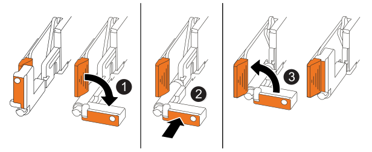

= 부팅 미디어(AFF A20, AFF A30 및 AFF A50)를 교체합니다
:allow-uri-read: 
:icons: font
:imagesdir: ../media/

[role="lead"]
AFF A20, AFF A30 또는 AFF A50 시스템의 부팅 매체에는 필수 펌웨어 및 구성 데이터가 저장됩니다. 교체 프로세스에는 컨트롤러 모듈 분리, 손상된 부팅 미디어 제거, 교체용 부팅 미디어 설치, ONTAP 이미지 전송 등이 포함됩니다.

부팅 미디어를 교체하려면 손상된 컨트롤러를 분리하고 부팅 미디어를 제거한 다음 교체 부팅 미디어를 설치하고 부팅 이미지를 USB 플래시 드라이브로 전송해야 합니다.

== 1단계: 컨트롤러를 제거합니다

컨트롤러를 교체하거나 컨트롤러 내의 구성 요소를 교체할 때 섀시에서 컨트롤러를 제거해야 합니다.

.시작하기 전에
스토리지 시스템의 다른 모든 구성 요소는 올바르게 작동해야 합니다. 그렇지 않은 경우 이 절차를 계속하기 전에 에 문의해야 https://mysupport.netapp.com/site/global/dashboard["NetApp 지원"] 합니다.

.단계
. 손상된 컨트롤러에서 NV LED가 꺼져 있는지 확인합니다.
+
NV LED가 꺼지면 디스테이징이 완료되어 손상된 컨트롤러를 안전하게 제거할 수 있습니다.

+

NOTE: NV LED가 깜박이는 경우(녹색) 디스테이징이 진행 중인 것입니다. NV LED가 꺼질 때까지 기다려야 합니다. 그러나 5분 이상 깜박이지 않으면 이 절차를 계속하기 전에 에 문의하십시오 https://mysupport.netapp.com/site/global/dashboard["NetApp 지원"].

+
NV LED는 컨트롤러의 NV 아이콘 옆에 있습니다.

+
image::../media/drw_g_nvmem_led_ieops-1839.svg[NV 상태 LED 위치]

[cols="1,4"]
|===

 a| 
image::../media/icon_round_1.png[설명선 번호 1]
 a| 
컨트롤러의 NV 아이콘 및 LED

|===
. 아직 접지되지 않은 경우 올바르게 접지하십시오.
. 손상된 컨트롤러의 전원을 분리합니다.
+

NOTE: 전원 공급 장치(PSU)에는 전원 스위치가 없습니다.

+
[cols="1,2"]
|===
| 연결을 끊는 경우... | 그러면... 

 a| 
AC PSU입니다
 a| 
.. 전원 코드 고정대를 엽니다.
.. PSU에서 전원 코드를 뽑고 따로 보관해 둡니다.

 a| 
DC PSU입니다
 a| 
.. D-sub DC 전원 코드 커넥터에서 나비 나사 2개를 풉니다.
.. PSU에서 전원 코드를 뽑고 따로 보관해 둡니다.

|===
. 손상된 컨트롤러에서 모든 케이블을 뽑습니다.
+
케이블이 연결된 위치를 추적합니다.

. 손상된 컨트롤러를 분리합니다.
+
다음 그림에서는 컨트롤러를 제거할 때 컨트롤러 핸들(컨트롤러의 왼쪽에서)의 작동을 보여 줍니다.

+
image::../media/drw_g_and_t_handles_remove_ieops-1837.svg[컨트롤러를 제거하는 컨트롤러 핸들 작동]

+
[cols="1,4"]
|===

 a| 
image::../media/icon_round_1.png[설명선 번호 1]
 a| 
컨트롤러의 양쪽 끝에서 수직 잠금 탭을 바깥쪽으로 밀어 핸들을 분리합니다.

 a| 
image::../media/icon_round_2.png[설명선 번호 2]
 a| 
** 핸들을 사용자 쪽으로 당겨 중앙판에서 컨트롤러를 분리합니다.
+
핸들을 당기면 핸들이 컨트롤러에서 바깥쪽으로 튀어 나와 저항이 느껴집니다. 계속 잡아당기십시오.

** 컨트롤러 하단을 지지하면서 컨트롤러를 섀시에서 밀어 꺼낸 다음 평평하고 안정적인 표면에 놓습니다.

 a| 
image::../media/icon_round_3.png[설명선 번호 3]
 a| 
필요한 경우 손잡이를 똑바로(탭 옆에 있음) 돌려 옆으로 치웁니다.

|===
. 컨트롤러를 정전기 방지 매트 위에 놓습니다.
. 손잡이 나사를 시계 반대 방향으로 돌려 컨트롤러 덮개를 연 다음 덮개를 엽니다.

== 2단계: 부팅 매체를 교체합니다

부팅 미디어를 교체하려면 컨트롤러 내부에서 부팅 미디어를 찾은 후 특정 단계를 따릅니다.

. 아직 접지되지 않은 경우 올바르게 접지하십시오.
. 다음과 같이 부팅 미디어를 제거합니다.
+
image::../media/drw_g_boot_media_replace_ieops-1872.svg[부팅 미디어를 교체합니다. 그래픽 교체]

+
[cols="1,4"]
|===

 a| 
image::../media/icon_round_1.png[설명선 번호 1]
 a| 
부팅 미디어 위치입니다

 a| 
image::../media/icon_round_2.png[설명선 번호 2]
 a| 
파란색 탭을 눌러 부팅 미디어의 오른쪽 끝을 분리합니다.

 a| 
image::../media/icon_round_3.png[설명선 번호 3]
 a| 
부트 미디어의 오른쪽 끝을 약간 비스듬히 들어 올려 부트 미디어의 양쪽을 잘 잡습니다.

 a| 
image::../media/icon_round_4.png[설명선 번호 4]
 a| 
소켓에서 부팅 미디어의 왼쪽 끝을 살짝 당겨 꺼냅니다.

|===
. 교체용 부팅 미디어를 설치합니다.
+
.. 패키지에서 부팅 미디어를 제거합니다.
.. 부팅 미디어의 소켓 끝을 해당 소켓에 밀어 넣습니다.
.. 부팅 미디어의 반대쪽 끝에서 파란색 탭(열림 위치)을 누른 상태에서 부팅 미디어의 해당 끝을 멈출 때까지 부드럽게 누른 다음 탭을 놓아 부팅 미디어를 제자리에 잠급니다.

== 3단계: 컨트롤러를 다시 설치합니다

컨트롤러를 섀시에 다시 설치하되, 재부팅하지 마십시오.

.이 작업에 대해
다음 그림은 컨트롤러를 재설치할 때 컨트롤러 핸들(컨트롤러의 왼쪽에서)의 작동을 보여 주며, 나머지 컨트롤러 재설치 단계를 위한 참조로 사용될 수 있습니다.

[cols="1,4"]
|===

 a| 
image::../media/icon_round_1.png[설명선 번호 1]
 a| 
컨트롤러를 수리하는 동안 컨트롤러 핸들을 똑바로(탭 옆) 돌린 경우 컨트롤러 핸들을 수평 위치로 아래로 돌립니다.

 a| 
image::../media/icon_round_2.png[설명선 번호 2]
 a| 
핸들을 밀어 컨트롤러를 섀시에 반쯤 다시 끼운 다음 지시가 있을 때 컨트롤러가 완전히 장착될 때까지 밉니다.

 a| 
image::../media/icon_round_3.png[설명선 번호 3]
 a| 
핸들을 똑바로 세운 위치로 돌리고 잠금 탭으로 제자리에 고정합니다.

|===
.단계
. 컨트롤러 덮개를 닫고 나비나사를 시계 방향으로 돌려 조입니다.
. 컨트롤러를 섀시에 반쯤 삽입합니다.
+
컨트롤러의 후면을 섀시의 입구에 맞춘 다음 핸들을 사용하여 컨트롤러를 부드럽게 밉니다.

+

NOTE: 이 절차의 뒷부분에서 지시가 있을 때까지 컨트롤러를 섀시에 완전히 삽입하지 마십시오.

. 케이블을 컨트롤러에 다시 연결합니다. 이때 전원 공급 장치(PSU)에 전원 코드를 꽂지 마십시오.
+

NOTE: 컨트롤러를 섀시에 완전히 장착하고 부팅하기 시작할 때 나중에 부팅 미디어 교체 절차에서 부팅 순서를 캡처하여 기록하기 위해 콘솔 케이블이 컨트롤러에 연결되어 있는지 확인하십시오.

== 4단계: 부팅 이미지를 부팅 미디어로 전송합니다

설치한 교체 부팅 매체에는 ONTAP 이미지가 없으므로 USB 플래시 드라이브를 사용하여 ONTAP 이미지를 전송해야 합니다.

.시작하기 전에
* FAT32로 포맷된 USB 플래시 드라이브가 있어야 하며 4GB 이상의 용량이 있어야 합니다.
* 손상된 컨트롤러가 실행 중이던 것과 동일한 ONTAP 이미지 버전이 있어야 합니다. NetApp Support 사이트의 섹션에서 적절한 이미지를 다운로드할 수 있습니다 https://support.netapp.com/downloads["다운로드"]
+
** NVE가 지원되는 경우 다운로드 버튼에 표시된 대로 NetApp 볼륨 암호화로 이미지를 다운로드합니다.
** NVE가 지원되지 않는 경우 다운로드 버튼에 표시된 대로 NetApp 볼륨 암호화 없이 이미지를 다운로드합니다.

* 컨트롤러의 노드 관리 포트(일반적으로 e0M 인터페이스) 간에 네트워크가 연결되어 있어야 합니다.

.단계
. 에서 적절한 서비스 이미지를 다운로드하여 https://mysupport.netapp.com/["NetApp Support 사이트"] USB 플래시 드라이브로 복사합니다.
+
.. 페이지의 다운로드 링크에서 랩톱의 작업 공간으로 서비스 이미지를 다운로드합니다.
.. 서비스 이미지의 압축을 풉니다.
+

NOTE: Windows를 사용하여 콘텐츠를 추출하는 경우 WinZip을 사용하여 netboot 이미지를 추출하지 마십시오. 7-Zip 또는 WinRAR과 같은 다른 추출 도구를 사용합니다.

+
USB 플래시 드라이브에는 손상된 컨트롤러가 실행 중인 것에 대한 적절한 ONTAP 이미지가 있어야 합니다.

.. 노트북에서 USB 플래시 드라이브를 제거합니다.

. USB 플래시 드라이브를 손상된 컨트롤러의 USB-A 포트에 삽입합니다.
+
USB 콘솔 포트가 아니라 USB 장치용 슬롯에 USB 플래시 드라이브를 설치해야 합니다.

. 손상된 컨트롤러를 섀시에 완전히 장착합니다.
+
.. 컨트롤러가 중앙판과 닿아 완전히 장착될 때까지 핸들을 단단히 누릅니다.
+

NOTE: 컨트롤러를 섀시에 밀어 넣을 때 과도한 힘을 가하지 마십시오. 커넥터가 손상될 수 있습니다.

+

NOTE: 섀시에 완전히 장착되면 컨트롤러가 부팅됩니다. 이는 파트너 컨트롤러의 성능을 받습니다.

.. 컨트롤러 핸들을 위로 돌리고 탭으로 제자리에 고정합니다.

. 로더 프롬프트에서 중지하려면 Ctrl+C를 눌러 부팅 프로세스를 중단합니다.
+
이 메시지가 나타나지 않으면 Ctrl-C를 누르고 유지보수 모드로 부팅하는 옵션을 선택한 다음 컨트롤러를 멈춰 로더로 부팅합니다.

. 전원 코드를 손상된 컨트롤러의 전원 공급 장치(PSU)에 다시 연결합니다.
+
PSU에 전원이 다시 공급되면 상태 LED가 녹색이어야 합니다.

+
[cols="1,2"]
|===
| 다시 연결하는 경우... | 그러면... 

 a| 
AC PSU입니다
 a| 
.. 전원 코드를 PSU에 꽂습니다.
.. 전원 코드 고정대로 전원 코드를 고정합니다.

 a| 
DC PSU입니다
 a| 
.. D-sub DC 전원 코드 커넥터를 PSU에 연결합니다.
.. 나비 나사 2개를 조여 D-sub DC 전원 코드 커넥터를 PSU에 고정합니다.

|===

.다음 단계
부팅 미디어를 교체한 후 을 수행해야 link:bootmedia-recovery-image-boot.html["복구 이미지를 부팅합니다"]합니다.
