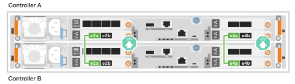
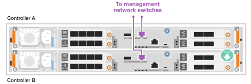

= AFF A20, AFF A30 및 AFF A50과 같은 하드웨어 케이블을 연결합니다
:allow-uri-read: 
:icons: font
:imagesdir: ../media/

[role="lead"]
AFF A20, AFF A30 또는 AFF A50 스토리지 시스템 하드웨어를 설치한 후 컨트롤러를 네트워크 및 쉘프에 케이블로 연결합니다.

.시작하기 전에
스토리지 시스템을 네트워크 스위치에 연결하는 방법에 대한 자세한 내용은 네트워크 관리자에게 문의하십시오.

.이 작업에 대해
* 클러스터/HA 및 호스트 네트워크 케이블 연결 절차는 일반적인 구성을 보여줍니다.
+
여기에 구성이 표시되지 않으면 를 방문하여 link:https://hwu.netapp.com["NetApp Hardware Universe를 참조하십시오"^]스토리지 시스템에 케이블을 연결하기 위한 포괄적인 구성 및 슬롯 우선 순위 정보를 확인하십시오.

* 케이블 연결 그래픽에는 포트에 커넥터를 삽입할 때 케이블 커넥터 당김 탭의 올바른 방향(위 또는 아래)을 나타내는 화살표 아이콘이 있습니다.
+
커넥터를 삽입할 때 딸깍 소리가 들려야 합니다. 딸깍 소리가 안 되면 커넥터를 제거하고 뒤집은 다음 다시 시도하십시오.

+
image:../media/drw_cable_pull_tab_direction_ieops-1699.svg["케이블 당김 탭 방향"]

* 광 스위치에 케이블로 연결하는 경우 광 트랜시버를 컨트롤러 포트에 삽입한 후 스위치 포트에 연결합니다.

== 1단계: 클러스터/HA 연결 케이블 연결

컨트롤러에 케이블을 연결하여 ONTAP 클러스터 연결을 생성합니다.

[role="tabbed-block"]
====
.스위치가 없는 클러스터 케이블 연결
--
.2포트 40/100 GbE 입출력 모듈 2개가 있는 AFF A30 또는 AFF A50
[%collapsible]
=====
.단계
. 클러스터/HA 인터커넥트 연결 케이블 연결:
+

NOTE: 클러스터 인터커넥트 트래픽과 HA 트래픽은 동일한 물리적 포트(슬롯 2와 4의 I/O 모듈)를 공유합니다. 포트는 40/100 GbE입니다.

+
.. 컨트롤러 A 포트 e2a와 컨트롤러 B 포트 e2a에 케이블 연결
.. 컨트롤러 A 포트 e4a를 컨트롤러 B 포트 e4a에 케이블로 연결합니다.
+

NOTE: 입출력 모듈 포트 e2b 및 e4b는 사용되지 않으며 호스트 네트워크 연결에 사용할 수 있습니다.

+
* 100 GbE 클러스터/HA 인터커넥트 케이블 *

+
image::../media/oie_cable100_gbe_qsfp28.png[클러스터 HA 100GbE 케이블]

+

=====
.2포트 40/100 GbE 입출력 모듈 1개가 있는 AFF A30 또는 AFF A50
[%collapsible]
=====
.단계
. 클러스터/HA 인터커넥트 연결 케이블 연결:
+

NOTE: 클러스터 인터커넥트 트래픽과 HA 트래픽은 동일한 물리적 포트(슬롯 4의 I/O 모듈)를 공유합니다. 포트는 40/100 GbE입니다.

+
.. 컨트롤러 A 포트 e4a를 컨트롤러 B 포트 e4a에 케이블로 연결합니다.
.. 컨트롤러 A 포트 e4b를 컨트롤러 B 포트 e4b에 케이블 연결
+
* 100 GbE 클러스터/HA 인터커넥트 케이블 *

+
image::../media/oie_cable100_gbe_qsfp28.png[클러스터 HA 100GbE 케이블]

+
image::../media/drw_isi_a30-50_switchless_2p_100gbe_1card_cabling_ieops-1925.svg[하나의 100GbE IO 모듈을 사용하는 A30 및 A50 스위치가 없는 클러스터 케이블 연결 다이어그램]

=====
.2포트 10/25 GbE 입출력 모듈 1개가 포함된 AFF A20
[%collapsible]
=====
.단계
. 클러스터/HA 인터커넥트 연결 케이블 연결:
+

NOTE: 클러스터 인터커넥트 트래픽과 HA 트래픽은 동일한 물리적 포트(슬롯 4의 I/O 모듈)를 공유합니다. 포트는 10/25GbE입니다.

+
.. 컨트롤러 A 포트 e4a를 컨트롤러 B 포트 e4a에 케이블로 연결합니다.
.. 컨트롤러 A 포트 e4b를 컨트롤러 B 포트 e4b에 케이블 연결
+
* 25GbE 클러스터/HA 인터커넥트 케이블 *

+
image:../media/oie_cable_sfp_gbe_copper.png["GbE SFP 구리 커넥터"]

+
image::../media/drw_isi_a20_switchless_2p_25gbe_cabling_ieops-2018.svg[25GbE 입출력 모듈 1개를 사용한 A20 스위치 없는 클러스터 케이블 연결 다이어그램]

=====
--
.스위치 클러스터 케이블링
--
.2포트 40/100 GbE 입출력 모듈 2개가 있는 AFF A30 또는 AFF A50
[%collapsible]
=====
.단계
. 클러스터/HA 인터커넥트 연결 케이블 연결:
+

NOTE: 클러스터 인터커넥트 트래픽과 HA 트래픽은 동일한 물리적 포트(슬롯 2와 4의 I/O 모듈)를 공유합니다. 포트는 40/100 GbE입니다.

+
.. 컨트롤러 A 포트 e4a를 클러스터 네트워크 스위치 A에 케이블 연결
.. 컨트롤러 A 포트 e2a를 클러스터 네트워크 스위치 B에 케이블 연결
.. 컨트롤러 B 포트 e4a를 클러스터 네트워크 스위치 A에 케이블 연결
.. 컨트롤러 B 포트 e2a를 클러스터 네트워크 스위치 B에 케이블 연결
+

NOTE: 입출력 모듈 포트 e2b 및 e4b는 사용되지 않으며 호스트 네트워크 연결에 사용할 수 있습니다.

+
* 40/100 GbE 클러스터/HA 인터커넥트 케이블 *

+
image::../media/oie_cable100_gbe_qsfp28.png[클러스터 HA 40/100 GbE 케이블]

+
image::../media/drw_isi_a30-50_switched_2p_100gbe_2card_cabling_ieops-2013.svg[2개의 100GbE IO 모듈을 사용하는 A30 및 A50 스위치 클러스터 케이블 다이어그램]

=====
.2포트 40/100 GbE 입출력 모듈 1개가 있는 AFF A30 또는 AFF A50
[%collapsible]
=====
.단계
. 컨트롤러를 클러스터 네트워크 스위치에 케이블 연결합니다.
+

NOTE: 클러스터 인터커넥트 트래픽과 HA 트래픽은 동일한 물리적 포트(슬롯 4의 I/O 모듈)를 공유합니다. 포트는 40/100 GbE입니다.

+
.. 컨트롤러 A 포트 e4a를 클러스터 네트워크 스위치 A에 케이블 연결
.. 컨트롤러 A 포트 e4b를 클러스터 네트워크 스위치 B에 케이블 연결
.. 컨트롤러 B 포트 e4a를 클러스터 네트워크 스위치 A에 케이블 연결
.. 컨트롤러 B 포트 e4b를 클러스터 네트워크 스위치 B에 케이블 연결
+
* 40/100 GbE 클러스터/HA 인터커넥트 케이블 *

+
image::../media/oie_cable100_gbe_qsfp28.png[클러스터 HA 40/100 GbE 케이블]

+
image::../media/drw_isi_a30-50_2p_100gbe_1card_switched_cabling_ieops-1926.svg[클러스터 연결을 클러스터 네트워크에 케이블 연결합니다]

=====
.2포트 10/25 GbE 입출력 모듈 1개가 포함된 AFF A20
[%collapsible]
=====
. 컨트롤러를 클러스터 네트워크 스위치에 케이블 연결합니다.
+

NOTE: 클러스터 인터커넥트 트래픽과 HA 트래픽은 동일한 물리적 포트(슬롯 4의 I/O 모듈)를 공유합니다. 포트는 10/25GbE입니다.

+
.. 컨트롤러 A 포트 e4a를 클러스터 네트워크 스위치 A에 케이블 연결
.. 컨트롤러 A 포트 e4b를 클러스터 네트워크 스위치 B에 케이블 연결
.. 컨트롤러 B 포트 e4a를 클러스터 네트워크 스위치 A에 케이블 연결
.. 컨트롤러 B 포트 e4b를 클러스터 네트워크 스위치 B에 케이블 연결
+
* 10/25GbE 클러스터/HA 인터커넥트 케이블 *

+
image:../media/oie_cable_sfp_gbe_copper.png["GbE SFP 구리 커넥터"]

+
image:../media/drw_isi_a20_switched_2p_25gbe_cabling_ieops-2019.svg["25GbE 입출력 모듈 1개를 사용한 A20 스위치 클러스터 케이블 연결 다이어그램"]

=====
--
====

== 2단계: 호스트 네트워크 연결 케이블 연결

컨트롤러를 이더넷 또는 FC 호스트 네트워크에 케이블로 연결합니다.

[role="tabbed-block"]
====
.이더넷 호스트 케이블 연결
--
.2포트 40/100 GbE 입출력 모듈 2개가 있는 AFF A30 또는 AFF A50
[%collapsible]
=====
.단계
. 각 컨트롤러에서 이더넷 호스트 네트워크 스위치에 케이블 포트 e2b 및 e4b를 연결합니다.
+

NOTE: 슬롯 2 및 4의 입출력 모듈 포트는 40/100 GbE(호스트 접속은 40/100 GbE)입니다.

+
* 40/100 GbE 케이블 *

+
image::../media/oie_cable_sfp_gbe_copper.png[40/100 Gb 케이블]

+
image::../media/drw_isi_a30-50_host_2p_40-100gbe_2card_cabling_ieops-2014.svg[40/100GbE 이더넷 호스트 네트워크 스위치에 케이블 연결]

=====
.4포트 10/25 GbE 입출력 모듈 1개가 있는 AFF A20, A30 또는 AFF A50
[%collapsible]
=====
.단계
. 각 컨트롤러에서 이더넷 호스트 네트워크 스위치에 케이블 포트 e2a, e2b, E2C 및 e2D를 연결합니다.
+
* 10/25 GbE 케이블 *

+
image:../media/oie_cable_sfp_gbe_copper.png["GbE SFP 구리 커넥터"]

+
image::../media/drw_isi_a30-50_host_2p_40-100gbe_1card_cabling_ieops-1923.svg[40/100GbE 이더넷 호스트 네트워크 스위치에 케이블 연결]

=====
--
.FC 호스트 케이블링
--
.4포트 64Gb/s FC 입출력 모듈 1개가 있는 AFF A20, A30 또는 AFF A50
[%collapsible]
=====
.단계
. 각 컨트롤러에서 포트 1a, 1b, 1c 및 1d를 FC 호스트 네트워크 스위치에 연결합니다.
+
* 64 Gb/s FC 케이블 *

+
image:../media/oie_cable_sfp_gbe_copper.png["64Gb FC 케이블"]

+
image::../media/drw_isi_a30-50_4p_64gb_fc_1card_cabling_ieops-1924.svg[64GB FC 호스트 네트워크 스위치에 대한 케이블 연결]

=====
--
====

== 3단계: 관리 네트워크 연결 케이블 연결

컨트롤러를 관리 네트워크에 케이블로 연결합니다.

. 각 컨트롤러의 관리(렌치) 포트를 관리 네트워크 스위치에 연결합니다.
+
* 1000BASE-T RJ-45 케이블 *

+
image::../media/oie_cable_rj45.png[RJ-45 케이블]

+

IMPORTANT: 아직 전원 코드를 연결하지 마십시오.

== 4단계: 선반 연결 케이블 연결

이 절차에서는 컨트롤러를 하나의 NS224 쉘프에 연결하는 방법을 보여 줍니다.

.이 작업에 대해
* 스토리지 시스템에서 지원되는 최대 쉘프 수와 광 및 스위치 연결과 같은 모든 케이블 옵션은 을 참조하십시오.link:https://hwu.netapp.com["NetApp Hardware Universe를 참조하십시오"^]
* NS224 쉘프 케이블 연결 절차는 NSM100 모듈 대신 NSM100B 모듈을 사용합니다. 케이블 연결은 사용된 NSM 모듈의 종류와 관계없이 동일하며, 포트 이름만 다릅니다.
+
** NSM100B 모듈은 슬롯 1의 I/O 모듈에서 포트 e1a 및 e1b를 사용합니다.
** NSM100 모듈은 내장(온보드) 포트 e0a 및 e0b를 사용합니다.

* 스토리지 시스템과 함께 제공된 스토리지 케이블을 사용하여 NS224 선반의 각 NSM 모듈에 각 컨트롤러를 케이블로 연결합니다. 스토리지 케이블의 케이블 유형은 다음과 같습니다.
+
* 100 GbE QSFP28 구리 케이블 *

+
image::../media/oie_cable100_gbe_qsfp28.png[100 GbE QSFP28 구리 케이블]

* 그래픽은 컨트롤러 A 케이블을 파란색으로, 컨트롤러 B 케이블은 노란색으로 표시합니다.

.단계
. 컨트롤러 A를 쉘프에 연결:
+
.. 케이블 컨트롤러 A 포트 e3a에서 NSM A 포트 E1A로 연결합니다.
.. 케이블 컨트롤러 A 포트 e3b에서 NSM B 포트 e1b에 연결합니다.
+
image:../media/drw_isi_g_1_ns224_controller_a_cabling_ieops-1945.svg["하나의 NS224 쉘프에 컨트롤러 A 포트 e3a 및 e3b 케이블 연결"]

. 컨트롤러 B를 쉘프에 연결:
+
.. 케이블 컨트롤러 B 포트 e3a에서 NSM B 포트 E1A로 연결합니다.
.. 케이블 컨트롤러 B 포트 e3b를 NSM A 포트 e1b에 연결합니다.
+
image:../media/drw_isi_g_1_ns224_controller_b_cabling_ieops-1946.svg["하나의 NS224 쉘프에 컨트롤러 B 포트 e3a 및 e3b 케이블 연결"]

.다음 단계
스토리지 시스템용 하드웨어를 케이블로 연결한 후link:install-power-hardware.html["스토리지 시스템의 전원을 켭니다"],
