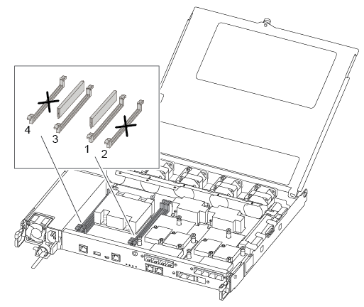

= DIMM-AFF A250을 교체합니다
:allow-uri-read: 
:icons: font
:imagesdir: ../media/

[role="lead"]
스토리지 시스템이 스토리지 시스템의 ONTAP 부팅을 방해하는 단일 DIMM 오류로 인해 발생하는 과도한 CECC(수정 가능한 오류 수정 코드) 오류 또는 해결할 수 없는 ECC 오류와 같은 오류가 스토리지 시스템에서 발생하면 컨트롤러의 DIMM을 교체해야 합니다.

.이 작업에 대해
시스템의 다른 모든 구성 요소가 올바르게 작동해야 합니다. 그렇지 않은 경우 기술 지원 부서에 문의해야 합니다.

오류가 발생한 구성 요소를 공급업체로부터 받은 교체 FRU 구성 요소로 교체해야 합니다.

== 1단계: 손상된 컨트롤러를 종료합니다

손상된 컨트롤러를 종료하려면 컨트롤러 상태를 확인하고, 필요한 경우 정상적인 컨트롤러가 손상된 컨트롤러 스토리지에서 데이터를 계속 제공할 수 있도록 컨트롤러를 인수해야 합니다.

.이 작업에 대해
* SAN 시스템을 사용하는 경우 손상된 컨트롤러 SCSI 블레이드에 대한 이벤트 메시지를 확인해야  `cluster kernel-service show`합니다. priv advanced 모드에서 명령을 실행하면 `cluster kernel-service show` 해당 노드의 노드 이름link:https://docs.netapp.com/us-en/ontap/system-admin/display-nodes-cluster-task.html["쿼럼 상태입니다"], 해당 노드의 가용성 상태 및 해당 노드의 작동 상태가 표시됩니다.
+
각 SCSI 블레이드 프로세스는 클러스터의 다른 노드와 함께 쿼럼에 있어야 합니다. 교체를 진행하기 전에 모든 문제를 해결해야 합니다.

* 노드가 2개 이상인 클러스터가 있는 경우 쿼럼에 있어야 합니다. 클러스터가 쿼럼에 없거나 정상 컨트롤러에 자격 및 상태에 대해 FALSE가 표시되는 경우 손상된 컨트롤러를 종료하기 전에 문제를 해결해야 합니다(참조) link:https://docs.netapp.com/us-en/ontap/system-admin/synchronize-node-cluster-task.html?q=Quorum["노드를 클러스터와 동기화합니다"^].

.단계
. AutoSupport가 활성화된 경우 AutoSupport 메시지를 호출하여 자동 케이스 생성을 억제합니다.
+
`system node autosupport invoke -node * -type all -message MAINT=<# of hours>h`

+
다음 AutoSupport 메시지는 2시간 동안 자동 케이스 생성을 억제합니다.

+
`cluster1:> system node autosupport invoke -node * -type all -message MAINT=2h`

. 자동 환불 비활성화:
+
.. 정상 컨트롤러의 콘솔에서 다음 명령을 입력하세요.
+
`storage failover modify -node local -auto-giveback false`

.. 입력하다 `y` _자동 환불을 비활성화하시겠습니까?_라는 메시지가 표시되면

. 손상된 컨트롤러를 로더 프롬프트로 가져가십시오.
+
[cols="1,2"]
|===
| 손상된 컨트롤러가 표시되는 경우... | 그러면... 

 a| 
LOADER 메시지가 표시됩니다
 a| 
다음 단계로 이동합니다.

 a| 
반환 대기 중...
 a| 
Ctrl-C를 누른 다음 메시지가 나타나면 y를 누릅니다.

 a| 
시스템 프롬프트 또는 암호 프롬프트
 a| 
정상적인 컨트롤러에서 손상된 컨트롤러를 인계하거나 중지합니다.

`storage failover takeover -ofnode _impaired_node_name_ -halt _true_`

_-halt true_parameter는 Loader 프롬프트를 표시합니다.

|===

== 2단계: 컨트롤러 모듈을 분리합니다

컨트롤러 모듈 내부의 구성 요소를 교체할 때 섀시에서 컨트롤러 모듈을 분리해야 합니다.

케이블을 어디에 연결했는지 알 수 있도록 케이블에 레이블을 지정해야 합니다.

. 아직 접지되지 않은 경우 올바르게 접지하십시오.
. 전원에서 컨트롤러 모듈 전원 공급 장치를 분리합니다.
. 전원 케이블 고정 장치를 분리한 다음 전원 공급 장치에서 케이블을 분리합니다.
. 컨트롤러 모듈 양쪽에 있는 래치 장치에 검지를 넣고 엄지 손가락으로 레버를 누른 다음 섀시에서 몇 인치 정도 조심스럽게 컨트롤러를 당깁니다.
+

NOTE: 컨트롤러 모듈을 분리하는 데 어려움이 있는 경우, 검지 손가락을 안쪽의 손가락 구멍을 통과하도록 합니다(팔을 교차함).

+
image::../media/drw_a250_pcm_remove_install.png[래치 메커니즘 열기]

+
[cols="1,3"]
|===

 a| 
image:../media/icon_round_1.png["설명선 번호 1"]
| 레버 

 a| 
image:../media/icon_round_2.png["설명선 번호 2"]
 a| 
래치 메커니즘

|===
. 양손으로 컨트롤러 모듈 측면을 잡고 섀시에서 조심스럽게 당겨 평평하고 안정적인 표면에 놓습니다.
. 컨트롤러 모듈 앞면의 손잡이 나사를 시계 반대 방향으로 돌려 컨트롤러 모듈 덮개를 엽니다.
+
image::../media/drw_a250_open_controller_module_cover.png[컨트롤러 모듈 덮개 열기]

+
[cols="1,3"]
|===

 a| 
image:../media/icon_round_1.png["설명선 번호 1"]
| 나비 나사 

 a| 
image:../media/icon_round_2.png["설명선 번호 2"]
 a| 
컨트롤러 모듈 덮개

|===
. 에어 덕트 커버를 들어 올리십시오.
+
image::../media/drw_a250_remove_airduct_cover.png[에어 덕트 커버를 들어 올립니다]

== 3단계: DIMM을 교체합니다

DIMM을 교체하려면 공기 덕트 상단의 DIMM 맵 레이블을 사용하여 컨트롤러 모듈에서 DIMM을 찾은 다음 특정 순서에 따라 교체해야 합니다.

다음 비디오 또는 표 형식 단계를 사용하여 DIMM을 교체합니다.

.애니메이션 - DIMM을 교체합니다
video::fa6b8107-86fb-4332-aa57-ac5b01605e52[panopto]
. 컨트롤러 모듈의 손상된 DIMM을 교체합니다.
+
DIMM은 마더보드의 슬롯 3 또는 1에 있습니다. 슬롯 2와 4는 비어 있습니다. 이 슬롯에 DIMM을 설치하지 마십시오.

+

. 교체 DIMM을 올바른 방향으로 삽입할 수 있도록 소켓에서 DIMM의 방향을 기록해 두십시오.
. DIMM의 양쪽에 있는 DIMM 이젝터 탭을 천천히 밀고 DIMM을 슬롯에서 밀어 꺼냅니다.
. 커넥터의 DIMM 이젝터 탭을 열린 위치로 둡니다.
. 정전기 방지 포장용 백에서 교체용 DIMM을 제거하고 DIMM을 모서리에 맞춰 슬롯에 맞춥니다.
+

NOTE: DIMM 회로 보드의 구성 요소에 압력이 가해질 수 있으므로 DIMM의 가장자리를 잡으십시오.

. 교체용 DIMM을 슬롯에 똑바로 삽입합니다.
+
DIMM은 소켓에 단단히 고정되어 있습니다. 그렇지 않은 경우 DIMM을 다시 삽입하여 소켓에 맞춥니다.

. DIMM이 고르게 정렬되어 소켓에 완전히 삽입되었는지 육안으로 검사합니다.

== 4단계: 컨트롤러 모듈을 설치합니다

컨트롤러 모듈에서 구성 요소를 교체한 후 컨트롤러 모듈을 섀시에 재설치한 다음 부팅해야 합니다.

다음 그림이나 기록된 단계를 사용하여 교체 컨트롤러 모듈을 섀시에 설치할 수 있습니다.

. 아직 설치하지 않은 경우 에어 덕트를 장착하십시오.
+
image::../media/drw_a250_install_airduct_cover.png[에어 덕트 설치]

. 컨트롤러 모듈 덮개를 닫고 손잡이 나사를 조입니다.
+
image::../media/drw_a250_close_controller_module_cover.png[컨트롤러 모듈 덮개를 닫습니다]

+
[cols="1,3"]
|===

 a| 
image:../media/icon_round_1.png["설명선 번호 1"]
| 컨트롤러 모듈 덮개 

 a| 
image:../media/icon_round_2.png["설명선 번호 2"]
 a| 
나비 나사

|===
. 컨트롤러 모듈을 섀시에 삽입합니다.
+
.. 래칭 메커니즘 암이 완전히 확장된 위치에 잠겨 있는지 확인합니다.
.. 양손을 사용하여 컨트롤러 모듈이 멈출 때까지 잠금 장치 암에 맞춰 부드럽게 밀어 넣습니다.
.. 잠금 장치 내부의 손가락 구멍을 통해 검지 손가락을 넣습니다.
.. 잠금 장치 상단의 주황색 탭을 엄지 손가락으로 누르고 정지 장치 위로 컨트롤러 모듈을 부드럽게 밉니다.
.. 래칭 메커니즘의 상단에서 엄지 손가락을 떼고 래칭 메커니즘이 제자리에 고정될 때까지 계속 밉니다.
+
컨트롤러 모듈을 완전히 삽입하고 섀시의 모서리와 같은 높이가 되도록 해야 합니다.

. 전원 코드를 전원 공급 장치에 연결하고 전원 케이블 잠금 칼러를 다시 설치한 다음 전원 공급 장치를 전원에 연결합니다.
+
전원이 복구되는 즉시 컨트롤러 모듈이 부팅되기 시작합니다. 부트 프로세스를 중단할 준비를 하십시오.

. 필요에 따라 시스템을 다시 연결합니다.
. 스토리지 'storage failover back-ofnode_impaired_node_name_'을 제공하여 컨트롤러를 정상 작동 상태로 되돌립니다
. 자동 반환이 비활성화된 경우 'Storage failover modify -node local -auto-반환 true'를 다시 설정합니다

== 5단계: 장애가 발생한 부품을 NetApp에 반환

키트와 함께 제공된 RMA 지침에 설명된 대로 오류가 발생한 부품을 NetApp에 반환합니다.  https://mysupport.netapp.com/site/info/rma["부품 반환 및 교체"]자세한 내용은 페이지를 참조하십시오.
