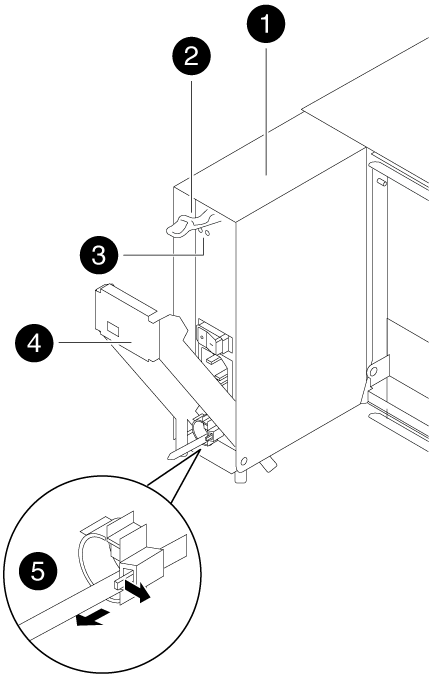

= Hardware-AFF A300 교체
:allow-uri-read: 
:icons: font
:imagesdir: ../media/

[role="lead"]
손상된 섀시에서 새 섀시로 전원 공급 장치, 팬 및 컨트롤러 모듈을 이동하고 손상된 섀시를 손상된 섀시와 동일한 모델의 새 섀시로 장비 랙 또는 시스템 캐비닛에서 교체하십시오.

== 1단계: 전원 공급 장치를 이동합니다

섀시를 교체할 때 전원 공급 장치를 빼내기 위해서는 이전 섀시에서 전원 공급 장치를 끄고, 분리하고, 분리한 후 교체 섀시에 설치하고 연결해야 합니다.

. 아직 접지되지 않은 경우 올바르게 접지하십시오.
. 전원 공급 장치를 끄고 전원 케이블을 뽑습니다.
+
.. 전원 공급 장치의 전원 스위치를 끕니다.
.. 전원 케이블 고정 장치를 연 다음 전원 공급 장치에서 전원 케이블을 뽑습니다.
.. 전원에서 전원 케이블을 뽑습니다.

. 전원 공급 장치 캠 핸들의 분리 래치를 누른 다음 캠 핸들을 완전히 열린 위치로 내려 중앙면에서 전원 공급 장치를 분리합니다.
+

+
|===

 a| 
image:../media/legend_icon_01.png[""]
| 전원 공급 장치 

 a| 
image:../media/legend_icon_02.png[""]
 a| 
캠 핸들 해제 래치

 a| 
image:../media/legend_icon_03.png[""]
 a| 
전원 및 장애 표시등

 a| 
image:../media/legend_icon_04.png[""]
 a| 
캠 핸들

 a| 
image:../media/legend_icon_05.png[""]
 a| 
전원 케이블 잠금 메커니즘

|===
. 캠 핸들을 사용하여 전원 공급 장치를 시스템 밖으로 밀어냅니다.
+

CAUTION: 전원 공급 장치를 분리할 때는 항상 두 손을 사용하여 무게를 지탱하십시오.

. 나머지 전원 공급 장치에 대해 위의 단계를 반복합니다.
. 양손으로 전원 공급 장치의 가장자리를 시스템 섀시의 입구에 맞춘 다음 캠 핸들을 사용하여 전원 공급 장치를 섀시에 부드럽게 밀어 넣습니다.
+
전원 공급 장치는 키 입력 방식이며 한 방향으로만 설치할 수 있습니다.

+

NOTE: 전원 공급 장치를 시스템에 밀어 넣을 때 과도한 힘을 가하지 마십시오. 커넥터가 손상될 수 있습니다.

. 전원 공급 장치 캠 핸들을 단단히 눌러 섀시에 완전히 고정한 다음 캠 핸들을 닫힘 위치로 밀어 캠 핸들 해제 래치가 잠금 위치에 딸깍 소리를 내면서 고정되도록 합니다.
. 전원 케이블을 다시 연결하고 전원 케이블 잠금 장치를 사용하여 전원 공급 장치에 고정합니다.
+

NOTE: 전원 공급 장치에는 전원 케이블만 연결하십시오. 이때 전원 케이블을 전원에 연결하지 마십시오.

== 2단계: 팬을 이동합니다

섀시를 교체할 때 팬 모듈을 꺼내면 특정 작업 시퀀스가 수행됩니다.

. 베젤의 양 측면에 있는 입구를 잡은 다음 섀시 프레임의 볼 스터드에서 베젤이 분리될 때까지 양손으로 베젤을 분리합니다(필요한 경우).
. 팬 모듈 캠 핸들의 분리 래치를 아래로 누른 다음 캠 핸들을 아래로 당깁니다.
+
팬 모듈은 섀시에서 약간 떨어진 곳으로 이동합니다.

+
image::../media/drw_fas32xx_fan.png[drw fas32xx 팬]

+
|===

 a| 
image:../media/legend_icon_01.png[""]
| 캠 핸들 

 a| 
image:../media/legend_icon_02.png[""]
 a| 
팬 모듈

 a| 
image:../media/legend_icon_03.png[""]
 a| 
캠 핸들 해제 래치

 a| 
image:../media/legend_icon_04.png[""]
 a| 
팬 모듈 주의 LED

|===
. 팬 모듈을 섀시에서 똑바로 당겨 빼내고, 다른 손으로 팬 모듈을 지지하여 섀시에서 흔들리지 않도록 하십시오.
+

CAUTION: 팬 모듈이 단락되었습니다. 팬 모듈이 갑자기 섀시에서 떨어져 다치지 않도록 항상 다른 손으로 팬 모듈의 하단을 지지하십시오.

. 팬 모듈을 따로 보관해 둡니다.
. 나머지 팬 모듈에 대해 위의 단계를 반복합니다.
. 팬 모듈을 입구에 맞춘 다음 섀시에 밀어 넣어 교체 섀시에 넣습니다.
. 팬 모듈 캠 손잡이를 단단히 눌러 섀시에 완전히 장착합니다.
+
팬 모듈이 완전히 장착되면 캠 핸들이 약간 올라갑니다.

. 캠 핸들을 닫힘 위치까지 돌려 캠 핸들 해제 래치가 딸깍 소리를 내며 잠금 위치에 있는지 확인합니다.
+
팬이 장착되고 작동 속도로 회전된 후에는 팬 LED가 녹색이어야 합니다.

. 나머지 팬 모듈에 대해 이 단계를 반복합니다.
. 베젤을 볼 스터드에 맞춘 다음 베젤을 볼 스터드에 부드럽게 밀어 넣습니다.

== 3단계: 컨트롤러 모듈을 분리합니다

섀시를 교체하려면 이전 섀시에서 컨트롤러 모듈 또는 모듈을 분리해야 합니다.

. 아직 접지되지 않은 경우 올바르게 접지하십시오.
. 케이블을 케이블 관리 장치에 연결하는 후크 및 루프 스트랩을 푼 다음, 케이블이 연결된 위치를 추적하면서 컨트롤러 모듈에서 시스템 케이블과 SFP(필요한 경우)를 분리합니다.
+
케이블 관리 장치에 케이블을 남겨 두면 케이블 관리 장치를 다시 설치할 때 케이블이 정리됩니다.

. 컨트롤러 모듈의 왼쪽과 오른쪽에서 케이블 관리 장치를 분리하여 한쪽에 둡니다.
+
image::../media/drw_32xx_cbl_mgmt_arm.png[drw 32xx cbl 관리 암]

. 컨트롤러 모듈의 캠 핸들에 있는 손잡이 나사를 풉니다.
+
image::../media/drw_8020_cam_handle_thumbscrew.png[drw 8020 캠 핸들 손잡이 나사]

+
|===

 a| 
image:../media/legend_icon_01.png[""]
| 나비 나사 

 a| 
image:../media/legend_icon_02.png[""]
 a| 
캠 핸들

|===
. 캠 핸들을 아래로 당기고 컨트롤러 모듈을 섀시 밖으로 밀어냅니다.
+
컨트롤러 모듈 하단을 섀시 밖으로 밀어낼 때 지지하는지 확인합니다.

. 컨트롤러 모듈을 안전한 곳에 두고 섀시에 다른 컨트롤러 모듈이 있는 경우 이 단계를 반복합니다.

== 4단계: 장비 랙 또는 시스템 캐비닛 내에서 섀시를 교체합니다

교체 섀시를 설치하려면 먼저 장비 랙 또는 시스템 캐비닛에서 기존 섀시를 분리해야 합니다.

. 섀시 장착 지점에서 나사를 분리합니다.
+

NOTE: 시스템이 시스템 캐비닛에 있는 경우 리어 타이 다운 브래킷을 분리해야 할 수 있습니다.

. 2-3명이 작업할 경우, 이전 섀시를 시스템 캐비닛의 랙 레일 또는 장비 랙의 _L_브라켓에서 밀어 낸 다음 따로 보관해 둡니다.
. 아직 접지되지 않은 경우 올바르게 접지하십시오.
. 2-3명의 직원을 사용하여 섀시를 시스템 캐비닛의 랙 레일 또는 장비 랙의 _L_브라켓에 부착하여 교체 섀시를 장비 랙 또는 시스템 캐비닛에 설치합니다.
. 섀시를 장비 랙 또는 시스템 캐비닛에 완전히 밀어 넣습니다.
. 이전 섀시에서 분리한 나사를 사용하여 섀시의 전면을 장비 랙 또는 시스템 캐비닛에 고정합니다.
. 아직 설치하지 않은 경우 베젤을 설치합니다.

== 5단계: 컨트롤러를 설치합니다

컨트롤러 모듈 및 기타 구성 요소를 새 섀시에 설치한 후 시스템을 부팅해야 합니다.

동일한 섀시에 2개의 컨트롤러 모듈이 있는 HA 쌍의 경우, 컨트롤러 모듈을 설치하는 순서는 섀시에 완전히 장착되자마자 재부팅을 시도하기 때문에 특히 중요합니다.

. 아직 접지되지 않은 경우 올바르게 접지하십시오.
. 컨트롤러 모듈의 끝을 섀시의 입구에 맞춘 다음 컨트롤러 모듈을 반쯤 조심스럽게 시스템에 밀어 넣습니다.
+

NOTE: 지시가 있을 때까지 컨트롤러 모듈을 섀시에 완전히 삽입하지 마십시오.

. 콘솔을 컨트롤러 모듈에 다시 연결하고 관리 포트를 다시 연결합니다.
. 새 섀시에 설치할 두 번째 컨트롤러가 있는 경우 위의 단계를 반복합니다.
. 컨트롤러 모듈 설치를 완료합니다.
+
[cols="1,2"]
|===
| 시스템이 다음 상태인 경우: | 그런 다음 다음 다음 단계를 수행하십시오. 

 a| 
HA 쌍
 a| 
.. 캠 핸들을 열린 위치에 둔 상태에서 컨트롤러 모듈이 중앙판과 완전히 맞닿고 완전히 장착될 때까지 단단히 누른 다음 캠 핸들을 잠금 위치로 닫습니다. 컨트롤러 모듈 후면의 캠 핸들에 있는 나비 나사를 조입니다.
+

NOTE: 커넥터가 손상되지 않도록 컨트롤러 모듈을 섀시에 밀어 넣을 때 과도한 힘을 가하지 마십시오.

.. 아직 설치하지 않은 경우 케이블 관리 장치를 다시 설치하십시오.
.. 케이블을 후크와 루프 스트랩으로 케이블 관리 장치에 연결합니다.
.. 새 섀시의 두 번째 컨트롤러 모듈에 대해 위의 단계를 반복합니다.

 a| 
독립형 구성
 a| 
.. 캠 핸들을 열린 위치에 둔 상태에서 컨트롤러 모듈이 중앙판과 완전히 맞닿고 완전히 장착될 때까지 단단히 누른 다음 캠 핸들을 잠금 위치로 닫습니다. 컨트롤러 모듈 후면의 캠 핸들에 있는 나비 나사를 조입니다.
+

NOTE: 커넥터가 손상되지 않도록 컨트롤러 모듈을 섀시에 밀어 넣을 때 과도한 힘을 가하지 마십시오.

.. 아직 설치하지 않은 경우 케이블 관리 장치를 다시 설치하십시오.
.. 케이블을 후크와 루프 스트랩으로 케이블 관리 장치에 연결합니다.
.. 블랭킹 패널을 다시 설치한 후 다음 단계로 이동하십시오.

|===
. 전원 공급 장치를 다른 전원에 연결한 다음 전원을 켭니다.
. 각 컨트롤러를 유지보수 모드로 부팅합니다.
+
.. 각 컨트롤러가 부팅을 시작할 때 'Press Ctrl-C for Boot Menu' 메시지가 나타나면 Ctrl-C를 눌러 부팅 프로세스를 중단합니다.
+

NOTE: 메시지가 표시되지 않고 컨트롤러 모듈이 ONTAP로 부팅된 경우 'halt'를 입력한 다음 로더 프롬프트에서 boot_ontap를 입력하고 메시지가 표시되면 Ctrl-C를 누른 다음 이 단계를 반복합니다.

.. 부팅 메뉴에서 유지 관리 모드 옵션을 선택합니다.

