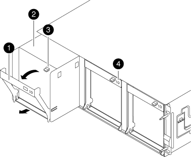

= FAN-AFF A300을 스왑한다
:allow-uri-read: 
:icons: font
:imagesdir: ../media/

[role="lead"]
서비스를 중단하지 않고 팬 모듈을 바꾸려면 특정 작업 순서를 수행해야 합니다.

NOTE: 팬 모듈을 섀시에서 분리한 후 2분 이내에 교체해야 합니다. 시스템 공기 흐름이 중단되고 과열되지 않도록 2분 후에 컨트롤러 모듈 또는 모듈이 종료됩니다.

. 아직 접지되지 않은 경우 올바르게 접지하십시오.
. 베젤의 양 측면에 있는 입구를 잡은 다음 섀시 프레임의 볼 스터드에서 베젤이 분리될 때까지 양손으로 베젤을 분리합니다(필요한 경우).
. 콘솔 오류 메시지를 확인하고 각 팬 모듈의 주의 LED를 확인하여 교체해야 하는 팬 모듈을 식별합니다.
. 팬 모듈 캠 핸들의 분리 래치를 아래로 누른 다음 캠 핸들을 아래로 당깁니다.
+
팬 모듈은 섀시에서 약간 떨어진 곳으로 이동합니다.

+

+
[cols="1,3"]
|===

 a| 
image:../media/legend_icon_01.png["설명선 번호 1"]
| 캠 핸들 

 a| 
image:../media/legend_icon_02.png["설명선 번호 2"]
 a| 
팬 모듈

 a| 
image:../media/legend_icon_02.png["설명선 번호 2"]
 a| 
캠 핸들 해제 래치

 a| 
image:../media/legend_icon_04.png["설명선 번호 4"]
 a| 
팬 모듈 주의 LED

|===
. 팬 모듈을 섀시에서 똑바로 당겨 빼내고, 다른 손으로 팬 모듈을 지지하여 섀시에서 흔들리지 않도록 하십시오.
+

CAUTION: 팬 모듈이 단락되었습니다. 팬 모듈이 갑자기 섀시에서 떨어져 다치지 않도록 항상 다른 손으로 팬 모듈의 하단을 지지하십시오.

. 팬 모듈을 따로 보관해 둡니다.
. 교체용 팬 모듈을 입구에 맞춘 다음 섀시에 밀어 넣어 섀시에 넣습니다.
. 팬 모듈 캠 손잡이를 단단히 눌러 섀시에 완전히 장착합니다.
+
팬 모듈이 완전히 장착되면 캠 핸들이 약간 올라갑니다.

. 캠 핸들을 닫힘 위치까지 돌려 캠 핸들 해제 래치가 딸깍 소리를 내며 잠금 위치에 있는지 확인합니다.
+
팬이 장착되고 작동 속도로 회전된 후에는 팬 LED가 녹색이어야 합니다.

. 베젤을 볼 스터드에 맞춘 다음 베젤을 볼 스터드에 부드럽게 밀어 넣습니다.
. 키트와 함께 제공된 RMA 지침에 설명된 대로 오류가 발생한 부품을 NetApp에 반환합니다. 를 참조하십시오 https://mysupport.netapp.com/site/info/rma["부품 반품 및 앰프, 교체"^] 페이지를 참조하십시오.

