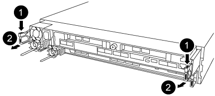

= 부팅 미디어 교체 - AFF A320
:icons: font
:imagesdir: ../media/

부팅 미디어를 교체하려면 손상된 컨트롤러 모듈을 분리하고 교체 부팅 미디어를 설치한 다음 부팅 이미지를 USB 플래시 드라이브로 전송해야 합니다.

== 1단계: 컨트롤러 모듈을 분리합니다

[role="lead"]
컨트롤러 모듈 내부의 구성요소에 액세스하려면 섀시에서 컨트롤러 모듈을 분리해야 합니다.

. 아직 접지되지 않은 경우 올바르게 접지하십시오.
. 전원에서 컨트롤러 모듈 전원 공급 장치를 분리합니다.
. 케이블을 케이블 관리 장치에 연결하는 후크 및 루프 스트랩을 푼 다음, 케이블이 연결된 위치를 추적하면서 컨트롤러 모듈에서 시스템 케이블과 SFP(필요한 경우)를 분리합니다.
+
image::../media/drw_a320_controller_cable_unplug_animated_gif.png[A320 drw 컨트롤러 케이블 언플러그 애니메이션 gif]

+
케이블 관리 장치에 케이블을 남겨 두면 케이블 관리 장치를 다시 설치할 때 케이블이 정리됩니다.

. 컨트롤러 모듈의 왼쪽과 오른쪽에서 케이블 관리 장치를 분리하여 한쪽에 둡니다.
. 섀시에서 컨트롤러 모듈을 분리합니다.
+

+
.. 검지를 컨트롤러 모듈 양쪽에 있는 래치 장치에 삽입합니다.
.. 래칭 메커니즘의 상단에 있는 주황색 탭을 눌러 섀시의 래치 핀을 지웁니다.
+
래치 메커니즘 후크는 거의 수직이어야 하며 섀시 핀이 없어야 합니다.

.. 컨트롤러 모듈 측면을 잡을 수 있도록 컨트롤러 모듈을 사용자 쪽으로 몇 인치 정도 가볍게 당깁니다.
.. 양손으로 컨트롤러 모듈을 섀시에서 조심스럽게 당겨 평평하고 안정적인 표면에 놓습니다.

== 2단계: 부팅 매체를 교체합니다

[role="lead"]
컨트롤러 모듈에서 부팅 미디어를 찾은 다음 지침에 따라 교체해야 합니다.

. 공기 덕트를 열고 다음 그림 또는 컨트롤러 모듈의 FRU 맵을 사용하여 부팅 미디어를 찾습니다.
. 컨트롤러 모듈에서 부팅 미디어를 찾아 제거합니다.
+
image::../media/drw_a320_boot_media_replace_animated_gif.png[A320 drw 부팅 미디어 교체 애니메이션 gif]

+
.. 부팅 미디어의 립이 파란색 버튼을 지울 때까지 부팅 미디어 끝에 있는 파란색 버튼을 누릅니다.
.. 부팅 미디어를 위로 돌리고 소켓에서 부팅 미디어를 조심스럽게 빼냅니다.
+
... 부팅 미디어가 소켓에 똑바로 완전히 장착되었는지 확인합니다.

+
필요한 경우 부팅 미디어를 분리하고 소켓에 재장착합니다.

. 부트 미디어를 제자리에 잠급니다.
+
.. 부트 미디어를 마더보드 쪽으로 돌립니다.
.. 파란색 버튼을 눌러 부팅 미디어 끝에 손가락을 놓고 부팅 미디어 끝을 눌러 파란색 잠금 버튼을 누릅니다.
.. 부트 미디어를 아래로 누르면서 파란색 잠금 버튼을 들어 올려 부트 미디어를 제자리에 고정합니다.

. 에어 덕트를 닫습니다.

== 3단계: USB 플래시 드라이브를 사용하여 부팅 이미지를 부팅 미디어로 전송합니다

[role="lead"]
설치한 교체 부팅 미디어에는 부팅 이미지가 없으므로 USB 플래시 드라이브를 사용하여 부팅 이미지를 전송해야 합니다.

* 최소 4GB 용량의 MBR/FAT32로 포맷된 USB 플래시 드라이브가 있어야 합니다
* 손상된 컨트롤러가 실행 중인 것과 동일한 ONTAP 이미지 버전의 복사본. NetApp Support 사이트의 다운로드 섹션에서 해당 이미지를 다운로드할 수 있습니다
+
** NVE가 사용하도록 설정된 경우 다운로드 버튼에 표시된 대로 NetApp Volume Encryption으로 이미지를 다운로드합니다.
** NVE가 활성화되지 않은 경우 다운로드 버튼에 표시된 대로 NetApp Volume Encryption 없이 이미지를 다운로드합니다.

* 시스템이 HA 쌍인 경우 네트워크에 연결되어 있어야 합니다.
* 시스템이 독립 실행형 시스템인 경우 네트워크 연결이 필요하지 않지만 var 파일 시스템을 복원할 때 추가 재부팅을 수행해야 합니다.
+
.. NetApp Support 사이트에서 USB 플래시 드라이브로 적절한 서비스 이미지를 다운로드하고 복사합니다.
+
... 서비스 이미지를 랩톱의 작업 공간에 다운로드합니다.
... 서비스 이미지의 압축을 풉니다.
+

NOTE: Windows를 사용하여 콘텐츠를 추출하는 경우 WinZip을 사용하여 netboot 이미지를 추출하지 마십시오. 7-Zip 또는 WinRAR과 같은 다른 추출 도구를 사용합니다.

+
압축 해제된 서비스 이미지 파일에는 두 개의 폴더가 있습니다.

+
**** 부팅
**** EFI

... USB 플래시 드라이브의 최상위 디렉토리에 EFI 폴더를 복사합니다.
+
USB 플래시 드라이브에는 EFI 폴더와 손상된 컨트롤러가 실행 중인 것과 동일한 BIOS(Service Image) 버전이 있어야 합니다.

... 노트북에서 USB 플래시 드라이브를 제거합니다.

.. 아직 에어 덕트를 닫지 않은 경우 에어 덕트를 닫으십시오.
.. 컨트롤러 모듈의 끝을 섀시의 입구에 맞춘 다음 컨트롤러 모듈을 반쯤 조심스럽게 시스템에 밀어 넣습니다.
.. 필요에 따라 케이블 관리 장치를 다시 설치하고 시스템을 다시 장착합니다.
+
미디어 컨버터(SFP 또는 QSFP)를 분리한 경우 재설치해야 합니다.

.. 전원 케이블을 전원 공급 장치에 연결하고 전원 케이블 고정 장치를 다시 설치합니다.
.. USB 플래시 드라이브를 컨트롤러 모듈의 USB 슬롯에 삽입합니다.
+
USB 콘솔 포트가 아니라 USB 장치용 슬롯에 USB 플래시 드라이브를 설치해야 합니다.

.. 컨트롤러 모듈 재설치를 완료합니다.
+
... 래치 암이 확장된 위치에 잠겨 있는지 확인합니다.
... 래치 암을 사용하여 컨트롤러 모듈이 멈출 때까지 섀시 베이에 밀어 넣습니다.
+

NOTE: 래치 암 상단의 래치 메커니즘을 아래로 밀지 마십시오. 이렇게 하면 잠금 장치를 올리고 컨트롤러 모듈을 섀시에 밀어 넣는 것이 금지됩니다.

... 래칭 메커니즘 상단의 주황색 탭을 누르고 있습니다.
... 컨트롤러 모듈이 섀시 모서리와 수평이 될 때까지 섀시 베이에 부드럽게 밀어 넣습니다.
+

NOTE: 래칭 메커니즘 암이 섀시에 밀어 넣습니다.

+
컨트롤러 모듈이 섀시에 완전히 장착되면 바로 부팅이 시작됩니다.

... 래치를 해제하여 컨트롤러 모듈을 제자리에 고정합니다.
... 아직 설치하지 않은 경우 케이블 관리 장치를 다시 설치하십시오.

.. 로더 프롬프트에서 중지하려면 Ctrl+C를 눌러 부팅 프로세스를 중단합니다.
+
이 메시지가 나타나지 않으면 Ctrl-C를 누르고 유지보수 모드로 부팅하는 옵션을 선택한 다음, 노드를 정지하여 로더로 부팅합니다.

.. LOADER 프롬프트에서 USB 플래시 드라이브에서 복구 이미지를 부팅하십시오: "boot_recovery"
+
이미지는 USB 플래시 드라이브에서 다운로드됩니다.

.. 메시지가 표시되면 이미지 이름을 입력하거나 화면의 괄호 안에 표시된 기본 이미지를 그대로 사용합니다.
.. 이미지를 설치한 후 복원 프로세스를 시작합니다.
+
... 화면에 표시되는 손상된 노드의 IP 주소를 기록합니다.
... 백업 구성을 복원하라는 메시지가 나타나면 'y'를 누릅니다.
... /etc/ssh/ssh_host_DSA_key 덮어쓸지 묻는 메시지가 나타나면 'y'를 누릅니다.

.. 고급 권한 레벨의 파트너 노드에서 이전 단계에서 기록한 IP 주소 'system node restore-backup-node local-target-address_impaired_node_ip_address_'를 사용하여 구성 동기화를 시작합니다
.. 복원이 성공하면 복구된 복사본을 사용하라는 메시지가 나타나면 손상된 노드에서 y를 누릅니다.
.. 확인 백업 절차가 성공했는지 확인한 후 노드를 재부팅할지 묻는 메시지가 표시되면 y를 누릅니다.
.. 환경 변수가 예상대로 설정되어 있는지 확인합니다.
+
... 노드를 LOADER 프롬프트로 가져갑니다.
+
ONTAP 프롬프트에서 system node halt-skip-lif-migration-before-shutdown true-ignore-quorum-warnings true-inhibit-Takeover true 명령을 실행할 수 있습니다.

... printenv 명령으로 환경 변수 설정을 확인한다.
... 환경 변수가 예상대로 설정되어 있지 않으면 'etenv__environment-variable-name___changed-value_' 명령으로 변경하십시오.
... 'avenev' 명령을 사용하여 변경 내용을 저장합니다.
... 노드를 재부팅합니다.

.. 손상된 노드 재부팅에서 'Waiting for 반환...' 메시지가 표시되면 정상 노드에서 기브백을 수행합니다.
+
[cols="1,2"]
|===
| 시스템이 다음 상태인 경우: | 그러면... 

 a| 
HA 쌍
 a| 
손상된 노드에 'Waiting for 반환...' 메시지가 표시된 후 정상 노드에서 반환 수행:

... 정상 노드에서 'storage failover 반환 - ofnode PARTNER_NODE_NAME'
+
손상된 노드는 스토리지를 가져온 후 부팅 작업을 완료한 다음 다시 부팅하여 정상적인 노드에서 이를 다시 가져옵니다.

+

NOTE: 기브백이 거부되면 거부권을 재정의할 수 있습니다.

+
http://docs.netapp.com/ontap-9/topic/com.netapp.doc.dot-cm-hacg/home.html["ONTAP 9 고가용성 구성 가이드"]

... 'storage failover show -반환' 명령을 사용하여 반환 작업의 진행률을 모니터링합니다.
... 반환 작업이 완료된 후 'storage failover show' 명령을 사용하여 HA 쌍이 정상 상태인지, 테이크오버가 가능한지 확인합니다.
... 스토리지 페일오버 수정 명령을 사용하여 자동 반환이 비활성화된 경우 자동 반환이 복구됩니다.

|===
.. 정상 노드에서 고급 권한 수준을 종료합니다.

