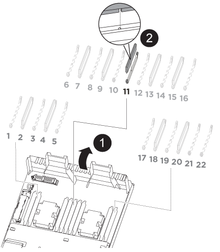

= NVDIMM-AFF A320을 교체합니다
:icons: font
:imagesdir: ../media/

[role="lead"]
시스템이 플래시 수명이 거의 끝나거나 식별된 NVDIMM이 일반적인 상태가 아닌 것으로 등록할 때 컨트롤러 모듈에서 NVDIMM을 교체해야 합니다. 그렇지 않으면 시스템 패닉이 발생합니다.

시스템의 다른 모든 구성 요소가 올바르게 작동해야 합니다. 그렇지 않은 경우 기술 지원 부서에 문의해야 합니다.

오류가 발생한 구성 요소를 공급업체로부터 받은 교체 FRU 구성 요소로 교체해야 합니다.

== 1단계: 손상된 컨트롤러를 종료합니다

[role="lead"]
스토리지 시스템 하드웨어 구성에 따라 다른 절차를 사용하여 손상된 컨트롤러를 종료하거나 인수할 수 있습니다.

=== 옵션 1: 노드를 종료합니다

[role="lead"]
손상된 노드를 종료하려면 노드 상태를 확인하고, 필요한 경우 정상 노드가 손상된 노드 스토리지에서 데이터를 계속 제공할 수 있도록 노드를 인계해야 합니다.

노드가 2개 이상인 클러스터가 있는 경우 쿼럼에 있어야 합니다. 클러스터가 쿼럼에 없거나 정상 노드에 자격 및 상태에 대해 false가 표시되는 경우 손상된 노드를 종료하기 전에 문제를 해결해야 합니다. 을 참조하십시오 link:https://docs.netapp.com/us-en/ontap/system-admin/index.html["CLI를 사용한 관리 개요"^].

.단계
. AutoSupport가 활성화된 경우 'system node AutoSupport invoke -node * -type all-message MAINT=number_of_hours_downh' AutoSupport 메시지를 호출하여 자동 케이스 생성을 억제합니다
+
다음 AutoSupport 메시지는 두 시간 동안 자동 케이스 생성을 억제합니다: ' cluster1: * > system node AutoSupport invoke - node * -type all-message MAINT=2h'

. 정상 노드의 콘솔에서 'storage failover modify – node local-auto-반환 false'의 자동 반환 기능을 해제합니다
. 손상된 노드를 LOADER 프롬프트로 가져갑니다.
+
[cols="1,2"]
|===
| 손상된 노드가 표시되는 경우... | 그러면... 

 a| 
LOADER 메시지가 표시됩니다
 a| 
컨트롤러 모듈 제거 로 이동합니다.

 a| 
반환 대기 중...
 a| 
Ctrl-C를 누른 다음 메시지가 나타나면 y를 누릅니다.

 a| 
시스템 프롬프트 또는 암호 프롬프트(시스템 암호 입력)
 a| 
정상 노드인 'storage failover takeover-ofnode_impaired_node_name_'에서 손상된 노드를 인계하거나 중단합니다

손상된 노드에 반환 대기 중... 이 표시되면 Ctrl-C를 누른 다음 "y"로 응답합니다.

를 누릅니다

|===

=== 옵션 2: 컨트롤러가 MetroCluster에 있습니다

NOTE: 시스템이 2노드 MetroCluster 구성인 경우 이 절차를 사용하지 마십시오.

손상된 노드를 종료하려면 노드 상태를 확인하고, 필요한 경우 정상 노드가 손상된 노드 스토리지에서 데이터를 계속 제공할 수 있도록 노드를 인계해야 합니다.

* 노드가 2개 이상인 클러스터가 있는 경우 쿼럼에 있어야 합니다. 클러스터가 쿼럼에 없거나 정상 노드에 자격 및 상태에 대해 false가 표시되는 경우 손상된 노드를 종료하기 전에 문제를 해결해야 합니다. 을 참조하십시오 link:https://docs.netapp.com/us-en/ontap/system-admin/index.html["CLI를 사용한 관리 개요"^].
* MetroCluster 설정이 있는 경우 MetroCluster 설정 상태가 구성되어 있고 해당 노드가 설정 및 정상 상태('MetroCluster node show')인지 확인해야 합니다.

.단계
. AutoSupport가 활성화된 경우 'system node AutoSupport invoke -node * -type all-message MAINT=number_of_hours_downh' AutoSupport 메시지를 호출하여 자동 케이스 생성을 억제합니다
+
다음 AutoSupport 메시지는 두 시간 동안 자동 케이스 생성을 억제합니다: ' cluster1: * > system node AutoSupport invoke - node * -type all-message MAINT=2h'

. 정상 노드의 콘솔에서 'storage failover modify – node local-auto-반환 false'의 자동 반환 기능을 해제합니다
. 손상된 노드를 LOADER 프롬프트로 가져갑니다.
+
[cols="1,2"]
|===
| 손상된 노드가 표시되는 경우... | 그러면... 

 a| 
LOADER 메시지가 표시됩니다
 a| 
컨트롤러 모듈 제거 로 이동합니다.

 a| 
반환 대기 중...
 a| 
Ctrl-C를 누른 다음 메시지가 나타나면 y를 누릅니다.

 a| 
시스템 프롬프트 또는 암호 프롬프트(시스템 암호 입력)
 a| 
정상 노드인 'storage failover takeover-ofnode_impaired_node_name_'에서 손상된 노드를 인계하거나 중단합니다

손상된 노드에 반환 대기 중... 이 표시되면 Ctrl-C를 누른 다음 "y"로 응답합니다.

를 누릅니다

|===

== 2단계: 컨트롤러 모듈을 분리합니다

[role="lead"]
컨트롤러 모듈 내부의 구성요소에 액세스하려면 섀시에서 컨트롤러 모듈을 분리해야 합니다.

. 아직 접지되지 않은 경우 올바르게 접지하십시오.
. 전원에서 컨트롤러 모듈 전원 공급 장치를 분리합니다.
. 케이블을 케이블 관리 장치에 연결하는 후크 및 루프 스트랩을 푼 다음, 케이블이 연결된 위치를 추적하면서 컨트롤러 모듈에서 시스템 케이블과 SFP(필요한 경우)를 분리합니다.
+
image::../media/drw_a320_cable_management_arms.png[A320 drw 케이블 관리 암]

+
케이블 관리 장치에 케이블을 남겨 두면 케이블 관리 장치를 다시 설치할 때 케이블이 정리됩니다.

. 컨트롤러 모듈의 왼쪽과 오른쪽에서 케이블 관리 장치를 분리하여 한쪽에 둡니다.
. 섀시에서 컨트롤러 모듈을 분리합니다.
+
image::../media/drw_a320_controller_remove_animated_gif.png[A320 drw 컨트롤러 애니메이션 gif]

+
.. 검지를 컨트롤러 모듈 양쪽에 있는 래치 장치에 삽입합니다.
.. 래칭 메커니즘의 상단에 있는 주황색 탭을 눌러 섀시의 래치 핀을 지웁니다.

+
래치 메커니즘 후크는 거의 수직이어야 하며 섀시 핀이 없어야 합니다.

+
.. 컨트롤러 모듈 측면을 잡을 수 있도록 컨트롤러 모듈을 사용자 쪽으로 몇 인치 정도 가볍게 당깁니다.
.. 양손으로 컨트롤러 모듈을 섀시에서 조심스럽게 당겨 평평하고 안정적인 표면에 놓습니다.

== 3단계: NVDIMM을 교체합니다

[role="lead"]
NVDIMM을 교체하려면 공기 덕트 상단의 NVDIMM 맵 레이블을 사용하여 컨트롤러 모듈에서 찾을 수도 있고 NVDIMM 옆의 LED를 사용하여 찾을 수도 있습니다. 그런 다음 특정 순서에 따라 교체해야 합니다.

NOTE: NVDIMM LED는 시스템을 중단할 때 내용을 디스테이징하는 동안 깜박입니다. 디스테이징이 완료되면 LED가 꺼집니다.

. 공기 덕트를 열고 컨트롤러 모듈의 슬롯 11에서 NVDIMM을 찾습니다.
+

NOTE: NVDIMM은 시스템 DIMM과 상당히 다릅니다.

. NVDIMM을 교체 컨트롤러 모듈에 올바른 방향으로 삽입할 수 있도록 소켓에 있는 NVDIMM의 방향을 기록해 두십시오.
. NVDIMM의 양쪽에 있는 두 NVDIMM 이젝터 탭을 천천히 밀어서 슬롯에서 NVDIMM을 꺼낸 다음 소켓에서 NVDIMM을 밀어내어 한쪽에 둡니다.
+

NOTE: NVDIMM 회로 보드의 구성 요소에 압력이 가해질 수 있으므로 NVDIMM의 가장자리를 조심스럽게 잡습니다.

. 정전기 방지 포장용 백에서 교체용 NVDIMM을 꺼내고 NVDIMM을 모서리에 맞춰 잡은 다음 슬롯에 맞춥니다.
+
NVDIMM의 핀 사이의 노치가 소켓의 탭과 일직선이 되어야 합니다.

. NVDIMM을 설치할 슬롯을 찾습니다.
. NVDIMM을 슬롯에 똑바로 삽입합니다.
+
NVDIMM은 슬롯에 단단히 장착되지만 쉽게 장착할 수 있습니다. 그렇지 않은 경우 NVDIMM을 슬롯에 재정렬하고 다시 삽입합니다.

+

NOTE: NVDIMM이 균일하게 정렬되어 슬롯에 완전히 삽입되었는지 육안으로 검사합니다.

. 이젝터 탭이 NVDIMM 끝 부분의 노치 위에 끼워질 때까지 NVDIMM의 상단 가장자리를 조심스럽게 단단히 누릅니다.
. 에어 덕트를 닫습니다.

== 4단계: 컨트롤러 모듈을 설치합니다

[role="lead"]
컨트롤러 모듈에서 구성 요소를 교체한 후 컨트롤러 모듈을 섀시에 다시 설치한 다음 유지보수 모드로 부팅해야 합니다.

. 아직 설치하지 않은 경우 컨트롤러 모듈 후면의 공기 덕트를 닫고 PCIe 카드 위에 덮개를 다시 설치합니다.
. 컨트롤러 모듈의 끝을 섀시의 입구에 맞춘 다음 컨트롤러 모듈을 반쯤 조심스럽게 시스템에 밀어 넣습니다.
+

NOTE: 지시가 있을 때까지 컨트롤러 모듈을 섀시에 완전히 삽입하지 마십시오.

. 다음 섹션의 작업을 수행하기 위해 시스템에 액세스할 수 있도록 관리 포트와 콘솔 포트에만 케이블을 연결합니다.
+

NOTE: 이 절차의 뒷부분에서 나머지 케이블을 컨트롤러 모듈에 연결합니다.

. 컨트롤러 모듈 재설치를 완료합니다.
+
.. 래치 암이 확장된 위치에 잠겨 있는지 확인합니다.
.. 래치 암을 사용하여 컨트롤러 모듈이 멈출 때까지 섀시 베이에 밀어 넣습니다.
.. 래칭 메커니즘 상단의 주황색 탭을 누르고 있습니다.
.. 컨트롤러 모듈이 섀시 모서리와 수평이 될 때까지 섀시 베이에 부드럽게 밀어 넣습니다.
+

NOTE: 래칭 메커니즘 암이 섀시에 밀어 넣습니다.

+
컨트롤러 모듈이 섀시에 완전히 장착되면 바로 부팅이 시작됩니다.

.. 래치를 해제하여 컨트롤러 모듈을 제자리에 고정합니다.
.. 전원 공급 장치를 다시 연결합니다.
.. 아직 설치하지 않은 경우 케이블 관리 장치를 다시 설치하십시오.
.. Ctrl-C를 눌러 정상적인 부팅 프로세스를 중단합니다.

== 5단계: 진단 유틸리티를 실행합니다

[role="lead"]
시스템에서 NVDIMM을 교체한 후에는 해당 구성 요소에 대한 진단 테스트를 실행해야 합니다.

진단 프로그램을 시작하려면 시스템에 LOADER 메시지가 표시되어야 합니다.

진단 절차의 모든 명령은 구성 요소를 교체하는 노드에서 실행됩니다.

. 서비스되는 노드가 LOADER 프롬프트에서 있지 않으면 'system node halt-node node node_name' 노드를 재부팅합니다
+
명령을 실행한 후 시스템이 로더 프롬프트에서 중지될 때까지 기다려야 합니다.

. LOADER 프롬프트에서 시스템 수준 진단이 제대로 작동하도록 특별히 설계된 특수 드라이버('BOOT_DIAGS')에 액세스합니다
. 표시된 메뉴에서 * Scan System * 을 선택하여 진단 테스트 실행을 활성화합니다.
. 표시된 메뉴에서 * Test Memory * 를 선택합니다.
. 표시된 메뉴에서 * NVDIMM Test * 를 선택합니다.
. 이전 단계의 결과에 따라 계속 진행합니다.
+
** 테스트에 실패한 경우 오류를 수정한 다음 테스트를 다시 실행하십시오.
** 테스트에서 오류가 없다고 보고된 경우 메뉴에서 재부팅을 선택하여 시스템을 재부팅합니다.

== 6단계: 진단 프로그램을 실행한 후 컨트롤러 모듈을 작동 상태로 복원합니다

[role="lead"]
진단 유틸리티를 완료한 후에는 시스템을 재가동하고 컨트롤러 모듈을 반환한 다음 자동 반환이 다시 사용되도록 설정해야 합니다.

. 필요에 따라 시스템을 다시 연결합니다.
+
미디어 컨버터(QSFP 또는 SFP)를 분리한 경우 광섬유 케이블을 사용하는 경우 다시 설치해야 합니다.

. 'storage failover back-ofnode_impaired_node_name_'이라는 스토리지 용량을 제공하여 노드를 정상 작동 상태로 되돌립니다
. 자동 반환이 비활성화된 경우 'Storage failover modify -node local -auto-반환 true'를 다시 설정합니다

== 7단계: 장애가 발생한 부품을 NetApp에 반환

[role="lead"]
부품을 교체한 후 키트와 함께 제공된 RMA 지침에 따라 오류가 발생한 부품을 NetApp에 반환할 수 있습니다. 기술 지원 부서(에 문의하십시오 https://mysupport.netapp.com/site/global/dashboard["NetApp 지원"], 888-463-8277 (북미), 00-800-44-638277 (유럽) 또는 +800-800-80-800 (아시아/태평양) 교체 절차에 대한 추가 지원이 필요한 경우.
