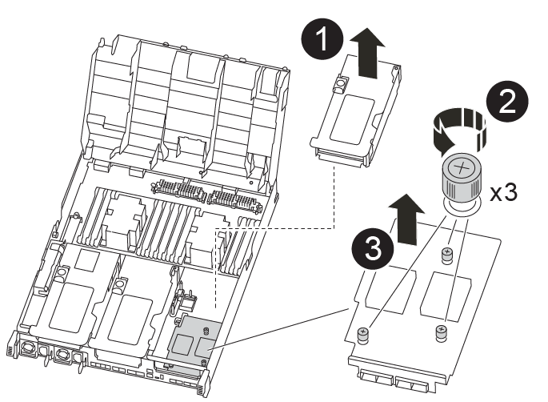

= PCIe 또는 메자닌 카드 - AFF A400을 교체합니다
:icons: font
:imagesdir: ../media/

[role="lead"]
PCIe 또는 메자닌 카드를 교체하려면 케이블과 SFP 및 QSFP 모듈을 카드에서 분리하고, 오류가 발생한 PCIe 또는 메자닌 카드를 교체한 다음 카드를 다시 배선해야 합니다.

* 이 절차는 시스템에서 지원하는 모든 버전의 ONTAP에서 사용할 수 있습니다
* 시스템의 다른 모든 구성 요소가 올바르게 작동해야 합니다. 그렇지 않은 경우 기술 지원 부서에 문의해야 합니다.

== 1단계: 손상된 컨트롤러를 종료합니다

[role="lead"]
스토리지 시스템 하드웨어 구성에 따라 다른 절차를 사용하여 손상된 컨트롤러를 종료하거나 인수할 수 있습니다.

=== 옵션 1: 대부분의 구성

[role="lead"]
손상된 노드를 종료하려면 노드 상태를 확인하고, 필요한 경우 정상 노드가 손상된 노드 스토리지에서 데이터를 계속 제공할 수 있도록 노드를 인계해야 합니다.

노드가 2개 이상인 클러스터가 있는 경우 쿼럼에 있어야 합니다. 클러스터가 쿼럼에 없거나 정상 노드에 자격 및 상태에 대해 false가 표시되는 경우 손상된 노드를 종료하기 전에 문제를 해결해야 합니다. 을 참조하십시오 link:https://docs.netapp.com/us-en/ontap/system-admin/index.html["CLI를 사용한 관리 개요"^].

.단계
. AutoSupport가 활성화된 경우 'system node AutoSupport invoke -node * -type all-message MAINT=number_of_hours_downh' AutoSupport 메시지를 호출하여 자동 케이스 생성을 억제합니다
+
다음 AutoSupport 메시지는 두 시간 동안 자동 케이스 생성을 억제합니다: ' cluster1: * > system node AutoSupport invoke - node * -type all-message MAINT=2h'

. 정상 노드의 콘솔에서 'storage failover modify – node local-auto-반환 false'의 자동 반환 기능을 해제합니다
. 손상된 노드를 LOADER 프롬프트로 가져갑니다.
+
[cols="1,2"]
|===
| 손상된 노드가 표시되는 경우... | 그러면... 

 a| 
LOADER 메시지가 표시됩니다
 a| 
컨트롤러 모듈 제거 로 이동합니다.

 a| 
반환 대기 중...
 a| 
Ctrl-C를 누른 다음 메시지가 나타나면 y를 누릅니다.

 a| 
시스템 프롬프트 또는 암호 프롬프트(시스템 암호 입력)
 a| 
정상 노드인 'storage failover takeover-ofnode_impaired_node_name_'에서 손상된 노드를 인계하거나 중단합니다

손상된 노드에 반환 대기 중... 이 표시되면 Ctrl-C를 누른 다음 "y"로 응답합니다.

를 누릅니다

|===

=== 옵션 2: 컨트롤러가 MetroCluster에 있습니다

NOTE: 시스템이 2노드 MetroCluster 구성인 경우 이 절차를 사용하지 마십시오.

손상된 노드를 종료하려면 노드 상태를 확인하고, 필요한 경우 정상 노드가 손상된 노드 스토리지에서 데이터를 계속 제공할 수 있도록 노드를 인계해야 합니다.

* 노드가 2개 이상인 클러스터가 있는 경우 쿼럼에 있어야 합니다. 클러스터가 쿼럼에 없거나 정상 노드에 자격 및 상태에 대해 false가 표시되는 경우 손상된 노드를 종료하기 전에 문제를 해결해야 합니다. 을 참조하십시오 link:https://docs.netapp.com/us-en/ontap/system-admin/index.html["CLI를 사용한 관리 개요"^].
* MetroCluster 설정이 있는 경우 MetroCluster 설정 상태가 구성되어 있고 해당 노드가 설정 및 정상 상태('MetroCluster node show')인지 확인해야 합니다.

.단계
. AutoSupport가 활성화된 경우 'system node AutoSupport invoke -node * -type all-message MAINT=number_of_hours_downh' AutoSupport 메시지를 호출하여 자동 케이스 생성을 억제합니다
+
다음 AutoSupport 메시지는 두 시간 동안 자동 케이스 생성을 억제합니다: ' cluster1: * > system node AutoSupport invoke - node * -type all-message MAINT=2h'

. 정상 노드의 콘솔에서 'storage failover modify – node local-auto-반환 false'의 자동 반환 기능을 해제합니다
. 손상된 노드를 LOADER 프롬프트로 가져갑니다.
+
[cols="1,2"]
|===
| 손상된 노드가 표시되는 경우... | 그러면... 

 a| 
LOADER 메시지가 표시됩니다
 a| 
컨트롤러 모듈 제거 로 이동합니다.

 a| 
반환 대기 중...
 a| 
Ctrl-C를 누른 다음 메시지가 나타나면 y를 누릅니다.

 a| 
시스템 프롬프트 또는 암호 프롬프트(시스템 암호 입력)
 a| 
정상 노드인 'storage failover takeover-ofnode_impaired_node_name_'에서 손상된 노드를 인계하거나 중단합니다

손상된 노드에 반환 대기 중... 이 표시되면 Ctrl-C를 누른 다음 "y"로 응답합니다.

를 누릅니다

|===

=== 옵션 3: 컨트롤러가 2노드 MetroCluster에 있습니다

[role="lead"]
손상된 노드를 종료하려면 노드 상태를 확인하고, 필요한 경우 정상 노드가 손상된 노드 스토리지에서 데이터를 계속 제공할 수 있도록 노드 간에 전환해야 합니다.

.이 작업에 대해
* NetApp Storage Encryption을 사용하는 경우 의 "FIPS 드라이브 또는 SED를 보호되지 않는 모드로 되돌리기" 섹션의 지침에 따라 MSID를 재설정해야 합니다 link:https://docs.netapp.com/us-en/ontap/encryption-at-rest/return-seds-unprotected-mode-task.html["CLI를 통한 NetApp 암호화 개요"^].
* 정상 노드에 전원을 공급하려면 이 절차의 마지막에 전원 공급 장치를 켜 두어야 합니다.

.단계
. 장애가 발생한 노드가 정상 노드인 'MetroCluster show'로 자동 전환되었는지 확인하려면 MetroCluster 상태를 확인하십시오
. 자동 절체가 발생했는지 여부에 따라 다음 표에 따라 진행합니다.
+
[cols="1,2"]
|===
| 장애가 있는 노드가... | 그러면... 

 a| 
가 자동으로 전환되었습니다
 a| 
다음 단계를 진행합니다.

 a| 
가 자동으로 전환되지 않았습니다
 a| 
정상 노드인 MetroCluster Switchover에서 계획된 절체 작업을 수행한다

 a| 
가 자동으로 전환되지 않고, 'MetroCluster switchover' 명령으로 전환을 시도했으며, 스위치오버가 거부되었습니다
 a| 
거부권 메시지를 검토하고 가능한 경우 문제를 해결한 후 다시 시도하십시오. 문제를 해결할 수 없는 경우 기술 지원 부서에 문의하십시오.

|===
. 정상적인 클러스터에서 'MetroCluster 환원 단계 집계' 명령을 실행하여 데이터 애그리게이트를 재동기화합니다.
+
[listing]
----
controller_A_1::> metrocluster heal -phase aggregates
[Job 130] Job succeeded: Heal Aggregates is successful.
----
+
치유가 거부되면 '-override-vetoes' 매개 변수를 사용하여 'MetroCluster 환원' 명령을 재실행할 수 있습니다. 이 선택적 매개 변수를 사용하는 경우 시스템은 복구 작업을 방지하는 모든 소프트 베인을 재정의합니다.

. MetroCluster operation show 명령을 사용하여 작업이 완료되었는지 확인합니다.
+
[listing]
----
controller_A_1::> metrocluster operation show
    Operation: heal-aggregates
      State: successful
Start Time: 7/25/2016 18:45:55
   End Time: 7/25/2016 18:45:56
     Errors: -
----
. 'storage aggregate show' 명령을 사용하여 애그리게이트의 상태를 확인하십시오.
+
[listing]
----
controller_A_1::> storage aggregate show
Aggregate     Size Available Used% State   #Vols  Nodes            RAID Status
--------- -------- --------- ----- ------- ------ ---------------- ------------
...
aggr_b2    227.1GB   227.1GB    0% online       0 mcc1-a2          raid_dp, mirrored, normal...
----
. MetroCluster 환원 단계 루트 애그리게이트( heal-phase root-aggregate) 명령을 사용하여 루트 애그리게이트를 수정합니다.
+
[listing]
----
mcc1A::> metrocluster heal -phase root-aggregates
[Job 137] Job succeeded: Heal Root Aggregates is successful
----
+
치유가 거부되면 -override-vetoes 매개변수를 사용하여 'MetroCluster 환원' 명령을 재실행할 수 있습니다. 이 선택적 매개 변수를 사용하는 경우 시스템은 복구 작업을 방지하는 모든 소프트 베인을 재정의합니다.

. 대상 클러스터에서 'MetroCluster operation show' 명령을 사용하여 환원 작업이 완료되었는지 확인합니다.
+
[listing]
----

mcc1A::> metrocluster operation show
  Operation: heal-root-aggregates
      State: successful
 Start Time: 7/29/2016 20:54:41
   End Time: 7/29/2016 20:54:42
     Errors: -
----
. 손상된 컨트롤러 모듈에서 전원 공급 장치를 분리합니다.

== 2단계: 컨트롤러 모듈을 분리합니다

[role="lead"]
컨트롤러 모듈 내부의 구성요소에 액세스하려면 섀시에서 컨트롤러 모듈을 분리해야 합니다.

다음 애니메이션, 그림 또는 작성된 단계를 사용하여 섀시에서 컨트롤러 모듈을 제거할 수 있습니다.

https://netapp.hosted.panopto.com/Panopto/Pages/embed.aspx?id=ca74d345-e213-4390-a599-aae10019ec82["컨트롤러 모듈 분리"]

image::../media/drw_A400_Remove_controller.png[drw A400 컨트롤러를 제거합니다]

. 아직 접지되지 않은 경우 올바르게 접지하십시오.
. 전원 케이블 고정 장치를 분리한 다음 전원 공급 장치에서 케이블을 분리합니다.
. 케이블을 케이블 관리 장치에 연결하는 후크 및 루프 스트랩을 푼 다음, 케이블이 연결된 위치를 추적하면서 컨트롤러 모듈에서 시스템 케이블과 SFP(필요한 경우)를 분리합니다.
+
케이블 관리 장치에 케이블을 남겨 두면 케이블 관리 장치를 다시 설치할 때 케이블이 정리됩니다.

. 컨트롤러 모듈에서 케이블 관리 장치를 분리하여 한쪽에 둡니다.
. 양쪽 잠금 래치를 아래로 누른 다음 두 래치를 동시에 아래로 돌립니다.
+
컨트롤러 모듈이 섀시에서 약간 꺼냅니다.

. 컨트롤러 모듈을 섀시 밖으로 밀어냅니다.
+
컨트롤러 모듈 하단을 섀시 밖으로 밀어낼 때 지지하는지 확인합니다.

. 컨트롤러 모듈을 안정적이고 평평한 표면에 놓습니다.

== 3단계: PCIe 카드를 교체합니다

[role="lead"]
PCIe 카드를 교체하려면 오류가 발생한 PCIe 카드를 찾아 컨트롤러 모듈에서 카드가 들어 있는 라이저를 꺼낸 다음 컨트롤러 모듈에 PCIe 라이저를 다시 설치해야 합니다.

다음 애니메이션, 그림 또는 기록된 단계를 사용하여 PCIe 카드를 교체할 수 있습니다.

https://netapp.hosted.panopto.com/Panopto/Pages/embed.aspx?id=84339f87-321c-400e-985e-aae10182cd24["PCIe 카드 교체"]

image:../media/drw_A400_Replace-PCIe-cards.png[""]

. 교체할 카드가 들어 있는 라이저를 분리합니다.
+
.. 공기 덕트 측면의 잠금 탭을 눌러 공기 덕트를 열고 컨트롤러 모듈 뒤쪽으로 민 다음 완전히 열린 위치로 돌립니다.
.. PCIe 카드에 있을 수 있는 SFP 또는 QSFP 모듈을 모두 분리합니다.
.. 라이저 왼쪽의 라이저 잠금 래치를 위로 돌려 공기 덕트 쪽으로 돌립니다.
+
라이저가 컨트롤러 모듈에서 약간 위로 올라갑니다.

.. 라이저를 수직으로 들어올려 평평한 표면에 놓습니다.

. 라이저에서 PCIe 카드를 분리합니다.
+
.. PCIe 카드에 액세스할 수 있도록 라이저를 돌립니다.
.. PCIe 라이저 측면에 있는 잠금 브래킷을 누른 다음 열린 위치로 돌립니다.
.. 라이저 2 및 3의 경우에만 측면 패널을 위로 돌립니다.
.. 브래킷을 살짝 밀어 올려 소켓에서 카드를 똑바로 들어 올려 PCIe 카드를 라이저에서 분리합니다.

. 소켓에 카드를 맞춘 후 소켓에 카드를 눌러 라이저에 교체 PCIe 카드를 설치하고 라이저의 측면 패널을 닫습니다(있는 경우).
+
카드를 슬롯에 제대로 맞추고 소켓에 장착할 때 카드에 힘을 고르게 하십시오. PCIe 카드는 슬롯에 완전히 균일하게 장착되어 있어야 합니다.

+

NOTE: 하단 슬롯에 카드를 설치할 때 카드 소켓이 제대로 보이지 않으면 상단 카드를 제거하여 카드 소켓을 확인하고 카드를 설치한 다음 상단 슬롯에서 분리한 카드를 다시 설치합니다.

. 라이저를 재설치합니다.
+
.. 라이저를 라이저 소켓 측면에 있는 핀에 맞춘 다음 핀을 아래로 내립니다.
.. 라이저를 마더보드의 소켓에 똑바로 밀어 넣습니다.
.. 래치를 라이저의 판금과 같은 높이로 돌립니다.

== 4단계: 메자닌 카드를 교체합니다

[role="lead"]
메자닌 카드는 라이저 번호 3(슬롯 4 및 5) 아래에 있습니다. 메자닌 카드에 액세스하려면 라이저를 분리하고 메자닌 카드를 교체한 다음 라이저 번호 3을 다시 설치해야 합니다. 자세한 내용은 컨트롤러 모듈의 FRU 맵을 참조하십시오.

다음 애니메이션, 그림 또는 기록된 단계를 사용하여 메자닌 카드를 교체할 수 있습니다.

https://netapp.hosted.panopto.com/Panopto/Pages/embed.aspx?id=4e00f5b1-8ca5-4cd6-9881-aadb01578e52["메자닌 카드 장착"]

. 라이저 번호 3(슬롯 4 및 5)을 분리합니다.
+
.. 공기 덕트 측면의 잠금 탭을 눌러 공기 덕트를 열고 컨트롤러 모듈 뒤쪽으로 민 다음 완전히 열린 위치로 돌립니다.
.. PCIe 카드에 있을 수 있는 SFP 또는 QSFP 모듈을 모두 분리합니다.
.. 라이저 왼쪽의 라이저 잠금 래치를 위로 돌려 공기 덕트 쪽으로 돌립니다.
+
라이저가 컨트롤러 모듈에서 약간 위로 올라갑니다.

.. 라이저를 들어 올린 다음 안정적이고 평평한 곳에 둡니다.

. 메자닌 카드를 교체합니다.
+
.. 카드에서 QSFP 또는 SFP 모듈을 모두 분리합니다.
.. 메자닌 카드의 손잡이 나사를 풀고 카드를 소켓에서 직접 조심스럽게 들어 올려 옆에 둡니다.
.. 교체용 메자닌 카드를 소켓과 가이드 핀 위에 맞추고 조심스럽게 카드를 소켓에 밀어 넣습니다.
.. 메자닌 카드의 나비 나사를 조입니다.

. 라이저를 재설치합니다.
+
.. 라이저를 라이저 소켓 측면에 있는 핀에 맞춘 다음 핀을 아래로 내립니다.
.. 라이저를 마더보드의 소켓에 똑바로 밀어 넣습니다.
.. 래치를 라이저의 판금과 같은 높이로 돌립니다.

== 5단계: 컨트롤러 모듈을 설치합니다

[role="lead"]
컨트롤러 모듈에서 구성 요소를 교체한 후 컨트롤러 모듈을 섀시에 다시 설치한 다음 유지보수 모드로 부팅해야 합니다.

다음 애니메이션, 그림 또는 기록된 단계를 사용하여 섀시에 컨트롤러 모듈을 설치할 수 있습니다.

https://netapp.hosted.panopto.com/Panopto/Pages/embed.aspx?id=0310fe80-b129-4685-8fef-ab19010e720a["컨트롤러 모듈 설치"]

image::../media/drw_A400_Install_controller_source.png[drw A400 컨트롤러 소스 설치]

. 아직 에어 덕트를 닫지 않은 경우 에어 덕트를 닫으십시오.
. 컨트롤러 모듈의 끝을 섀시의 입구에 맞춘 다음 컨트롤러 모듈을 반쯤 조심스럽게 시스템에 밀어 넣습니다.
+

NOTE: 지시가 있을 때까지 컨트롤러 모듈을 섀시에 완전히 삽입하지 마십시오.

. 필요에 따라 시스템을 다시 연결합니다.
+
미디어 컨버터(QSFP 또는 SFP)를 분리한 경우 광섬유 케이블을 사용하는 경우 다시 설치해야 합니다.

. 컨트롤러 모듈 설치를 완료합니다.
+
.. 전원 코드를 전원 공급 장치에 연결하고 전원 케이블 잠금 고리를 다시 설치한 다음 전원 공급 장치를 전원에 연결합니다.
.. 잠금 래치를 사용하여 컨트롤러 모듈이 중앙판과 만나 완전히 장착될 때까지 섀시 안으로 단단히 밀어 넣습니다.
+
컨트롤러 모듈이 완전히 장착되면 잠금 래치가 상승합니다.

+

NOTE: 커넥터가 손상되지 않도록 컨트롤러 모듈을 섀시에 밀어 넣을 때 과도한 힘을 가하지 마십시오.

+
컨트롤러 모듈이 섀시에 완전히 장착되면 바로 부팅이 시작됩니다. 부트 프로세스를 중단할 준비를 하십시오.

.. 잠금 래치를 위쪽으로 돌려 잠금 핀이 풀리도록 컨트롤러 모듈을 기울인 다음 컨트롤러를 완전히 밀어 넣은 다음 잠금 래치를 잠금 위치로 내려 섀시에 완전히 장착합니다.
.. 아직 설치하지 않은 경우 케이블 관리 장치를 다시 설치하십시오.
.. 정상 부트 프로세스를 중단하고 'Ctrl-C'를 눌러 로더로 부팅합니다.
+

NOTE: 시스템이 부팅 메뉴에서 멈추는 경우 로더로 부팅하는 옵션을 선택합니다.

.. LOADER 프롬프트에서 BYE를 입력하여 PCIe 카드 및 기타 구성 요소를 재초기화하고 노드를 재부팅합니다.

. 'storage failover back-ofnode_impaired_node_name_'이라는 스토리지 용량을 제공하여 노드를 정상 작동 상태로 되돌립니다
. 자동 반환이 비활성화된 경우 'Storage failover modify -node local -auto-반환 true'를 다시 설정합니다

== 6단계: 컨트롤러 모듈을 작동 상태로 복원합니다

[role="lead"]
컨트롤러를 복원하려면 시스템을 재가동하고 컨트롤러 모듈을 반환한 다음 자동 반환이 다시 사용되도록 설정해야 합니다.

. 필요에 따라 시스템을 다시 연결합니다.
+
미디어 컨버터(QSFP 또는 SFP)를 분리한 경우 광섬유 케이블을 사용하는 경우 다시 설치해야 합니다.

. 'storage failover back-ofnode_impaired_node_name_'이라는 스토리지 용량을 제공하여 노드를 정상 작동 상태로 되돌립니다
. 자동 반환이 비활성화된 경우 'Storage failover modify -node local -auto-반환 true'를 다시 설정합니다

== 7단계: 2노드 MetroCluster 구성에서 애그리게이트를 다시 전환합니다

[role="lead"]
2노드 MetroCluster 구성에서 FRU 교체를 완료한 후에는 MetroCluster 스위치백 작업을 수행할 수 있습니다. 그러면 이전 사이트의 SVM(Sync-Source Storage Virtual Machine)이 활성 상태이고 로컬 디스크 풀에서 데이터를 제공하는 구성을 정상 운영 상태로 되돌릴 수 있습니다.

이 작업은 2노드 MetroCluster 구성에만 적용됩니다.

.단계
. 모든 노드가 "enabled" 상태(MetroCluster node show)에 있는지 확인합니다
+
[listing]
----
cluster_B::>  metrocluster node show

DR                           Configuration  DR
Group Cluster Node           State          Mirroring Mode
----- ------- -------------- -------------- --------- --------------------
1     cluster_A
              controller_A_1 configured     enabled   heal roots completed
      cluster_B
              controller_B_1 configured     enabled   waiting for switchback recovery
2 entries were displayed.
----
. 모든 SVM에서 재동기화가 완료되었는지 확인합니다. 'MetroCluster vserver show'
. 복구 작업에 의해 수행되는 자동 LIF 마이그레이션이 'MetroCluster check lif show'에 성공적으로 완료되었는지 확인합니다
. 정상적인 클러스터에 있는 모든 노드에서 'MetroCluster 스위치백' 명령을 사용하여 스위치백을 수행합니다.
. 스위치백 작업이 완료되었는지 확인합니다. 'MetroCluster show'
+
클러스터가 "대기 중 - 스위치백" 상태에 있으면 스위치백 작업이 여전히 실행 중입니다.

+
[listing]
----
cluster_B::> metrocluster show
Cluster              Configuration State    Mode
--------------------	------------------- 	---------
 Local: cluster_B configured       	switchover
Remote: cluster_A configured       	waiting-for-switchback
----
+
클러스터가 '정상' 상태에 있으면 스위치백 작업이 완료됩니다.

+
[listing]
----
cluster_B::> metrocluster show
Cluster              Configuration State    Mode
--------------------	------------------- 	---------
 Local: cluster_B configured      		normal
Remote: cluster_A configured      		normal
----
+
스위치백을 완료하는 데 시간이 오래 걸리는 경우 MetroCluster config-replication resync resync-status show 명령을 사용하여 진행 중인 기준선의 상태를 확인할 수 있습니다.

. SnapMirror 또는 SnapVault 구성을 다시 설정합니다.

== 8단계: 장애가 발생한 부품을 NetApp에 반환

[role="lead"]
부품을 교체한 후 키트와 함께 제공된 RMA 지침에 따라 오류가 발생한 부품을 NetApp에 반환할 수 있습니다. 기술 지원 부서(에 문의하십시오 https://mysupport.netapp.com/site/global/dashboard["NetApp 지원"], 888-463-8277 (북미), 00-800-44-638277 (유럽) 또는 +800-800-80-800 (아시아/태평양) 교체 절차에 대한 추가 지원이 필요한 경우.
