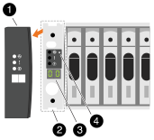

= 스토리지 시스템의 전원을 켭니다(AFF A70, AFF A90)
:allow-uri-read: 
:icons: font
:imagesdir: ../media/

[role="lead"]
네트워크와 쉘프 케이블을 연결한 후 컨트롤러 및 추가 쉘프에 전원을 공급할 준비가 되었습니다.

NOTE: 외부 NS224 쉘프는 선택 사항입니다.

== 1단계: 쉘프 전원을 켜고 쉘프 ID를 할당합니다

ONTAP 스토리지 시스템에서 각 NS224 쉘프는 고유한 쉘프 ID로 구별됩니다. 이 ID는 쉘프가 스토리지 시스템 설정 내에서 구분되도록 합니다. 기본적으로 쉘프 ID는 일반적으로 '00' 및 '01'로 할당되지만, 스토리지 시스템 전체에서 고유성을 유지하기 위해 이러한 ID를 조정해야 할 수 있습니다.

NOTE: 컨트롤러 섀시 쉘프 ID는 '00'으로 하드 코딩됩니다. 플랫폼에 연결된 NS224 쉘프에는 쉘프 ID '00'을 사용하지 마십시오.

.이 작업에 대해
* 유효한 쉘프 ID는 00부터 99까지입니다.
* 쉘프 ID가 적용되려면 쉘프의 전원을 껐다가 다시 켜기(두 전원 코드를 모두 뽑은 다음, 적절한 시간을 기다린 다음 다시 꽂아야 합니다).

.단계
. 전원 코드를 선반에 먼저 연결하고 전원 코드 고정대로 제자리에 고정한 다음 전원 코드를 다른 회로의 전원에 연결하여 선반의 전원을 켭니다.
+
셸프의 전원이 켜지고 전원에 연결되면 자동으로 부팅됩니다.

. 왼쪽 끝 캡을 제거하여 전면판 뒤의 셸프 ID 버튼에 액세스합니다.
+

+
[cols="20%,80%"]
|===

 a| 
image::../media/legend_icon_01.svg[설명선 번호 1]
 a| 
선반 엔드 캡

 a| 
image::../media/legend_icon_02.svg[설명선 번호 2]
 a| 
선반 면판

 a| 
image::../media/legend_icon_03.svg[설명선 번호 3]
 a| 
쉘프 ID 번호입니다

 a| 
image::../media/legend_icon_04.svg[설명선 번호 4]
 a| 
쉘프 ID 액세스 버튼

|===
. 쉘프 ID의 첫 번째 번호를 변경합니다.
+
.. 종이 클립의 곧게 편 끝이나 끝이 뾰족한 볼 포인트 펜을 작은 구멍에 삽입합니다.
.. 디지털 디스플레이의 첫 번째 숫자가 깜박일 때까지 단추를 누른 다음 단추를 놓습니다.
+
숫자가 깜박일 때까지 최대 15초가 걸릴 수 있습니다. 그러면 쉘프 ID 프로그래밍 모드가 활성화됩니다.

+

NOTE: ID가 깜빡이는 데 15초 이상 걸리는 경우 버튼을 다시 길게 눌러 완전히 누르십시오.

.. 버튼을 눌렀다가 놓으면 0에서 9 사이의 원하는 번호에 도달할 때까지 숫자가 앞으로 이동합니다.
+
각 누름 및 해제 시간은 1초 단위로 짧게 설정할 수 있습니다.

+
첫 번째 숫자가 계속 깜박입니다.

. 쉘프 ID의 두 번째 번호를 변경합니다.
+
.. 디지털 디스플레이에서 두 번째 숫자가 깜박일 때까지 버튼을 계속 누릅니다.
+
숫자가 깜박일 때까지 최대 3초가 걸릴 수 있습니다.

+
디지털 디스플레이의 첫 번째 숫자가 깜박임을 멈춥니다.

.. 버튼을 눌렀다가 놓으면 0에서 9 사이의 원하는 번호에 도달할 때까지 숫자가 앞으로 이동합니다.
+
두 번째 숫자가 계속 깜박입니다.

. 원하는 번호를 잠그고 두 번째 번호의 깜박임이 멈출 때까지 버튼을 길게 눌러 프로그래밍 모드를 종료합니다.
+
숫자가 깜박임을 멈추는 데 최대 3초가 걸릴 수 있습니다.

+
디지털 디스플레이의 두 숫자가 깜박이기 시작하고 ODP의 황색 LED가 약 5초 후에 켜지면서 보류 중인 쉘프 ID가 아직 적용되지 않았음을 알려줍니다.

. 쉘프 ID가 적용되도록 쉘프 전원을 10초 이상 껐다가 다시 켭니다.
+
.. 쉘프의 두 전원 공급 장치에서 전원 코드를 뽑습니다.
.. 10초 동안 기다립니다.
.. 전원 코드를 쉘프 전원 공급 장치에 다시 꽂아 전원을 껐다가 다시 켭니다.
+
전원 코드가 꽂으면 전원 공급 장치의 전원이 켜집니다. 이색 LED가 녹색으로 켜져야 합니다.

. 왼쪽 엔드 캡을 다시 장착합니다.

== 2단계: 컨트롤러의 전원을 켭니다

. 랩톱을 직렬 콘솔 포트에 연결하여 컨트롤러에 전원이 공급될 때 부팅 순서를 모니터링할 수 있습니다.
+
.. 노트북의 직렬 콘솔 포트를 N-8-1에서 115,200보드로 설정합니다.
+

NOTE: 직렬 콘솔 포트를 구성하는 방법에 대한 지침은 노트북의 온라인 도움말을 참조하십시오.

.. 콘솔 케이블을 노트북에 연결하고 플랫폼과 함께 제공된 콘솔 케이블을 사용하여 컨트롤러의 직렬 콘솔 포트를 연결합니다.
.. 랩톱을 관리 서브넷의 스위치에 연결합니다.
+
image::../media/drw_a1k_70-90_console_connection_ieops-1702.svg[콘솔 연결]

.. 관리 서브넷에 있는 주소를 사용하여 랩톱에 TCP/IP 주소를 할당합니다.

. 전원 코드를 컨트롤러 전원 공급 장치에 연결한 다음 다른 회로의 전원 공급 장치에 연결합니다.
+
image::../media/drw_affa1k_power_source_icon_ieops-1700.svg[일반 전원 연결 다이어그램]

+
** 플랫폼이 부팅되기 시작합니다. 초기 부팅에는 최대 8분이 소요될 수 있습니다.
** LED가 깜박이고 팬이 시작되면서 컨트롤러에 전원이 들어오고 있음을 나타냅니다.
** 팬이 처음 시동될 때 매우 큰 소음이 발생할 수 있습니다. 시동 중 큰 팬 소음이 발생하는 것은 정상입니다.

. 각 전원 공급 장치의 고정 장치를 사용하여 전원 케이블을 고정합니다.

