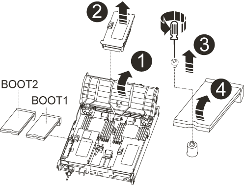
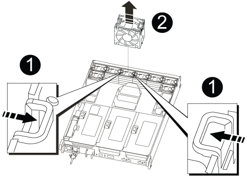

= 컨트롤러 모듈 하드웨어 교체 - AFF A700s
:allow-uri-read: 
:icons: font
:imagesdir: ../media/

[role="lead"]
컨트롤러 모듈 하드웨어를 교체하려면 손상된 컨트롤러를 제거하고, FRU 구성 요소를 교체 컨트롤러 모듈로 이동한 다음, 교체 컨트롤러 모듈을 섀시에 설치하고, 시스템을 유지보수 모드로 부팅해야 합니다.

== 1단계: 컨트롤러 모듈을 분리합니다

컨트롤러 모듈을 교체하거나 컨트롤러 모듈 내부에 있는 구성요소를 교체할 때 섀시에서 컨트롤러 모듈을 분리해야 합니다.

. 아직 접지되지 않은 경우 올바르게 접지하십시오.
. 케이블을 케이블 관리 장치에 연결하는 후크 및 루프 스트랩을 푼 다음, 케이블이 연결된 위치를 추적하면서 컨트롤러 모듈에서 시스템 케이블과 SFP(필요한 경우)를 분리합니다.
+
케이블 관리 장치에 케이블을 남겨 두면 케이블 관리 장치를 다시 설치할 때 케이블이 정리됩니다.

. 전원에서 컨트롤러 모듈 전원 공급 장치를 분리한 다음 전원 공급 장치에서 케이블을 뽑습니다.
. 컨트롤러 모듈에서 케이블 관리 장치를 분리하여 한쪽에 둡니다.
. 양쪽 잠금 래치를 아래로 누른 다음 두 래치를 동시에 아래로 돌립니다.
+
컨트롤러 모듈이 섀시에서 약간 꺼냅니다.

+
image::../media/drw_a700s_pcm_remove.png[drw a700s PCM 제거]

+
[cols="1,4"]
|===

 a| 
image:../media/legend_icon_01.png[""]
| 잠금 래치 

 a| 
image:../media/legend_icon_02.png[""]
 a| 
잠금 핀

|===
. 컨트롤러 모듈을 섀시 밖으로 밀어냅니다.
+
컨트롤러 모듈 하단을 섀시 밖으로 밀어낼 때 지지하는지 확인합니다.

. 컨트롤러 모듈을 안정적이고 평평한 표면에 놓은 다음 공기 덕트를 엽니다.
+
.. 에어 덕트 측면에 있는 잠금 탭을 컨트롤러 모듈 중앙을 향해 누릅니다.
.. 공기 덕트를 팬 모듈 쪽으로 민 다음 완전히 열린 위치까지 위쪽으로 돌립니다.
+
image::../media/drw_a700s_open_air_duct.png[drw a700s 개방형 공기 덕트]

+
[cols="1,4"]
|===

 a| 
image:../media/legend_icon_01.png[""]
| 에어 덕트 잠금 탭 

 a| 
image:../media/legend_icon_02.png[""]
 a| 
라이저

 a| 
image:../media/legend_icon_03.png[""]
 a| 
에어 덕트

|===

== 2단계: NVRAM 카드를 이동합니다

컨트롤러 교체 프로세스의 일부로 손상된 컨트롤러 모듈의 라이저 1에서 NVRAM 카드를 분리하고 교체 컨트롤러 모듈의 라이저 1에 카드를 설치해야 합니다. 장애가 있는 컨트롤러 모듈에서 교체 컨트롤러 모듈로 DIMM을 이동한 후에만 라이저 1을 교체 컨트롤러 모듈에 다시 설치해야 합니다.

. 컨트롤러 모듈에서 NVRAM 라이저, 라이저 1을 분리합니다.
+
.. 라이저 왼쪽에 있는 라이저 잠금 래치를 팬 쪽으로 돌립니다.
+
NVRAM 라이저가 컨트롤러 모듈에서 약간 위로 올라갑니다.

.. NVRAM 라이저를 위로 들어 올리고 팬을 향해 이동해서 라이저의 판금 립이 컨트롤러 모듈의 모서리에서 분리되도록 한 다음, 라이저를 컨트롤러 모듈에서 수직으로 들어올립니다. 그런 다음 NVRAM 카드에 액세스할 수 있도록 평평하고 안정적인 곳에 놓습니다.
+
image::../media/drw_a700s_nvme_replace.png[drw a700s NVMe 교체]

+
[cols="1,4"]
|===

 a| 
image:../media/legend_icon_01.png[""]
| 에어 덕트 

 a| 
image:../media/legend_icon_02.png[""]
 a| 
라이저 1 잠금 래치

 a| 
image:../media/legend_icon_03.png[""]
 a| 
NVRAM 카드에 연결하는 NVRAM 배터리 케이블 플러그

 a| 
image:../media/legend_icon_04.png[""]
 a| 
카드 잠금 브래킷

 a| 
image:../media/legend_icon_05.png[""]
 a| 
NVRAM 카드

|===

. 라이저 모듈에서 NVRAM 카드를 분리합니다.
+
.. NVRAM 카드에 액세스할 수 있도록 라이저 모듈을 돌립니다.
.. NVRAM 카드에 연결된 NVRAM 배터리 케이블을 뽑습니다.
.. NVRAM 라이저 측면에 있는 잠금 브래킷을 누른 다음 열린 위치로 돌립니다.
.. 라이저 모듈에서 NVRAM 카드를 분리합니다.

. 교체용 컨트롤러 모듈에서 NVRAM 라이저를 분리합니다.
. NVRAM 라이저에 NVRAM 카드를 설치합니다.
+
.. 카드를 라이저 모듈의 카드 가이드 및 라이저의 카드 소켓에 맞춥니다.
.. 카드를 카드 소켓에 똑바로 밀어 넣습니다.
+

NOTE: 카드가 라이저 소켓에 완전히 똑바로 장착되었는지 확인하십시오.

.. NVRAM 카드의 소켓에 배터리 케이블을 연결합니다.
.. 잠금 래치를 잠금 위치로 돌려 제자리에 고정되었는지 확인합니다.

== 3단계: PCIe 카드를 이동합니다

컨트롤러 교체 프로세스의 일환으로, PCIe 라이저 모듈, 라이저 2(중간 라이저) 및 라이저 3(맨 오른쪽에 있는 라이저) 모두를 손상된 컨트롤러 모듈에서 분리하고 라이저 모듈에서 PCIe 카드를 제거해야 합니다. 교체용 컨트롤러 모듈의 동일한 라이저 모듈에 설치합니다. DIMM을 교체 컨트롤러 모듈로 이동하면 라이저 모듈을 교체 컨트롤러 모듈에 설치합니다.

. 컨트롤러 모듈에서 PCIe 라이저를 분리합니다.
+
.. PCIe 카드에 있을 수 있는 SFP 모듈을 모두 분리합니다.
.. 라이저 왼쪽의 모듈 잠금 래치를 위로 돌려 팬 모듈을 향해 돌립니다.
+
PCIe 라이저가 컨트롤러 모듈에서 약간 위로 올라갑니다.

.. PCIe 라이저를 위로 들어 올리고 팬 쪽으로 이동시키고 라이저의 판금 립이 컨트롤러 모듈의 모서리에서 분리되도록 한 다음, 라이저를 컨트롤러 모듈에서 들어 올린 다음 안정적이고 평평한 표면에 놓습니다.
+
image::../media/drw_a700s_pcie_replace.png[drw a700s PCIe 교체]

+
[cols="1,4"]
|===

 a| 
image:../media/legend_icon_01.png[""]
| 에어 덕트 

 a| 
image:../media/legend_icon_02.png[""]
 a| 
라이저 잠금 래치

 a| 
image:../media/legend_icon_03.png[""]
 a| 
카드 잠금 브래킷

 a| 
image:../media/legend_icon_04.png[""]
 a| 
라이저 2(중간 라이저) 및 라이저 슬롯 2 및 3의 PCI 카드

|===

. 라이저에서 PCIe 카드를 분리합니다.
+
.. PCIe 카드에 액세스할 수 있도록 라이저를 돌립니다.
.. PCIe 라이저 측면에 있는 잠금 브래킷을 누른 다음 열린 위치로 돌립니다.
.. 라이저에서 PCIe 카드를 분리합니다.

. 교체용 컨트롤러 모듈에서 해당 라이저를 분리합니다.
. PCIe 라이저의 동일한 슬롯에 PCIe 카드를 설치합니다.
+
.. 카드를 라이저의 카드 가이드와 라이저의 카드 소켓에 맞춘 다음 라이저의 소켓에 똑바로 밀어 넣습니다.
+

NOTE: 카드가 라이저 소켓에 완전히 똑바로 장착되었는지 확인하십시오.

.. 잠금 래치가 딸깍 소리를 내며 잠금 위치로 들어갈 때까지 돌려 고정합니다.

. 손상된 컨트롤러 모듈의 슬롯 4 및 5에서 라이저 3 및 PCIe 카드에 대해 위의 단계를 반복합니다.

== 4단계: 부팅 미디어를 이동합니다

AFF A700s에는 1차 및 2차 또는 백업 부팅 미디어라는 2개의 부팅 미디어 장치가 있습니다. 손상된 컨트롤러에서 _replacement_controller로 이동한 다음 _replacement_controller의 해당 슬롯에 설치해야 합니다.

부팅 미디어는 라이저 2의 중간 PCIe 라이저 모듈에 있습니다. 부팅 미디어에 액세스하려면 이 PCIe 모듈을 제거해야 합니다.

. 부팅 미디어를 찾습니다.
+
.. 필요한 경우 공기 덕트를 엽니다.
.. 필요한 경우 잠금 래치를 잠금 해제한 다음 컨트롤러 모듈에서 라이저를 분리하여 가운데 PCIe 모듈인 라이저 2를 분리합니다.
+

+
[cols="1,4"]
|===

 a| 
image:../media/legend_icon_01.png[""]
| 에어 덕트 

 a| 
image:../media/legend_icon_02.png[""]
 a| 
라이저 2(중간 PCIe 모듈)

 a| 
image:../media/legend_icon_03.png[""]
 a| 
부트 미디어 나사

 a| 
image:../media/legend_icon_04.png[""]
 a| 
미디어를 부팅합니다

|===
. 컨트롤러 모듈에서 부팅 미디어를 제거합니다.
+
.. 1 십자 드라이버를 사용하여 부트 매체를 잡고 있는 나사를 제거하고 나사를 안전한 곳에 둡니다.
.. 부팅 미디어의 측면을 잡고 부팅 미디어를 천천히 위로 돌린 다음 부팅 미디어를 소켓에서 똑바로 잡아당겨 분리합니다.

. 부팅 미디어를 새 컨트롤러 모듈로 옮기고 설치합니다.
+

NOTE: 손상된 컨트롤러 모듈에 설치된 교체 컨트롤러 모듈의 동일한 소켓에 부팅 미디어를 설치하고, 기본 부팅 미디어 소켓(슬롯 1)과 보조 부팅 미디어 소켓(슬롯 2)을 보조 부팅 미디어 소켓에 설치합니다.

+
.. 부트 미디어의 가장자리를 소켓 하우징에 맞춘 다음 조심스럽게 소켓에 똑바로 밀어 넣습니다.
.. 부트 미디어를 마더보드 쪽으로 돌립니다.
.. 부트 미디어 나사를 사용하여 부트 미디어를 마더보드에 고정합니다.
+
나사를 너무 조이지 마십시오. 그렇지 않으면 부트 미디어가 손상될 수 있습니다.

== 5단계: 팬을 이동합니다

오류가 발생한 컨트롤러 모듈을 교체할 때 장애가 발생한 컨트롤러 모듈에서 교체 모듈로 팬을 이동해야 합니다.

. 팬 모듈 측면에 있는 잠금 탭을 잡고 팬 모듈을 컨트롤러 모듈 밖으로 똑바로 들어 올려 팬 모듈을 분리합니다.
+

+
[cols="1,4"]
|===

 a| 
image:../media/legend_icon_01.png[""]
| 팬 잠금 탭 

 a| 
image:../media/legend_icon_02.png[""]
 a| 
팬 모듈

|===
. 팬 모듈을 교체용 컨트롤러 모듈로 옮긴 다음 팬 모듈의 가장자리를 컨트롤러 모듈의 입구에 맞춘 다음 잠금 래치가 제자리에 고정될 때까지 팬 모듈을 컨트롤러 모듈로 밀어 넣습니다.
. 나머지 팬 모듈에 대해 이 단계를 반복합니다.

== 6단계: 시스템 DIMM을 이동합니다

[role="lead"]
DIMM을 이동하려면 손상된 컨트롤러를 찾아 교체 컨트롤러로 이동한 다음 특정 단계를 따릅니다.

. 컨트롤러 모듈에서 DIMM을 찾습니다.
+
image::../media/drw_a700s_dimm_replace.png[drw a700s DIMM 교체]

+
[cols="1,4"]
|===

 a| 
image:../media/legend_icon_01.png[""]
| 에어 덕트 

 a| 
image:../media/legend_icon_02.png[""]
 a| 
라이저 1 및 DIMM 뱅크 1-4

 a| 
image:../media/legend_icon_03.png[""]
 a| 
라이저 2 및 DIMM 뱅크 5-8 및 9-12

 a| 
image:../media/legend_icon_04.png[""]
 a| 
라이저 3 및 DIMM 뱅크 13-16

|===
. DIMM을 올바른 방향으로 교체 컨트롤러 모듈에 삽입할 수 있도록 소켓에 있는 DIMM의 방향을 기록해 두십시오.
. DIMM의 양쪽에 있는 두 개의 DIMM 이젝터 탭을 천천히 밀어 슬롯에서 DIMM을 꺼낸 다음 슬롯에서 DIMM을 밀어 꺼냅니다.
+

NOTE: DIMM 회로 보드의 구성 요소에 압력이 가해질 수 있으므로 DIMM의 가장자리를 조심스럽게 잡으십시오.

. DIMM을 설치할 슬롯을 찾습니다.
. 커넥터의 DIMM 이젝터 탭이 열린 위치에 있는지 확인한 다음 DIMM을 슬롯에 똑바로 삽입합니다.
+
DIMM은 슬롯에 단단히 장착되지만 쉽게 장착할 수 있습니다. 그렇지 않은 경우 DIMM을 슬롯에 재정렬하고 다시 삽입합니다.

+

NOTE: DIMM이 균일하게 정렬되어 슬롯에 완전히 삽입되었는지 육안으로 검사합니다.

. 이젝터 탭이 DIMM 끝 부분의 노치 위에 끼워질 때까지 DIMM의 상단 가장자리를 조심스럽게 단단히 누릅니다.
. 나머지 DIMM에 대해 이 단계를 반복합니다.

== 7단계: NVRAM 모듈을 설치합니다

NVRAM 모듈을 설치하려면 특정 단계의 순서를 따라야 합니다.

. 라이저를 컨트롤러 모듈에 설치합니다.
+
.. 라이저의 립을 컨트롤러 모듈 판금의 밑면에 맞춥니다.
.. 라이저를 컨트롤러 모듈의 핀을 따라 이동한 다음 라이저를 컨트롤러 모듈에 내려 놓습니다.
.. 잠금 래치를 아래로 돌려 잠금 위치로 클릭합니다.
+
잠금 래치가 잠기면 잠금 래치가 라이저 윗면과 맞닿고 라이저는 컨트롤러 모듈에 똑바로 앉습니다.

.. PCIe 카드에서 제거된 SFP 모듈을 모두 재장착합니다.

== 8단계: NVRAM 배터리를 이동합니다

컨트롤러 모듈을 교체할 때는 NVRAM 배터리를 손상된 컨트롤러 모듈에서 교체 컨트롤러 모듈로 이동해야 합니다

. 라이저 모듈, 라이저 1의 왼쪽에서 NVRAM 배터리를 찾습니다.
+
image::../media/drw_a700s_nvme_battery_replace.png[drw a700s NVMe 배터리 교체]

+
[cols="1,4"]
|===

 a| 
image:../media/legend_icon_01.png[""]
| NVRAM 배터리 플러그 

 a| 
image:../media/legend_icon_02.png[""]
 a| 
파란색 NVRAM 배터리 잠금 탭

|===
. 배터리 플러그를 찾아 배터리 플러그 표면에 있는 클립을 눌러 소켓에서 플러그를 분리한 다음 소켓에서 배터리 케이블을 분리합니다.
. 배터리를 잡고 누름 이라고 표시된 파란색 잠금 탭을 누른 다음 홀더 및 컨트롤러 모듈에서 배터리를 들어올립니다.
. 배터리 팩을 교체 컨트롤러 모듈로 옮긴 다음 NVRAM 라이저에 설치합니다.
+
.. 측면 벽의 지지 탭이 배터리 팩의 슬롯에 끼워질 때까지 판금 측면 벽을 따라 배터리 팩을 아래로 밀어 넣습니다. 그러면 배터리 팩 래치가 맞물려 제자리에 잠깁니다.
.. 배터리 팩을 단단히 눌러 제자리에 고정되었는지 확인합니다.
.. 배터리 플러그를 라이저 소켓에 꽂고 플러그가 제자리에 고정되어 있는지 확인합니다.

== 9단계: PCIe 라이저를 설치합니다

PCIe 라이저를 설치하려면 특정 단계를 따라야 합니다.

. 아직 접지되지 않은 경우 올바르게 접지하십시오.
. 라이저를 컨트롤러 모듈에 설치합니다.
+
.. 라이저의 립을 컨트롤러 모듈 판금의 밑면에 맞춥니다.
.. 라이저를 컨트롤러 모듈의 핀을 따라 이동한 다음 라이저를 컨트롤러 모듈에 내려 놓습니다.
.. 잠금 래치를 아래로 돌려 잠금 위치로 클릭합니다.
+
잠금 래치가 잠기면 잠금 래치가 라이저 윗면과 맞닿고 라이저는 컨트롤러 모듈에 똑바로 앉습니다.

.. PCIe 카드에서 제거된 SFP 모듈을 모두 재장착합니다.

. 손상된 컨트롤러 모듈의 슬롯 4 및 5에서 라이저 3 및 PCIe 카드에 대해 위의 단계를 반복합니다.

== 10단계: 전원 공급 장치를 이동합니다

컨트롤러 모듈을 교체할 때 손상된 컨트롤러 모듈에서 교체 컨트롤러 모듈로 전원 공급 장치 및 전원 공급 장치 보호물을 이동해야 합니다.

. 아직 접지되지 않은 경우 올바르게 접지하십시오.
. 잠금 탭을 누른 상태에서 컨트롤러 모듈에서 전원 공급 장치를 당겨 빼낼 수 있도록 캠 핸들을 돌립니다.
+

CAUTION: 전원 공급 장치가 단락되었습니다. 컨트롤러 모듈에서 분리할 때 컨트롤 모듈이 갑자기 흔들리지 않고 다치지 않도록 항상 두 손을 사용하여 지지하십시오.

+
image::../media/drw_a700s_replace_psu.gif[drw a700s PSU 교체]

+
|===

 a| 
image:../media/legend_icon_01.png[""]
| 파란색 전원 공급 장치 잠금 탭 

 a| 
image:../media/legend_icon_02.png[""]
 a| 
전원 공급 장치

|===
. 전원 공급 장치를 새 컨트롤러 모듈로 이동한 다음 설치합니다.
. 양손으로 전원 공급 장치의 가장자리를 컨트롤러 모듈의 입구에 맞춘 다음 잠금 탭이 딸깍 소리가 나면서 제자리에 고정될 때까지 전원 공급 장치를 컨트롤러 모듈에 부드럽게 밀어 넣습니다.
+
전원 공급 장치는 내부 커넥터에만 제대로 연결되어 한 방향으로만 제자리에 고정됩니다.

+

NOTE: 내부 커넥터의 손상을 방지하려면 전원 공급 장치를 시스템에 밀어 넣을 때 과도한 힘을 가하지 마십시오.

. 손상된 컨트롤러 모듈에서 PSU 블랭킹 패널을 제거한 다음 교체 컨트롤러 모듈에 설치합니다.

== 11단계: 컨트롤러 모듈을 설치합니다

장애가 발생한 컨트롤러 모듈에서 교체 컨트롤러 모듈로 모든 구성 요소를 이동한 후에는 교체 컨트롤러 모듈을 섀시에 설치하고 유지보수 모드로 부팅해야 합니다.

. 아직 접지되지 않은 경우 올바르게 접지하십시오.
. 아직 에어 덕트를 닫지 않은 경우 에어 덕트를 닫으십시오.
+
.. 공기 덕트를 컨트롤러 모듈로 끝까지 돌립니다.
.. 잠금 탭이 딸깍 소리가 날 때까지 공기 덕트를 라이저 쪽으로 밉니다.
.. 공기 덕트가 제대로 장착되고 제자리에 고정되었는지 확인합니다.
+
image::../media/drw_a700s_close_air_duct.png[drw a700s 공기 덕트 닫기]

+
|===

 a| 
image:../media/legend_icon_01.png[""]
| 잠금 탭 

 a| 
image:../media/legend_icon_02.png[""]
 a| 
슬라이드 플런저

|===
. 컨트롤러 모듈의 끝을 섀시의 입구에 맞춘 다음 컨트롤러 모듈을 반쯤 조심스럽게 시스템에 밀어 넣습니다.
+

NOTE: 지시가 있을 때까지 컨트롤러 모듈을 섀시에 완전히 삽입하지 마십시오.

. 다음 섹션의 작업을 수행하기 위해 시스템에 액세스할 수 있도록 관리 포트와 콘솔 포트에만 케이블을 연결합니다.
+

NOTE: 이 절차의 뒷부분에서 나머지 케이블을 컨트롤러 모듈에 연결합니다.

. 컨트롤러 모듈 재설치를 완료합니다.
+
.. 컨트롤러 모듈이 중앙판과 만나 완전히 장착될 때까지 섀시 안으로 단단히 밀어 넣습니다.
+
컨트롤러 모듈이 완전히 장착되면 잠금 래치가 상승합니다.

+

NOTE: 커넥터가 손상되지 않도록 컨트롤러 모듈을 섀시에 밀어 넣을 때 과도한 힘을 가하지 마십시오.

+
컨트롤러 모듈이 섀시에 완전히 장착되면 바로 부팅이 시작됩니다. 부트 프로세스를 중단할 준비를 하십시오.

.. 잠금 래치를 위쪽으로 돌려 잠금 핀이 분리될 때까지 기울인 다음 잠금 위치로 내립니다.
.. Ctrl+C를 눌러 부팅 프로세스를 중단합니다.

. 시스템 케이블 및 트랜시버 모듈을 컨트롤러 모듈에 연결하고 케이블 관리 장치를 다시 설치합니다.
. 전원 케이블을 전원 공급 장치에 연결하고 전원 케이블 고정 장치를 다시 설치합니다.
. 시스템이 10GbE 클러스터 상호 연결 및 40GbE NIC 또는 온보드 포트에서 데이터 연결을 지원하도록 구성된 경우 유지보수 모드에서 nicadmin 변환 명령을 사용하여 이러한 포트를 10GbE 연결로 변환합니다.
+

NOTE: 변환을 완료한 후 유지보수 모드를 종료해야 합니다.

