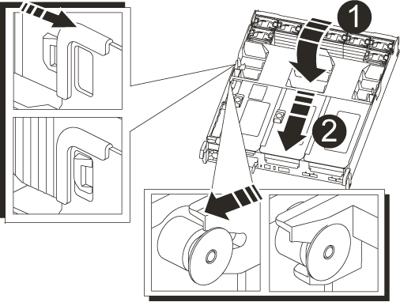

= NVRAM 배터리 교체 - AFF A700s
:allow-uri-read: 
:icons: font
:imagesdir: ../media/

[role="lead"]
시스템에서 NVRAM 배터리를 교체하려면 컨트롤러 모듈을 시스템에서 분리하고 배터리를 분리한 다음 배터리를 교체하고 컨트롤러 모듈을 다시 설치해야 합니다.

시스템의 다른 모든 구성 요소가 올바르게 작동해야 합니다. 그렇지 않은 경우 기술 지원 부서에 문의해야 합니다.

== 1단계: 손상된 컨트롤러를 종료합니다

손상된 컨트롤러를 종료하려면 컨트롤러 상태를 확인하고, 필요한 경우 정상적인 컨트롤러가 손상된 컨트롤러 스토리지에서 데이터를 계속 제공할 수 있도록 컨트롤러를 인수해야 합니다.

노드가 2개 이상인 클러스터가 있는 경우 쿼럼에 있어야 합니다. 클러스터가 쿼럼에 없거나 정상 컨트롤러에 자격 및 상태에 대해 FALSE가 표시되는 경우 손상된 컨트롤러를 종료하기 전에 문제를 해결해야 합니다(참조) link:https://docs.netapp.com/us-en/ontap/system-admin/synchronize-node-cluster-task.html?q=Quorum["노드를 클러스터와 동기화합니다"^].

.단계
. AutoSupport가 활성화된 경우 'system node AutoSupport invoke -node * -type all-message MAINT=_number_of_hours_down_h' AutoSupport 메시지를 호출하여 자동 케이스 생성을 억제합니다
+
다음 AutoSupport 메시지는 두 시간 동안 자동 케이스 생성을 억제합니다: ' cluster1: * > system node AutoSupport invoke - node * -type all-message MAINT=2h'

. 손상된 컨트롤러가 HA 쌍의 일부인 경우 정상 컨트롤러의 콘솔에서 '스토리지 페일오버 수정-노드 로컬-자동 반환 거짓'을 자동 반환하도록 해제합니다
. 손상된 컨트롤러를 로더 프롬프트로 가져가십시오.
+
[cols="1,2"]
|===
| 손상된 컨트롤러가 표시되는 경우... | 그러면... 

 a| 
LOADER 메시지가 표시됩니다
 a| 
컨트롤러 모듈 제거 로 이동합니다.

 a| 
반환 대기 중...
 a| 
Ctrl+C를 누른 다음 y를 누릅니다.

 a| 
시스템 프롬프트 또는 암호 프롬프트(시스템 암호 입력)
 a| 
정상적인 컨트롤러 'storage failover takeover -ofnode_impaired_node_name_'에서 손상된 컨트롤러를 인수하거나 중단합니다

손상된 컨트롤러에 기브백을 기다리는 중... 이 표시되면 Ctrl-C를 누른 다음 y를 응답합니다.

|===

== 2단계: 컨트롤러 모듈을 분리합니다

컨트롤러 모듈을 교체하거나 컨트롤러 모듈 내부에 있는 구성요소를 교체할 때 섀시에서 컨트롤러 모듈을 분리해야 합니다.

. 아직 접지되지 않은 경우 올바르게 접지하십시오.
. 전원에서 컨트롤러 모듈 전원 공급 장치를 분리한 다음 전원 공급 장치에서 케이블을 뽑습니다.
. 케이블을 케이블 관리 장치에 연결하는 후크 및 루프 스트랩을 푼 다음, 케이블이 연결된 위치를 추적하면서 컨트롤러 모듈에서 시스템 케이블과 SFP(필요한 경우)를 분리합니다.
+
케이블 관리 장치에 케이블을 남겨 두면 케이블 관리 장치를 다시 설치할 때 케이블이 정리됩니다.

. 컨트롤러 모듈에서 케이블 관리 장치를 분리하여 한쪽에 둡니다.
. 양쪽 잠금 래치를 아래로 누른 다음 두 래치를 동시에 아래로 돌립니다.
+
컨트롤러 모듈이 섀시에서 약간 꺼냅니다.

+
image::../media/drw_a700s_pcm_remove.png[drw a700s PCM 제거]

+
|===

 a| 
image:../media/legend_icon_01.png[""]
 a| 
잠금 래치

 a| 
image:../media/legend_icon_02.png[""]
 a| 
잠금 핀

|===
. 컨트롤러 모듈을 섀시 밖으로 밀어냅니다.
+
컨트롤러 모듈 하단을 섀시 밖으로 밀어낼 때 지지하는지 확인합니다.

. 컨트롤러 모듈을 안전한 곳에 둡니다.

== 3단계: NVRAM 배터리를 교체합니다

NVRAM 배터리를 교체하려면 오류가 발생한 NVRAM 배터리를 컨트롤러 모듈에서 분리하고 교체용 NVRAM 배터리를 컨트롤러 모듈에 설치해야 합니다.

. 아직 접지되지 않은 경우 올바르게 접지하십시오.
. 라이저 모듈, 라이저 1의 왼쪽에서 NVRAM 배터리를 찾습니다.
+
image::../media/drw_a700s_nvme_battery_replace.png[drw a700s NVMe 배터리 교체]

+
|===

 a| 
image:../media/legend_icon_01.png[""]
 a| 
NVRAM 배터리 플러그

 a| 
image:../media/legend_icon_02.png[""]
 a| 
파란색 NVRAM 배터리 잠금 탭

|===
. 배터리 플러그를 찾아 배터리 플러그 표면에 있는 클립을 눌러 소켓에서 플러그를 분리한 다음 소켓에서 배터리 케이블을 분리합니다.
. 배터리 홀더의 파란색 잠금 탭을 눌러 래치가 홀더에서 풀리도록 합니다.
. 라이저 브래킷 아래로 배터리를 밀어 들어 올려 컨트롤러에서 분리한 다음 옆에 둡니다.
. 교체용 배터리 팩을 판금 측면 벽을 따라 아래로 밀어 측면 벽의 지지 탭이 배터리 팩의 슬롯에 걸리고 배터리 팩 래치가 맞물려 제자리에 잠길 때까지 넣습니다.
. 배터리 플러그를 라이저 소켓에 꽂고 플러그가 제자리에 고정되어 있는지 확인합니다.

== 4단계: 컨트롤러 모듈을 재설치합니다

컨트롤러 모듈 내에서 구성 요소를 교체한 후 시스템 섀시에 컨트롤러 모듈을 다시 설치하고 부팅해야 합니다.

. 아직 접지되지 않은 경우 올바르게 접지하십시오.
. 아직 에어 덕트를 닫지 않은 경우 에어 덕트를 닫으십시오.
+
.. 공기 덕트를 컨트롤러 모듈로 끝까지 돌립니다.
.. 잠금 탭이 딸깍 소리가 날 때까지 공기 덕트를 라이저 쪽으로 밉니다.
.. 공기 덕트가 제대로 장착되고 제자리에 고정되었는지 확인합니다.
+

+
|===

 a| 
image:../media/legend_icon_01.png[""]
 a| 
잠금 탭

 a| 
image:../media/legend_icon_02.png[""]
 a| 
슬라이드 플런저

|===

. 컨트롤러 모듈의 끝을 섀시의 입구에 맞춘 다음 컨트롤러 모듈을 반쯤 조심스럽게 시스템에 밀어 넣습니다.
+

NOTE: 지시가 있을 때까지 컨트롤러 모듈을 섀시에 완전히 삽입하지 마십시오.

. 필요에 따라 시스템을 다시 연결합니다.
+
미디어 컨버터(QSFP 또는 SFP)를 분리한 경우 광섬유 케이블을 사용하는 경우 다시 설치해야 합니다.

. 전원 코드를 전원 공급 장치에 연결하고 전원 케이블 잠금 고리를 다시 설치한 다음 전원 공급 장치를 전원에 연결합니다.
. 컨트롤러 모듈 재설치를 완료합니다.
+
.. 아직 설치하지 않은 경우 케이블 관리 장치를 다시 설치하십시오.
.. 컨트롤러 모듈이 중앙판과 만나 완전히 장착될 때까지 섀시 안으로 단단히 밀어 넣습니다.
+
컨트롤러 모듈이 완전히 장착되면 잠금 래치가 상승합니다.

+

NOTE: 커넥터가 손상되지 않도록 컨트롤러 모듈을 섀시에 밀어 넣을 때 과도한 힘을 가하지 마십시오.

+
컨트롤러 모듈이 섀시에 완전히 장착되면 바로 부팅이 시작됩니다.

.. 잠금 래치를 위쪽으로 돌려 잠금 핀이 분리될 때까지 기울인 다음 잠금 위치로 내립니다.

. 시스템이 10GbE 클러스터 상호 연결 및 40GbE NIC 또는 온보드 포트에서 데이터 연결을 지원하도록 구성된 경우 유지보수 모드에서 nicadmin 변환 명령을 사용하여 이러한 포트를 10GbE 연결로 변환합니다.
+

NOTE: 변환을 완료한 후 유지보수 모드를 종료해야 합니다.

. 스토리지 'storage failover back-ofnode_impaired_node_name_'을 제공하여 컨트롤러를 정상 작동 상태로 되돌립니다
. 자동 반환이 비활성화된 경우 'Storage failover modify -node local -auto-반환 true'를 다시 설정합니다

== 5단계: 장애가 발생한 부품을 NetApp에 반환

키트와 함께 제공된 RMA 지침에 설명된 대로 오류가 발생한 부품을 NetApp에 반환합니다. 를 참조하십시오 https://["부품 반품 및 앰프, 교체"] 페이지를 참조하십시오.
