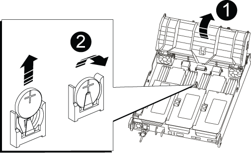

= 실시간 시계 배터리 AFF A700s를 교체하십시오
:allow-uri-read: 
:icons: font
:imagesdir: ../media/

[role="lead"]
정확한 시간 동기화에 의존하는 시스템 서비스 및 응용 프로그램이 계속 작동할 수 있도록 컨트롤러 모듈의 실시간 클럭(RTC) 배터리를 교체합니다.

* 이 절차는 시스템에서 지원하는 모든 버전의 ONTAP에서 사용할 수 있습니다
* 시스템의 다른 모든 구성 요소가 올바르게 작동해야 합니다. 그렇지 않은 경우 기술 지원 부서에 문의해야 합니다.

== 1단계: 손상된 컨트롤러를 종료합니다

[role="lead"]
손상된 컨트롤러를 종료하려면 컨트롤러 상태를 확인하고, 필요한 경우 정상적인 컨트롤러가 손상된 컨트롤러 스토리지에서 데이터를 계속 제공할 수 있도록 컨트롤러를 인수해야 합니다.

노드가 2개 이상인 클러스터가 있는 경우 쿼럼에 있어야 합니다. 클러스터가 쿼럼에 없거나 정상 컨트롤러에 자격 및 상태에 대해 FALSE가 표시되는 경우 손상된 컨트롤러를 종료하기 전에 문제를 해결해야 합니다. 을 참조하십시오 link:https://docs.netapp.com/us-en/ontap/system-admin/index.html["CLI를 사용한 관리 개요"^].

.단계
. AutoSupport가 활성화된 경우 'system node AutoSupport invoke -node * -type all-message MAINT=_number_of_hours_down_h' AutoSupport 메시지를 호출하여 자동 케이스 생성을 억제합니다
+
다음 AutoSupport 메시지는 두 시간 동안 자동 케이스 생성을 억제합니다: ' cluster1: * > system node AutoSupport invoke - node * -type all-message MAINT=2h'

. 손상된 컨트롤러가 HA 쌍의 일부인 경우 정상 컨트롤러의 콘솔에서 '스토리지 페일오버 수정-노드 로컬-자동 반환 거짓'을 자동 반환하도록 해제합니다
. 손상된 컨트롤러를 로더 프롬프트로 가져가십시오.
+
[cols="1,2"]
|===
| 손상된 컨트롤러가 표시되는 경우... | 그러면... 

 a| 
LOADER 메시지가 표시됩니다
 a| 
컨트롤러 모듈 제거 로 이동합니다.

 a| 
반환 대기 중...
 a| 
Ctrl+C를 누른 다음 y를 누릅니다.

 a| 
시스템 프롬프트 또는 암호 프롬프트(시스템 암호 입력)
 a| 
정상적인 컨트롤러 'storage failover takeover -ofnode_impaired_node_name_'에서 손상된 컨트롤러를 인수하거나 중단합니다

손상된 컨트롤러에 기브백을 기다리는 중... 이 표시되면 Ctrl-C를 누른 다음 y를 응답합니다.

|===

== 2단계: 컨트롤러 모듈을 분리합니다

[role="lead"]
컨트롤러 모듈을 교체하거나 컨트롤러 모듈 내부에 있는 구성요소를 교체할 때 섀시에서 컨트롤러 모듈을 분리해야 합니다.

. 아직 접지되지 않은 경우 올바르게 접지하십시오.
. 케이블을 케이블 관리 장치에 연결하는 후크 및 루프 스트랩을 푼 다음, 케이블이 연결된 위치를 추적하면서 컨트롤러 모듈에서 시스템 케이블과 SFP(필요한 경우)를 분리합니다.
+
케이블 관리 장치에 케이블을 남겨 두면 케이블 관리 장치를 다시 설치할 때 케이블이 정리됩니다.

. 전원에서 컨트롤러 모듈 전원 공급 장치를 분리한 다음 전원 공급 장치에서 케이블을 뽑습니다.
. 컨트롤러 모듈에서 케이블 관리 장치를 분리하여 한쪽에 둡니다.
. 양쪽 잠금 래치를 아래로 누른 다음 두 래치를 동시에 아래로 돌립니다.
+
컨트롤러 모듈이 섀시에서 약간 꺼냅니다.

+
image::../media/drw_a700s_pcm_remove.png[drw a700s PCM 제거]

+
|===

 a| 
image:../media/legend_icon_01.png[""]
 a| 
잠금 래치

 a| 
image:../media/legend_icon_02.png[""]
 a| 
잠금 핀

|===
. 컨트롤러 모듈을 섀시 밖으로 밀어냅니다.
+
컨트롤러 모듈 하단을 섀시 밖으로 밀어낼 때 지지하는지 확인합니다.

. 컨트롤러 모듈을 안정적이고 평평한 표면에 놓은 다음 공기 덕트를 엽니다.
+
.. 에어 덕트 측면에 있는 잠금 탭을 컨트롤러 모듈 중앙을 향해 누릅니다.
.. 공기 덕트를 팬 모듈 쪽으로 민 다음 완전히 열린 위치까지 위쪽으로 돌립니다.
+
image::../media/drw_a700s_open_air_duct.png[drw a700s 개방형 공기 덕트]

+
[cols="1,3"]
|===

 a| 
image:../media/legend_icon_01.png[""]
 a| 
에어 덕트 잠금 탭

 a| 
image:../media/legend_icon_02.png[""]
 a| 
라이저

 a| 
image:../media/legend_icon_03.png[""]
 a| 
에어 덕트

|===

== 3단계: RTC 배터리를 교체합니다

[role="lead"]
RTC 배터리를 교체하려면 컨트롤러 내부에 있는 배터리를 찾아 특정 단계를 따르십시오.

. 아직 접지되지 않은 경우 올바르게 접지하십시오.
. RTC 배터리를 찾습니다.
+

+
[cols="1,3"]
|===

 a| 
image:../media/legend_icon_01.png[""]
 a| 
에어 덕트

 a| 
image:../media/legend_icon_02.png[""]
 a| 
RTC 배터리 및 하우징

|===
. 배터리를 홀더에서 조심스럽게 밀어내고 홀더에서 돌린 다음 홀더에서 들어 꺼냅니다.
+

NOTE: 배터리함을 홀더에서 분리할 때 배터리의 극성에 유의하십시오. 배터리에는 플러스 기호가 표시되어 있으며 홀더에 올바르게 위치해야 합니다. 홀더 근처에 있는 더하기 기호는 배터리를 어떻게 배치해야 하는지 알려줍니다.

. 정전기 방지 운송용 백에서 교체용 배터리를 제거합니다.
. RTC 배터리의 극성을 확인한 다음 배터리를 비스듬히 기울이고 아래로 눌러 홀더에 삽입합니다.
. 배터리를 육안으로 검사하여 홀더가 완전히 장착되어 있고 극성이 올바른지 확인하십시오.

== 4단계: 컨트롤러 모듈을 다시 설치하고 RTC 배터리 교체 후 시간/날짜를 설정합니다

[role="lead"]
컨트롤러 모듈 내에서 구성 요소를 교체한 후에는 시스템 섀시에 컨트롤러 모듈을 재설치하고, 컨트롤러의 시간 및 날짜를 재설정한 다음 부팅해야 합니다.

. 에어 덕트 또는 컨트롤러 모듈 커버를 아직 닫지 않은 경우 닫으십시오.
. 컨트롤러 모듈의 끝을 섀시의 입구에 맞춘 다음 컨트롤러 모듈을 반쯤 조심스럽게 시스템에 밀어 넣습니다.
+
지시가 있을 때까지 컨트롤러 모듈을 섀시에 완전히 삽입하지 마십시오.

. 필요에 따라 시스템을 다시 연결합니다.
+
미디어 컨버터(QSFP 또는 SFP)를 분리한 경우 광섬유 케이블을 사용하는 경우 다시 설치해야 합니다.

. 전원 공급 장치가 연결되어 있지 않은 경우 전원 공급 장치를 다시 연결하고 전원 케이블 고정 장치를 다시 설치합니다.
. 컨트롤러 모듈 재설치를 완료합니다.
+
.. 컨트롤러 모듈이 중앙판과 만나 완전히 장착될 때까지 섀시 안으로 단단히 밀어 넣습니다.
+
컨트롤러 모듈이 완전히 장착되면 잠금 래치가 상승합니다.

+

NOTE: 커넥터가 손상되지 않도록 컨트롤러 모듈을 섀시에 밀어 넣을 때 과도한 힘을 가하지 마십시오.

+
컨트롤러 모듈이 섀시에 완전히 장착되면 바로 부팅이 시작됩니다.

.. 잠금 래치를 위쪽으로 돌려 잠금 핀이 분리될 때까지 기울인 다음 잠금 위치로 내립니다.
.. 아직 설치하지 않은 경우 케이블 관리 장치를 다시 설치하십시오.
.. LOADER 프롬프트에서 컨트롤러를 중단합니다.

. 컨트롤러의 시간 및 날짜를 재설정합니다.
+
.. 'show date' 명령으로 정상적인 컨트롤러의 날짜 및 시간을 확인한다.
.. 대상 컨트롤러의 LOADER 프롬프트에서 시간 및 날짜를 확인합니다.
.. 필요한 경우 'mm/dd/yyyy' 명령으로 날짜를 수정합니다.
.. 필요한 경우 '시간 설정 hh:mm:ss' 명령을 사용하여 GMT로 시간을 설정합니다.
.. 대상 컨트롤러의 날짜 및 시간을 확인합니다.

. LOADER 프롬프트에서 BYE를 입력하여 PCIe 카드 및 기타 구성 요소를 재초기화하고 컨트롤러를 재부팅합니다.
. 스토리지 'storage failover back-ofnode_impaired_node_name_'을 제공하여 컨트롤러를 정상 작동 상태로 되돌립니다
. 자동 반환이 비활성화된 경우 'Storage failover modify -node local -auto-반환 true'를 다시 설정합니다

== 5단계: 장애가 발생한 부품을 NetApp에 반환

[role="lead"]
키트와 함께 제공된 RMA 지침에 설명된 대로 오류가 발생한 부품을 NetApp에 반환합니다. 를 참조하십시오 https://mysupport.netapp.com/site/info/rma["부품 반품 및 앰프, 교체"] 페이지를 참조하십시오.
