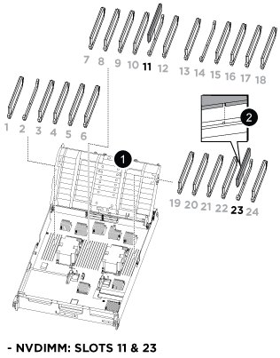

= 컨트롤러 모듈 하드웨어 교체 - AFF A800
:allow-uri-read: 
:icons: font
:imagesdir: ../media/

[role="lead"]
컨트롤러를 교체하려면 손상된 컨트롤러를 제거하고, FRU 구성 요소를 교체 컨트롤러 모듈로 이동한 다음, 교체 컨트롤러 모듈을 섀시에 설치하고, 시스템을 유지보수 모드로 부팅해야 합니다.

== 1단계: 컨트롤러 모듈을 분리합니다

컨트롤러 모듈을 교체하거나 컨트롤러 모듈 내부에 있는 구성요소를 교체할 때 섀시에서 컨트롤러 모듈을 분리해야 합니다.

. 섀시 앞면에서 엄지 손가락으로 각 드라이브를 단단히 눌러 정지가 느껴질 때까지 밀어넣습니다. 이렇게 하면 드라이브가 섀시 중앙판에 단단히 고정됩니다.
+
image::../media/drw_a800_drive_seated_IEOPS-960.svg[시트 디스크 드라이브]

. 섀시 후면으로 이동합니다. 아직 접지되지 않은 경우 올바르게 접지하십시오.
. 전원에서 컨트롤러 모듈 전원 공급 장치를 분리합니다.
. 전원 케이블 고정 장치를 분리한 다음 전원 공급 장치에서 케이블을 분리합니다.
. 케이블을 케이블 관리 장치에 연결하는 후크와 루프 스트랩을 푼 다음, 시스템 케이블과 SFP 및 QSFP 모듈(필요한 경우)을 컨트롤러 모듈에서 분리하여 케이블이 연결된 위치를 추적합니다.
+
케이블 관리 장치에 케이블을 남겨 두면 케이블 관리 장치를 다시 설치할 때 케이블이 정리됩니다.

. 컨트롤러 모듈에서 케이블 관리 장치를 분리하여 한쪽에 둡니다.
. 양쪽 잠금 래치를 아래로 누른 다음 두 래치를 동시에 아래로 돌립니다.
+
컨트롤러 모듈이 섀시에서 약간 꺼냅니다.

+
image::../media/drw_a800_pcm_remove.png[컨트롤러 모듈을 분리합니다]

+
[cols="1,4"]
|===

 a| 
image:../media/icon_round_1.png["설명선 번호 1"]
 a| 
잠금 래치

 a| 
image:../media/icon_round_2.png["설명선 번호 2"]
 a| 
잠금 핀

|===
. 컨트롤러 모듈을 섀시 밖으로 밀어내고 안정적이고 평평한 표면에 놓습니다.
+
컨트롤러 모듈 하단을 섀시 밖으로 밀어낼 때 지지하는지 확인합니다. .

. 컨트롤러 모듈을 안정적이고 평평한 표면에 놓습니다.
. 컨트롤러 모듈 에어 덕트를 엽니다.
+
.. 에어 덕트 측면에 있는 잠금 탭을 컨트롤러 모듈 중앙을 향해 누릅니다.
.. 공기 덕트를 팬 모듈 쪽으로 민 다음 완전히 열린 위치까지 위쪽으로 돌립니다.
+
image::../media/drw_a800_open_air_duct.png[에어 덕트를 여십시오]

+
[cols="1,4"]
|===

 a| 
image:../media/icon_round_1.png["설명선 번호 1"]
 a| 
에어 덕트 잠금 탭

 a| 
image:../media/icon_round_2.png["설명선 번호 2"]
 a| 
공기 덕트를 팬 모듈 쪽으로 밉니다

 a| 
image:../media/icon_round_3.png["설명선 번호 3"]
 a| 
공기 덕트를 팬 모듈 쪽으로 돌립니다

|===

== 2단계: 전원 공급 장치를 이동합니다

컨트롤러 모듈을 교체할 때 장애가 있는 컨트롤러 모듈에서 교체 컨트롤러 모듈로 전원 공급 장치를 이동해야 합니다.

. 잠금 탭을 누른 상태에서 컨트롤러 모듈에서 전원 공급 장치를 당겨 빼낼 수 있도록 캠 핸들을 돌립니다.
+

CAUTION: 전원 공급 장치가 단락되었습니다. 컨트롤러 모듈에서 분리할 때 컨트롤 모듈이 갑자기 흔들리지 않고 다치지 않도록 항상 두 손을 사용하여 지지하십시오.

+
image::../media/drw_a800_replace_psu.svg[전원 공급 장치를 분리하거나 교체합니다]

+
[cols="1,4"]
|===

 a| 
image:../media/icon_round_1.png["설명선 번호 1"]
 a| 
파란색 전원 공급 장치 잠금 탭

 a| 
image:../media/icon_round_2.png["설명선 번호 2"]
 a| 
전원 공급 장치

|===
. 전원 공급 장치를 새 컨트롤러 모듈로 이동한 다음 설치합니다.
. 양손으로 전원 공급 장치의 가장자리를 컨트롤러 모듈의 입구에 맞춘 다음 잠금 탭이 딸깍 소리가 나면서 제자리에 고정될 때까지 전원 공급 장치를 컨트롤러 모듈에 부드럽게 밀어 넣습니다.
+
전원 공급 장치는 내부 커넥터에만 제대로 연결되어 한 방향으로만 제자리에 고정됩니다.

+

NOTE: 내부 커넥터의 손상을 방지하려면 전원 공급 장치를 시스템에 밀어 넣을 때 과도한 힘을 가하지 마십시오.

== 3단계: 팬을 이동합니다

오류가 발생한 컨트롤러 모듈을 교체할 때 장애가 발생한 컨트롤러 모듈에서 교체 모듈로 팬을 이동해야 합니다.

. 팬 모듈 측면에 있는 잠금 탭을 잡고 팬 모듈을 컨트롤러 모듈 밖으로 똑바로 들어 올려 팬 모듈을 분리합니다.
+
image::../media/drw_a800_replace_fan.png[팬을 분리합니다]

+
|===

 a| 
image:../media/icon_round_1.png["설명선 번호 1"]

 a| 
팬 잠금 탭

 a| 
image:../media/icon_round_2.png["설명선 번호 2"]

 a| 
팬 모듈

|===
. 팬 모듈을 교체용 컨트롤러 모듈로 옮긴 다음 팬 모듈의 가장자리를 컨트롤러 모듈의 입구에 맞춘 다음 잠금 래치가 제자리에 고정될 때까지 팬 모듈을 컨트롤러 모듈로 밀어 넣습니다.
. 나머지 팬 모듈에 대해 이 단계를 반복합니다.

== 4단계: NVDIMM 배터리를 이동합니다

컨트롤러 모듈을 교체할 때는 NVRAM 배터리를 손상된 컨트롤러 모듈에서 교체 컨트롤러 모듈로 이동해야 합니다

. 공기 덕트 덮개를 열고 라이저에서 NVDIMM 배터리를 찾습니다.
+
image::../media/drw_a800_nvdimm_battery_replace.png[NVDIMM 배터리를 교체합니다]

+
[cols="1,4"]
|===

 a| 
image:../media/icon_round_1.png["설명선 번호 1"]
 a| 
공기 덕트 라이저

 a| 
image:../media/icon_round_2.png["설명선 번호 2"]
 a| 
NVDIMM 배터리 플러그

 a| 
image:../media/icon_round_3.png["설명선 번호 3"]
 a| 
NVDIMM 배터리 팩

|===
+
* 주의: * 시스템을 중단할 때 NVDIMM 배터리 컨트롤 보드 LED가 깜박이면서 플래시 메모리에 내용을 디스테이징합니다. 디스테이징이 완료되면 LED가 꺼집니다.

. 배터리 플러그를 찾아 배터리 플러그 표면에 있는 클립을 눌러 소켓에서 플러그를 분리한 다음 소켓에서 배터리 케이블을 분리합니다.
. 배터리를 잡고 공기 덕트 및 컨트롤러 모듈에서 배터리를 들어 꺼냅니다.
. 배터리 팩을 교체용 컨트롤러 모듈로 옮긴 다음 NVDIMM 공기 덕트에 설치합니다.
+
.. 배터리 팩을 슬롯에 삽입하고 배터리 팩을 단단히 눌러 제자리에 고정되었는지 확인합니다.
.. 배터리 플러그를 라이저 소켓에 꽂고 플러그가 제자리에 고정되어 있는지 확인합니다.

== 5단계: PCIe 라이저를 분리합니다

컨트롤러 교체 프로세스의 일부로, PCIe 모듈을 손상된 컨트롤러 모듈에서 분리해야 합니다. NVDIMMMS 및 DIMM이 교체 컨트롤러 모듈로 이동된 후에는 교체 컨트롤러 모듈의 동일한 위치에 설치해야 합니다.

. 컨트롤러 모듈에서 PCIe 라이저를 분리합니다.
+
.. PCIe 카드에 있을 수 있는 SFP 또는 QSFP 모듈을 모두 분리합니다.
.. 라이저 왼쪽의 라이저 잠금 래치를 팬 모듈 쪽으로 돌립니다.
+
라이저가 컨트롤러 모듈에서 약간 위로 올라갑니다.

.. 라이저를 위로 들어 올리고 팬을 향해 이동시키고 라이저의 판금 립이 컨트롤러 모듈의 모서리에서 분리되도록 한 다음, 라이저를 컨트롤러 모듈에서 들어 올린 다음 안정적이고 평평한 표면에 놓습니다.
+
image::../media/drw_a800_riser_2_3_remove.png[라이저 2 및 3 을 탈착합니다]

+
[cols="1,4"]
|===

 a| 
image:../media/icon_round_1.png["설명선 번호 1"]
 a| 
에어 덕트

 a| 
image:../media/icon_round_2.png["설명선 번호 2"]
 a| 
라이저 1(왼쪽 라이저), 라이저 2(중앙 라이저) 및 3(오른쪽 라이저) 잠금 래치

|===

. 손상된 컨트롤러 모듈의 나머지 라이저에 대해 앞의 단계를 반복합니다.
. 교체 컨트롤러의 빈 라이저에 대해 위 단계를 반복한 후 치웁니다.

== 6단계: 시스템 DIMM을 이동합니다

DIMM을 이동하려면 손상된 컨트롤러를 찾아 교체 컨트롤러로 이동한 다음 특정 단계를 따릅니다.

. DIMM을 올바른 방향으로 교체 컨트롤러 모듈에 삽입할 수 있도록 소켓에 있는 DIMM의 방향을 기록해 두십시오.
. DIMM의 양쪽에 있는 두 개의 DIMM 이젝터 탭을 천천히 밀어 슬롯에서 DIMM을 꺼낸 다음 슬롯에서 DIMM을 밀어 꺼냅니다.
+

NOTE: DIMM 회로 보드의 구성 요소에 압력이 가해질 수 있으므로 DIMM의 가장자리를 조심스럽게 잡으십시오.

. DIMM을 설치할 슬롯을 찾습니다.
. DIMM을 슬롯에 똑바로 삽입합니다.
+
DIMM은 슬롯에 단단히 장착되지만 쉽게 장착할 수 있습니다. 그렇지 않은 경우 DIMM을 슬롯에 재정렬하고 다시 삽입합니다.

+

NOTE: DIMM이 균일하게 정렬되어 슬롯에 완전히 삽입되었는지 육안으로 검사합니다.

. 이젝터 탭이 DIMM 끝 부분의 노치 위에 끼워질 때까지 DIMM의 상단 가장자리를 조심스럽게 단단히 누릅니다.
. 나머지 DIMM에 대해 이 단계를 반복합니다.

== 7단계: NVDIMM을 이동합니다

NVDIMM을 이동하려면 손상된 컨트롤러를 찾아 교체 컨트롤러로 이동한 다음 특정 단계를 따르십시오.

. 컨트롤러 모듈에서 NVDIMM을 찾습니다.
+

+
[cols="1,4"]
|===

 a| 
image:../media/icon_round_1.png["설명선 번호 1"]
 a| 
에어 덕트

 a| 
image:../media/icon_round_2.png["설명선 번호 2"]
 a| 
NVDIMM

|===
. NVDIMM을 교체 컨트롤러 모듈에 올바른 방향으로 삽입할 수 있도록 소켓에 있는 NVDIMM의 방향을 기록해 두십시오.
. NVDIMM의 양쪽에 있는 두 NVDIMM 이젝터 탭을 천천히 밀어서 슬롯에서 NVDIMM을 꺼낸 다음 소켓에서 NVDIMM을 밀어내어 한쪽에 둡니다.
+

NOTE: NVDIMM 회로 보드의 구성 요소에 압력이 가해질 수 있으므로 NVDIMM의 가장자리를 조심스럽게 잡습니다.

. NVDIMM을 설치할 슬롯을 찾습니다.
. NVDIMM을 슬롯에 똑바로 삽입합니다.
+
NVDIMM은 슬롯에 단단히 장착되지만 쉽게 장착할 수 있습니다. 그렇지 않은 경우 NVDIMM을 슬롯에 재정렬하고 다시 삽입합니다.

+

NOTE: NVDIMM이 균일하게 정렬되어 슬롯에 완전히 삽입되었는지 육안으로 검사합니다.

. 이젝터 탭이 NVDIMM 끝 부분의 노치 위에 끼워질 때까지 NVDIMM의 상단 가장자리를 조심스럽게 단단히 누릅니다.
. 이전 단계를 반복하여 다른 NVDIMM을 이동합니다.

== 8단계: 부팅 미디어를 이동합니다

손상된 컨트롤러에서 부팅 미디어 장치를 이동하여 교체 컨트롤러에 설치해야 합니다.

부팅 미디어는 라이저 3 아래에 있습니다.

. 부팅 미디어를 찾습니다.
+
image::../media/drw_a800_pcm_replace_only_boot_media.png[부팅 미디어를 분리합니다]

+
[cols="1,4"]
|===

 a| 
image:../media/icon_round_1.png["설명선 번호 1"]
 a| 
에어 덕트

 a| 
image:../media/icon_round_2.png["설명선 번호 2"]
 a| 
라이저 3

 a| 
image:../media/icon_round_3.png["설명선 번호 3"]
 a| 
Phillips #1 드라이버

 a| 
image:../media/icon_round_4.png["설명선 번호 4"]
 a| 
부트 미디어 나사

 a| 
image:../media/icon_round_5.png["설명선 번호 5"]
 a| 
미디어를 부팅합니다

|===
. 컨트롤러 모듈에서 부팅 미디어를 제거합니다.
+
.. 1 십자 드라이버를 사용하여 부트 매체를 잡고 있는 나사를 제거하고 나사를 안전한 곳에 둡니다.
.. 부팅 미디어의 측면을 잡고 부팅 미디어를 천천히 위로 돌린 다음 부팅 미디어를 소켓에서 똑바로 잡아당겨 분리합니다.

. 부팅 미디어를 새 컨트롤러 모듈로 옮기고 설치합니다.
+
.. 부트 미디어의 가장자리를 소켓 하우징에 맞춘 다음 조심스럽게 소켓에 똑바로 밀어 넣습니다.
.. 부트 미디어를 마더보드 쪽으로 돌립니다.
.. 부트 미디어 나사를 사용하여 부트 미디어를 마더보드에 고정합니다.
+
나사를 너무 조이지 마십시오. 그렇지 않으면 부트 미디어가 손상될 수 있습니다.

== 9단계: PCIe 라이저를 설치합니다

DIMM, NVDIMM 및 부팅 미디어를 이동한 후 교체 컨트롤러 모듈에 PCIe 라이저를 설치합니다.

. 교체용 컨트롤러 모듈에 라이저를 설치합니다.
+
.. 라이저의 립을 컨트롤러 모듈 판금의 밑면에 맞춥니다.
.. 라이저를 컨트롤러 모듈의 핀을 따라 이동한 다음 라이저를 컨트롤러 모듈에 내려 놓습니다.
.. 잠금 래치를 아래로 돌려 잠금 위치로 클릭합니다.
+
잠금 래치가 잠기면 잠금 래치가 라이저 윗면과 맞닿고 라이저는 컨트롤러 모듈에 똑바로 앉습니다.

.. PCIe 카드에서 제거된 SFP 또는 QSFP 모듈을 모두 재장착합니다.

. 나머지 PCIe 라이저에 대해 앞의 단계를 반복합니다.

== 10단계: 컨트롤러 모듈을 설치합니다

장애가 발생한 컨트롤러 모듈에서 교체 컨트롤러 모듈로 모든 구성 요소를 이동한 후에는 교체 컨트롤러 모듈을 섀시에 설치하고 유지보수 모드로 부팅해야 합니다.

. 아직 에어 덕트를 닫지 않은 경우 에어 덕트를 닫으십시오.
+
.. 공기 덕트를 컨트롤러 모듈로 끝까지 돌립니다.
.. 잠금 탭이 딸깍 소리가 날 때까지 공기 덕트를 라이저 쪽으로 밉니다.
.. 공기 덕트가 제대로 장착되고 제자리에 고정되었는지 확인합니다.
+
image::../media/drw_a800_close_air_duct.png[에어 덕트를 닫으십시오]

+
[cols="1,4"]
|===

 a| 
image:../media/icon_round_1.png["설명선 번호 1"]
 a| 
잠금 탭

 a| 
image:../media/icon_round_2.png["설명선 번호 2"]
 a| 
슬라이드 플런저

|===

. 컨트롤러 모듈의 끝을 섀시의 입구에 맞춘 다음 컨트롤러 모듈을 반쯤 조심스럽게 시스템에 밀어 넣습니다.
+

NOTE: 지시가 있을 때까지 컨트롤러 모듈을 섀시에 완전히 삽입하지 마십시오.

. 다음 섹션의 작업을 수행하기 위해 시스템에 액세스할 수 있도록 관리 포트와 콘솔 포트에만 케이블을 연결합니다.
+

NOTE: 이 절차의 뒷부분에서 나머지 케이블을 컨트롤러 모듈에 연결합니다.

. 컨트롤러 모듈 재설치를 완료합니다.
+
.. 컨트롤러 모듈이 중앙판과 만나 완전히 장착될 때까지 섀시 안으로 단단히 밀어 넣습니다.
+
컨트롤러 모듈이 완전히 장착되면 잠금 래치가 상승합니다.

+

NOTE: 커넥터가 손상되지 않도록 컨트롤러 모듈을 섀시에 밀어 넣을 때 과도한 힘을 가하지 마십시오.

.. 잠금 래치를 위쪽으로 돌려 잠금 핀이 분리될 때까지 기울인 다음 잠금 위치로 내립니다.

. 시스템 케이블 및 트랜시버 모듈을 컨트롤러 모듈에 연결하고 케이블 관리 장치를 다시 설치합니다.
. 전원 케이블을 전원 공급 장치에 연결하고 전원 케이블 고정 장치를 다시 설치합니다.
+
컨트롤러 모듈이 전원에 연결되자마자 부팅이 시작됩니다. 부트 프로세스를 중단할 준비를 하십시오.

+

NOTE: 시스템에 DC 전원 공급 장치가 있는 경우 전원 공급 장치 케이블의 손잡이 나사가 단단히 조여져 있는지 확인합니다.

