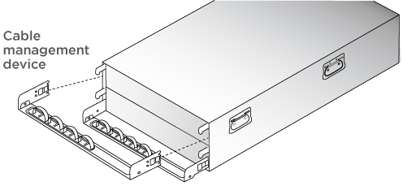
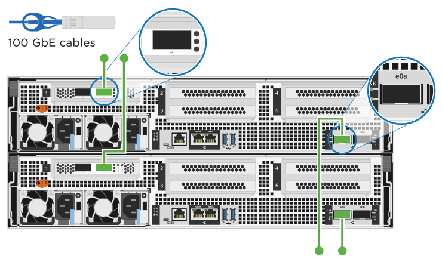
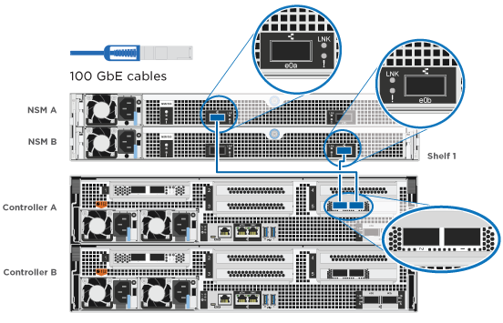
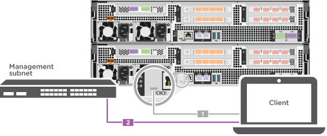

= 자세한 단계 - AFF A800
:allow-uri-read: 
:icons: font
:imagesdir: ../media/

[role="lead"]
이 섹션에서는 AFF A800 시스템 설치를 위한 자세한 단계별 지침을 제공합니다.

== 1단계: 설치 준비

AFF A800 시스템을 설치하려면 계정을 생성하고 시스템을 등록해야 합니다. 또한 시스템에 맞는 케이블 수와 유형을 확인하고 특정 네트워크 정보를 수집해야 합니다.

에 대한 액세스 권한이 있어야 합니다 link:https://hwu.netapp.com["NetApp Hardware Universe를 참조하십시오"^] (HWU) - 사이트 요구사항에 대한 정보 및 구성된 시스템에 대한 추가 정보 에 대한 액세스 권한을 가질 수도 있습니다 link:http://mysupport.netapp.com/documentation/productlibrary/index.html?productID=62286["사용 중인 ONTAP 버전에 대한 릴리즈 노트"^] 이 시스템에 대한 자세한 내용은 를 참조하십시오.

.필요한 것
사이트에서 다음을 제공해야 합니다.

* 스토리지 시스템의 랙 공간입니다
+
** 플랫폼의 HA 구성이 4U입니다
** NS224 스토리지 쉘프당 2U

* Phillips #2 드라이버
* 웹 브라우저를 사용하여 시스템을 네트워크 스위치 및 랩톱 또는 콘솔에 연결하는 추가 네트워킹 케이블
+
.. 모든 상자의 내용물을 풉니다.
.. 컨트롤러에서 시스템 일련 번호를 기록합니다.
+
image::../media/drw_ssn_label.png[시스템 일련 번호의 예]

.단계
. 계정 설정:
+
.. 기존 계정에 로그인하거나 계정을 만듭니다.
.. 등록(link:https://mysupport.netapp.com/eservice/registerSNoAction.do?moduleName=RegisterMyProduct["NetApp 제품 등록"^])를 클릭합니다.

. 다운로드 및 설치 link:https://mysupport.netapp.com/site/tools/tool-eula/activeiq-configadvisor["NetApp 다운로드: Config Advisor"^] 노트북으로.
. 받은 케이블의 수와 유형을 확인하고 기록합니다.
+
다음 표에서는 수신할 수 있는 케이블 유형을 보여 줍니다. 표에 나와 있지 않은 케이블을 받은 경우 를 참조하십시오 link:https://hwu.netapp.com["NetApp Hardware Universe를 참조하십시오"^] 케이블을 찾아 사용 여부를 확인합니다.

+
[cols="1,2,1,2"]
|===
| 커넥터 유형 | 부품 번호 및 길이 | 케이블 유형... | 대상... 

 a| 
100GbE 케이블
 a| 
X66211A-05(112-00595), 0.5m
 a| 
image:../media/oie_cable100_gbe_qsfp28.png["100 GbE QSFP28 커넥터"]
 a| 
HA 인터커넥트

 a| 
X66211A-05(112-00595), 0.5m,

X66211-1(112-00573), 1m
 a| 
클러스터 인터커넥트 네트워크

 a| 
X66211-2(112-00574), 2m,

X66211-5(112-00576), 5m
 a| 
스토리지, 데이터

 a| 
10GbE 케이블
 a| 
X6566B-3-R6(112-00300), 3m,

X6566B-5-R6(112-00301), 5m
 a| 
데이터

 a| 
25GbE 케이블
 a| 
X66240A-2(112-00598), 2m,

X66240A-5(112-00600), 5m
 a| 
데이터

 a| 
RJ-45(주문에 따라 다름)
 a| 
해당 없음
 a| 
image:../media/oie_cable_rj45.png["RJ-45 케이블 커넥터"]
 a| 
관리

 a| 
파이버 채널
 a| 
X66250-2(112-00342) 2m;

X66250-5(112-00344) 5m,

X66250-15(112-00346) 15m,

X66250-30(112-00347) 30m
 a| 
image:../media/oie_cable_fc_optical.png["OIE 파이버 채널 광 케이블"]
 a| 

 a| 
마이크로 USB 콘솔 케이블
 a| 
해당 없음
 a| 
image:../media/oie_cable_micro_usb.png["마이크로 USB 커넥터"]
 a| 
소프트웨어 설정 중 콘솔 연결

 a| 
전원 케이블
 a| 
해당 없음
 a| 
image:../media/oie_cable_power.png["전원 케이블"]
 a| 
시스템 전원을 켭니다

|===
. 를 다운로드하고 완료합니다 link:https://library.netapp.com/ecm/ecm_download_file/ECMLP2839002["클러스터 구성 워크시트"^].

== 2단계: 하드웨어 설치

필요에 따라 4-포스트 랙 또는 NetApp 시스템 캐비닛에 시스템을 설치해야 합니다.

.단계
. 필요에 따라 레일 키트를 설치합니다.
+
link:../platform-supplemental/superrail-install.html["4-포스트 랙에 SuperRail 설치"]

. 레일 키트에 포함된 지침에 따라 시스템을 설치하고 고정합니다.
+

NOTE: 시스템 무게와 관련된 안전 문제를 알고 있어야 합니다.

+
image::../media/drw_affa800_weight_caution.png[4인 리프트 주의]

. 케이블 관리 장치를 연결합니다(그림 참조).
+

. 시스템 전면에 베젤을 부착합니다.

== 3단계: 컨트롤러 케이블을 연결합니다

스위치가 없는 2노드 클러스터 방법 또는 클러스터 인터커넥트 네트워크 방법을 사용하여 플랫폼 클러스터에 대한 케이블 연결이 필요합니다. Fibre Channel 또는 iSCSI 호스트 네트워크 또는 직접 연결 스토리지에 대한 케이블 연결은 선택 사항입니다. 이 케이블 연결은 배타적이지 않으므로 호스트 네트워크 및 스토리지에 케이블을 연결할 수 있습니다.

=== 필요한 케이블 연결: 컨트롤러를 클러스터에 케이블로 연결합니다

스위치가 없는 2노드 클러스터 방법을 사용하거나 클러스터 인터커넥트 네트워크를 사용하여 컨트롤러에 케이블을 연결합니다.

==== 옵션 1: 스위치가 없는 2노드 클러스터를 케이블로 연결합니다

컨트롤러의 관리 네트워크 포트는 스위치에 연결됩니다. HA 인터커넥트 및 클러스터 인터커넥트 포트는 두 컨트롤러 모두에 케이블로 연결됩니다.

.시작하기 전에
시스템을 스위치에 연결하는 방법에 대한 자세한 내용은 네트워크 관리자에게 문의하십시오.

그림 화살표에 올바른 케이블 커넥터 당김 탭 방향이 있는지 확인하십시오.

image::../media/oie_cable_pull_tab_up.png[상단의 당김 탭이 있는 케이블 커넥터]

NOTE: 커넥터를 삽입할 때 딸깍 소리가 들려야 합니다. 딸깍 소리가 안 되면 커넥터를 제거하고 회전했다가 다시 시도하십시오.

.단계
. 애니메이션 또는 표 형식 단계를 사용하여 컨트롤러와 스위치 사이의 케이블 연결을 완료합니다.
+
.애니메이션 - 스위치가 없는 2노드 클러스터를 케이블로 연결합니다
video::edc42447-f721-4cbe-b080-ab0c0123a139[panopto]
+
[cols="10,90"]
|===
| 단계 | 각 컨트롤러 모듈에서 수행합니다 

 a| 
image:../media/icon_square_1_blue.png["설명선 번호 1"]
 a| 
HA 인터커넥트 포트에 케이블 연결:

** e0b ~ e0b
** e1b에서 e1b까지
image:../media/drw_affa800_ha_pair_cabling.png["HA 쌍 케이블링"]

 a| 
image:../media/icon_square_2_green.png["설명선 번호 2"]
 a| 
클러스터 인터커넥트 포트에 케이블 연결:

** e0a ~ e0a
** E1A ~ E1A
image:../media/drw_affa800_tnsc_clust_cabling.png["스위치가 없는 2노드 클러스터에서 클러스터 인터커넥트 케이블 연결"]

 a| 
image:../media/icon_square_3_purple.png["3단계"]
 a| 
관리 네트워크 스위치에 관리 포트를 케이블로 연결합니다    image:../media/drw_affa800_mgmt_cabling.png["시스템 뒷면의 관리 포트 위치를 보여 주는 그림입니다"]

 a| 
image:../media/oie_legend_icon_attn_symbol.png["주의 기호"]
 a| 
이때 전원 코드를 꽂지 마십시오.

|===
. 케이블 연결 옵션을 수행하려면 다음을 참조하십시오.
+
** <<옵션 1: Fibre Channel 호스트 네트워크에 케이블을 연결합니다>>
** <<옵션 2: 10GbE 호스트 네트워크에 케이블 연결>>
** <<옵션 3: 컨트롤러를 단일 드라이브 쉘프에 연결합니다>>
** <<옵션 4: 컨트롤러를 두 드라이브 쉘프에 연결합니다>>

. 시스템 설정을 완료하려면 을 참조하십시오 link:install-detailed-guide.html#step-4-complete-system-setup-and-configuration["4단계: 시스템 설치 및 구성을 완료합니다"].

==== 옵션 2: 스위치 클러스터 케이블 연결

컨트롤러의 클러스터 인터커넥트 및 관리 네트워크 포트는 스위치에 연결되고 HA 인터커넥트 포트는 두 컨트롤러에 케이블로 연결됩니다.

.시작하기 전에
시스템을 스위치에 연결하는 방법에 대한 자세한 내용은 네트워크 관리자에게 문의하십시오.

그림 화살표에 올바른 케이블 커넥터 당김 탭 방향이 있는지 확인하십시오.

image::../media/oie_cable_pull_tab_up.png[상단의 당김 탭이 있는 케이블 커넥터]

NOTE: 커넥터를 삽입할 때 딸깍 소리가 들려야 합니다. 딸깍 소리가 안 되면 커넥터를 제거하고 회전했다가 다시 시도하십시오.

.단계
. 애니메이션 또는 표 형식 단계를 사용하여 컨트롤러와 스위치 사이의 케이블 연결을 완료합니다.
+
.애니메이션 - 스위치 클러스터 케이블 연결
video::49e48140-4c5a-4395-a7d7-ab0c0123a10e[panopto]
+
[cols="10,90"]
|===
| 단계 | 각 컨트롤러 모듈에서 수행합니다 

 a| 
image:../media/icon_square_1_blue.png["설명선 번호 1"]
 a| 
HA 인터커넥트 포트에 케이블 연결:

** e0b ~ e0b
** e1b에서 e1b까지
image:../media/drw_affa800_ha_pair_cabling.png["HA 쌍 케이블링"]

 a| 
image:../media/icon_square_2_yellow.png["설명선 번호 2"]
 a| 
클러스터 인터커넥트 포트를 100GbE 클러스터 인터커넥트 스위치에 케이블로 연결합니다.
** e0a
** E1A

 a| 
image:../media/icon_square_3_orange.png["3단계"]
 a| 
관리 네트워크 스위치에 관리 포트를 케이블로 연결합니다    image:../media/drw_affa800_mgmt_cabling.png["시스템 뒷면의 관리 포트 위치를 보여 주는 그림입니다"]

 a| 
image:../media/oie_legend_icon_attn_symbol.png["주의 기호"]
 a| 
이때 전원 코드를 꽂지 마십시오.

|===
. 케이블 연결 옵션을 수행하려면 다음을 참조하십시오.
+
** <<옵션 1: Fibre Channel 호스트 네트워크에 케이블을 연결합니다>>
** <<옵션 2: 10GbE 호스트 네트워크에 케이블 연결>>
** <<옵션 3: 컨트롤러를 단일 드라이브 쉘프에 연결합니다>>
** <<옵션 4: 컨트롤러를 두 드라이브 쉘프에 연결합니다>>

. 시스템 설정을 완료하려면 을 참조하십시오 link:install-detailed-guide.html#step-4-complete-system-setup-and-configuration["4단계: 시스템 설치 및 구성을 완료합니다"].

=== 케이블 연결 옵션: 케이블 구성에 따라 달라지는 옵션

Fibre Channel 또는 iSCSI 호스트 네트워크 또는 직접 연결 스토리지에 대한 구성 종속 케이블 연결 옵션이 있습니다. 이 케이블 연결은 배타적이지 않으므로 호스트 네트워크 및 스토리지에 케이블로 연결할 수 있습니다.

==== 옵션 1: Fibre Channel 호스트 네트워크에 케이블을 연결합니다

컨트롤러의 파이버 채널 포트는 파이버 채널 호스트 네트워크 스위치에 연결됩니다.

.시작하기 전에
시스템을 스위치에 연결하는 방법에 대한 자세한 내용은 네트워크 관리자에게 문의하십시오.

그림 화살표에 올바른 케이블 커넥터 당김 탭 방향이 있는지 확인하십시오.

image::../media/oie_cable_pull_tab_up.png[상단의 당김 탭이 있는 케이블 커넥터]

NOTE: 커넥터를 삽입할 때 딸깍 소리가 들려야 합니다. 딸깍 소리가 안 되면 커넥터를 제거하고 회전했다가 다시 시도하십시오.

[cols="10,90"]
|===
| 단계 | 각 컨트롤러 모듈에서 수행합니다 

 a| 
1
 a| 
포트 2a에서 2D를 FC 호스트 스위치에 케이블로 연결합니다.image:../media/drw_affa800_fc_host_cabling.png["Fibre Channel 호스트 네트워크 케이블 연결"]

 a| 
2
 a| 
다른 옵션 케이블 연결을 수행하려면 다음 중에서 선택합니다.

* <<옵션 3: 컨트롤러를 단일 드라이브 쉘프에 연결합니다>>
* <<옵션 4: 컨트롤러를 두 드라이브 쉘프에 연결합니다>>

 a| 
3
 a| 
시스템 설정을 완료하려면 을 참조하십시오 link:install-detailed-guide.html#step-4-complete-system-setup-and-configuration["4단계: 시스템 설치 및 구성을 완료합니다"].

|===

==== 옵션 2: 10GbE 호스트 네트워크에 케이블 연결

컨트롤러의 10GbE 포트는 10GbE 호스트 네트워크 스위치에 연결됩니다.

.시작하기 전에
시스템을 스위치에 연결하는 방법에 대한 자세한 내용은 네트워크 관리자에게 문의하십시오.

그림 화살표에 올바른 케이블 커넥터 당김 탭 방향이 있는지 확인하십시오.

image::../media/oie_cable_pull_tab_up.png[상단의 당김 탭이 있는 케이블 커넥터]

NOTE: 커넥터를 삽입할 때 딸깍 소리가 들려야 합니다. 딸깍 소리가 안 되면 커넥터를 제거하고 회전했다가 다시 시도하십시오.

[cols="10,90"]
|===
| 단계 | 각 컨트롤러 모듈에서 수행합니다 

 a| 
1
 a| 
케이블 포트 e4a~e4d를 10GbE 호스트 네트워크 스위치에 연결합니다.image:../media/drw_affa800_10gbe_host_cabling.png["호스트 네트워크 케이블 연결"]

 a| 
2
 a| 
다른 옵션 케이블 연결을 수행하려면 다음 중에서 선택합니다.

* <<옵션 3: 컨트롤러를 단일 드라이브 쉘프에 연결합니다>>
* <<옵션 4: 컨트롤러를 두 드라이브 쉘프에 연결합니다>>

 a| 
3
 a| 
시스템 설정을 완료하려면 을 참조하십시오 link:install-detailed-guide.html#step-4-complete-system-setup-and-configuration["4단계: 시스템 설치 및 구성을 완료합니다"].

|===

==== 옵션 3: 컨트롤러를 단일 드라이브 쉘프에 연결합니다

각 컨트롤러를 NS224 드라이브 쉘프의 NSM 모듈에 케이블로 연결해야 합니다.

.시작하기 전에
그림 화살표에 올바른 케이블 커넥터 당김 탭 방향이 있는지 확인하십시오.

image::../media/oie_cable_pull_tab_up.png[상단의 당김 탭이 있는 케이블 커넥터]

NOTE: 커넥터를 삽입할 때 딸깍 소리가 들려야 합니다. 딸깍 소리가 안 되면 커넥터를 제거하고 회전했다가 다시 시도하십시오.

애니메이션 또는 표 형식 단계를 사용하여 컨트롤러를 단일 쉘프에 연결합니다.

.애니메이션 - 컨트롤러를 단일 드라이브 쉘프에 연결합니다
video::09dade4f-00bd-4d41-97d7-ab0c0123a0b4[panopto]
[cols="10,90"]
|===
| 단계 | 각 컨트롤러 모듈에서 수행합니다 

 a| 
image:../media/icon_square_1_blue.png["설명선 번호 1"]
 a| 
컨트롤러 A를 쉘프에 연결:    

 a| 
image:../media/icon_square_2_yellow.png["설명선 번호 2"]
 a| 
컨트롤러 B를 쉘프에 연결:    image:../media/drw_affa800_1shelf_cabling_b.png["컨트롤러 B를 단일 쉘프에 케이블 연결"]

|===
시스템 설정을 완료하려면 을 참조하십시오 link:install-detailed-guide.html#step-4-complete-system-setup-and-configuration["4단계: 시스템 설치 및 구성을 완료합니다"].

==== 옵션 4: 컨트롤러를 두 드라이브 쉘프에 연결합니다

각 컨트롤러를 NS224 드라이브 쉘프의 NSM 모듈에 케이블로 연결해야 합니다.

.시작하기 전에
그림 화살표에 올바른 케이블 커넥터 당김 탭 방향이 있는지 확인하십시오.

image::../media/oie_cable_pull_tab_up.png[상단의 당김 탭이 있는 케이블 커넥터]

NOTE: 커넥터를 삽입할 때 딸깍 소리가 들려야 합니다. 딸깍 소리가 안 되면 커넥터를 제거하고 회전했다가 다시 시도하십시오.

애니메이션 또는 표 형식 단계를 사용하여 컨트롤러를 두 드라이브 쉘프에 연결합니다.

.애니메이션 - 컨트롤러를 두 드라이브 쉘프에 연결합니다
video::fe50ac38-9375-4e6b-85af-ab0c0123a0e0[panopto]
[cols="10,90"]
|===
| 단계 | 각 컨트롤러 모듈에서 수행합니다 

 a| 
image:../media/icon_square_1_blue.png["설명선 번호 1"]
 a| 
컨트롤러 A를 쉘프에 연결:    image:../media/drw_affa800_2shelf_cabling_a.png["컨트롤러 A를 2개 쉘프에 케이블 연결"]

 a| 
image:../media/icon_square_2_yellow.png["설명선 번호 2"]
 a| 
컨트롤러 B를 쉘프에 연결:    image:../media/drw_affa800_2shelf_cabling_b.png["컨트롤러 B를 2개 쉘프에 케이블 연결"]

|===
시스템 설정을 완료하려면 을 참조하십시오 link:install-detailed-guide.html#step-4-complete-system-setup-and-configuration["4단계: 시스템 설치 및 구성을 완료합니다"].

== 4단계: 시스템 설치 및 구성을 완료합니다

스위치 및 랩톱에 대한 연결만 제공하는 클러스터 검색을 사용하거나 시스템의 컨트롤러에 직접 연결한 다음 관리 스위치에 연결하여 시스템 설치 및 구성을 완료합니다.

=== 옵션 1: 네트워크 검색이 활성화된 경우 시스템 설치 및 구성을 완료합니다

랩톱에서 네트워크 검색을 사용하도록 설정한 경우 자동 클러스터 검색을 사용하여 시스템 설정 및 구성을 완료할 수 있습니다.

.단계
. 전원 코드를 컨트롤러 전원 공급 장치에 연결한 다음 다른 회로의 전원 공급 장치에 연결합니다.
+
시스템이 부팅을 시작합니다. 초기 부팅에는 최대 8분이 소요될 수 있습니다.

. 랩톱에 네트워크 검색이 활성화되어 있는지 확인합니다.
+
자세한 내용은 노트북의 온라인 도움말을 참조하십시오.

. 애니메이션을 사용하여 노트북을 관리 스위치에 연결합니다.
+
.애니메이션 - 노트북을 관리 스위치에 연결합니다
video::d61f983e-f911-4b76-8b3a-ab1b0066909b[panopto]
. 나열된 ONTAP 아이콘을 선택하여 다음을 검색합니다.
+
image::../media/drw_autodiscovery_controler_select.png[ONTAP 아이콘을 선택합니다]

+
.. 파일 탐색기를 엽니다.
.. 왼쪽 창에서 * 네트워크 * 를 클릭합니다.
.. 마우스 오른쪽 버튼을 클릭하고 * 새로 고침 * 을 선택합니다.
.. ONTAP 아이콘을 두 번 클릭하고 화면에 표시된 인증서를 수락합니다.
+

NOTE: xxxxx는 대상 노드의 시스템 일련 번호입니다.

+
System Manager가 열립니다.

. System Manager의 안내에 따라 설정을 사용하여 에서 수집한 데이터를 사용하여 시스템을 구성합니다 link:https://library.netapp.com/ecm/ecm_download_file/ECMLP2862613["ONTAP 구성 가이드 를 참조하십시오"^].
. Config Advisor을 실행하여 시스템의 상태를 확인하십시오.
. 초기 구성을 완료한 후 ONTAP의 추가 기능 구성에 대한 자세한 내용은 을 https://docs.netapp.com/us-en/ontap/index.html["ONTAP 9 설명서"^] 참조하십시오.

=== 옵션 2: 네트워크 검색이 활성화되지 않은 경우 시스템 설치 및 구성을 완료합니다

랩톱에서 네트워크 검색을 사용하지 않는 경우 이 작업을 사용하여 구성 및 설정을 완료해야 합니다.

.단계
. 랩톱 또는 콘솔 케이블 연결 및 구성:
+
.. 노트북 또는 콘솔의 콘솔 포트를 N-8-1을 사용하여 115,200보드 로 설정합니다.
+

NOTE: 콘솔 포트를 구성하는 방법은 랩톱 또는 콘솔의 온라인 도움말을 참조하십시오.

.. 콘솔 케이블을 랩톱 또는 콘솔에 연결하고 시스템과 함께 제공된 콘솔 케이블을 사용하여 컨트롤러의 콘솔 포트를 연결합니다.
+
image::../media/drw_console_connect_affa800.png[콘솔 포트에 연결 중입니다]

.. 랩톱 또는 콘솔을 관리 서브넷의 스위치에 연결합니다.
+

.. 관리 서브넷에 있는 TCP/IP 주소를 사용하여 랩톱 또는 콘솔에 할당합니다.

. 전원 코드를 컨트롤러 전원 공급 장치에 연결한 다음 다른 회로의 전원 공급 장치에 연결합니다.
+
시스템이 부팅을 시작합니다. 초기 부팅에는 최대 8분이 소요될 수 있습니다.

. 노드 중 하나에 초기 노드 관리 IP 주소를 할당합니다.
+
[cols="1,2"]
|===
| 관리 네트워크에 DHCP가 있는 경우... | 그러면... 

 a| 
구성됨
 a| 
새 컨트롤러에 할당된 IP 주소를 기록합니다.

 a| 
구성되지 않았습니다
 a| 
.. PuTTY, 터미널 서버 또는 해당 환경에 해당하는 를 사용하여 콘솔 세션을 엽니다.
+

NOTE: PuTTY 구성 방법을 모르는 경우 노트북 또는 콘솔의 온라인 도움말을 확인하십시오.

.. 스크립트에 메시지가 표시되면 관리 IP 주소를 입력합니다.

|===
. 랩톱 또는 콘솔에서 System Manager를 사용하여 클러스터를 구성합니다.
+
.. 브라우저에서 노드 관리 IP 주소를 가리킵니다.
+

NOTE: 주소의 형식은 +https://x.x.x.x+ 입니다.

.. 에서 수집한 데이터를 사용하여 시스템을 구성합니다 link:https://library.netapp.com/ecm/ecm_download_file/ECMLP2862613["ONTAP 구성 가이드 를 참조하십시오"^].

. Config Advisor을 실행하여 시스템의 상태를 확인하십시오.
. 초기 구성을 완료한 후 ONTAP의 추가 기능 구성에 대한 자세한 내용은 을 https://docs.netapp.com/us-en/ontap/index.html["ONTAP 9 설명서"^] 참조하십시오.

