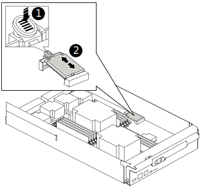

= 자동 부팅 복구를 위한 부팅 미디어 교체 - AFF A900
:allow-uri-read: 
:icons: font
:imagesdir: ../media/

[role="lead"]
AFF A900 시스템의 부팅 미디어에는 필수 펌웨어 및 구성 데이터가 저장됩니다. 교체 프로세스에는 컨트롤러 모듈을 제거하고 열고, 손상된 부트 미디어를 제거하고, 컨트롤러 모듈에 교체 부트 미디어를 설치한 다음, 컨트롤러 모듈을 다시 설치하는 작업이 포함됩니다.

자동 부팅 미디어 복구 프로세스는 ONTAP 9.17.1 이상에서만 지원됩니다. 스토리지 시스템에서 이전 버전의 ONTAP 실행 중인 경우 link:bootmedia-replace-workflow.html["수동 부팅 복구 절차"] .

부트 미디어는 공기 덕트 아래의 컨트롤러 모듈 내부에 있으며, 시스템에서 컨트롤러 모듈을 제거하면 접근할 수 있습니다.

.단계
. 아직 접지되지 않은 경우 올바르게 접지하십시오.
. 손상된 컨트롤러 모듈에서 케이블을 뽑고 케이블이 연결된 위치를 추적합니다.
. 캠 핸들의 테라코타 버튼이 잠금 해제될 때까지 아래로 밉니다.
+
.애니메이션 - 컨트롤러를 제거합니다
video::256721fd-4c2e-40b3-841a-adf2000df5fa[panopto]
+
image::../media/drw_a900_remove_PCM.png[컨트롤러를 놓습니다]

+
[cols="1,4"]
|===

 a| 
image:../media/icon_round_1.png["설명선 번호 1"]
 a| 
캠 핸들 해제 버튼

 a| 
image:../media/icon_round_2.png["설명선 번호 2"]
 a| 
캠 핸들

|===
. 캠 핸들을 돌려 컨트롤러 모듈을 섀시에서 완전히 분리한 다음 컨트롤러 모듈을 섀시 밖으로 밉니다.
+
컨트롤러 모듈 하단을 섀시 밖으로 밀어낼 때 지지하는지 확인합니다.

. 컨트롤러 모듈 덮개를 평평하고 안정적인 곳에 놓고 덮개의 파란색 단추를 누르고 덮개를 컨트롤러 모듈 뒤쪽으로 민 다음 덮개를 위로 돌려 컨트롤러 모듈에서 들어올립니다.
+
image::../media/drw_a900_PCM_open.png[컨트롤러 모듈에서 덮개를 들어올립니다]

+
[cols="1,4"]
|===

 a| 
image:../media/icon_round_1.png["설명선 번호 1"]
 a| 
컨트롤러 모듈 커버 잠금 버튼

|===
. 부팅 미디어를 교체합니다.
+
.. 컨트롤러 모듈 후면에서 검은색 공기 덕트를 들어 올린 후 다음 그림 또는 컨트롤러 모듈의 FRU 맵을 사용하여 부팅 미디어를 찾습니다.
+
.애니메이션 - 부팅 미디어를 교체합니다
video::c5080658-765e-4d29-8456-adf2000e1495[panopto]
+

+
[cols="1,4"]
|===

 a| 
image:../media/icon_round_1.png["설명선 번호 1"]
 a| 
분리 탭을 누릅니다

 a| 
image:../media/icon_round_2.png["설명선 번호 2"]
 a| 
미디어를 부팅합니다

|===
.. 부트 미디어 하우징의 파란색 버튼을 눌러 하우징에서 부트 미디어를 분리한 다음 부트 미디어 소켓에서 조심스럽게 똑바로 당겨 빼냅니다.
+

NOTE: 부트 미디어가 소켓 또는 부트 미디어를 손상시킬 수 있으므로 비틀거나 위로 잡아 당기지 마십시오.

.. 교체 부팅 미디어의 가장자리를 부팅 미디어 소켓에 맞춘 다음 소켓에 부드럽게 밀어 넣습니다.
.. 부팅 미디어가 소켓에 똑바로 완전히 장착되었는지 확인합니다.
+
필요한 경우 부팅 미디어를 분리하고 소켓에 재장착합니다.

.. 부트 미디어를 아래로 눌러 부트 미디어 하우징의 잠금 버튼을 누릅니다.

. 뚜껑의 핀을 마더보드 캐리어의 슬롯에 맞추고 덮개를 제자리에 밀어 넣어 컨트롤러 모듈 덮개를 다시 설치합니다.
. 컨트롤러 모듈을 다시 설치하세요:
+
.. 컨트롤러 모듈의 끝을 섀시의 입구에 맞춘 다음 컨트롤러 모듈을 반쯤 조심스럽게 시스템에 밀어 넣습니다.
.. 필요에 따라 컨트롤러 모듈을 다시 장착합니다.
.. 컨트롤러 모듈을 시스템 안으로 끝까지 밀어 캠 핸들이 USB 플래시 드라이브에서 사라졌는지 확인하고 캠 핸들을 단단히 눌러 컨트롤러 모듈 장착을 완료한 다음 캠 핸들을 닫힘 위치로 밉니다.
+
컨트롤러가 섀시에 완전히 설치되면 바로 부팅이 시작됩니다.

+
이 메시지가 나타나지 않으면 Ctrl-C를 누르고 유지보수 모드로 부팅하는 옵션을 선택한 다음 컨트롤러를 멈춰 로더로 부팅합니다.

. 컨트롤러가 확장 또는 패브릭 연결 MetroCluster에 있는 경우 FC 어댑터 구성을 복원해야 합니다.
+
.. 유지보수 모드로 부팅:'boot_ONTAP maint
.. MetroCluster 포트를 이니시에이터로 설정합니다: "ucadmin modify -m fc -t iniitator adapter_name"
.. 유지 보수 모드로 복귀하기 위해 정지한다

.다음 단계
손상된 부팅 미디어를 물리적으로 교체한 후,link:bootmedia-recovery-image-boot-bmr.html["파트너 노드에서 ONTAP 이미지를 복원합니다"]
