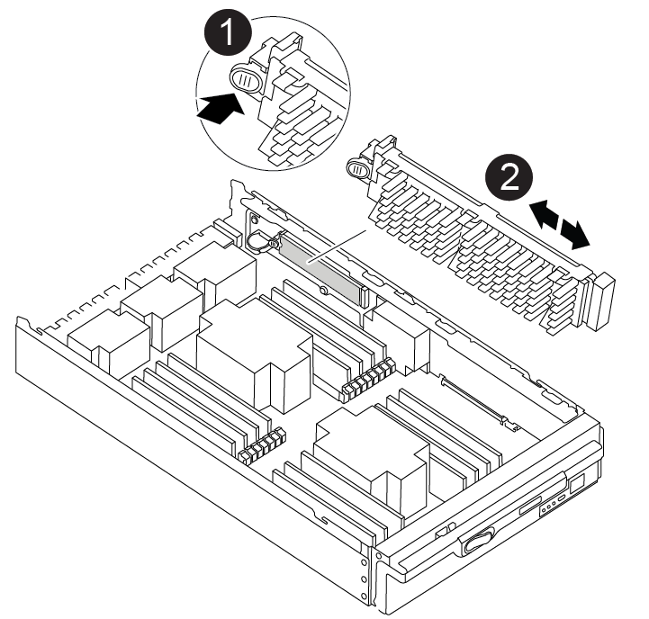

= 컨트롤러를 제거하고 부팅 미디어를 교체한 다음 부팅 이미지(AFF A900)를 전송합니다
:allow-uri-read: 
:icons: font
:imagesdir: ../media/

[role="lead"]
컨트롤러 모듈을 분리 및 열고 컨트롤러에서 부팅 미디어를 찾아 교체한 다음 교체 부팅 미디어로 이미지를 전송해야 합니다.

== 1단계: 컨트롤러 모듈을 분리합니다

컨트롤러 내의 구성 요소에 액세스하려면 먼저 시스템에서 컨트롤러 모듈을 분리한 다음 컨트롤러 모듈의 덮개를 분리해야 합니다.

.단계
. 아직 접지되지 않은 경우 올바르게 접지하십시오.
. 손상된 컨트롤러 모듈에서 케이블을 뽑고 케이블이 연결된 위치를 추적합니다.
. 캠 핸들의 테라코타 버튼이 잠금 해제될 때까지 아래로 밉니다.
+
.애니메이션 - 컨트롤러를 제거합니다
video::256721fd-4c2e-40b3-841a-adf2000df5fa[panopto]
+
image::../media/drw_a900_remove_PCM.png[컨트롤러를 놓습니다]

+
[cols="1,4"]
|===

 a| 
image:../media/legend_icon_01.png["설명선 번호 1"]
 a| 
캠 핸들 해제 버튼

 a| 
image:../media/legend_icon_02.png["설명선 번호 2"]
 a| 
캠 핸들

|===
. 캠 핸들을 돌려 컨트롤러 모듈을 섀시에서 완전히 분리한 다음 컨트롤러 모듈을 섀시 밖으로 밉니다.
+
컨트롤러 모듈 하단을 섀시 밖으로 밀어낼 때 지지하는지 확인합니다.

. 컨트롤러 모듈 덮개를 평평하고 안정적인 곳에 놓고 덮개의 파란색 단추를 누르고 덮개를 컨트롤러 모듈 뒤쪽으로 민 다음 덮개를 위로 돌려 컨트롤러 모듈에서 들어올립니다.
+
image::../media/drw_a900_PCM_open.png[컨트롤러 모듈에서 덮개를 들어올립니다]

+
[cols="1,4"]
|===

 a| 
image:../media/legend_icon_01.png["설명선 번호 1"]
 a| 
컨트롤러 모듈 커버 잠금 버튼

|===

== 2단계: 부팅 매체를 교체합니다

컨트롤러에서 부팅 미디어를 찾고 지침에 따라 교체해야 합니다.

.단계
. 컨트롤러 모듈 후면에서 검은색 공기 덕트를 들어 올린 후 다음 그림 또는 컨트롤러 모듈의 FRU 맵을 사용하여 부팅 미디어를 찾습니다.
+
.애니메이션 - 부팅 미디어를 교체합니다
video::c5080658-765e-4d29-8456-adf2000e1495[panopto]
+

+
[cols="1,4"]
|===

 a| 
image:../media/legend_icon_01.png["설명선 번호 1"]
 a| 
분리 탭을 누릅니다

 a| 
image:../media/legend_icon_02.png["설명선 번호 2"]
 a| 
미디어를 부팅합니다

|===
. 부트 미디어 하우징의 파란색 버튼을 눌러 하우징에서 부트 미디어를 분리한 다음 부트 미디어 소켓에서 조심스럽게 똑바로 당겨 빼냅니다.
+

NOTE: 부트 미디어가 소켓 또는 부트 미디어를 손상시킬 수 있으므로 비틀거나 위로 잡아 당기지 마십시오.

. 교체 부팅 미디어의 가장자리를 부팅 미디어 소켓에 맞춘 다음 소켓에 부드럽게 밀어 넣습니다.
. 부팅 미디어가 소켓에 똑바로 완전히 장착되었는지 확인합니다.
+
필요한 경우 부팅 미디어를 분리하고 소켓에 재장착합니다.

. 부트 미디어를 아래로 눌러 부트 미디어 하우징의 잠금 버튼을 누릅니다.
. 뚜껑의 핀을 마더보드 캐리어의 슬롯에 맞추고 덮개를 제자리에 밀어 넣어 컨트롤러 모듈 덮개를 다시 설치합니다.

== 3단계: 부팅 이미지를 부팅 미디어로 전송합니다

이미지가 설치된 USB 플래시 드라이브를 사용하여 교체 부팅 미디어에 시스템 이미지를 설치할 수 있습니다. 그러나 이 절차 중에 var 파일 시스템을 복원해야 합니다.

.시작하기 전에
* FAT32로 포맷된 USB 플래시 드라이브가 있어야 하며 4GB 이상의 용량이 있어야 합니다.
* 손상된 컨트롤러가 실행 중인 것과 동일한 ONTAP 이미지 버전의 복사본. NetApp Support 사이트의 다운로드 섹션에서 해당 이미지를 다운로드할 수 있습니다
+
** NVE가 사용하도록 설정된 경우 다운로드 버튼에 표시된 대로 NetApp Volume Encryption으로 이미지를 다운로드합니다.
** NVE가 활성화되지 않은 경우 다운로드 버튼에 표시된 대로 NetApp Volume Encryption 없이 이미지를 다운로드합니다.

* 시스템이 독립 실행형 시스템인 경우 네트워크 연결이 필요하지 않지만 var 파일 시스템을 복원할 때 추가 재부팅을 수행해야 합니다.

.단계
. 컨트롤러 모듈의 끝을 섀시의 입구에 맞춘 다음 컨트롤러 모듈을 반쯤 조심스럽게 시스템에 밀어 넣습니다.
. 필요에 따라 컨트롤러 모듈을 다시 장착합니다.
. USB 플래시 드라이브를 컨트롤러 모듈의 USB 슬롯에 삽입합니다.
+
USB 콘솔 포트가 아니라 USB 장치용 슬롯에 USB 플래시 드라이브를 설치해야 합니다.

. 컨트롤러 모듈을 시스템 안으로 끝까지 밀어 캠 핸들이 USB 플래시 드라이브에서 사라졌는지 확인하고 캠 핸들을 단단히 눌러 컨트롤러 모듈 장착을 완료한 다음 캠 핸들을 닫힘 위치로 밉니다.
+
컨트롤러가 섀시에 완전히 설치되면 바로 부팅이 시작됩니다.

. 자동 부팅 시작 메시지가 표시되면 Ctrl-C를 눌러 로더 프롬프트에서 중지 부팅 프로세스를 중단합니다. 중단하려면 Ctrl-C를 누릅니다
+
이 메시지가 나타나지 않으면 Ctrl-C를 누르고 유지보수 모드로 부팅하는 옵션을 선택한 다음 컨트롤러를 멈춰 로더로 부팅합니다.

. LOADER 프롬프트에서 네트워크 연결 유형을 설정합니다.
+
** DHCP:'ifconfig e0a-auto'를 구성하는 경우
+

NOTE: 구성하는 타겟 포트는 네트워크 연결을 통한 var 파일 시스템 복원 중에 정상적인 컨트롤러에서 손상된 컨트롤러와 통신하는 데 사용하는 타겟 포트입니다. 이 명령에서 e0M 포트를 사용할 수도 있습니다.

** 수동 연결을 구성하는 경우: 'ifconfig e0a-addr=filer_addr-mask=netmask-GW=gateway-dns=dns_addr-domain=dns_domain'
+
*** filer_addr은 스토리지 시스템의 IP 주소입니다.
*** 넷마스크는 HA 파트너에 연결된 관리 네트워크의 네트워크 마스크입니다.
*** 게이트웨이는 네트워크의 게이트웨이입니다.
*** dns_addr 은 네트워크에 있는 이름 서버의 IP 주소입니다.
*** DNS_DOMAIN은 DNS(Domain Name System) 도메인 이름입니다.
+
이 선택적 매개 변수를 사용하는 경우 netboot 서버 URL에 정규화된 도메인 이름이 필요하지 않습니다. 서버의 호스트 이름만 있으면 됩니다.

+

NOTE: 인터페이스에 다른 매개 변수가 필요할 수 있습니다. 자세한 내용은 펌웨어 프롬프트에서 help ifconfig를 입력할 수 있습니다.

. 컨트롤러가 확장 또는 패브릭 연결 MetroCluster에 있는 경우 FC 어댑터 구성을 복원해야 합니다.
+
.. 유지보수 모드로 부팅:'boot_ONTAP maint
.. MetroCluster 포트를 이니시에이터로 설정합니다: "ucadmin modify -m fc -t iniitator adapter_name"
.. 유지 보수 모드로 복귀하기 위해 정지한다

+
변경 사항은 시스템이 부팅될 때 구현됩니다.

