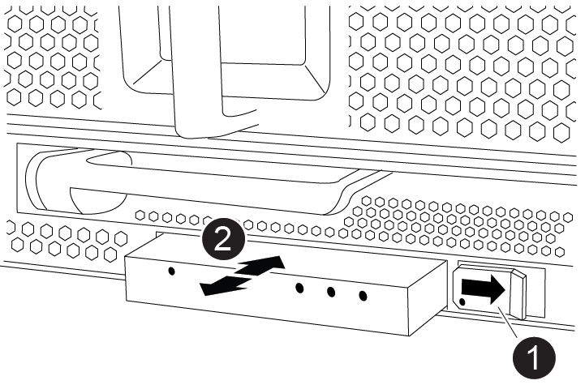

= LED USB 모듈 교체 - AFF A900
:allow-uri-read: 
:icons: font
:imagesdir: ../media/

[role="lead"]
LED USB 모듈은 콘솔 포트 및 시스템 상태에 대한 연결을 제공합니다. 이 모듈을 교체하는 경우 도구가 필요하지 않으며 서비스가 중단되지 않습니다.

== 1단계: LED USB 모듈을 교체합니다

.단계
. 이전 LED USB 모듈을 분리합니다.
+
.애니메이션 - LED-USB 모듈 제거/설치
video::eb715462-cc20-454f-bcf9-adf9016af84e[panopto]
+

+
[cols="10,90"]
|===

 a| 
image:../media/legend_icon_01.png[""]
 a| 
잠금 버튼

 a| 
image:../media/legend_icon_02.png[""]
 a| 
USB LED 모듈

|===
+
.. 베젤을 분리한 상태에서 섀시 전면의 왼쪽 하단에 있는 LED USB 모듈을 찾습니다.
.. 래치를 밀어 모듈을 부분적으로 꺼냅니다.
.. 베이에서 모듈을 당겨 중앙판에서 분리합니다. 슬롯을 비워 두지 마십시오.

. 새 LED USB 모듈을 설치합니다.
+
.. 모듈을 베이의 슬라이더 래치 근처에 있는 모듈 모서리의 노치와 맞춥니다. 베이는 모듈을 거꾸로 설치할 수 없습니다.
.. 모듈이 섀시와 완전히 맞닿을 때까지 베이에 밀어 넣습니다.
+
모듈이 안전하게 중앙판에 연결되어 있을 때 딸깍 소리가 납니다.

== 2단계: 장애가 발생한 구성 요소를 반환합니다

. 키트와 함께 제공된 RMA 지침에 설명된 대로 오류가 발생한 부품을 NetApp에 반환합니다. 를 참조하십시오 https://mysupport.netapp.com/site/info/rma["부품 반품 및 앰프, 교체"^] 페이지를 참조하십시오.

