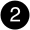

= AFX 2K I/O 모듈 추가 및 교체 개요
:allow-uri-read: 
:icons: font
:imagesdir: ../media/

[role="lead"]
AFX 2K 스토리지 시스템은 I/O 모듈을 확장하거나 교체하여 네트워크 연결성과 성능을 향상시킬 수 있는 유연성을 제공합니다. I/O 모듈을 추가하거나 교체하는 것은 네트워크 기능을 업그레이드하거나 장애가 발생한 모듈을 처리할 때 필수적입니다.

AFX 2K 스토리지 시스템에서 장애가 발생한 I/O 모듈을 동일한 유형의 I/O 모듈 또는 다른 유형의 I/O 모듈로 교체할 수 있습니다. 또한 빈 슬롯이 있는 시스템에 I/O 모듈을 추가할 수도 있습니다.

* link:io-module-add.html["입출력 모듈을 추가합니다"]
+
모듈을 추가하면 중복성이 개선되어 하나의 모듈이 고장나도 시스템이 계속 작동할 수 있습니다.

* link:io-module-replace.html["입출력 모듈을 교체합니다"]
+
장애가 발생한 입출력 모듈을 교체하면 시스템을 최적의 작동 상태로 복구할 수 있습니다.

.I/O 슬롯 번호 지정
AFX 2K 컨트롤러의 I/O 슬롯은 다음 그림과 같이 1번부터 11번까지 번호가 매겨져 있습니다.

image::../media/drw_afx_2k_rear_slots_ieops-2862.svg[AFX 2K 컨트롤러의 슬롯 번호 매기기]

[cols="10%,23%,10%,24%,10%,23%"]
|===
| 슬롯 번호 | 입출력 슬롯 | 슬롯 번호 | 입출력 슬롯 | 슬롯 번호 | 입출력 슬롯 

 a| 
image::../media/icon_round_1.svg[설명선 번호 1]
| HA  a| 
image::../media/icon_round_4.svg[설명선 번호 4]

image::../media/icon_round_5.svg[설명선 번호 5]
| NVRAM12  a| 
image::../media/icon_round_9.svg[설명선 번호 9]
| 네트워크 

 a| 

| 클러스터  a| 
image::../media/icon_round_6.svg[설명선 번호 6]

image::../media/icon_round_7.svg[설명선 번호 7]
| NVRAM12-EX  a| 
image::../media/icon_round_10.svg[설명선 번호 10]
| 스토리지 

 a| 
image::../media/icon_round_3.svg[설명선 번호 3]
| 네트워크  a| 
image::../media/icon_round_8.svg[설명선 번호 8]
| 스토리지  a| 
image::../media/icon_round_11.svg[설명선 번호 11]
| (*선택 사항*) 추가 관리 연결을 위한 4포트 25GbE SFP28 
|===