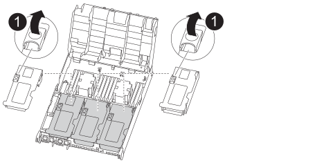
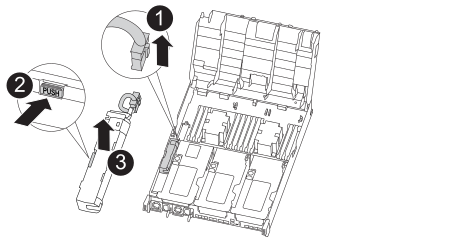
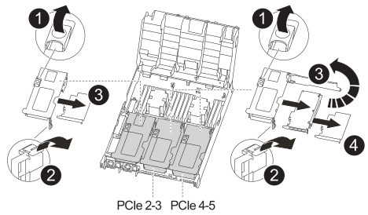

= 컨트롤러 모듈 하드웨어(ASA C400)를 교체합니다
:allow-uri-read: 
:icons: font
:imagesdir: ../media/

[role="lead"]
컨트롤러 모듈 하드웨어를 교체하려면 손상된 컨트롤러를 제거하고, FRU 구성 요소를 교체 컨트롤러 모듈로 이동한 다음, 교체 컨트롤러 모듈을 섀시에 설치하고, 시스템을 유지보수 모드로 부팅해야 합니다.

== 1단계: 컨트롤러 모듈을 분리합니다

컨트롤러 모듈 내부의 구성요소에 액세스하려면 섀시에서 컨트롤러 모듈을 분리해야 합니다.

다음 그림 또는 기록된 단계를 사용하여 섀시에서 컨트롤러 모듈을 제거할 수 있습니다.

.애니메이션 - 컨트롤러 모듈을 분리합니다
video::ca74d345-e213-4390-a599-aae10019ec82[panopto]
. 아직 접지되지 않은 경우 올바르게 접지하십시오.
. 전원 케이블 고정 장치를 분리한 다음 전원 공급 장치에서 케이블을 분리합니다.
. 케이블을 케이블 관리 장치에 연결하는 후크 및 루프 스트랩을 푼 다음, 케이블이 연결된 위치를 추적하면서 컨트롤러 모듈에서 시스템 케이블과 SFP(필요한 경우)를 분리합니다.
+
케이블 관리 장치에 케이블을 남겨 두면 케이블 관리 장치를 다시 설치할 때 케이블이 정리됩니다.

. 컨트롤러 모듈에서 케이블 관리 장치를 분리하여 한쪽에 둡니다.
. 양쪽 잠금 래치를 아래로 누른 다음 두 래치를 동시에 아래로 돌립니다.
+
컨트롤러 모듈이 섀시에서 약간 꺼냅니다.

+
image:../media/drw_A400_Remove_controller.png[""]

+
[cols="10,90"]
|===

 a| 
image:../media/legend_icon_01.png["설명선 번호 1"]
 a| 
잠금 래치

 a| 
image:../media/legend_icon_02.png["설명선 번호 2"]
| 컨트롤러가 섀시 밖으로 약간 이동합니다 
|===
. 컨트롤러 모듈을 섀시 밖으로 밀어냅니다.
+
컨트롤러 모듈 하단을 섀시 밖으로 밀어낼 때 지지하는지 확인합니다.

. 컨트롤러 모듈을 안정적이고 평평한 표면에 놓습니다.
. 교체 컨트롤러 모듈에서 에어 덕트를 열고 애니메이션, 그림 또는 작성된 단계를 사용하여 컨트롤러 모듈에서 빈 라이저를 분리합니다.
+
.애니메이션 - 교체 컨트롤러 모듈에서 빈 라이저를 분리합니다
video::49053752-e813-4c15-a917-ab190147fa6e[panopto]

[cols="10,90"]
|===

 a| 
image:../media/legend_icon_01.png["설명선 번호 1"]
 a| 
라이저 분리 래치

|===
. 에어 덕트 측면에 있는 잠금 탭을 컨트롤러 모듈 중앙을 향해 누릅니다.
. 공기 덕트를 컨트롤러 모듈 뒤쪽으로 민 다음 완전히 열린 위치까지 위쪽으로 돌립니다.
. 라이저 1 의 왼쪽에 있는 라이저 잠금 래치를 위로 돌려 공기 덕트 쪽으로 향하게 한 다음 라이저를 위로 들어 올려 옆에 둡니다.
. 나머지 라이저에 대해 이전 단계를 반복합니다.

== 2단계: 전원 공급 장치를 이동합니다

컨트롤러 모듈을 교체할 때 장애가 있는 컨트롤러 모듈에서 교체 컨트롤러 모듈로 전원 공급 장치를 이동해야 합니다.

다음 애니메이션, 그림 또는 기록된 단계를 사용하여 전원 공급 장치를 교체 컨트롤러 모듈로 이동할 수 있습니다.

.애니메이션 - 전원 공급 장치를 이동합니다
video::92060115-1967-475b-b517-aad9012f130c[panopto]
. 전원 공급 장치를 분리합니다.
+
image::../media/drw_A400_psu.png[drw A400 PSU]

[cols="10,90"]
|===

 a| 
image:../media/legend_icon_01.png["설명선 번호 1"]
 a| 
PSU 잠금 탭

 a| 
image:../media/legend_icon_02.png["설명선 번호 2"]
 a| 
전원 케이블 고정대

|===
. 캠 핸들을 돌려 섀시에서 전원 공급 장치를 당겨 빼냅니다.
. 파란색 잠금 탭을 눌러 섀시에서 전원 공급 장치를 분리합니다.
. 양손으로 전원 공급 장치를 섀시에서 빼낸 다음 따로 보관해 둡니다.
+
.. 전원 공급 장치를 새 컨트롤러 모듈로 이동한 다음 설치합니다.
.. 양손으로 전원 공급 장치의 가장자리를 컨트롤러 모듈의 입구에 맞춘 다음 잠금 탭이 딸깍 소리가 나면서 제자리에 고정될 때까지 전원 공급 장치를 컨트롤러 모듈에 부드럽게 밀어 넣습니다.
+
전원 공급 장치는 내부 커넥터에만 제대로 연결되어 한 방향으로만 제자리에 고정됩니다.

+

NOTE: 내부 커넥터의 손상을 방지하려면 전원 공급 장치를 시스템에 밀어 넣을 때 과도한 힘을 가하지 마십시오.

.. 나머지 전원 공급 장치에 대해 위의 단계를 반복합니다.

== 3단계: NVDIMM 배터리를 이동합니다

손상된 컨트롤러 모듈에서 교체 컨트롤러 모듈로 NVDIMM 배터리를 이동하려면 특정 단계를 수행해야 합니다.

다음 애니메이션, 그림 또는 기록된 단계를 사용하여 장애가 있는 컨트롤러 모듈에서 교체 컨트롤러 모듈로 NVDIMM 배터리를 이동할 수 있습니다.

.애니메이션 - NVDIMM 배터리를 이동합니다
video::94d115b2-b02a-4234-805c-aad9012f204c[panopto]

[cols="10,90"]
|===

 a| 
image:../media/legend_icon_01.png["설명선 번호 1"]
 a| 
NVDIMM 배터리 플러그

 a| 
image:../media/legend_icon_02.png["설명선 번호 2"]
 a| 
NVDIMM 배터리 잠금 탭

 a| 
image:../media/legend_icon_03.png["설명선 번호 3"]
 a| 
NVDIMM 배터리

|===
. 에어 덕트를 엽니다.
+
.. 에어 덕트 측면에 있는 잠금 탭을 컨트롤러 모듈 중앙을 향해 누릅니다.
.. 공기 덕트를 컨트롤러 모듈 뒤쪽으로 민 다음 완전히 열린 위치까지 위쪽으로 돌립니다.

. 컨트롤러 모듈에서 NVDIMM 배터리를 찾습니다.
. 배터리 플러그를 찾아 배터리 플러그 표면에 있는 클립을 눌러 소켓에서 플러그를 분리한 다음 소켓에서 배터리 케이블을 분리합니다.
. 배터리를 잡고 누름 이라고 표시된 파란색 잠금 탭을 누른 다음 홀더 및 컨트롤러 모듈에서 배터리를 들어올립니다.
. 배터리를 교체 컨트롤러 모듈로 이동합니다.
. 배터리 모듈을 배터리 입구에 맞춘 다음 제자리에 잠길 때까지 배터리를 슬롯에 부드럽게 밀어 넣습니다.
+

NOTE: 지시가 있을 때까지 배터리 케이블을 마더보드에 다시 연결하지 마십시오.

== 4단계: 부팅 미디어를 이동합니다

부팅 미디어를 찾은 다음 지침에 따라 손상된 컨트롤러 모듈에서 분리한 후 교체 컨트롤러 모듈에 삽입해야 합니다.

다음 애니메이션, 그림 또는 기록된 단계를 사용하여 손상된 컨트롤러 모듈에서 교체 컨트롤러 모듈로 부팅 미디어를 이동할 수 있습니다.

.애니메이션 - 부팅 미디어를 이동합니다
video::2a14099c-85de-4a84-867c-aad9012efac8[panopto]
image::../media/drw_A400_Replace-boot_media_IEOPS-1007.svg[drw A400 부팅 미디어 IEOPS 1007 교체]

[cols="10,90"]
|===

 a| 
image:../media/legend_icon_01.png["설명선 번호 1"]
 a| 
부트 미디어 잠금 탭

 a| 
image:../media/legend_icon_02.png["설명선 번호 2"]
 a| 
미디어를 부팅합니다

|===
. 컨트롤러 모듈에서 부팅 미디어를 찾아 제거합니다.
+
.. 부팅 미디어의 립이 파란색 버튼을 지울 때까지 부팅 미디어 끝에 있는 파란색 버튼을 누릅니다.
.. 부팅 미디어를 위로 돌리고 소켓에서 부팅 미디어를 조심스럽게 빼냅니다.

. 부트 미디어를 새 컨트롤러 모듈로 옮기고 부트 미디어의 가장자리를 소켓 하우징에 맞춘 다음 소켓에 부드럽게 밀어 넣습니다.
. 부팅 미디어가 소켓에 똑바로 완전히 장착되었는지 확인합니다.
+
필요한 경우 부팅 미디어를 분리하고 소켓에 재장착합니다.

. 부트 미디어를 제자리에 잠급니다.
+
.. 부트 미디어를 마더보드 쪽으로 돌립니다.
.. 파란색 잠금 버튼을 눌러 열림 위치에 놓습니다.
.. 파란색 버튼을 눌러 부트 미디어 끝에 손가락을 놓고 부트 미디어 끝을 단단히 눌러 파란색 잠금 버튼을 누릅니다.

== 5단계: PCIe 라이저 및 메자닌 카드를 이동합니다

컨트롤러 교체 프로세스의 일부로 PCIe 라이저 및 메자닌 카드를 손상된 컨트롤러 모듈에서 교체 컨트롤러 모듈로 이동해야 합니다.

다음 애니메이션, 그림 또는 기록된 단계를 사용하여 장애가 있는 컨트롤러 모듈에서 교체 컨트롤러 모듈로 PCIe 라이저 및 메자닌 카드를 이동할 수 있습니다.

이동 PCIe 라이저 1 및 2(왼쪽 및 가운데 라이저):

.애니메이션 - PCI 라이저 1과 2를 이동합니다
video::f4ee1d4d-6029-4fe6-a063-aad9012f170b[panopto]
메자닌 카드 및 라이저 3(오른쪽 라이저) 이동:

.애니메이션 - 메자닌 카드 및 라이저 3을 이동합니다
video::b0c3b575-3434-4e00-a421-aad9012f2e9e[panopto]

[cols="10,90"]
|===

 a| 
image:../media/legend_icon_01.png["설명선 번호 1"]
 a| 
라이저 잠금 래치

 a| 
image:../media/legend_icon_02.png["설명선 번호 2"]
 a| 
PCI 카드 잠금 래치

 a| 
image:../media/legend_icon_03.png["설명선 번호 3"]
 a| 
PCI 잠금 플레이트

 a| 
image:../media/legend_icon_04.png["설명선 번호 4"]
 a| 
PCI 카드

|===
. PCIe 라이저 1과 2를 손상된 컨트롤러 모듈에서 교체 컨트롤러 모듈로 이동합니다.
+
.. PCIe 카드에 있을 수 있는 SFP 또는 QSFP 모듈을 모두 분리합니다.
.. 라이저 왼쪽의 라이저 잠금 래치를 위로 돌려 공기 덕트 쪽으로 돌립니다.
+
라이저가 컨트롤러 모듈에서 약간 위로 올라갑니다.

.. 라이저를 들어 올린 다음 교체용 컨트롤러 모듈로 이동합니다.
.. 라이저를 라이저 소켓의 측면에 있는 핀에 맞춘 다음, 라이저를 핀 아래로 내리고 라이저를 마더보드의 소켓에 똑바로 밀어 넣은 다음 래치를 라이저의 판금과 같은 높이로 돌립니다.
.. 라이저 번호 2에 대해 이 단계를 반복합니다.

. 라이저 번호 3을 분리하고 메자닌 카드를 분리한 다음 두 카드를 모두 교체 컨트롤러 모듈에 설치합니다.
+
.. PCIe 카드에 있을 수 있는 SFP 또는 QSFP 모듈을 모두 분리합니다.
.. 라이저 왼쪽의 라이저 잠금 래치를 위로 돌려 공기 덕트 쪽으로 돌립니다.
+
라이저가 컨트롤러 모듈에서 약간 위로 올라갑니다.

.. 라이저를 들어 올린 다음 안정적이고 평평한 곳에 둡니다.
.. 메자닌 카드의 손잡이 나사를 풀고 카드를 소켓에서 직접 조심스럽게 들어 올린 다음 교체용 컨트롤러 모듈로 이동합니다.
.. 교체 컨트롤러에 메자닌(메자닌)를 설치하고 나비 나사로 고정합니다.
.. 교체용 컨트롤러 모듈에 세 번째 라이저를 설치합니다.

== 6단계: DIMM을 이동합니다

DIMM을 찾은 다음 장애가 있는 컨트롤러 모듈에서 교체 컨트롤러 모듈로 DIMM을 이동해야 합니다.

장애가 발생한 컨트롤러 모듈에서 교체 컨트롤러 모듈의 해당 슬롯으로 직접 DIMM을 이동할 수 있도록 새 컨트롤러 모듈이 준비되어 있어야 합니다.

다음 애니메이션, 그림 또는 기록된 단계를 사용하여 장애가 있는 컨트롤러 모듈에서 교체 컨트롤러 모듈로 DIMM을 이동할 수 있습니다.

.애니메이션 - DIMM을 이동합니다
video::717b52fa-f236-4f3d-b07d-aad9012f51a3[panopto]
image::../media/drw_A400_Replace-NVDIMM-DIMM_IEOPS-1009.svg[drw A400 NVDIMM IEOPS 1009 교체]

[cols="10,90"]
|===

 a| 
image:../media/legend_icon_01.png["설명선 번호 1"]
 a| 
DIMM 잠금 탭

 a| 
image:../media/legend_icon_02.png["설명선 번호 2"]
 a| 
DIMM

 a| 
image:../media/legend_icon_03.png["설명선 번호 3"]
 a| 
DIMM 소켓

|===
. 컨트롤러 모듈에서 DIMM을 찾습니다.
. DIMM을 올바른 방향으로 교체 컨트롤러 모듈에 삽입할 수 있도록 소켓에 있는 DIMM의 방향을 기록해 두십시오.
. NVDIMM 배터리가 새 컨트롤러 모듈에 꽂혀 있지 않은지 확인합니다.
. 장애가 있는 컨트롤러 모듈에서 교체 컨트롤러 모듈로 DIMM을 이동합니다.
+

NOTE: 각 DIMM을 손상된 컨트롤러 모듈에서 점유한 동일한 슬롯에 설치하십시오.

+
.. DIMM의 양쪽에 있는 DIMM 이젝터 탭을 천천히 밀어서 슬롯에서 DIMM을 꺼낸 다음 슬롯에서 DIMM을 꺼냅니다.
+

NOTE: DIMM 회로 보드의 구성 요소에 압력이 가해질 수 있으므로 DIMM의 가장자리를 조심스럽게 잡으십시오.

.. 교체 컨트롤러 모듈에서 해당 DIMM 슬롯을 찾습니다.
.. DIMM 소켓의 DIMM 이젝터 탭이 열린 위치에 있는지 확인한 다음 DIMM을 소켓에 똑바로 삽입합니다.
+
DIMM은 소켓에 단단히 장착되지만 쉽게 장착할 수 있습니다. 그렇지 않은 경우 DIMM을 소켓에 재정렬하고 다시 삽입합니다.

.. DIMM이 고르게 정렬되어 소켓에 완전히 삽입되었는지 육안으로 검사합니다.
.. 나머지 DIMM에 대해 이러한 하위 단계를 반복합니다.

. NVDIMM 배터리를 마더보드에 연결합니다.
+
플러그가 컨트롤러 모듈에 잠겼는지 확인합니다.

== 7단계: 컨트롤러 모듈을 설치합니다

장애가 발생한 컨트롤러 모듈에서 교체 컨트롤러 모듈로 모든 구성 요소를 이동한 후에는 교체 컨트롤러 모듈을 섀시에 설치하고 유지보수 모드로 부팅해야 합니다.

다음 애니메이션, 그림 또는 기록된 단계를 사용하여 교체 컨트롤러 모듈을 섀시에 설치할 수 있습니다.

.애니메이션 - 컨트롤러 모듈을 설치합니다
video::0310fe80-b129-4685-8fef-ab19010e720a[panopto]
image::../media/drw_A400_Install_controller_source.png[drw A400 컨트롤러 소스 설치]

[cols="10,90"]
|===

 a| 
image:../media/legend_icon_01.png["설명선 번호 1"]
 a| 
컨트롤러 모듈

 a| 
image:../media/legend_icon_02.png["설명선 번호 2"]
 a| 
컨트롤러 잠금 래치

|===
. 아직 에어 덕트를 닫지 않은 경우 에어 덕트를 닫으십시오.
. 컨트롤러 모듈의 끝을 섀시의 입구에 맞춘 다음 컨트롤러 모듈을 반쯤 조심스럽게 시스템에 밀어 넣습니다.
+

NOTE: 지시가 있을 때까지 컨트롤러 모듈을 섀시에 완전히 삽입하지 마십시오.

. 다음 섹션의 작업을 수행하기 위해 시스템에 액세스할 수 있도록 관리 포트와 콘솔 포트에만 케이블을 연결합니다.
+

NOTE: 이 절차의 뒷부분에서 나머지 케이블을 컨트롤러 모듈에 연결합니다.

. 컨트롤러 모듈 설치를 완료합니다.
+
.. 전원 코드를 전원 공급 장치에 연결하고 전원 케이블 잠금 고리를 다시 설치한 다음 전원 공급 장치를 전원에 연결합니다.
.. 잠금 래치를 사용하여 잠금 래치가 상승하기 시작할 때까지 컨트롤러 모듈을 섀시에 단단히 밀어 넣습니다.
+

NOTE: 커넥터가 손상되지 않도록 컨트롤러 모듈을 섀시에 밀어 넣을 때 과도한 힘을 가하지 마십시오.

.. 잠금 래치를 위쪽으로 돌려 잠금 핀이 풀리도록 컨트롤러 모듈을 기울인 다음 컨트롤러를 완전히 밀어 넣은 다음 잠금 래치를 잠금 위치로 내려 섀시에 완전히 장착합니다.
+
컨트롤러 모듈이 섀시에 완전히 장착되면 바로 부팅이 시작됩니다. 부트 프로세스를 중단할 준비를 하십시오.

.. 아직 설치하지 않은 경우 케이블 관리 장치를 다시 설치하십시오.
.. 정상 부트 프로세스를 중단하고 'Ctrl-C'를 눌러 로더로 부팅합니다.
+

NOTE: 시스템이 부팅 메뉴에서 멈추는 경우 로더로 부팅하는 옵션을 선택합니다.

.. LOADER 프롬프트에서 BYE를 입력하여 PCIe 카드 및 기타 구성 요소를 다시 초기화합니다.
.. 부트 프로세스를 중단하고 'Ctrl-C'를 눌러 로더 프롬프트로 부팅합니다.
+
시스템이 부팅 메뉴에서 멈추는 경우 로더로 부팅하는 옵션을 선택합니다.

