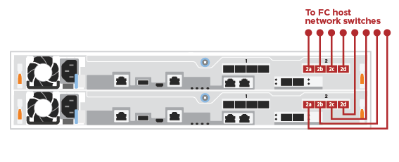

= 자세한 단계 - ASA C250
:allow-uri-read: 
:icons: font
:imagesdir: ../media/

[role="lead"]
이 섹션에서는 ASA C250 시스템 설치에 대한 자세한 단계별 지침을 제공합니다.

== 1단계: 설치 준비

AFF A250 시스템을 설치하려면 계정을 만들고 시스템을 등록해야 합니다. 또한 시스템에 맞는 케이블 수와 유형을 확인하고 특정 네트워크 정보를 수집해야 합니다.

NOTE: 특정 전력 요구사항이 있는 고객은 HWU에서 구성 옵션을 확인해야 합니다.

.시작하기 전에
* 에 대한 액세스 권한이 있는지 확인합니다 link:https://hwu.netapp.com["NetApp Hardware Universe를 참조하십시오"^] HWU)를 참조하십시오.
* 에 대한 액세스 권한이 있는지 확인합니다 link:http://mysupport.netapp.com/documentation/productlibrary/index.html?productID=62286["사용 중인 ONTAP 버전에 대한 릴리즈 노트"^] 이 시스템에 대한 자세한 내용은 를 참조하십시오.
* 사이트에서 다음을 제공해야 합니다.
+
** 스토리지 시스템의 랙 공간입니다
** Phillips #2 드라이버
** 웹 브라우저를 사용하여 시스템을 네트워크 스위치 및 랩톱 또는 콘솔에 연결하는 추가 네트워킹 케이블

.단계
. 모든 상자의 내용물을 풉니다.
. 컨트롤러에서 시스템 일련 번호를 기록합니다.
+
image::../media/drw_ssn_label.png[시스템 일련 번호의 예]

. 계정 설정:
+
.. 기존 계정에 로그인하거나 계정을 만듭니다.
.. link:https://mysupport.netapp.com/eservice/registerSNoAction.do?moduleName=RegisterMyProduct["등록"^] 시스템.

. 다운로드 및 설치 link:https://mysupport.netapp.com/site/tools/tool-eula/activeiq-configadvisor["NetApp 다운로드: Config Advisor"^] 노트북으로.
. 받은 케이블의 수와 유형을 확인하고 기록합니다.
+
다음 표에서는 수신할 수 있는 케이블 유형을 보여 줍니다. 표에 나와 있지 않은 케이블을 받은 경우 를 참조하십시오 link:https://hwu.netapp.com["NetApp Hardware Universe를 참조하십시오"^] 케이블을 찾아 사용 여부를 확인합니다.

+
[cols="1,2,1,2"]
|===
| 케이블 유형... | 부품 번호 및 길이 | 커넥터 유형 | 대상... 

 a| 
25GbE 케이블
 a| 
X66240A-05(112-00595), 0.5m,

X66240-2(112-00573), 2m
 a| 
image:../media/oie_cable100_gbe_qsfp28.png["100 GbE QSFP28 커넥터"]
 a| 
클러스터 인터커넥트 네트워크

 a| 
X66240A-2(112-00598), 2m,

X66240A-5(112-00600), 5m
 a| 
데이터

 a| 
100GbE 케이블
 a| 
X66211-2(112-00574), 2m,

X66211-5(112-00576), 5m
 a| 
스토리지

 a| 
RJ-45(주문에 따라 다름)
 a| 
해당 없음
 a| 
image:../media/oie_cable_rj45.png["RJ-45 케이블 커넥터"]
 a| 
관리 네트워크(BMC 및 렌치 포트) 및 이더넷 데이터(e0a 및 e0b)

 a| 
파이버 채널
 a| 
X66250-2(112-00342) 2m;

X66250-5(112-00344) 5m,

X66250-15(112-00346) 15m,

X66250-30(112-00347) 30m
 a| 
image:../media/oie_cable_fc_optical.png["OIE 파이버 채널 광 케이블"]
 a| 

 a| 
마이크로 USB 콘솔 케이블
 a| 
해당 없음
 a| 
image:../media/oie_cable_micro_usb.png["마이크로 USB 커넥터를 보여 주는 그림"]
 a| 
소프트웨어 설정 중 콘솔 연결

 a| 
전원 케이블
 a| 
해당 없음
 a| 
image:../media/oie_cable_power.png["전원 케이블"]
 a| 
시스템 전원을 켭니다

|===
. 를 검토합니다 link:https://library.netapp.com/ecm/ecm_download_file/ECMLP2862613["ONTAP 구성 가이드 를 참조하십시오"^] 그런 다음 해당 가이드에 나열된 필수 정보를 수집합니다.

== 2단계: 하드웨어 설치

필요에 따라 4-포스트 랙 또는 NetApp 시스템 캐비닛에 시스템을 설치해야 합니다.

.단계
. 필요에 따라 레일 키트를 설치합니다.
. 레일 키트에 포함된 지침에 따라 시스템을 설치하고 고정합니다.
+

NOTE: 시스템 무게와 관련된 안전 문제를 알고 있어야 합니다.

+
image::../media/drw_affa250_weight_caution.png[2인 리프트 주의]

. 이 시스템에는 케이블 관리 장치가 없으므로 케이블을 식별하고 관리합니다.
. 시스템 전면에 베젤을 부착합니다.

== 3단계: 컨트롤러를 클러스터에 케이블로 연결합니다

스위치가 없는 2노드 클러스터 방법을 사용하거나 클러스터 인터커넥트 네트워크 방법을 사용하여 컨트롤러에 케이블을 연결합니다.

[role="tabbed-block"]
====
.옵션 1: 스위치가 없는 2노드 클러스터
--
컨트롤러 모듈의 관리, 파이버 채널 및 데이터 또는 호스트 네트워크 포트는 스위치에 연결됩니다. 클러스터 인터커넥트 포트는 두 컨트롤러 모듈에 케이블로 연결됩니다.

.시작하기 전에
* 시스템을 스위치에 연결하는 방법에 대한 자세한 내용은 네트워크 관리자에게 문의하십시오.
* 그림 화살표에 올바른 케이블 커넥터 당김 탭 방향이 있는지 확인하십시오.
+
image::../media/oie_cable_pull_tab_down.png[당김 탭이 있는 케이블 커넥터]

+

NOTE: 커넥터를 삽입할 때 딸깍 소리가 들려야 합니다. 딸깍 소리가 안 되면 커넥터를 제거하고 회전했다가 다시 시도하십시오.

.이 작업에 대해
애니메이션이나 표 형식 단계를 사용하여 컨트롤러와 스위치 사이의 케이블 연결을 완료합니다. 각 컨트롤러에서 단계를 수행합니다.

.애니메이션 - 케이블 2노드 스위치가 없는 클러스터
video::beec3966-0a01-473c-a5de-ac68017fbf29[panopto]
.단계
. 25GbE 클러스터 인터커넥트 케이블을 사용하여 클러스터 인터커넥트 포트 e0c~e0c 및 e0d를 e0d에 연결합니다.
+
image:../media/oie_cable_sfp_gbe_copper.png["GbE SFP 구리 커넥터"]:

+
image:../media/drw_affa250_tnsc_cabling.png["스위치가 없는 2노드 클러스터에서 클러스터 인터커넥트 케이블 연결"]

. RJ45 케이블을 사용하여 관리 네트워크 스위치에 렌치 포트를 연결합니다.
+
image::../media/drw_affa250_mgmt_cabling.png[관리 포트 케이블 연결]

IMPORTANT: 이때 전원 코드를 꽂지 마십시오.

--
.옵션 2: 스위치 클러스터
--
컨트롤러의 모든 포트는 스위치, 클러스터 인터커넥트, 관리, 파이버 채널, 데이터 또는 호스트 네트워크 스위치에 연결됩니다.

.시작하기 전에
* 시스템을 스위치에 연결하는 방법에 대한 자세한 내용은 네트워크 관리자에게 문의하십시오.
* 그림 화살표에 올바른 케이블 커넥터 당김 탭 방향이 있는지 확인하십시오.
+
image::../media/oie_cable_pull_tab_down.png[당김 탭이 있는 케이블 커넥터]

+

NOTE: 커넥터를 삽입할 때 딸깍 소리가 들려야 합니다. 딸깍 소리가 안 되면 커넥터를 제거하고 회전했다가 다시 시도하십시오.

.이 작업에 대해
애니메이션이나 단계를 사용하여 컨트롤러와 스위치 사이의 케이블 연결을 완료합니다. 각 컨트롤러에서 단계를 수행합니다.

.애니메이션 - 케이블 스위치 클러스터
video::bf6759dc-4cbf-488e-982e-ac68017fbef8[panopto]
.단계
. 클러스터 인터커넥트 포트 e0c 및 e0d를 25GbE 클러스터 인터커넥트 스위치에 케이블로 연결합니다.
+
image:../media/drw_affa250_switched_clust_cabling.png["클러스터 인터커넥트 케이블 연결"]

. RJ45 케이블을 사용하여 관리 네트워크 스위치에 렌치 포트를 연결합니다.
+
image::../media/drw_affa250_mgmt_cabling.png[관리 포트 케이블 연결]

--
====

== 4단계: 호스트 네트워크 또는 스토리지에 케이블 연결(옵션)

Fibre Channel 또는 iSCSI 호스트 네트워크 또는 직접 연결 스토리지에 대한 구성 종속 케이블 연결 옵션이 있습니다. 이 케이블 연결은 배타적이지 않으므로 호스트 네트워크 및 스토리지에 케이블로 연결할 수 있습니다.

NOTE: link:https://hwu.netapp.com["NetApp Hardware Universe를 참조하십시오"^] 호스트 네트워크 카드(Fibre Channel 또는 25GbE)의 슬롯 우선 순위는 슬롯 2입니다. 그러나 두 카드가 모두 있는 경우 Fibre Channel 카드가 슬롯 2에 들어가고 25GbE 카드가 슬롯 1에 들어갑니다(아래 옵션 참조). 외부 셸프가 있는 경우 스토리지 카드는 셸프용으로 지원되는 유일한 슬롯인 슬롯 1에 들어갑니다.

[role="tabbed-block"]
====
.옵션 1: Fibre Channel 호스트 네트워크에 케이블 연결
--
컨트롤러의 파이버 채널 포트는 파이버 채널 호스트 네트워크 스위치에 연결됩니다.

.시작하기 전에
* 시스템을 스위치에 연결하는 방법에 대한 자세한 내용은 네트워크 관리자에게 문의하십시오.
* 그림 화살표에 올바른 케이블 커넥터 당김 탭 방향이 있는지 확인하십시오.
+
image::../media/oie_cable_pull_tab_up.png[상단의 당김 탭이 있는 케이블 커넥터]

+

NOTE: 커넥터를 삽입할 때 딸깍 소리가 들려야 합니다. 딸깍 소리가 안 되면 커넥터를 제거하고 회전했다가 다시 시도하십시오.

.이 작업에 대해
각 컨트롤러 모듈에서 다음 단계를 수행하십시오.

.단계
. 포트 2a에서 2D를 FC 호스트 스위치에 케이블로 연결합니다.
+

--
.옵션 2: 25GbE 데이터 또는 호스트 네트워크에 케이블을 연결합니다
--
컨트롤러의 25GbE 포트는 25GbE 데이터 또는 호스트 네트워크 스위치에 연결됩니다.

.시작하기 전에
* 시스템을 스위치에 연결하는 방법에 대한 자세한 내용은 네트워크 관리자에게 문의하십시오.
* 그림 화살표에 올바른 케이블 커넥터 당김 탭 방향이 있는지 확인하십시오.
+
image::../media/oie_cable_pull_tab_up.png[상단의 당김 탭이 있는 케이블 커넥터]

+

NOTE: 커넥터를 삽입할 때 딸깍 소리가 들려야 합니다. 딸깍 소리가 안 되면 커넥터를 제거하고 회전했다가 다시 시도하십시오.

.이 작업에 대해
각 컨트롤러 모듈에서 다음 단계를 수행하십시오.

.단계
. 케이블 포트 e4a~e4d를 10GbE 호스트 네트워크 스위치에 연결합니다.
+
image:../media/drw_affa250_25gbe_host_cabling.png["25GbE 케이블 연결"]

--
.옵션 3: 컨트롤러를 단일 드라이브 쉘프에 연결합니다
--
각 컨트롤러를 NS224 드라이브 쉘프의 NSM 모듈에 케이블로 연결합니다.

.시작하기 전에
그림 화살표에 올바른 케이블 커넥터 당김 탭 방향이 있는지 확인하십시오.

image::../media/oie_cable_pull_tab_up.png[상단의 당김 탭이 있는 케이블 커넥터]

NOTE: 커넥터를 삽입할 때 딸깍 소리가 들려야 합니다. 딸깍 소리가 안 되면 커넥터를 제거하고 회전했다가 다시 시도하십시오.

.이 작업에 대해
애니메이션 또는 표 형식 단계를 사용하여 컨트롤러와 단일 쉘프 간의 케이블 연결을 완료합니다. 각 컨트롤러 모듈에 대해 단계를 수행합니다.

.애니메이션 - 컨트롤러를 단일 NS224에 케이블로 연결합니다
video::3f92e625-a19c-4d10-9028-ac68017fbf57[panopto]
.단계
. 컨트롤러 A를 쉘프에 연결합니다.
+
image:../media/drw_affa250_1shelf_cabling_a.png["컨트롤러 A 케이블링"]

. 컨트롤러 B를 쉘프에 연결합니다.
+
image:../media/drw_affa250_1shelf_cabling_b.png["컨트롤러 B 케이블 연결"]

--
====

== 5단계: 시스템 설치를 완료합니다

스위치 및 랩톱에 대한 연결만 제공하는 클러스터 검색을 사용하거나 시스템의 컨트롤러에 직접 연결한 다음 관리 스위치에 연결하여 시스템 설치 및 구성을 완료합니다.

[role="tabbed-block"]
====
.옵션 1: 네트워크 검색이 활성화된 경우
--
랩톱에서 네트워크 검색을 사용하도록 설정한 경우 자동 클러스터 검색을 사용하여 시스템 설정 및 구성을 완료할 수 있습니다.

.단계
. 전원 코드를 컨트롤러 전원 공급 장치에 연결한 다음 다른 회로의 전원 공급 장치에 연결합니다.
+
시스템이 부팅을 시작합니다. 초기 부팅에는 최대 8분이 소요될 수 있습니다.

. 랩톱에 네트워크 검색이 활성화되어 있는지 확인합니다.
+
자세한 내용은 노트북의 온라인 도움말을 참조하십시오.

. 애니메이션을 사용하여 노트북을 관리 스위치에 연결합니다.
+
.애니메이션 - 노트북을 관리 스위치에 연결합니다
video::d61f983e-f911-4b76-8b3a-ab1b0066909b[panopto]
. 나열된 ONTAP 아이콘을 선택하여 다음을 검색합니다.
+
image::../media/drw_autodiscovery_controler_select.png[ONTAP 아이콘을 선택합니다]

+
.. 파일 탐색기를 엽니다.
.. 왼쪽 창에서 * 네트워크 * 를 클릭합니다.
.. 마우스 오른쪽 버튼을 클릭하고 * 새로 고침 * 을 선택합니다.
.. ONTAP 아이콘을 두 번 클릭하고 화면에 표시된 인증서를 수락합니다.
+

NOTE: xxxxx는 대상 노드의 시스템 일련 번호입니다.

+
System Manager가 열립니다.

. System Manager의 안내에 따라 설정을 사용하여 에서 수집한 데이터를 사용하여 시스템을 구성합니다 link:https://library.netapp.com/ecm/ecm_download_file/ECMLP2862613["ONTAP 구성 가이드 를 참조하십시오"^].
. Config Advisor을 실행하여 시스템의 상태를 확인하십시오.
. 초기 구성을 완료한 후 로 이동합니다 link:https://www.netapp.com/data-management/oncommand-system-documentation/["ONTAP 및 amp; ONTAP 시스템 관리자 설명서 리소스"^] 페이지에서 ONTAP의 추가 기능 구성에 대한 정보를 얻을 수 있습니다.

--
.옵션 2: 네트워크 검색이 활성화되지 않은 경우
--
랩톱에서 네트워크 검색을 사용하지 않는 경우 이 작업을 사용하여 구성 및 설정을 완료해야 합니다.

.단계
. 랩톱 또는 콘솔 케이블 연결 및 구성:
+
.. 노트북 또는 콘솔의 콘솔 포트를 N-8-1을 사용하여 115,200보드 로 설정합니다.
+

NOTE: 콘솔 포트를 구성하는 방법은 랩톱 또는 콘솔의 온라인 도움말을 참조하십시오.

.. 랩톱 또는 콘솔을 관리 서브넷의 스위치에 연결합니다.
+
image::../media/drw_console_client_mgmt_subnet_affa250.png[관리 서브넷에 연결하는 중입니다]

.. 관리 서브넷에 있는 TCP/IP 주소를 사용하여 랩톱 또는 콘솔에 할당합니다.

. 전원 코드를 컨트롤러 전원 공급 장치에 연결한 다음 다른 회로의 전원 공급 장치에 연결합니다.
+
시스템이 부팅을 시작합니다. 초기 부팅에는 최대 8분이 소요될 수 있습니다.

. 노드 중 하나에 초기 노드 관리 IP 주소를 할당합니다.
+
[cols="1,2"]
|===
| 관리 네트워크에 DHCP가 있는 경우... | 그러면... 

 a| 
구성됨
 a| 
새 컨트롤러에 할당된 IP 주소를 기록합니다.

 a| 
구성되지 않았습니다
 a| 
.. PuTTY, 터미널 서버 또는 해당 환경에 해당하는 를 사용하여 콘솔 세션을 엽니다.
+

NOTE: PuTTY 구성 방법을 모르는 경우 노트북 또는 콘솔의 온라인 도움말을 확인하십시오.

.. 스크립트에 메시지가 표시되면 관리 IP 주소를 입력합니다.

|===
. 랩톱 또는 콘솔에서 System Manager를 사용하여 클러스터를 구성합니다.
+
.. 브라우저에서 노드 관리 IP 주소를 가리킵니다.
+

NOTE: 주소의 형식은 +https://x.x.x.x+ 입니다.

.. 에서 수집한 데이터를 사용하여 시스템을 구성합니다 link:https://library.netapp.com/ecm/ecm_download_file/ECMLP2862613["ONTAP 구성 가이드 를 참조하십시오"^].

. Config Advisor을 실행하여 시스템의 상태를 확인하십시오.
. 초기 구성을 완료한 후 로 이동합니다 link:https://www.netapp.com/data-management/oncommand-system-documentation/["ONTAP 및 amp; ONTAP 시스템 관리자 설명서 리소스"^] 페이지에서 ONTAP의 추가 기능 구성에 대한 정보를 얻을 수 있습니다.

--
====