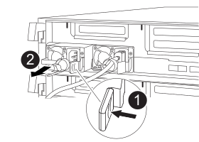

= 전원 공급 장치 교체 - ASA A400
:allow-uri-read: 
:icons: font
:imagesdir: ../media/

[role="lead"]
전원 공급 장치(PSU) 교체에는 대상 PSU를 전원에서 분리하고, 전원 케이블을 뽑고, 기존 PSU를 분리하고, 교체용 PSU를 설치한 다음 교체용 PSU를 전원에 다시 연결하는 작업이 포함됩니다.

* 전원 공급 장치는 이중화되고 핫 스왑이 가능합니다.
* 이 절차는 한 번에 하나의 전원 공급 장치를 교체하기 위한 것입니다.
+

NOTE: 섀시에서 전원 공급 장치를 분리한 후 2분 이내에 전원 공급 장치를 교체하는 것이 좋습니다. 시스템이 계속 작동하지만 ONTAP에서는 전원 공급 장치를 교체할 때까지 성능이 저하된 전원 공급 장치에 대한 메시지를 콘솔에 보냅니다.

+

IMPORTANT: PSU를 다른 효율 등급과 함께 사용하지 마십시오. 항상 Like를 사용합니다.

다음 그림과 함께 기록된 단계를 사용하여 전원 공급 장치를 교체할 수 있습니다.

[cols="10,90"]
|===

 a| 
image:../media/legend_icon_01.png["설명선 번호 1"]
 a| 
PSU 잠금 탭

 a| 
image:../media/legend_icon_02.png["설명선 번호 2"]
 a| 
전원 케이블 고정대

|===
. 아직 접지되지 않은 경우 올바르게 접지하십시오.
. 콘솔 오류 메시지 또는 전원 공급 장치의 LED를 통해 교체할 전원 공급 장치를 식별합니다.
. 전원 공급 장치를 분리합니다.
+
.. 전원 케이블 고정 장치를 연 다음 전원 공급 장치에서 전원 케이블을 뽑습니다.
.. 전원에서 전원 케이블을 뽑습니다.

. 전원 공급 장치를 분리합니다.
+
.. 캠 핸들을 돌려 섀시에서 전원 공급 장치를 당겨 빼냅니다.
.. 파란색 잠금 탭을 눌러 섀시에서 전원 공급 장치를 분리합니다.
.. 양손으로 전원 공급 장치를 섀시에서 빼낸 다음 따로 보관해 둡니다.

. 양손으로 전원 공급 장치의 가장자리를 컨트롤러 모듈의 입구에 맞춘 다음 잠금 탭이 딸깍 소리가 나면서 제자리에 고정될 때까지 전원 공급 장치를 컨트롤러 모듈에 부드럽게 밀어 넣습니다.
+
전원 공급 장치는 내부 커넥터에만 제대로 연결되어 한 방향으로만 제자리에 고정됩니다.

+

NOTE: 내부 커넥터의 손상을 방지하려면 전원 공급 장치를 시스템에 밀어 넣을 때 과도한 힘을 가하지 마십시오.

. 캠 핸들을 돌려 전원 공급 장치와 수평이 되도록 합니다.
. 전원 공급 장치 케이블을 다시 연결합니다.
+
.. 전원 케이블을 전원 공급 장치와 전원에 다시 연결합니다.
.. 전원 케이블 리테이너를 사용하여 전원 공급 장치에 전원 케이블을 고정합니다.

+
전원 공급 장치로 전원이 복구되면 상태 LED가 녹색이어야 합니다.

. 키트와 함께 제공된 RMA 지침에 설명된 대로 오류가 발생한 부품을 NetApp에 반환합니다. 를 참조하십시오 https://mysupport.netapp.com/site/info/rma["부품 반품 및 앰프, 교체"^] 페이지를 참조하십시오.

