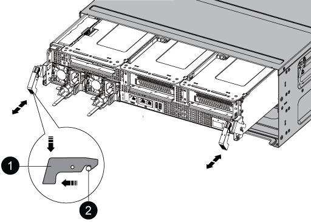

= PCIe 카드 교체 - ASA A800
:allow-uri-read: 
:icons: font
:imagesdir: ../media/

[role="lead"]
PCIe 카드를 장착하려면 카드를 연결하기 전에 카드에서 케이블을 분리하고 SFP 및 QSFP 모듈을 카드에서 제거한 다음 라이저를 다시 설치하고 SFP 및 QSFP 모듈을 다시 설치해야 합니다.

* 이 절차는 시스템에서 지원하는 모든 버전의 ONTAP에서 사용할 수 있습니다
* 시스템의 다른 모든 구성 요소가 올바르게 작동해야 합니다. 그렇지 않은 경우 기술 지원 부서에 문의해야 합니다.

== 1단계: 손상된 컨트롤러를 종료합니다

손상된 컨트롤러를 종료하려면 컨트롤러 상태를 확인하고, 필요한 경우 정상적인 컨트롤러가 손상된 컨트롤러 스토리지에서 데이터를 계속 제공할 수 있도록 컨트롤러를 인수해야 합니다.

.이 작업에 대해
* SAN 시스템을 사용하는 경우 이벤트 메시지를 확인해야 합니다  `cluster kernel-service show`) 손상된 컨트롤러 SCSI 블레이드의 경우. 를 클릭합니다 `cluster kernel-service show` 명령은 노드 이름, 해당 노드의 쿼럼 상태, 해당 노드의 가용성 상태 및 해당 노드의 작동 상태를 표시합니다.
+
각 SCSI 블레이드 프로세스는 클러스터의 다른 노드와 함께 쿼럼에 있어야 합니다. 교체를 진행하기 전에 모든 문제를 해결해야 합니다.

* 노드가 2개 이상인 클러스터가 있는 경우 쿼럼에 있어야 합니다. 클러스터가 쿼럼에 없거나 정상 컨트롤러에 자격 및 상태에 대해 FALSE가 표시되는 경우 손상된 컨트롤러를 종료하기 전에 문제를 해결해야 합니다(참조) link:https://docs.netapp.com/us-en/ontap/system-admin/synchronize-node-cluster-task.html?q=Quorum["노드를 클러스터와 동기화합니다"^].

.단계
. AutoSupport가 활성화된 경우 'system node AutoSupport invoke -node * -type all-message MAINT=number_of_hours_downh' AutoSupport 메시지를 호출하여 자동 케이스 생성을 억제합니다
+
다음 AutoSupport 메시지는 2시간 동안 자동 케이스 생성을 억제합니다. `cluster1:> system node autosupport invoke -node * -type all -message MAINT=2h`

. 정상적인 컨트롤러의 콘솔에서 'Storage failover modify – node local - auto-반환 false'를 자동으로 반환합니다
+

NOTE: 자동 반환을 비활성화하시겠습니까?_가 표시되면 'y'를 입력합니다.

. 손상된 컨트롤러를 로더 프롬프트로 가져가십시오.
+
[cols="1,2"]
|===
| 손상된 컨트롤러가 표시되는 경우... | 그러면... 

 a| 
LOADER 메시지가 표시됩니다
 a| 
다음 단계로 이동합니다.

 a| 
반환 대기 중...
 a| 
Ctrl-C를 누른 다음 메시지가 나타나면 y를 누릅니다.

 a| 
시스템 프롬프트 또는 암호 프롬프트
 a| 
정상적인 컨트롤러 'storage failover takeover -ofnode_impaired_node_name_'에서 손상된 컨트롤러를 인수하거나 중단합니다

손상된 컨트롤러에 기브백을 기다리는 중... 이 표시되면 Ctrl-C를 누른 다음 y를 응답합니다.

|===

== 2단계: 컨트롤러 모듈을 분리합니다

컨트롤러 모듈을 교체하거나 컨트롤러 모듈 내부에 있는 구성요소를 교체할 때 섀시에서 컨트롤러 모듈을 분리해야 합니다.

. 아직 접지되지 않은 경우 올바르게 접지하십시오.
. 전원에서 컨트롤러 모듈 전원 공급 장치를 분리합니다.
. 전원 케이블 고정 장치를 분리한 다음 전원 공급 장치에서 케이블을 분리합니다.
. 케이블을 케이블 관리 장치에 연결하는 후크와 루프 스트랩을 푼 다음, 시스템 케이블과 SFP 및 QSFP 모듈(필요한 경우)을 컨트롤러 모듈에서 분리하여 케이블이 연결된 위치를 추적합니다.
+
케이블 관리 장치에 케이블을 남겨 두면 케이블 관리 장치를 다시 설치할 때 케이블이 정리됩니다.

. 컨트롤러 모듈에서 케이블 관리 장치를 분리하여 한쪽에 둡니다.
. 양쪽 잠금 래치를 아래로 누른 다음 두 래치를 동시에 아래로 돌립니다.
+
컨트롤러 모듈이 섀시에서 약간 꺼냅니다.

+

+
[cols="1,4"]
|===

 a| 
image:../media/legend_icon_01.png["설명선 번호 1"]
 a| 
잠금 래치

 a| 
image:../media/legend_icon_02.png["설명선 번호 2"]
 a| 
잠금 핀

|===
. 컨트롤러 모듈을 섀시 밖으로 밀어냅니다.
+
컨트롤러 모듈 하단을 섀시 밖으로 밀어낼 때 지지하는지 확인합니다.

. 컨트롤러 모듈을 안정적이고 평평한 표면에 놓은 다음 공기 덕트를 엽니다.
+
.. 에어 덕트 측면에 있는 잠금 탭을 컨트롤러 모듈 중앙을 향해 누릅니다.
.. 공기 덕트를 팬 모듈 쪽으로 민 다음 완전히 열린 위치까지 위쪽으로 돌립니다.
+
image::../media/drw_a800_open_air_duct.png[에어 덕트를 여십시오]

+
[cols="1,4"]
|===

 a| 
image:../media/legend_icon_01.png["설명선 번호 1"]
 a| 
에어 덕트 잠금 탭

 a| 
image:../media/legend_icon_02.png["설명선 번호 2"]
 a| 
공기 덕트를 팬 모듈 쪽으로 밉니다

 a| 
image:../media/legend_icon_03.png["설명선 번호 3"]
 a| 
공기 덕트를 팬 모듈 쪽으로 돌립니다

|===

== 3단계: PCIe 카드를 교체합니다

PCIe 카드를 교체하려면 대상 라이저의 PCIe 카드 포트에서 케이블 연결과 QSFP 및 SFP를 모두 분리하고, 컨트롤러 모듈에서 라이저를 꺼낸 다음 PCIe 카드를 분리하고 다시 장착하고, 라이저 및 모든 QSFP 및 SFP를 포트에 다시 설치해야 합니다. 포트에 케이블을 연결합니다.

. 교체할 카드가 라이저 1인지 또는 라이저 2 또는 3인지 확인합니다.
+
** 라이저 1에서 100GbE PCIe 카드를 교체하는 경우 2-3단계 및 6-7단계를 사용합니다.
** 라이저 2 또는 3에서 PCIe 카드를 교체하는 경우 4단계부터 7단계까지 수행하십시오.

. 컨트롤러 모듈에서 라이저 1을 분리합니다.
+
.. PCIe 카드에 있을 수 있는 QSFP 모듈을 제거합니다.
.. 라이저 왼쪽의 라이저 잠금 래치를 팬 모듈 쪽으로 돌립니다.
+
라이저가 컨트롤러 모듈에서 약간 위로 올라갑니다.

.. 라이저를 위로 들어 올리고 팬을 향해 이동시키고 라이저의 판금 립이 컨트롤러 모듈의 모서리에서 분리되도록 한 다음, 라이저를 컨트롤러 모듈에서 들어 올린 다음 안정적이고 평평한 표면에 놓습니다.
+
image::../media/drw_a800_pcie_1_replace.png[라이저 1에 PCI 카드를 교체합니다]

+
[cols="1,4"]
|===

 a| 
image:../media/legend_icon_01.png["설명선 번호 1"]
 a| 
에어 덕트

 a| 
image:../media/legend_icon_02.png["설명선 번호 2"]
 a| 
라이저 잠금 래치

 a| 
image:../media/legend_icon_03.png["설명선 번호 3"]
 a| 
카드 잠금 브래킷

 a| 
image:../media/legend_icon_04.png["설명선 번호 4"]
 a| 
슬롯 1에 100GbE PCIe 카드가 있는 라이저 1(왼쪽 라이저)

|===

. 라이저 1에서 PCIe 카드를 분리합니다.
+
.. PCIe 카드에 액세스할 수 있도록 라이저를 돌립니다.
.. PCIe 라이저 측면에 있는 잠금 브래킷을 누른 다음 열린 위치로 돌립니다.
.. 라이저에서 PCIe 카드를 분리합니다.

. 컨트롤러 모듈에서 PCIe 라이저를 분리합니다.
+
.. PCIe 카드에 있을 수 있는 SFP 또는 QSFP 모듈을 모두 분리합니다.
.. 라이저 왼쪽의 라이저 잠금 래치를 팬 모듈 쪽으로 돌립니다.
+
라이저가 컨트롤러 모듈에서 약간 위로 올라갑니다.

.. 라이저를 위로 들어 올리고 팬을 향해 이동시키고 라이저의 판금 립이 컨트롤러 모듈의 모서리에서 분리되도록 한 다음, 라이저를 컨트롤러 모듈에서 들어 올린 다음 안정적이고 평평한 표면에 놓습니다.
+
image::../media/drw_a800_pcie_2_5_replace.gif[PCI 카드 2 - 5를 가운데 라이저와 오른쪽 라이저에 장착합니다]

+
[cols="1,4"]
|===

 a| 
image:../media/legend_icon_01.png["설명선 번호 1"]
 a| 
에어 덕트

 a| 
image:../media/legend_icon_02.png["설명선 번호 2"]
 a| 
라이저 2(중앙 라이저) 또는 3(오른쪽 라이저) 잠금 래치

 a| 
image:../media/legend_icon_03.png["설명선 번호 3"]
 a| 
카드 잠금 브래킷

 a| 
image:../media/legend_icon_04.png["설명선 번호 4"]
 a| 
라이저 2 또는 3의 측면 패널

 a| 
image:../media/legend_icon_05.png["설명선 번호 5"]
 a| 
라이저 2 또는 3의 PCIe 카드

|===

. 라이저에서 PCIe 카드를 분리합니다.
+
.. PCIe 카드에 액세스할 수 있도록 라이저를 돌립니다.
.. PCIe 라이저 측면에 있는 잠금 브래킷을 누른 다음 열린 위치로 돌립니다.
.. 라이저에서 측면 패널을 돌려 분리합니다.
.. 라이저에서 PCIe 카드를 분리합니다.

. PCIe 카드를 라이저의 동일한 슬롯에 설치합니다.
+
.. 카드를 라이저의 카드 소켓에 맞춘 다음 라이저의 소켓에 똑바로 밀어 넣습니다.
+

NOTE: 카드가 라이저 소켓에 완전히 똑바로 장착되었는지 확인하십시오.

.. 라이저 2 또는 3의 경우 측면 패널을 닫습니다.
.. 잠금 래치가 딸깍 소리를 내며 잠금 위치로 들어갈 때까지 돌려 고정합니다.

. 라이저를 컨트롤러 모듈에 설치합니다.
+
.. 라이저의 립을 컨트롤러 모듈 판금의 밑면에 맞춥니다.
.. 라이저를 컨트롤러 모듈의 핀을 따라 이동한 다음 라이저를 컨트롤러 모듈에 내려 놓습니다.
.. 잠금 래치를 아래로 돌려 잠금 위치로 클릭합니다.
+
잠금 래치가 잠기면 잠금 래치가 라이저 윗면과 맞닿고 라이저는 컨트롤러 모듈에 똑바로 앉습니다.

.. PCIe 카드에서 제거된 SFP 모듈을 모두 재장착합니다.

== 4단계: 컨트롤러 모듈을 재설치합니다

컨트롤러 모듈 내에서 구성 요소를 교체한 후 시스템 섀시에 컨트롤러 모듈을 다시 설치하고 부팅해야 합니다.

. 아직 에어 덕트를 닫지 않은 경우 에어 덕트를 닫으십시오.
+
.. 공기 덕트를 컨트롤러 모듈로 끝까지 돌립니다.
.. 잠금 탭이 딸깍 소리가 날 때까지 공기 덕트를 라이저 쪽으로 밉니다.
.. 공기 덕트가 제대로 장착되고 제자리에 고정되었는지 확인합니다.
+
image::../media/drw_a800_close_air_duct.png[에어 덕트를 닫으십시오]

+
[cols="1,4"]
|===

 a| 
image:../media/legend_icon_01.png["설명선 번호 1"]
 a| 
잠금 탭

 a| 
image:../media/legend_icon_02.png["설명선 번호 2"]
 a| 
슬라이드 플런저

|===

. 컨트롤러 모듈의 끝을 섀시의 입구에 맞춘 다음 컨트롤러 모듈을 반쯤 조심스럽게 시스템에 밀어 넣습니다.
+

NOTE: 지시가 있을 때까지 컨트롤러 모듈을 섀시에 완전히 삽입하지 마십시오.

. 필요에 따라 시스템을 다시 연결합니다.
. 전원 케이블을 전원 공급 장치에 연결하고 전원 케이블 고정 장치를 다시 설치합니다.
. 컨트롤러 모듈 재설치를 완료합니다.
+
.. 컨트롤러 모듈이 중앙판과 만나 완전히 장착될 때까지 섀시 안으로 단단히 밀어 넣습니다.
+
컨트롤러 모듈이 완전히 장착되면 잠금 래치가 상승합니다.

+

NOTE: 커넥터가 손상되지 않도록 컨트롤러 모듈을 섀시에 밀어 넣을 때 과도한 힘을 가하지 마십시오.

+
컨트롤러 모듈이 섀시에 완전히 장착되면 바로 부팅이 시작됩니다.

.. 잠금 래치를 위쪽으로 돌려 잠금 핀이 분리될 때까지 기울인 다음 잠금 위치로 내립니다.
.. 아직 설치하지 않은 경우 케이블 관리 장치를 다시 설치하십시오.

. 스토리지 'storage failover back-ofnode_impaired_node_name_'을 제공하여 컨트롤러를 정상 작동 상태로 되돌립니다
. 자동 반환이 비활성화된 경우 'Storage failover modify -node local -auto-반환 true'를 다시 설정합니다

== 5단계: 장애가 발생한 부품을 NetApp에 반환

키트와 함께 제공된 RMA 지침에 설명된 대로 오류가 발생한 부품을 NetApp에 반환합니다. 를 참조하십시오 https://mysupport.netapp.com/site/info/rma["부품 반품 및 앰프, 교체"] 페이지를 참조하십시오.
