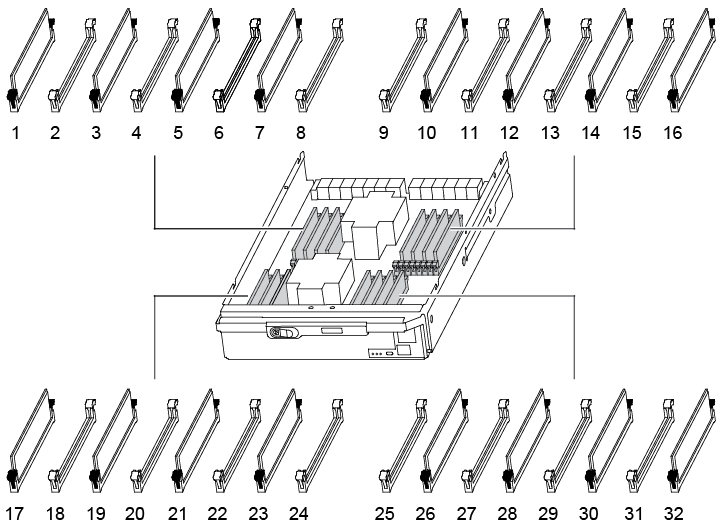

= DIMM-ASA A900을 교체합니다
:allow-uri-read: 
:icons: font
:imagesdir: ../media/

[role="lead"]
시스템에서 수정 가능한 오류 수정 코드(ECC)를 계속 등록할 때 컨트롤러 모듈의 DIMM을 교체해야 합니다. 그렇지 않으면 시스템 패닉이 발생합니다.

.시작하기 전에
시스템의 다른 모든 구성 요소가 올바르게 작동해야 합니다. 그렇지 않은 경우 기술 지원 부서에 문의해야 합니다.

오류가 발생한 구성 요소를 공급업체로부터 받은 교체 FRU 구성 요소로 교체해야 합니다.

== 1단계: 손상된 컨트롤러를 종료합니다

다음 옵션 중 하나를 사용하여 컨트롤러를 종료하거나 손상된 컨트롤러를 인수합니다.

[role="tabbed-block"]
====
.옵션 1: 대부분의 시스템
--
손상된 컨트롤러를 종료하려면 컨트롤러 상태를 확인하고, 필요한 경우 정상적인 컨트롤러가 손상된 컨트롤러 스토리지에서 데이터를 계속 제공할 수 있도록 컨트롤러를 인수해야 합니다.

.이 작업에 대해
* SAN 시스템을 사용하는 경우 손상된 컨트롤러 SCSI 블레이드에 대한 이벤트 메시지를 확인해야  `cluster kernel-service show`합니다.  `cluster kernel-service show`priv advanced 모드에서 명령을 실행하면 노드 이름, 해당 노드의 쿼럼 상태, 해당 노드의 가용성 상태 및 해당 노드의 작동 상태가 표시됩니다.
+
각 SCSI 블레이드 프로세스는 클러스터의 다른 노드와 함께 쿼럼에 있어야 합니다. 교체를 진행하기 전에 모든 문제를 해결해야 합니다.

* 노드가 2개 이상인 클러스터가 있는 경우 쿼럼에 있어야 합니다. 클러스터가 쿼럼에 없거나 정상 컨트롤러에 자격 및 상태에 대해 FALSE가 표시되는 경우 손상된 컨트롤러를 종료하기 전에 문제를 해결해야 합니다(참조) link:https://docs.netapp.com/us-en/ontap/system-admin/synchronize-node-cluster-task.html?q=Quorum["노드를 클러스터와 동기화합니다"^].

.단계
. AutoSupport가 활성화된 경우 AutoSupport 메시지를 호출하여 자동 케이스 생성을 억제합니다. `system node autosupport invoke -node * -type all -message MAINT=<# of hours>h`
+
다음 AutoSupport 메시지는 2시간 동안 자동 케이스 생성을 억제합니다. `cluster1:> system node autosupport invoke -node * -type all -message MAINT=2h`

. 정상적인 컨트롤러의 콘솔에서 'Storage failover modify – node local - auto-반환 false'를 자동으로 반환합니다
+

NOTE: 자동 반환을 비활성화하시겠습니까?_가 표시되면 'y'를 입력합니다.

. 손상된 컨트롤러를 로더 프롬프트로 가져가십시오.
+
[cols="1,2"]
|===
| 손상된 컨트롤러가 표시되는 경우... | 그러면... 

 a| 
LOADER 메시지가 표시됩니다
 a| 
다음 단계로 이동합니다.

 a| 
반환 대기 중...
 a| 
Ctrl-C를 누른 다음 메시지가 나타나면 y를 누릅니다.

 a| 
시스템 프롬프트 또는 암호 프롬프트
 a| 
정상적인 컨트롤러 'storage failover takeover -ofnode_impaired_node_name_'에서 손상된 컨트롤러를 인수하거나 중단합니다

손상된 컨트롤러에 기브백을 기다리는 중... 이 표시되면 Ctrl-C를 누른 다음 y를 응답합니다.

|===

--
.옵션 2: 컨트롤러가 MetroCluster에 있습니다
--

NOTE: 시스템이 2노드 MetroCluster 구성인 경우 이 절차를 사용하지 마십시오.

손상된 컨트롤러를 종료하려면 컨트롤러 상태를 확인하고, 필요한 경우 정상적인 컨트롤러가 손상된 컨트롤러 스토리지에서 데이터를 계속 제공할 수 있도록 컨트롤러를 인수해야 합니다.

* 노드가 2개 이상인 클러스터가 있는 경우 쿼럼에 있어야 합니다. 클러스터가 쿼럼에 없거나 정상 컨트롤러에 자격 및 상태에 대해 FALSE가 표시되는 경우 손상된 컨트롤러를 종료하기 전에 문제를 해결해야 합니다(참조) link:https://docs.netapp.com/us-en/ontap/system-admin/synchronize-node-cluster-task.html?q=Quorum["노드를 클러스터와 동기화합니다"^].
* MetroCluster 설정이 있는 경우 MetroCluster 설정 상태가 구성되어 있고 해당 노드가 설정 및 정상 상태('MetroCluster node show')인지 확인해야 합니다.

.단계
. AutoSupport가 활성화된 경우 'system node AutoSupport invoke -node * -type all-message MAINT=number_of_hours_downh' AutoSupport 메시지를 호출하여 자동 케이스 생성을 억제합니다
+
다음 AutoSupport 메시지는 두 시간 동안 자동 케이스 생성을 억제합니다: ' cluster1: * > system node AutoSupport invoke - node * -type all-message MAINT=2h'

. 정상적인 컨트롤러의 콘솔에서 'Storage failover modify – node local - auto-반환 false'를 자동으로 반환합니다
. 손상된 컨트롤러를 로더 프롬프트로 가져가십시오.
+
[cols="1,2"]
|===
| 손상된 컨트롤러가 표시되는 경우... | 그러면... 

 a| 
LOADER 메시지가 표시됩니다
 a| 
다음 단계로 이동합니다.

 a| 
반환 대기 중...
 a| 
Ctrl-C를 누른 다음 메시지가 나타나면 y를 누릅니다.

 a| 
시스템 프롬프트 또는 암호 프롬프트(시스템 암호 입력)
 a| 
정상적인 컨트롤러 'storage failover takeover -ofnode_impaired_node_name_'에서 손상된 컨트롤러를 인수하거나 중단합니다

손상된 컨트롤러에 기브백을 기다리는 중... 이 표시되면 Ctrl-C를 누른 다음 y를 응답합니다.

|===

--
====

== 2단계: 컨트롤러 모듈을 분리합니다

컨트롤러 내의 구성 요소에 액세스하려면 먼저 시스템에서 컨트롤러 모듈을 분리한 다음 컨트롤러 모듈의 덮개를 분리해야 합니다.

. 아직 접지되지 않은 경우 올바르게 접지하십시오.
. 손상된 컨트롤러 모듈에서 케이블을 뽑고 케이블이 연결된 위치를 추적합니다.
. 캠 핸들의 테라코타 버튼이 잠금 해제될 때까지 아래로 밉니다.
+
.애니메이션 - 컨트롤러를 제거합니다
video::256721fd-4c2e-40b3-841a-adf2000df5fa[panopto]
+
image::../media/drw_a900_remove_PCM.png[컨트롤러를 놓습니다]

+
[cols="1,4"]
|===

 a| 
image:../media/legend_icon_01.png["설명선 번호 1"]
 a| 
캠 핸들 해제 버튼

 a| 
image:../media/legend_icon_02.png["설명선 번호 2"]
 a| 
캠 핸들

|===
. 캠 핸들을 돌려 컨트롤러 모듈을 섀시에서 완전히 분리한 다음 컨트롤러 모듈을 섀시 밖으로 밉니다.
+
컨트롤러 모듈 하단을 섀시 밖으로 밀어낼 때 지지하는지 확인합니다.

. 컨트롤러 모듈 덮개를 평평하고 안정적인 곳에 놓고 덮개의 파란색 단추를 누르고 덮개를 컨트롤러 모듈 뒤쪽으로 민 다음 덮개를 위로 돌려 컨트롤러 모듈에서 들어올립니다.
+
image::../media/drw_a900_PCM_open.png[컨트롤러 모듈에서 덮개를 들어올립니다]

+
[cols="1,4"]
|===

 a| 
image:../media/legend_icon_01.png["설명선 번호 1"]
 a| 
컨트롤러 모듈 커버 잠금 버튼

|===

== 3단계: DIMM을 교체합니다

DIMM을 교체하려면 컨트롤러 내부에서 DIMM을 찾은 후 특정 단계를 따르십시오.

NOTE: VER2 컨트롤러에는 DIMM 소켓이 적습니다. 지원되는 DIMM의 수를 줄이거나 DIMM 소켓 번호 지정에 변화가 없습니다. DIMM을 새 컨트롤러 모듈로 이동할 때 손상된 컨트롤러 모듈과 동일한 소켓 번호/위치에 DIMM을 설치합니다.  DIMM 소켓 위치는 VER2 컨트롤러 모듈의 FRU 맵 다이어그램을 참조하십시오.

. 아직 접지되지 않은 경우 올바르게 접지하십시오.
. 컨트롤러 모듈에서 DIMM을 찾습니다.
+

. DIMM의 양쪽에 있는 두 개의 DIMM 이젝터 탭을 천천히 밀어 슬롯에서 DIMM을 꺼낸 다음 슬롯에서 DIMM을 밀어 꺼냅니다.
+

IMPORTANT: DIMM 회로 보드의 구성 요소에 압력이 가해질 수 있으므로 DIMM의 가장자리를 조심스럽게 잡으십시오.

+
.애니메이션 - DIMM을 교체합니다
video::db161030-298a-4ae4-b902-adf2000e2aa4[panopto]
+
image::../media/drw_a900_replace_PCM_dimms.png[DIMM을 분리합니다]

+
[cols="1,4"]
|===

 a| 
image:../media/legend_icon_01.png["설명선 번호 1"]
 a| 
DIMM 이젝터 탭

 a| 
image:../media/legend_icon_02.png["설명선 번호 2"]
 a| 
DIMM

|===
. 정전기 방지 포장용 백에서 교체용 DIMM을 제거하고 DIMM을 모서리에 맞춰 슬롯에 맞춥니다.
+
DIMM의 핀 사이의 노치가 소켓의 탭과 일직선이 되어야 합니다.

. 커넥터의 DIMM 이젝터 탭이 열린 위치에 있는지 확인한 다음 DIMM을 슬롯에 똑바로 삽입합니다.
+
DIMM은 슬롯에 단단히 장착되지만 쉽게 장착할 수 있습니다. 그렇지 않은 경우 DIMM을 슬롯에 재정렬하고 다시 삽입합니다.

+

IMPORTANT: DIMM이 균일하게 정렬되어 슬롯에 완전히 삽입되었는지 육안으로 검사합니다.

. 이젝터 탭이 DIMM 끝 부분의 노치 위에 끼워질 때까지 DIMM의 상단 가장자리를 조심스럽게 단단히 누릅니다.
. 컨트롤러 모듈 덮개를 닫습니다.

== 4단계: 컨트롤러를 설치합니다

컨트롤러 모듈에 구성 요소를 설치한 후에는 컨트롤러 모듈을 시스템 섀시에 다시 설치하고 운영 체제를 부팅해야 합니다.

동일한 섀시에 2개의 컨트롤러 모듈이 있는 HA 쌍의 경우, 컨트롤러 모듈을 설치하는 순서는 섀시에 완전히 장착되자마자 재부팅을 시도하기 때문에 특히 중요합니다.

. 아직 접지되지 않은 경우 올바르게 접지하십시오.
. 아직 설치하지 않은 경우 컨트롤러 모듈의 덮개를 다시 끼우십시오.
+
image::../media/drw_a900_PCM_open.png[컨트롤러 모듈에서 덮개를 들어올립니다]

+
[cols="1,4"]
|===

 a| 
image:../media/legend_icon_01.png["설명선 번호 1"]
 a| 
컨트롤러 모듈 커버 잠금 버튼

|===
. 컨트롤러 모듈의 끝을 섀시의 입구에 맞춘 다음 컨트롤러 모듈을 반쯤 조심스럽게 시스템에 밀어 넣습니다.
+
.애니메이션 - 컨트롤러 설치
video::099237f3-d7f2-4749-86e2-adf2000df53c[panopto]
+
image::../media/drw_a900_remove_PCM.png[컨트롤러를 놓습니다]

+
[cols="1,4"]
|===

 a| 
image:../media/legend_icon_01.png["설명선 번호 1"]
 a| 
캠 핸들 해제 버튼

 a| 
image:../media/legend_icon_02.png["설명선 번호 2"]
 a| 
캠 핸들

|===
+

NOTE: 지시가 있을 때까지 컨트롤러 모듈을 섀시에 완전히 삽입하지 마십시오.

. 다음 섹션의 작업을 수행하기 위해 시스템에 액세스할 수 있도록 관리 포트와 콘솔 포트에만 케이블을 연결합니다.
+

NOTE: 이 절차의 뒷부분에서 나머지 케이블을 컨트롤러 모듈에 연결합니다.

. 컨트롤러 모듈 재설치를 완료합니다.
+
.. 아직 설치하지 않은 경우 케이블 관리 장치를 다시 설치하십시오.
.. 컨트롤러 모듈이 중앙판과 만나 완전히 장착될 때까지 섀시 안으로 단단히 밀어 넣습니다.
+
컨트롤러 모듈이 완전히 장착되면 잠금 래치가 상승합니다.

+

IMPORTANT: 커넥터가 손상되지 않도록 컨트롤러 모듈을 섀시에 밀어 넣을 때 과도한 힘을 가하지 마십시오.

+
컨트롤러 모듈이 섀시에 완전히 장착되면 바로 부팅이 시작됩니다. 부트 프로세스를 중단할 준비를 하십시오.

.. 잠금 래치를 위쪽으로 돌려 잠금 핀이 분리될 때까지 기울인 다음 잠금 위치로 내립니다.
.. Press Ctrl-C for Boot Menu가 표시되면 Ctrl-C를 눌러 부팅 프로세스를 중단합니다.
.. 표시된 메뉴에서 유지보수 모드로 부팅하는 옵션을 선택합니다.

== 5단계: 시스템 수준 진단 프로그램을 실행합니다

새 DIMM을 설치한 후 진단 유틸리티를 실행해야 합니다.

시스템 레벨 진단을 시작하려면 시스템에 LOADER 메시지가 표시되어야 합니다.

진단 절차의 모든 명령은 구성 요소를 교체하는 컨트롤러에서 실행됩니다.

. 수리할 컨트롤러가 로더 프롬프트에 있지 않은 경우 다음 단계를 수행하십시오.
+
.. 표시된 메뉴에서 유지보수 모드 옵션을 선택합니다.
.. 컨트롤러가 유지보수 모드로 부팅된 후 컨트롤러를 중지합니다. `halt`
+
명령을 실행한 후 시스템이 로더 프롬프트에서 중지될 때까지 기다려야 합니다.

+

IMPORTANT: 부팅 프로세스 중에 안전하게 응답할 수 있습니다 `y` 를 눌러 메시지를 표시합니다.

+
*** HA 구성에서 유지보수 모드로 전환할 때 정상 상태의 컨트롤러가 계속 중지되는지 확인하는 경고 메시지가 표시되는 경우

. LOADER 프롬프트에서 시스템 수준 진단이 제대로 작동하도록 특별히 설계된 특수 드라이버를 액세스합니다. `boot_diags`
+
부팅 프로세스 중에 안전하게 응답할 수 있습니다 `y` 유지보수 모드 프롬프트(*>)가 나타날 때까지 프롬프트에 응답합니다.

. 시스템 메모리에 대한 진단 유틸리티를 실행합니다. `sldiag device run -dev mem`
. DIMM 교체로 인한 하드웨어 문제가 없는지 확인합니다. `sldiag device status -dev mem -long -state failed`
+
시스템 수준 진단은 테스트 실패가 없을 경우 프롬프트로 돌아가거나 구성 요소 테스트로 인한 전체 실패 상태를 표시합니다.

. 이전 단계의 결과에 따라 계속 진행합니다.
+
[cols="1,2"]
|===
| 시스템 수준 진단이 테스트되는 경우... | 그러면... 

 a| 
실패없이 완료되었습니다
 a| 
.. 상태 로그 지우기: `sldiag device clearstatus`
.. 로그가 지워졌는지 확인합니다. `sldiag device status`
+
다음과 같은 기본 응답이 표시됩니다.

+
SLDIAG: 로그 메시지가 없습니다.

.. 유지보수 모드를 종료합니다
+
컨트롤러에 LOADER 프롬프트가 표시됩니다.

.. LOADER 프롬프트에서 컨트롤러를 부팅합니다. `bye`
.. 컨트롤러를 정상 작동 상태로 되돌립니다.

|===
+
[cols="1,2"]
|===
| 컨트롤러가 다음 상태인 경우: | 그러면... 

 a| 
HA 쌍
 a| 
Giveback을 수행합니다. `storage failover giveback -ofnode replacement_node_name`        * 참고: * 자동 반환을 비활성화한 경우 storage failover modify 명령으로 다시 활성화하십시오.

 a| 
테스트 실패가 발생했습니다
 a| 
문제의 원인을 확인합니다.

.. 유지보수 모드를 종료합니다
+
명령을 실행한 후 LOADER 프롬프트에서 시스템이 중지될 때까지 기다립니다.

.. 시스템 수준 진단 프로그램 실행 시 확인된 모든 고려 사항, 케이블이 안전하게 연결되어 있는지, 하드웨어 구성 요소가 스토리지 시스템에 올바르게 설치되어 있는지 확인합니다.
.. 서비스 중인 컨트롤러 모듈을 부팅하고 키를 눌러 부팅을 중단합니다 `Ctrl-C` Boot 메뉴로 이동하라는 메시지가 표시되면
+
*** 섀시에 2개의 컨트롤러 모듈이 있는 경우, 서비스 중인 컨트롤러 모듈을 섀시에 완전히 장착합니다.
+
컨트롤러 모듈이 완전히 장착되면 부팅됩니다.

*** 섀시에 하나의 컨트롤러 모듈이 있는 경우 전원 공급 장치를 연결한 다음 전원을 켭니다.

.. 메뉴에서 Boot to maintenance mode(유지 관리 모드로 부팅) 를 선택합니다.
.. 다음 명령을 입력하여 유지 관리 모드를 종료합니다. `halt`
+
명령을 실행한 후 LOADER 프롬프트에서 시스템이 중지될 때까지 기다립니다.

.. 시스템 레벨 진단 테스트를 다시 실행하십시오.

|===

== 6단계: 장애가 발생한 부품을 NetApp에 반환

키트와 함께 제공된 RMA 지침에 설명된 대로 오류가 발생한 부품을 NetApp에 반환합니다. 를 참조하십시오 https://mysupport.netapp.com/site/info/rma["부품 반품 및 앰프, 교체"] 페이지를 참조하십시오.
