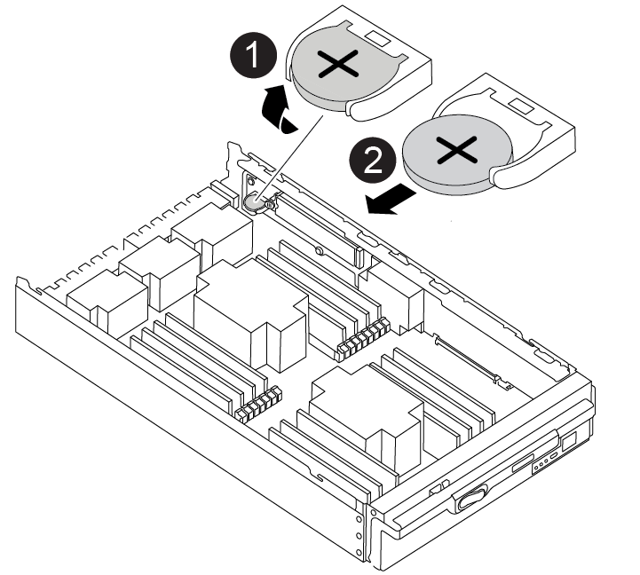

= 실시간 시계 배터리를 교체합니다. - ASA A900
:allow-uri-read: 
:icons: font
:imagesdir: ../media/

[role="lead"]
정확한 시간 동기화에 의존하는 시스템 서비스 및 응용 프로그램이 계속 작동할 수 있도록 컨트롤러 모듈의 실시간 클럭(RTC) 배터리를 교체합니다.

* 이 절차는 시스템에서 지원하는 모든 버전의 ONTAP에서 사용할 수 있습니다
* 시스템의 다른 모든 구성 요소가 올바르게 작동해야 합니다. 그렇지 않은 경우 기술 지원 부서에 문의해야 합니다.

== 1단계: 손상된 컨트롤러를 종료합니다

다음 옵션 중 하나를 사용하여 컨트롤러를 종료하거나 손상된 컨트롤러를 인수합니다.

[role="tabbed-block"]
====
.옵션 1: 대부분의 시스템
--
손상된 컨트롤러를 종료하려면 컨트롤러 상태를 확인하고, 필요한 경우 정상적인 컨트롤러가 손상된 컨트롤러 스토리지에서 데이터를 계속 제공할 수 있도록 컨트롤러를 인수해야 합니다.

.이 작업에 대해
* SAN 시스템을 사용하는 경우 이벤트 메시지를 확인해야 합니다  `cluster kernel-service show`) 손상된 컨트롤러 SCSI 블레이드의 경우. 를 클릭합니다 `cluster kernel-service show` 명령은 노드 이름, 해당 노드의 쿼럼 상태, 해당 노드의 가용성 상태 및 해당 노드의 작동 상태를 표시합니다.
+
각 SCSI 블레이드 프로세스는 클러스터의 다른 노드와 함께 쿼럼에 있어야 합니다. 교체를 진행하기 전에 모든 문제를 해결해야 합니다.

* 노드가 2개 이상인 클러스터가 있는 경우 쿼럼에 있어야 합니다. 클러스터가 쿼럼에 없거나 정상 컨트롤러에 자격 및 상태에 대해 FALSE가 표시되는 경우 손상된 컨트롤러를 종료하기 전에 문제를 해결해야 합니다(참조) link:https://docs.netapp.com/us-en/ontap/system-admin/synchronize-node-cluster-task.html?q=Quorum["노드를 클러스터와 동기화합니다"^].

.단계
. AutoSupport가 활성화된 경우 'system node AutoSupport invoke -node * -type all-message MAINT=number_of_hours_downh' AutoSupport 메시지를 호출하여 자동 케이스 생성을 억제합니다
+
다음 AutoSupport 메시지는 2시간 동안 자동 케이스 생성을 억제합니다. `cluster1:> system node autosupport invoke -node * -type all -message MAINT=2h`

. 정상적인 컨트롤러의 콘솔에서 'Storage failover modify – node local - auto-반환 false'를 자동으로 반환합니다
+

NOTE: 자동 반환을 비활성화하시겠습니까?_가 표시되면 'y'를 입력합니다.

. 손상된 컨트롤러를 로더 프롬프트로 가져가십시오.
+
[cols="1,2"]
|===
| 손상된 컨트롤러가 표시되는 경우... | 그러면... 

 a| 
LOADER 메시지가 표시됩니다
 a| 
다음 단계로 이동합니다.

 a| 
반환 대기 중...
 a| 
Ctrl-C를 누른 다음 메시지가 나타나면 y를 누릅니다.

 a| 
시스템 프롬프트 또는 암호 프롬프트
 a| 
정상적인 컨트롤러 'storage failover takeover -ofnode_impaired_node_name_'에서 손상된 컨트롤러를 인수하거나 중단합니다

손상된 컨트롤러에 기브백을 기다리는 중... 이 표시되면 Ctrl-C를 누른 다음 y를 응답합니다.

|===

--
.옵션 2: 컨트롤러가 MetroCluster에 있습니다
--

NOTE: 시스템이 2노드 MetroCluster 구성인 경우 이 절차를 사용하지 마십시오.

손상된 컨트롤러를 종료하려면 컨트롤러 상태를 확인하고, 필요한 경우 정상적인 컨트롤러가 손상된 컨트롤러 스토리지에서 데이터를 계속 제공할 수 있도록 컨트롤러를 인수해야 합니다.

* 노드가 2개 이상인 클러스터가 있는 경우 쿼럼에 있어야 합니다. 클러스터가 쿼럼에 없거나 정상 컨트롤러에 자격 및 상태에 대해 FALSE가 표시되는 경우 손상된 컨트롤러를 종료하기 전에 문제를 해결해야 합니다(참조) link:https://docs.netapp.com/us-en/ontap/system-admin/synchronize-node-cluster-task.html?q=Quorum["노드를 클러스터와 동기화합니다"^].
* MetroCluster 설정이 있는 경우 MetroCluster 설정 상태가 구성되어 있고 해당 노드가 설정 및 정상 상태('MetroCluster node show')인지 확인해야 합니다.

.단계
. AutoSupport가 활성화된 경우 'system node AutoSupport invoke -node * -type all-message MAINT=number_of_hours_downh' AutoSupport 메시지를 호출하여 자동 케이스 생성을 억제합니다
+
다음 AutoSupport 메시지는 두 시간 동안 자동 케이스 생성을 억제합니다: ' cluster1: * > system node AutoSupport invoke - node * -type all-message MAINT=2h'

. 정상적인 컨트롤러의 콘솔에서 'Storage failover modify – node local - auto-반환 false'를 자동으로 반환합니다
. 손상된 컨트롤러를 로더 프롬프트로 가져가십시오.
+
[cols="1,2"]
|===
| 손상된 컨트롤러가 표시되는 경우... | 그러면... 

 a| 
LOADER 메시지가 표시됩니다
 a| 
다음 단계로 이동합니다.

 a| 
반환 대기 중...
 a| 
Ctrl-C를 누른 다음 메시지가 나타나면 y를 누릅니다.

 a| 
시스템 프롬프트 또는 암호 프롬프트(시스템 암호 입력)
 a| 
정상적인 컨트롤러 'storage failover takeover -ofnode_impaired_node_name_'에서 손상된 컨트롤러를 인수하거나 중단합니다

손상된 컨트롤러에 기브백을 기다리는 중... 이 표시되면 Ctrl-C를 누른 다음 y를 응답합니다.

|===

--
====

== 2단계: 컨트롤러를 제거합니다

컨트롤러 내의 구성 요소에 액세스하려면 먼저 시스템에서 컨트롤러 모듈을 분리한 다음 컨트롤러 모듈의 덮개를 분리해야 합니다.

. 아직 접지되지 않은 경우 올바르게 접지하십시오.
. 손상된 컨트롤러 모듈에서 케이블을 뽑고 케이블이 연결된 위치를 추적합니다.
. 캠 핸들의 테라코타 버튼이 잠금 해제될 때까지 아래로 밉니다.
+
.애니메이션 - 컨트롤러를 제거합니다
video::256721fd-4c2e-40b3-841a-adf2000df5fa[panopto]
+
image::../media/drw_a900_remove_PCM.png[drw a900 PCM을 제거합니다]

+
[cols="10,90"]
|===

 a| 
image:../media/legend_icon_01.png["설명선 번호 1"]
 a| 
캠 핸들 해제 버튼

 a| 
image:../media/legend_icon_02.png["설명선 번호 2"]
 a| 
캠 핸들

|===
. 캠 핸들을 돌려 컨트롤러 모듈을 섀시에서 완전히 분리한 다음 컨트롤러 모듈을 섀시 밖으로 밉니다.
+
컨트롤러 모듈 하단을 섀시 밖으로 밀어낼 때 지지하는지 확인합니다.

. 컨트롤러 모듈 덮개를 평평하고 안정적인 곳에 놓고 덮개의 파란색 단추를 누르고 덮개를 컨트롤러 모듈 뒤쪽으로 민 다음 덮개를 위로 돌려 컨트롤러 모듈에서 들어올립니다.

image::../media/drw_a900_PCM_open.png[drw a900 PCM이 열려 있습니다]

[cols="10,90"]
|===

 a| 
image:../media/legend_icon_01.png["설명선 번호 1"]
 a| 
컨트롤러 모듈 커버 잠금 버튼

|===

== 3단계: RTC 배터리를 교체합니다

RTC 배터리를 교체하려면 컨트롤러 모듈에서 결함이 있는 배터리를 찾아 홀더에서 분리한 다음 교체용 배터리를 홀더에 설치해야 합니다.

. 아직 접지되지 않은 경우 올바르게 접지하십시오.
. RTC 배터리를 찾습니다.
+
.애니메이션 - RTC 배터리를 교체합니다
video::1bb4d8d4-5040-471c-9593-adf2000df48d[panopto]
+

+
[cols="10,90"]
|===

 a| 
image:../media/legend_icon_01.png["설명선 번호 1"]
 a| 
RTC 배터리

 a| 
image:../media/legend_icon_02.png["설명선 번호 2"]
 a| 
RTC 배터리 하우징

|===
. 배터리를 홀더에서 조심스럽게 밀어내고 홀더에서 돌린 다음 홀더에서 들어 꺼냅니다.
+

NOTE: 배터리함을 홀더에서 분리할 때 배터리의 극성에 유의하십시오. 배터리에는 플러스 기호가 표시되어 있으며 홀더에 올바르게 위치해야 합니다. 홀더 근처에 있는 더하기 기호는 배터리를 어떻게 배치해야 하는지 알려줍니다.

. 정전기 방지 운송용 백에서 교체용 배터리를 제거합니다.
. 컨트롤러 모듈에서 빈 배터리 홀더를 찾습니다.
. RTC 배터리의 극성을 확인한 다음 배터리를 비스듬히 기울이고 아래로 눌러 홀더에 삽입합니다.
. 배터리를 육안으로 검사하여 홀더가 완전히 장착되어 있고 극성이 올바른지 확인하십시오.
. 컨트롤러 모듈 덮개를 다시 설치합니다.

== 4단계: 컨트롤러 모듈을 다시 설치하고 시간/날짜를 설정합니다

RTC 배터리를 교체한 후 컨트롤러 모듈을 다시 설치해야 합니다. RTC 배터리를 10분 이상 컨트롤러 모듈에서 분리한 경우 시간과 날짜를 재설정해야 할 수 있습니다.

. 에어 덕트 또는 컨트롤러 모듈 커버를 아직 닫지 않은 경우 닫으십시오.
. 컨트롤러 모듈의 끝을 섀시의 입구에 맞춘 다음 컨트롤러 모듈을 반쯤 조심스럽게 시스템에 밀어 넣습니다.
+
지시가 있을 때까지 컨트롤러 모듈을 섀시에 완전히 삽입하지 마십시오.

. 필요에 따라 시스템을 다시 연결합니다.
+
미디어 컨버터(QSFP 또는 SFP)를 분리한 경우 광섬유 케이블을 사용하는 경우 다시 설치해야 합니다.

. 전원 공급 장치가 연결되어 있지 않은 경우 전원 공급 장치를 다시 연결하고 전원 케이블 고정 장치를 다시 설치합니다.
. 컨트롤러 모듈 재설치를 완료합니다.
+
.. 캠 핸들을 열린 위치에 둔 상태에서 컨트롤러 모듈이 중앙판과 완전히 맞닿고 완전히 장착될 때까지 단단히 누른 다음 캠 핸들을 잠금 위치로 닫습니다.
+

IMPORTANT: 커넥터가 손상되지 않도록 컨트롤러 모듈을 섀시에 밀어 넣을 때 과도한 힘을 가하지 마십시오.

.. 아직 설치하지 않은 경우 케이블 관리 장치를 다시 설치하십시오.
.. 케이블을 후크와 루프 스트랩으로 케이블 관리 장치에 연결합니다.
.. 전원 케이블을 전원 공급 장치와 전원에 다시 연결한 다음 전원을 켜서 부팅 프로세스를 시작합니다.
.. LOADER 프롬프트에서 컨트롤러를 중단합니다.

NOTE: 시스템이 부팅 메뉴에서 중지되면 "노드 재부팅" 옵션을 선택하고 메시지가 표시되면 y를 선택한 다음 "Ctrl-C"를 눌러 로더로 부팅합니다.

. 컨트롤러의 시간 및 날짜를 재설정합니다.
+
.. 'show date' 명령으로 정상적인 컨트롤러의 날짜 및 시간을 확인한다.
.. 대상 컨트롤러의 LOADER 프롬프트에서 시간 및 날짜를 확인합니다.
.. 필요한 경우 'mm/dd/yyyy' 명령으로 날짜를 수정합니다.
.. 필요한 경우 '시간 설정 hh:mm:ss' 명령을 사용하여 GMT로 시간을 설정합니다.
.. 대상 컨트롤러의 날짜 및 시간을 확인합니다.

. LOADER 프롬프트에서 BYE를 입력하여 PCIe 카드 및 기타 구성 요소를 재초기화하고 컨트롤러를 재부팅합니다.
. 스토리지 'storage failover 반환 - ofnode impaired_node_name'을 반환하여 컨트롤러를 정상 작동 상태로 되돌립니다
. 자동 반환이 비활성화된 경우 'Storage failover modify -node local -auto-반환 true'를 다시 설정합니다

== 5단계: 장애가 발생한 부품을 NetApp에 반환

키트와 함께 제공된 RMA 지침에 설명된 대로 오류가 발생한 부품을 NetApp에 반환합니다. 를 참조하십시오 https://mysupport.netapp.com/site/info/rma["부품 반품 및 앰프, 교체"] 페이지를 참조하십시오.
