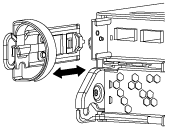

= DIMM 교체 - AFF C190
:icons: font
:imagesdir: ../media/

[role="lead"]
시스템에서 수정 가능한 오류 수정 코드(ECC)를 계속 등록할 때 컨트롤러 모듈의 DIMM을 교체해야 합니다. 그렇지 않으면 시스템 패닉이 발생합니다.

시스템의 다른 모든 구성 요소가 올바르게 작동해야 합니다. 그렇지 않은 경우 기술 지원 부서에 문의해야 합니다.

오류가 발생한 구성 요소를 공급업체로부터 받은 교체 FRU 구성 요소로 교체해야 합니다.

== 1단계: 손상된 컨트롤러를 종료합니다

손상된 컨트롤러를 종료하려면 컨트롤러 상태를 확인하고, 필요한 경우 정상적인 컨트롤러가 손상된 컨트롤러 스토리지에서 데이터를 계속 제공할 수 있도록 컨트롤러를 인수해야 합니다.

노드가 2개 이상인 클러스터가 있는 경우 쿼럼에 있어야 합니다. 클러스터가 쿼럼에 없거나 정상 컨트롤러에 자격 및 상태에 대해 FALSE가 표시되는 경우 손상된 컨트롤러를 종료하기 전에 문제를 해결해야 합니다. 을 참조하십시오 link:https://docs.netapp.com/us-en/ontap/system-admin/index.html["CLI를 사용한 관리 개요"^].

.단계
. AutoSupport가 활성화된 경우 'system node AutoSupport invoke -node * -type all-message MAINT=number_of_hours_downh' AutoSupport 메시지를 호출하여 자동 케이스 생성을 억제합니다
+
다음 AutoSupport 메시지는 두 시간 동안 자동 케이스 생성을 억제합니다: ' cluster1: * > system node AutoSupport invoke - node * -type all-message MAINT=2h'

. 정상적인 컨트롤러의 콘솔에서 'Storage failover modify – node local - auto-반환 false'를 자동으로 반환합니다
. 손상된 컨트롤러를 로더 프롬프트로 가져가십시오.
+
[cols="1,2"]
|===
| 손상된 컨트롤러가 표시되는 경우... | 그러면... 

 a| 
LOADER 메시지가 표시됩니다
 a| 
컨트롤러 모듈 제거 로 이동합니다.

 a| 
반환 대기 중...
 a| 
Ctrl-C를 누른 다음 메시지가 나타나면 y를 누릅니다.

 a| 
시스템 프롬프트 또는 암호 프롬프트(시스템 암호 입력)
 a| 
정상적인 컨트롤러 'storage failover takeover -ofnode_impaired_node_name_'에서 손상된 컨트롤러를 인수하거나 중단합니다

손상된 컨트롤러에 기브백을 기다리는 중... 이 표시되면 Ctrl-C를 누른 다음 y를 응답합니다.

|===

== 2단계: 컨트롤러 모듈을 분리합니다

컨트롤러 모듈 내부의 구성 요소에 액세스하려면 먼저 시스템에서 컨트롤러 모듈을 분리한 다음 컨트롤러 모듈의 덮개를 분리해야 합니다.

. 아직 접지되지 않은 경우 올바르게 접지하십시오.
. 케이블을 케이블 관리 장치에 연결하는 후크 및 루프 스트랩을 푼 다음, 케이블이 연결된 위치를 추적하면서 컨트롤러 모듈에서 시스템 케이블과 SFP(필요한 경우)를 분리합니다.
+
케이블 관리 장치에 케이블을 남겨 두면 케이블 관리 장치를 다시 설치할 때 케이블이 정리됩니다.

. 컨트롤러 모듈의 왼쪽과 오른쪽에서 케이블 관리 장치를 분리하여 한쪽에 둡니다.
+

. 캠 손잡이의 래치를 꽉 잡고 캠 핸들을 완전히 열어 미드플레인에서 컨트롤러 모듈을 분리한 다음 두 손으로 컨트롤러 모듈을 섀시에서 꺼냅니다.
+
image::../media/drw_2240_x_opening_cam_latch.png[drw 2240 x 캠 개방 래치]

. 컨트롤러 모듈을 뒤집어 평평하고 안정적인 곳에 놓습니다.
. 파란색 탭을 밀어 덮개를 연 다음 덮개를 위로 돌려 엽니다.
+
image::../media/drw_2600_opening_pcm_cover.png[drw 2600 열림 PCM 커버]

== 3단계: DIMM을 교체합니다

DIMM을 교체하려면 컨트롤러 모듈 내부에서 DIMM을 찾은 다음 특정 단계를 따라야 합니다.

DIMM을 교체할 경우 컨트롤러 모듈에서 NVMEM 배터리를 분리한 후 DIMM을 제거해야 합니다.

. 컨트롤러 모듈에서 NVMEM LED를 확인합니다.
+
비휘발성 메모리(NVMEM)에서 기록되지 않은 데이터가 손실되지 않도록 시스템 구성요소를 교체하기 전에 완전 시스템 종료를 수행해야 합니다. LED는 컨트롤러 모듈 뒷면에 있습니다. 다음 아이콘을 찾습니다.

+
image::../media/drw_hw_nvram_icon.png[drw HW NVRAM 아이콘]

. NVMEM LED가 깜박이지 않으면 NVMEM에 콘텐츠가 없습니다. 다음 단계를 건너뛰고 이 절차의 다음 작업을 진행할 수 있습니다.
. NVMEM LED가 깜박이면 NVMEM에 데이터가 있으며 메모리를 지우려면 배터리를 분리해야 합니다.
+
.. 배터리를 찾아 배터리 플러그 표면에 있는 클립을 눌러 플러그 소켓에서 잠금 클립을 분리한 다음 소켓에서 배터리 케이블을 분리합니다.
+
image::../media/drw_2600_nvmem_battery_unplug.png[drw 2600 nvmem 배터리 분리]

.. NVMEM LED가 더 이상 켜져 있지 않은지 확인합니다.
.. 배터리 커넥터를 다시 연결합니다.

. 로 돌아갑니다 link:dimm_replace.md#replace-the-dimms["3단계: DIMM을 교체합니다"] NVMEM LED를 다시 확인하는 절차입니다.
. 컨트롤러 모듈에서 DIMM을 찾습니다.
+

NOTE: 각 시스템 메모리 DIMM에는 각 DIMM 슬롯 옆의 보드에 있는 LED가 있습니다. 결함이 있는 LED가 2초마다 깜박입니다.

. 교체 DIMM을 올바른 방향으로 삽입할 수 있도록 소켓에서 DIMM의 방향을 기록해 두십시오.
. DIMM의 양쪽에 있는 두 개의 DIMM 이젝터 탭을 천천히 밀어 슬롯에서 DIMM을 꺼낸 다음 슬롯에서 DIMM을 밀어 꺼냅니다.
+

NOTE: DIMM 회로 보드의 구성 요소에 압력이 가해질 수 있으므로 DIMM의 가장자리를 조심스럽게 잡으십시오.

+
시스템 DIMM의 수와 위치는 시스템 모델에 따라 다릅니다.

+
다음 그림은 시스템 DIMM의 위치를 보여줍니다.

+
image::../media/drw_2600_dimm_repl_animated_gif.png[drw 2600 DIMM repl 애니메이션 gif]

. 정전기 방지 포장용 백에서 교체용 DIMM을 제거하고 DIMM을 모서리에 맞춰 슬롯에 맞춥니다.
+
DIMM의 핀 사이의 노치가 소켓의 탭과 일직선이 되어야 합니다.

. 커넥터의 DIMM 이젝터 탭이 열린 위치에 있는지 확인한 다음 DIMM을 슬롯에 똑바로 삽입합니다.
+
DIMM은 슬롯에 단단히 장착되지만 쉽게 장착할 수 있습니다. 그렇지 않은 경우 DIMM을 슬롯에 재정렬하고 다시 삽입합니다.

+

NOTE: DIMM이 균일하게 정렬되어 슬롯에 완전히 삽입되었는지 육안으로 검사합니다.

. 이젝터 탭이 DIMM 끝 부분의 노치 위에 끼워질 때까지 DIMM의 상단 가장자리를 조심스럽게 단단히 누릅니다.
. NVMEM 배터리 플러그 소켓을 찾은 다음 배터리 케이블 플러그 전면에 있는 클립을 눌러 소켓에 삽입합니다.
+
플러그가 컨트롤러 모듈에 잠겼는지 확인합니다.

. 컨트롤러 모듈 덮개를 닫습니다.

== 4단계: 컨트롤러 모듈을 재설치합니다

컨트롤러 모듈의 구성 요소를 교체한 후 섀시에 다시 설치해야 합니다.

. 아직 설치하지 않은 경우 컨트롤러 모듈의 덮개를 다시 끼우십시오.
. 컨트롤러 모듈의 끝을 섀시의 입구에 맞춘 다음 컨트롤러 모듈을 반쯤 조심스럽게 시스템에 밀어 넣습니다.
+

NOTE: 지시가 있을 때까지 컨트롤러 모듈을 섀시에 완전히 삽입하지 마십시오.

. 필요에 따라 시스템을 다시 연결합니다.
+
미디어 컨버터(QSFP 또는 SFP)를 분리한 경우 광섬유 케이블을 사용하는 경우 다시 설치해야 합니다.

. 컨트롤러 모듈 재설치를 완료합니다. 컨트롤러 모듈이 섀시에 완전히 장착되면 바로 부팅이 시작됩니다. 부트 프로세스를 중단할 준비를 하십시오.
+
.. 캠 핸들을 열린 위치에 둔 상태에서 컨트롤러 모듈이 중앙판과 완전히 맞닿고 완전히 장착될 때까지 단단히 누른 다음 캠 핸들을 잠금 위치로 닫습니다.
+

NOTE: 커넥터가 손상되지 않도록 컨트롤러 모듈을 섀시에 밀어 넣을 때 과도한 힘을 가하지 마십시오.

+
컨트롤러가 섀시에 장착되면 바로 부팅이 시작됩니다.

.. 아직 설치하지 않은 경우 케이블 관리 장치를 다시 설치하십시오.
.. 케이블을 후크와 루프 스트랩으로 케이블 관리 장치에 연결합니다.
.. Press Ctrl-C for Boot Menu 메시지가 표시되면 Ctrl-C를 눌러 부팅 프로세스를 중단합니다.
+

NOTE: 메시지가 표시되지 않고 컨트롤러 모듈이 ONTAP로 부팅되면 'halt'를 입력한 다음 로더 프롬프트에서 boot_ontap를 입력하고 메시지가 표시되면 Ctrl-C를 누른 다음 유지보수 모드로 부팅합니다.

.. 표시된 메뉴에서 유지보수 모드로 부팅하는 옵션을 선택합니다.

== 5단계: 시스템 수준 진단 프로그램을 실행합니다

새 DIMM을 설치한 후 진단 유틸리티를 실행해야 합니다.

시스템 레벨 진단을 시작하려면 시스템에 LOADER 메시지가 표시되어야 합니다.

진단 절차의 모든 명령은 구성 요소를 교체하는 컨트롤러에서 실행됩니다.

. 수리할 컨트롤러가 로더 프롬프트에 있지 않은 경우 다음 단계를 수행하십시오.
+
.. 표시된 메뉴에서 유지보수 모드 옵션을 선택합니다.
.. 컨트롤러가 유지보수 모드로 부팅된 후 컨트롤러를 정지시킵니다
+
명령을 실행한 후 시스템이 로더 프롬프트에서 중지될 때까지 기다려야 합니다.

+

NOTE: 부팅 프로세스 중에 프롬프트에 "y"로 안전하게 응답할 수 있습니다.

+
*** HA 구성에서 유지보수 모드로 전환할 때 정상 상태의 컨트롤러가 계속 중지되었는지 확인해야 한다는 프롬프트 경고 메시지가 표시됩니다.

. LOADER 프롬프트에서 시스템 수준 진단이 제대로 작동하도록 특별히 설계된 특수 드라이버('BOOT_DIAGS')에 액세스합니다
+
부팅 프로세스 중에 유지보수 모드 프롬프트(*>)가 나타날 때까지 프롬프트에 "y"로 안전하게 응답할 수 있습니다.

. 시스템 메모리에 대해 'ldiag device run-dev mpem'이라는 진단 유틸리티를 실행합니다
. DIMM의 교체로 인한 하드웨어 문제가 없는지 확인합니다. 'ldiag device status - dev mpm -long-state failed'
+
시스템 수준 진단은 테스트 실패가 없을 경우 프롬프트로 돌아가거나 구성 요소 테스트로 인한 전체 실패 상태를 표시합니다.

. 이전 단계의 결과에 따라 계속 진행합니다.
+
[cols="1,2"]
|===
| 시스템 수준 진단이 테스트되는 경우... | 그러면... 

 a| 
실패없이 완료되었습니다
 a| 
.. 상태 로그 'ldiag device clearstatus'를 지웁니다
.. 'ldiag device status'라는 로그가 지워졌는지 확인한다
+
다음과 같은 기본 응답이 표시됩니다.

+
SLDIAG: 로그 메시지가 없습니다.

.. 유지보수 모드를 종료합니다
+
컨트롤러에 LOADER 프롬프트가 표시됩니다.

.. LOADER 프롬프트에서 컨트롤러를 부팅합니다. bye
.. 컨트롤러를 정상 작동 상태로 되돌립니다.

|===

|===

| 컨트롤러가 다음 상태인 경우: | 그러면... 

 a| 
HA 쌍
 a| 
'storage failover back -ofnode_replacement_node_name_' * 참고: * 자동 반환을 해제한 경우 스토리지 페일오버 수정 명령을 사용하여 다시 설정하십시오.

 a| 
독립형 구성
 a| 
다음 단계를 진행합니다. 별도의 조치가 필요하지 않습니다.

+시스템 수준 진단을 완료했습니다.

 a| 
테스트 실패가 발생했습니다
 a| 
문제의 원인을 확인합니다.

. 유지보수 모드를 종료합니다
+
명령을 실행한 후 LOADER 프롬프트에서 시스템이 중지될 때까지 기다립니다.

. 섀시에 있는 컨트롤러 모듈 수에 따라 전원 공급 장치를 끄거나 켜 둡니다.
+
** 섀시에 두 개의 컨트롤러 모듈이 있는 경우 다른 컨트롤러 모듈에 전원을 공급하려면 전원 공급 장치를 켜 두십시오.
** 섀시에 하나의 컨트롤러 모듈이 있는 경우 전원 공급 장치를 끄고 전원에서 분리합니다.

. 시스템 수준 진단 프로그램 실행 시 확인된 모든 고려 사항, 케이블이 안전하게 연결되어 있는지, 하드웨어 구성 요소가 스토리지 시스템에 올바르게 설치되어 있는지 확인합니다.
. 부팅 메뉴에 대한 메시지가 표시되면 'Ctrl-C'를 눌러 현재 사용 중인 컨트롤러 모듈을 부팅하고 부팅을 중단하십시오.
+
** 섀시에 2개의 컨트롤러 모듈이 있는 경우, 서비스 중인 컨트롤러 모듈을 섀시에 완전히 장착합니다.
+
컨트롤러 모듈이 완전히 장착되면 부팅됩니다.

** 섀시에 하나의 컨트롤러 모듈이 있는 경우 전원 공급 장치를 연결한 다음 전원을 켭니다.

. 메뉴에서 Boot to maintenance mode(유지 관리 모드로 부팅) 를 선택합니다.
. 'halt' 명령어를 입력하여 Maintenance Mode를 종료한다
+
명령을 실행한 후 LOADER 프롬프트에서 시스템이 중지될 때까지 기다립니다.

. 시스템 레벨 진단 테스트를 다시 실행하십시오.

|===

== 6단계: 장애가 발생한 부품을 NetApp에 반환

부품을 교체한 후 키트와 함께 제공된 RMA 지침에 따라 오류가 발생한 부품을 NetApp에 반환할 수 있습니다. 기술 지원 부서(에 문의하십시오 https://mysupport.netapp.com/site/global/dashboard["NetApp 지원"], 888-463-8277 (북미), 00-800-44-638277 (유럽) 또는 +800-800-80-800 (아시아/태평양) 교체 절차에 대한 추가 지원이 필요한 경우.
