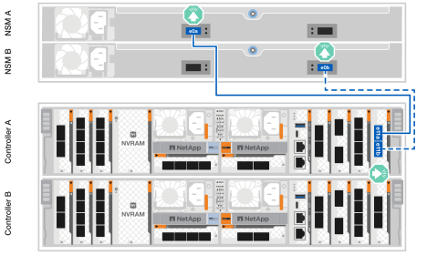

= 하드웨어 케이블 연결 - AFF C80
:allow-uri-read: 
:icons: font
:imagesdir: ../media/

[role="lead"]
AFF C80 스토리지 시스템용 랙 하드웨어를 설치한 후 컨트롤러의 네트워크 케이블을 설치하고 컨트롤러와 스토리지 쉘프 간에 케이블을 연결합니다.

.시작하기 전에
스토리지 시스템을 스위치에 연결하는 방법에 대한 자세한 내용은 네트워크 관리자에게 문의하십시오.

.이 작업에 대해
* 다음 절차는 일반적인 구성을 보여 줍니다. 특정 케이블 연결은 스토리지 시스템용으로 주문한 구성 요소에 따라 다릅니다. 포괄적인 구성 및 슬롯 우선 순위에 대한 자세한 내용은 을 link:https://hwu.netapp.com["NetApp Hardware Universe를 참조하십시오"^]참조하십시오.
* AFF C80 컨트롤러의 I/O 슬롯에는 1부터 11까지의 번호가 지정됩니다.
+
image::../media/drw_a1K_back_slots_labeled_ieops-2162.svg[AFF C80 컨트롤러의 슬롯 번호]

* 케이블 연결 그래픽에는 포트에 커넥터를 삽입할 때 케이블 커넥터 당김 탭의 올바른 방향(위 또는 아래)을 나타내는 화살표 아이콘이 있습니다.
+
커넥터를 삽입할 때 딸깍 소리가 들려야 합니다. 딸깍 소리가 안 되면 커넥터를 제거하고 뒤집은 다음 다시 시도하십시오.

+
image::../media/drw_cable_pull_tab_direction_ieops-1699.svg[케이블 당김 탭 방향의 예]

* 광 스위치에 케이블로 연결하는 경우 광 트랜시버를 컨트롤러 포트에 삽입한 후 스위치 포트에 연결합니다.

== 1단계: 클러스터/HA 연결 케이블 연결

컨트롤러를 ONTAP 클러스터에 케이블로 연결합니다. 이 절차는 스토리지 시스템 모델 및 입출력 모듈 구성에 따라 다릅니다.

NOTE: 클러스터 인터커넥트 트래픽과 HA 트래픽은 동일한 물리적 포트를 공유합니다.

[role="tabbed-block"]
====
.스위치가 없는 클러스터 케이블 연결
--
클러스터/HA 인터커넥트 케이블을 사용하여 포트 E1A에 E1A를 연결하고 포트 e7a에 e7a를 연결합니다.

.단계
. 컨트롤러 A의 포트 E1A를 컨트롤러 B의 포트 E1A에 연결합니다
. 컨트롤러 A의 포트 e7a를 컨트롤러 B의 포트 e7a에 연결합니다
+
* 클러스터/HA 인터커넥트 케이블 *

+
image::../media/oie_cable_25Gb_Ethernet_SFP28_IEOPS-1069.svg[클러스터 HA 케이블]

+
image::../media/drw_70-90_tnsc_cluster_cabling_ieops-1653.svg[스위치가 없는 2노드 클러스터 케이블 연결 다이어그램]

--
.스위치 클러스터 케이블링
--
100 GbE 케이블을 사용하여 포트 E1A를 E1A에 연결하고 포트 e7a를 e7a에 연결합니다.

.단계
. 컨트롤러 A의 포트 E1A와 컨트롤러 B의 포트 E1A를 클러스터 네트워크 스위치 A에 연결합니다
. 컨트롤러 A의 포트 e7a와 컨트롤러 B의 포트 e7a를 클러스터 네트워크 스위치 B에 연결합니다
+
* 100 GbE 케이블 *

+
image::../media/oie_cable100_gbe_qsfp28.png[100Gb 케이블]

+
image::../media/drw_70-90_switched_cluster_cabling_ieops-1657.svg[클러스터 연결을 클러스터 네트워크에 케이블 연결합니다]

--
====

== 2단계: 호스트 네트워크 연결 케이블 연결

이더넷 모듈 포트를 호스트 네트워크에 연결합니다.

다음은 몇 가지 일반적인 호스트 네트워크 케이블 연결의 예입니다. 특정 시스템 구성은 를 link:https://hwu.netapp.com["NetApp Hardware Universe를 참조하십시오"^] 참조하십시오.

.단계
. 이더넷 데이터 네트워크 스위치에 e9a 및 e9b 포트를 연결합니다.
+

NOTE: 클러스터 및 HA 트래픽에 시스템 성능을 극대화하려면 호스트 네트워크 연결에 포트 e1b 및 e7b 포트를 사용하지 마십시오. 성능을 최대화하려면 별도의 호스트 카드를 사용하십시오.

+
* 100 GbE 케이블 *

+
image::../media/oie_cable_sfp_gbe_copper.png[100Gb 이더넷 케이블]

+
image::../media/drw_70-90_network_cabling1_ieops-1654.svg[100Gb 이더넷 네트워크에 케이블 연결]

. 10/25 GbE 호스트 네트워크 스위치를 연결합니다.
+
* 4포트, 10/25 GbE 호스트 *

+
image::../media/oie_cable_sfp_gbe_copper.png[10/25GB 이더넷 케이블]

+
image::../media/drw_70-90_network_cabling2_ieops-1655.svg[10/25GB 이더넷 네트워크에 케이블 연결]

== 3단계: 관리 네트워크 연결 케이블 연결

1000BASE-T RJ-45 케이블을 사용하여 각 컨트롤러의 관리(렌치) 포트를 관리 네트워크 스위치에 연결합니다.

image::../media/oie_cable_rj45.png[RJ-45 케이블]

* 1000BASE-T RJ-45 케이블 *

image::../media/drw_70-90_management_connection_ieops-1656.svg[관리 네트워크에 연결합니다]

IMPORTANT: 아직 전원 코드를 연결하지 마십시오.

== 4단계: 선반 연결 케이블 연결

다음 케이블 연결 절차는 컨트롤러를 스토리지 쉘프에 연결하는 방법을 보여줍니다. 설정에 맞는 다음 케이블 연결 옵션 중 하나를 선택합니다.

스토리지 시스템에서 지원되는 최대 쉘프 수와 모든 케이블 옵션에 대한 내용은 을 참조하십시오.link:https://hwu.netapp.com["NetApp Hardware Universe를 참조하십시오"^]

[role="tabbed-block"]
====
.옵션 1: NS224 스토리지 쉘프 1개
--
각 컨트롤러를 NS224 쉘프의 NSM 모듈에 연결합니다. 그래픽은 컨트롤러 A 케이블을 파란색으로, 컨트롤러 B 케이블은 노란색으로 표시합니다.

* 100 GbE QSFP28 구리 케이블 *

image::../media/oie_cable100_gbe_qsfp28.png[100 GbE QSFP28 구리 케이블]

.단계
. 컨트롤러 A 포트 e11a를 NSM A 포트 e0a에 연결합니다.
. 컨트롤러 A 포트 e11b를 포트 NSM B 포트 e0b에 연결합니다.
+

. 컨트롤러 B 포트 e11a를 NSM B 포트 e0a에 연결합니다.
. 컨트롤러 B 포트 e11b를 NSM A 포트 e0b에 연결합니다.
+
image:../media/drw_a70-90_1shelf_cabling_b_ieops-1732.svg["컨트롤러 B e11a 및 e11b - 단일 NS224 쉘프"]

--
.옵션 2: NS224 스토리지 쉘프 2개
--
각 컨트롤러를 두 NS224 쉘프의 NSM 모듈에 연결합니다. 그래픽은 컨트롤러 A 케이블을 파란색으로, 컨트롤러 B 케이블은 노란색으로 표시합니다.

* 100 GbE QSFP28 구리 케이블 *

image::../media/oie_cable100_gbe_qsfp28.png[100 GbE QSFP28 구리 케이블]

.단계
. 컨트롤러 A에서 다음 포트를 연결합니다.
+
.. 포트 e11a를 쉘프 1, NSM A 포트 e0a에 연결합니다.
.. 포트 e11b를 쉘프 2,NSM B 포트 e0b에 연결합니다.
.. 포트 e8a를 쉘프 2, NSM A 포트 e0a에 연결합니다.
.. 포트 e8b를 쉘프 1,NSM B 포트 e0b에 연결합니다.
+
image:../media/drw_a70-90_2shelf_cabling_a_ieops-1733.svg["컨트롤러 A의 컨트롤러-쉘프 연결"]

. 컨트롤러 B에서 다음 포트를 연결합니다.
+
.. 포트 e11a를 쉘프 1, NSM B 포트 e0a에 연결합니다.
.. 포트 e11b를 쉘프 2,NSM A 포트 e0b에 연결합니다.
.. 포트 e8a를 쉘프 2, NSM B 포트 e0a에 연결합니다.
.. 포트 e8b를 쉘프 1,NSM A 포트 e0b에 연결합니다.
+
image:../media/drw_a70-90_2shelf_cabling_b_ieops-1734.svg["컨트롤러 B의 컨트롤러-쉘프 연결"]

--
====
.다음 단계
AFF C80 시스템용 하드웨어를 케이블로 연결한 후link:install-power-hardware.html["AFF C80 스토리지 시스템의 전원을 켭니다"],
