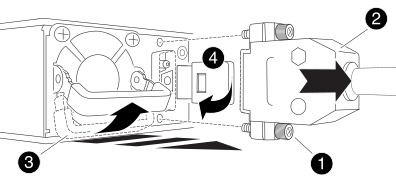

= 전원 공급 장치 교체 - AFF C800
:allow-uri-read: 
:icons: font
:imagesdir: ../media/

[role="lead"]
전원 공급 장치(PSU) 교체에는 대상 PSU를 전원에서 분리하고, 전원 케이블을 뽑고, 기존 PSU를 분리하고, 교체용 PSU를 설치한 다음 다시 전원에 연결하는 작업이 포함됩니다.

전원 공급 장치는 이중화되고 핫 스왑이 가능합니다.

.이 작업에 대해
이 절차는 한 번에 하나의 PSU를 교체하는 데 사용됩니다.

NOTE: PSU를 섀시에서 분리한 후 2분 이내에 교체하는 것이 좋습니다. 시스템이 계속 작동하지만 ONTAP는 PSU를 교체할 때까지 성능이 저하된 PSU에 대한 메시지를 콘솔에 보냅니다.

IMPORTANT: 다른 효율 등급 또는 다른 입력 유형의 PSU를 혼용하지 마십시오. 항상 Like를 사용합니다.

사용 중인 PSU 유형(AC 또는 DC)에 맞는 절차를 사용하십시오.

[role="tabbed-block"]
====
.옵션 1: AC PSU 교체
--
AC PSU를 교체하려면 다음 단계를 수행하십시오.

. 아직 접지되지 않은 경우 올바르게 접지하십시오.
. 콘솔 오류 메시지 또는 PSU의 빨간색 오류 LED를 통해 교체할 PSU를 식별합니다.
. PSU를 분리합니다.
+
.. 전원 케이블 고정 장치를 연 다음 PSU에서 전원 케이블을 뽑습니다.
.. 전원에서 전원 케이블을 뽑습니다.

. 손잡이를 위로 돌리고 잠금 탭을 누른 다음 PSU를 컨트롤러 모듈에서 당겨 꺼냅니다.
+

CAUTION: PSU가 짧습니다. 컨트롤러 모듈에서 분리할 때 컨트롤 모듈이 갑자기 흔들리지 않고 다치지 않도록 항상 두 손을 사용하여 지지하십시오.

+
image::../media/drw_a800_replace_psu.svg[PSU를 제거하거나 다시 설치합니다]

+
[cols="1,3"]
|===

 a| 
image:../media/icon_round_1.png["설명선 번호 1"]
 a| 
파란색 PSU 잠금 탭

 a| 
image:../media/icon_round_2.png["설명선 번호 2"]
 a| 
전원 공급 장치

|===
. 컨트롤러 모듈에 교체용 PSU를 설치합니다.
+
.. 양손을 사용하여 교체용 PSU의 가장자리를 컨트롤러 모듈의 입구에 맞춘 후 지지하십시오.
.. 잠금 탭이 딸깍 소리를 내며 제자리에 고정될 때까지 PSU를 컨트롤러 모듈에 조심스럽게 밀어 넣습니다.
+
전원 공급 장치는 내부 커넥터에만 제대로 연결되어 한 방향으로만 제자리에 고정됩니다.

+

NOTE: 내부 커넥터의 손상을 방지하려면 PSU를 시스템에 밀어 넣을 때 과도한 힘을 가하지 마십시오.

. PSU 케이블을 다시 연결합니다.
+
.. 전원 케이블을 PSU 및 전원에 다시 연결합니다.
.. 전원 케이블 고정 장치를 사용하여 전원 케이블을 PSU에 고정합니다.

+
PSU에 전원이 다시 공급되면 상태 LED가 녹색이어야 합니다.

. 키트와 함께 제공된 RMA 지침에 설명된 대로 오류가 발생한 부품을 NetApp에 반환합니다.  https://mysupport.netapp.com/site/info/rma["부품 반환 및 교체"^]자세한 내용은 페이지를 참조하십시오.

--
.옵션 2: DC PSU 교체
--
DC PSU를 교체하려면 다음 단계를 수행하십시오.

. 아직 접지되지 않은 경우 올바르게 접지하십시오.
. 콘솔 오류 메시지 또는 PSU의 빨간색 오류 LED를 통해 교체할 PSU를 식별합니다.
. PSU를 분리합니다.
+
.. 플러그에 있는 나비 나사를 사용하여 D-sub DC 케이블 커넥터를 풉니다.
.. PSU에서 케이블을 분리하여 따로 보관합니다.

. 손잡이를 위로 돌리고 잠금 탭을 누른 다음 PSU를 컨트롤러 모듈에서 당겨 꺼냅니다.
+

CAUTION: PSU가 짧습니다. 컨트롤러 모듈에서 분리할 때 컨트롤 모듈이 갑자기 흔들리지 않고 다치지 않도록 항상 두 손을 사용하여 지지하십시오.

+

+
[cols="1,3"]
|===

 a| 
image:../media/icon_round_1.png["설명선 번호 1"]
 a| 
나비 나사

 a| 
image:../media/icon_round_2.png["설명선 번호 2"]
 a| 
D-sub DC 전원 PSU 케이블 커넥터

 a| 
image:../media/icon_round_3.png["설명선 번호 3"]
 a| 
전원 공급 장치 핸들

 a| 
image:../media/icon_round_4.png["설명선 번호 4"]
 a| 
파란색 PSU 잠금 탭

|===
. 컨트롤러 모듈에 교체용 PSU를 설치합니다.
+
.. 양손을 사용하여 교체용 PSU의 가장자리를 컨트롤러 모듈의 입구에 맞춘 후 지지하십시오.
.. 잠금 탭이 딸깍 소리를 내며 제자리에 고정될 때까지 PSU를 컨트롤러 모듈에 조심스럽게 밀어 넣습니다.
+
전원 공급 장치는 내부 커넥터에만 제대로 연결되어 한 방향으로만 제자리에 고정됩니다.

+

NOTE: 내부 커넥터의 손상을 방지하려면 PSU를 시스템에 밀어 넣을 때 과도한 힘을 가하지 마십시오.

. D-sub DC 전원 케이블을 다시 연결합니다.
+
.. 전원 케이블 커넥터를 PSU에 꽂습니다.
.. 손잡이 나사를 사용하여 전원 케이블을 PSU에 고정합니다.
+
PSU에 전원이 다시 공급되면 상태 LED가 녹색이어야 합니다.

. 키트와 함께 제공된 RMA 지침에 설명된 대로 오류가 발생한 부품을 NetApp에 반환합니다.  https://mysupport.netapp.com/site/info/rma["부품 반환 및 교체"^]자세한 내용은 페이지를 참조하십시오.

--
====