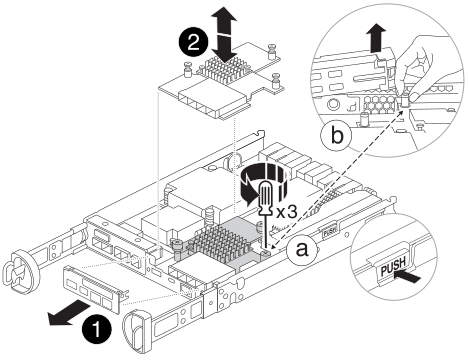

= 컨트롤러 모듈 하드웨어-FAS2800을 교체합니다
:allow-uri-read: 
:icons: font
:imagesdir: ../media/

[role="lead"]
손상된 컨트롤러를 제거하고, FRU 구성 요소를 교체 컨트롤러 모듈로 이동하고, 교체 컨트롤러 모듈을 섀시에 설치한 다음, 교체 컨트롤러 모듈을 부팅하여 손상된 컨트롤러 모듈 하드웨어를 교체합니다.

.애니메이션 - 컨트롤러 모듈을 교체합니다
video::c83a3301-3161-4d65-86e8-af540147576a[panopto]

== 1단계: 컨트롤러 모듈을 분리합니다

손상된 컨트롤러 모듈을 섀시에서 분리합니다.

. 아직 접지되지 않은 경우 올바르게 접지하십시오.
. 케이블을 케이블 관리 장치에 연결하는 후크 및 루프 스트랩을 푼 다음, 케이블이 연결된 위치를 추적하면서 컨트롤러 모듈에서 시스템 케이블과 SFP(필요한 경우)를 분리합니다.
+
케이블 관리 장치에 케이블을 남겨 두면 케이블 관리 장치를 다시 설치할 때 케이블이 정리됩니다.

. 컨트롤러 모듈의 왼쪽과 오른쪽에서 케이블 관리 장치를 분리하여 한쪽에 둡니다.
. 케이블을 분리한 후 SFP 모듈을 시스템에 남겨 둔 경우 교체용 컨트롤러 모듈로 이동합니다.
. 캠 손잡이의 래치를 꽉 잡고 캠 핸들을 완전히 열어 미드플레인에서 컨트롤러 모듈을 분리한 다음 두 손으로 컨트롤러 모듈을 섀시에서 꺼냅니다.
+
image::../media/drw_2240_x_opening_cam_latch.svg[drw 2240 x 캠 개방 래치]

. 컨트롤러 모듈을 뒤집어 평평하고 안정적인 곳에 놓습니다.
. 컨트롤러 모듈 측면에 있는 파란색 단추를 눌러 덮개를 연 다음 덮개를 컨트롤러 모듈에서 위로 돌려 분리합니다.
+
image::../media/drw_2850_open_controller_module_cover_IEOPS-695.svg[2850 drw 열린 컨트롤러 모듈 덮개 IEOPS 695]

[cols="1,3"]
|===

 a| 
image::../media/legend_icon_01.svg[범례 아이콘 01]
 a| 
컨트롤러 모듈 덮개 분리 단추

|===

== 2단계: NVMEM 배터리를 이동합니다

손상된 컨트롤러 모듈에서 NVMEM 배터리를 제거하고 교체 컨트롤러 모듈에 설치합니다.

NOTE: 지시가 있을 때까지 NVMEM 배터리를 연결하지 마십시오.

image::../media/drw_2850_replace_nvbattery_IEOPS-715.svg[2850 drw 는 nvbattery IEOPS 715를 대체합니다]

[cols="1,3"]
|===

 a| 
image::../media/legend_icon_01.svg[범례 아이콘 01]
 a| 
NVMEM 배터리 릴리즈 버튼

 a| 
image::../media/legend_icon_02.svg[범례 아이콘 02]
 a| 
NVMEM 배터리 플러그

|===
. 컨트롤러 모듈에서 배터리를 분리합니다.
+
.. 컨트롤러 모듈 측면에 있는 파란색 버튼을 누릅니다.
.. 고정 브래킷에서 배터리가 분리될 때까지 배터리를 밀어 올린 다음 컨트롤러 모듈에서 배터리를 들어올립니다.
.. 배터리 플러그 표면에 있는 클립을 눌러 소켓에서 플러그를 분리한 다음 소켓에서 배터리 케이블을 분리합니다.

. 배터리를 교체 컨트롤러 모듈로 옮기고 설치합니다.
+
.. 판금 측면의 고정 브래킷에 배터리를 맞춥니다.
.. 전지 래치가 맞물려 측면 벽의 구멍에 끼워질 때까지 전지 팩을 아래로 밉니다.
+

NOTE: 배터리를 아직 연결하지 마십시오.  나머지 구성 요소를 교체 컨트롤러 모듈로 이동하면 플러그를 꽂을 수 있습니다.

== 3단계: 메자닌 카드를 분리합니다

손상된 컨트롤러 모듈에서 메자닌 베젤과 PCIe 메자닌 카드를 분리합니다.

[cols="1,3"]
|===

 a| 
image::../media/legend_icon_01.svg[범례 아이콘 01]
 a| 
라이저 베젤

 a| 
image::../media/legend_icon_02.svg[범례 아이콘 02]
 a| 
PCIe 메자닌 카드

|===
. 메자닌 카드 베젤을 컨트롤러 모듈에서 똑바로 밀어 분리합니다.
. 메자닌 카드의 손잡이 나사를 풉니다.
+

NOTE: 손가락이나 드라이버로 나비나사를 풀 수 있습니다.

. 메자닌 카드를 똑바로 들어 올려 정전기 방지 표면에 놓습니다.

== 4단계: 부팅 미디어를 이동합니다

손상된 컨트롤러 모듈에서 부팅 미디어를 분리하여 교체 컨트롤러 모듈에 설치합니다.

. 메자닌 카드를 분리한 후 다음 그림 또는 컨트롤러 모듈의 FRU 맵을 사용하여 부팅 미디어를 찾습니다.
+
image::../media/drw_2850_replace_boot_media_IEOPS-696.svg[2850 drw 는 부팅 미디어 IEOPS 696을 교체합니다]

+
[cols="1,3"]
|===

 a| 
image::../media/legend_icon_01.svg[범례 아이콘 01]
 a| 
부트 미디어 해제 버튼

|===
. 다음과 같이 부팅 미디어를 제거합니다.
+
.. 부트 미디어 하우징의 파란색 버튼을 눌러 하우징에서 부트 미디어를 분리합니다.
.. 부팅 미디어를 위로 돌린 다음 부팅 미디어 소켓에서 조심스럽게 똑바로 꺼냅니다.
+

NOTE: 부트 미디어가 소켓 또는 부트 미디어를 손상시킬 수 있으므로 비틀거나 위로 잡아 당기지 마십시오.

. 교체 컨트롤러 모듈에 부팅 미디어를 설치합니다.
+
.. 교체 부팅 미디어의 가장자리를 부팅 미디어 소켓에 맞춘 다음 소켓에 부드럽게 밀어 넣습니다.
.. 부팅 미디어가 소켓에 똑바로 완전히 장착되었는지 확인합니다.
+
필요한 경우 부팅 미디어를 분리하고 소켓에 재장착합니다.

.. 부트 미디어 하우징의 파란색 잠금 버튼을 누르고 부트 미디어를 아래쪽으로 돌린 다음 잠금 버튼을 놓아 부트 미디어를 제자리에 고정합니다.

== 5단계: 교체용 컨트롤러에 메자닌 카드를 설치합니다

교체용 컨트롤러 모듈에 메자닌 카드를 설치합니다.

. 메자닌 카드를 재설치합니다.
+
.. 메자닌 카드를 마더보드의 소켓에 맞춥니다.
.. 카드를 조심스럽게 눌러 소켓에 장착합니다.
.. 메자닌 카드에 있는 3개의 손잡이 나사를 조입니다.

. 메자닌 카드 베젤을 재설치합니다.

== 6단계: DIMM을 이동합니다

손상된 컨트롤러 모듈에서 DIMM을 분리하여 교체 컨트롤러 모듈에 설치합니다.

image::../media/drw_2850_replace_dimms_IEOPS-699.svg[2850 drw DIMMs IEOPS 699 교체]

[cols="1,3"]
|===

 a| 
image::../media/legend_icon_01.svg[범례 아이콘 01]
 a| 
DIMM 잠금 래치

 a| 
image::../media/legend_icon_02.svg[범례 아이콘 02]
 a| 
DIMM

|===
. 컨트롤러 모듈에서 DIMM을 찾습니다
+

NOTE: DIMM을 교체 컨트롤러 모듈의 동일한 위치에 올바른 방향으로 삽입할 수 있도록 DIMM의 위치를 소켓에 기록해 두십시오.

. 장애가 있는 컨트롤러 모듈에서 DIMM을 분리합니다.
+
.. DIMM 양쪽에 있는 두 개의 DIMM 이젝터 탭을 천천히 밀어서 슬롯에서 DIMM을 꺼냅니다.
+
DIMM이 약간 위로 회전합니다.

.. DIMM을 끝까지 돌린 다음 소켓에서 DIMM을 꺼냅니다.
+

NOTE: DIMM 회로 보드의 구성 요소에 압력이 가해질 수 있으므로 DIMM의 가장자리를 조심스럽게 잡으십시오.

. NVMEM 배터리가 교체 컨트롤러 모듈에 연결되어 있지 않은지 확인합니다.
. 장애가 발생한 컨트롤러에 있던 것과 동일한 위치에 DIMM을 교체 컨트롤러에 설치합니다.
+
.. 이젝터 탭이 DIMM 끝 부분의 노치 위에 끼워질 때까지 DIMM의 상단 가장자리를 조심스럽게 단단히 누릅니다.
+
DIMM은 슬롯에 단단히 장착되지만 쉽게 장착할 수 있습니다. 그렇지 않은 경우 DIMM을 슬롯에 재정렬하고 다시 삽입합니다.

+

NOTE: DIMM이 균일하게 정렬되어 슬롯에 완전히 삽입되었는지 육안으로 검사합니다.

. 다른 DIMM에 대해서도 이 단계를 반복합니다.

== 7단계: 캐싱 모듈을 이동합니다

손상된 컨트롤러 모듈에서 캐싱 모듈을 제거하여 교체 컨트롤러 모듈에 설치합니다.

image::../media/drw_2850_replace_caching module_IEOPS-697.svg[2850 drw 캐시 모듈 IEOPS 697 교체]

[cols="1,3"]
|===

 a| 
image::../media/legend_icon_01.svg[범례 아이콘 01]
 a| 
캐시 모듈 잠금 버튼

|===
. 컨트롤러 모듈 후면 근처에 있는 캐싱 모듈을 찾아서 분리합니다.
+
.. 파란색 잠금 버튼을 누르고 캐싱 모듈을 위로 돌립니다.
.. 캐싱 모듈을 하우징에서 똑바로 천천히 당겨 빼냅니다.

. 교체용 컨트롤러 모듈에 캐시 모듈을 설치합니다.
+
.. 캐싱 모듈의 가장자리를 하우징의 소켓에 맞춘 다음 소켓에 부드럽게 밀어 넣습니다.
.. 캐싱 모듈이 소켓에 직각으로 완전히 장착되었는지 확인합니다.
+
필요한 경우 캐시 모듈을 분리하고 소켓에 재장착합니다.

.. 파란색 잠금 버튼을 누르고 캐싱 모듈을 완전히 아래로 돌린 다음 잠금 버튼을 놓아 캐싱 모듈을 제자리에 잠급니다.

. NVMEM 배터리를 연결합니다.
+
플러그가 마더보드의 배터리 전원 소켓에 제대로 꽂혀 있는지 확인합니다.

+

NOTE: 배터리를 꽂기가 어려운 경우 컨트롤러 모듈에서 배터리를 분리하고 플러그를 꽂은 다음 컨트롤러 모듈에 배터리를 다시 설치합니다.

. 컨트롤러 모듈 덮개를 다시 설치합니다.

== 8단계: NV 배터리를 설치합니다

교체용 컨트롤러 모듈에 NV 배터리를 설치합니다.

. 배터리 플러그를 컨트롤러 모듈의 소켓에 다시 꽂습니다.
+
플러그가 마더보드의 배터리 소켓에 제대로 잠겼는지 확인합니다.

. 판금 측면의 고정 브래킷에 배터리를 맞춥니다.
. 전지 래치가 맞물려 측면 벽의 구멍에 끼워질 때까지 전지 팩을 아래로 밉니다.
. 컨트롤러 모듈 덮개를 다시 설치하고 제자리에 고정합니다.

== 9단계: 컨트롤러를 설치합니다

교체 컨트롤러 모듈을 시스템 섀시에 설치하고 ONTAP를 부팅합니다.

NOTE: 시스템이 부팅될 때 시스템 펌웨어를 업데이트할 수 있습니다. 이 프로세스를 중단하지 마십시오. 이 절차를 수행하려면 부팅 프로세스를 중단해야 합니다. 이 과정은 일반적으로 부팅 프로세스를 중단하라는 메시지가 표시된 후 언제든지 수행할 수 있습니다. 그러나 시스템이 부팅될 때 시스템 펌웨어를 업데이트하는 경우 업데이트가 완료될 때까지 기다린 후 부팅 프로세스를 중단해야 합니다.

. 아직 접지되지 않은 경우 올바르게 접지하십시오.
. 아직 설치하지 않은 경우 컨트롤러 모듈의 덮개를 다시 끼우십시오.
. 컨트롤러 모듈을 돌립니다.
. 컨트롤러 모듈의 끝을 섀시의 입구에 맞춘 다음 컨트롤러 모듈을 반쯤 조심스럽게 시스템에 밀어 넣습니다.
+

NOTE: 지시가 있을 때까지 컨트롤러 모듈을 섀시에 완전히 삽입하지 마십시오.

. 컨트롤러 모듈 재설치를 완료합니다.
+
.. 캠 핸들을 열린 위치에 둔 상태에서 컨트롤러 모듈이 중앙판과 완전히 맞닿고 완전히 장착될 때까지 단단히 누른 다음 캠 핸들을 잠금 위치로 닫습니다.
+

NOTE: 커넥터가 손상되지 않도록 컨트롤러 모듈을 섀시에 밀어 넣을 때 과도한 힘을 가하지 마십시오.

+
컨트롤러가 섀시에 장착되면 바로 부팅이 시작됩니다.

.. 아직 설치하지 않은 경우 케이블 관리 장치를 다시 설치하십시오.
.. 케이블을 후크와 루프 스트랩으로 케이블 관리 장치에 연결합니다.
+

NOTE: 자동 펌웨어 업데이트 콘솔 메시지를 찾아야 합니다. 업데이트 메시지가 나타나면 를 누르지 마십시오 `Ctrl-C` 업데이트가 완료되었음을 확인하는 메시지가 나타날 때까지 부팅 프로세스를 중단합니다. 펌웨어 업데이트가 중단되면 부팅 프로세스가 로더 프롬프트로 종료됩니다. 를 실행해야 합니다 `update_flash` 명령을 입력한 다음 를 입력합니다 `bye -g` 를 눌러 시스템을 재부팅합니다.

* 중요: * 부팅 프로세스 중에 다음과 같은 메시지가 표시될 수 있습니다.

* 시스템 ID 불일치 및 시스템 ID 재정의를 요청하는 프롬프트 경고. 응답 `y` 를 눌러 이 프롬프트로 이동합니다.
* HA 구성에서 유지보수 모드로 전환할 때 정상적인 컨트롤러가 계속 작동 중지되는지 확인해야 한다는 프롬프트 경고 메시지가 표시됩니다. 응답 `y` 를 눌러 이 프롬프트로 이동합니다.

