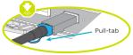
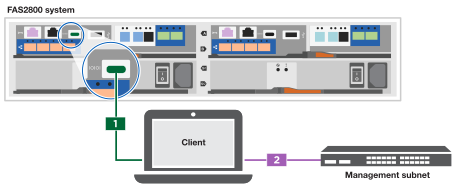

= 세부 단계 - FAS2800
:allow-uri-read: 
:icons: font
:imagesdir: ../media/

[role="lead"]
이 가이드에서는 일반적인 NetApp 시스템 설치를 위한 단계별 지침을 제공합니다. 자세한 설치 지침을 보려면 이 가이드를 사용하십시오.

== 1단계: 설치 준비

FAS2800 시스템을 설치하려면 NetApp Support 사이트에 계정을 만들고, 시스템을 등록하고, 라이센스 키를 받아야 합니다. 또한 시스템에 맞는 케이블 수와 유형을 확인하고 특정 네트워크 정보를 수집해야 합니다.

에 대한 액세스 권한이 있어야 합니다 https://hwu.netapp.com["NetApp Hardware Universe를 참조하십시오"] 사이트 요구 사항 및 구성된 시스템에 대한 추가 정보를 확인하십시오. 에 대한 액세스 권한을 가질 수도 있습니다 http://mysupport.netapp.com/documentation/productlibrary/index.html?productID=62286["사용 중인 ONTAP 9 버전에 대한 릴리즈 노트"] 해당 버전의 ONTAP에서 이 시스템에 대한 자세한 내용을 확인하십시오.

사이트에서 다음을 제공해야 합니다.

* 스토리지 시스템의 랙 공간입니다
* Phillips #2 드라이버
* 웹 브라우저를 사용하여 시스템을 네트워크 스위치 및 랩톱 또는 콘솔에 연결하는 추가 네트워킹 케이블
* RJ-45 연결 및 웹 브라우저에 대한 액세스 권한이 있는 랩톱 또는 콘솔

.단계
. 모든 상자의 내용물을 풉니다.
. 컨트롤러에서 시스템 일련 번호를 기록합니다.
+
image::../media/drw_ssn_label.svg[drw SSN 레이블]

. 계정 설정:
+
.. 기존 계정에 로그인하거나 계정을 만듭니다.
.. 를 통해 시스템을 등록합니다  https://mysupport.netapp.com/eservice/registerSNoAction.do?moduleName=RegisterMyProduct["NetApp 제품 등록"]

. 다운로드 및 설치 https://mysupport.netapp.com/site/tools/tool-eula/activeiq-configadvisor["Config Advisor"] 노트북으로.
. 받은 케이블의 수와 유형을 확인하고 기록합니다.
+
다음 표에서는 수신할 수 있는 케이블 유형을 보여 줍니다. 표에 나와 있지 않은 케이블을 받은 경우 를 참조하십시오 https://hwu.netapp.com["NetApp Hardware Universe를 참조하십시오"] 케이블을 찾아 사용 여부를 확인합니다.

+
[cols="1,2,1,2"]
|===
| 케이블 유형... | 부품 번호 및 길이 | 커넥터 유형 | 대상... 

 a| 
10GbE, SFP28 케이블(주문 종속)
 a| 
X6566B-05-R6,.5,

X656B-2-R6, 2m
 a| 
image::../media/oie_cable_sfp_gbe_copper.svg[OIE 케이블 SFP GbE 구리]
 a| 
네트워크 케이블

 a| 
25Gb 이더넷, SFP28
 a| 
X66240A-05, .5m

X66240-2, 2m

X66240A-5, 5m
 a| 
image::../media/oie_cable_25Gb_Ethernet_SFP28_IEOPS-1069.svg[OIE 케이블 25Gb 이더넷 SFP28 IEOPS 1069]
 a| 
네트워크 케이블

 a| 
32Gb 파이버 채널,
SFP+(타겟/이니시에이터)
 a| 
X66250-2, 2m

X66250-5, 5m

X66250-15, 15m
 a| 
image::../media/oie_cable_sfp_gbe_copper.svg[OIE 케이블 SFP GbE 구리]
 a| 
FC 네트워크

 a| 
CAT 6, RJ-45(주문 종속)
 a| 
X6561-R6

X6562-R6
 a| 

 a| 
관리 네트워크 및 이더넷 데이터

 a| 
스토리지
 a| 
X66030A, 0.5m

X66031A, 1m

X66032A, 2m
 a| 
image::../media/oie_cable_mini_sas_hd_to_mini_sas_hd.svg[OIE 케이블 미니 SAS HD - 미니 SAS HD]
 a| 
스토리지

 a| 
USB-C 콘솔 케이블
 a| 
해당 없음
 a| 
image::../media/oie_cable_micro_usb.svg[OIE 케이블 마이크로 USB]
 a| 
Windows 또는 Mac 랩톱/콘솔에서 소프트웨어를 설치하는 동안 콘솔 연결

 a| 
전원 케이블
 a| 
해당 없음
 a| 
image::../media/oie_cable_power.svg[OIE 케이블 전원]
 a| 
시스템 전원을 켭니다

 a| 
옵션 FC 케이블
 a| 
옵션 FC 케이블
 a| 
image::../media/oie_cable_fiber_lc_connector.svg[OIE 케이블 파이버 LC 커넥터]
 a| 
추가 FC 네트워크 케이블

|===
. 에 있는 워크시트를 다운로드하고 작성합니다  https://docs.netapp.com/us-en/ontap/software_setup/concept_set_up_the_cluster.html#cluster-setup-worksheets["ONTAP CLI를 사용하여 클러스터를 설정합니다"^].

== 2단계: 하드웨어 설치

필요에 따라 4-포스트 랙 또는 NetApp 시스템 캐비닛에 시스템을 설치해야 합니다.

.단계
. 필요에 따라 레일 키트를 설치합니다.
. 레일 키트에 포함된 지침에 따라 시스템을 설치하고 고정합니다.
+

NOTE: 시스템 무게와 관련된 안전 문제를 알고 있어야 합니다.

+
image::../media/oie_fas2800_weight_caution_IEOPS-1070.svg[OIE fas2800 무게 주의 IEOPS 1070]

. 케이블 관리 장치를 연결합니다(그림 참조).
+
image::../media/drw_cable_management_arm_install.svg[drw 케이블 관리 암 설치]

. 시스템 전면에 베젤을 부착합니다.

== 3단계: 컨트롤러를 네트워크에 케이블로 연결합니다

스위치가 없는 2노드 클러스터 방법을 사용하거나 클러스터 인터커넥트 네트워크 방법을 사용하여 컨트롤러를 네트워크에 연결합니다.

다음 표에서는 스위치가 없는 2노드 클러스터 네트워크 케이블 연결과 스위치 클러스터 네트워크 케이블 연결의 그림에서 콜아웃 번호와 케이블 색을 사용한 케이블 유형을 식별합니다.

[cols="20%,80%"]
|===
| 케이블 연결 | 연결 유형 

 a| 
image::../media/oie_legend_icon_1_lg.svg[OIE 범례 아이콘 1 LG]
 a| 
클러스터 인터커넥트

 a| 
image::../media/oie_legend_icon_2_lp.svg[OIE 범례 아이콘 2 lp]
 a| 
관리 네트워크 스위치

 a| 
image::../media/oie_legend_icon_3_o.svg[OIE 범례 아이콘 3 o]
 a| 
호스트 네트워크 스위치

|===
[role="tabbed-block"]
====
.옵션 1: 스위치가 없는 2노드 클러스터를 케이블로 연결합니다
--
스위치가 없는 2노드 클러스터용 네트워크 연결과 클러스터 인터커넥트 포트에 케이블을 연결합니다.

.시작하기 전에
시스템을 스위치에 연결하는 방법에 대한 자세한 내용은 네트워크 관리자에게 문의하십시오.

그림 화살표에 올바른 케이블 커넥터 당김 탭 방향이 있는지 확인하십시오.

NOTE: 커넥터를 삽입할 때 딸깍 소리가 들려야 합니다. 딸깍 소리가 느껴지지 않으면 커넥터를 분리하고 케이블 헤드를 뒤집은 다음 다시 시도하십시오.

NOTE: 광 스위치에 연결하는 경우 포트에 케이블을 연결하기 전에 컨트롤러 포트에 SFP를 삽입합니다.

.이 작업에 대해
그래픽 또는 단계별 지침을 사용하여 컨트롤러와 스위치 간의 케이블 연결을 완료할 수 있습니다.

.애니메이션 - 스위치가 없는 2노드 클러스터 케이블 연결
video::90577508-fa79-46cf-b18a-afe8016325af[panopto]
.단계
. 클러스터 인터커넥트 케이블을 사용하여 클러스터 인터커넥트 포트 e0a~e0a 및 e0b~e0b에 케이블 연결:
+
image::../media/oie_cable_25Gb_Ethernet_SFP28_IEOPS-1069.svg[OIE 케이블 25Gb 이더넷 SFP28 IEOPS 1069]

+
* 클러스터 인터커넥트 케이블 *

+
image::../media/drw_2800_tnsc_cluster_cabling_IEOPS-892.svg[drw 2800 tnsc 클러스터 케이블 연결 IEOPS 892]

. RJ45 케이블을 사용하여 e0M 포트를 관리 네트워크 스위치에 연결합니다.
+

+
RJ45 케이블 *

+
image::../media/drw_2800_management_connection_IEOPS-1077.svg[drw 2800 관리 연결 IEOPS 1077]

. 메자닌 카드 포트를 호스트 네트워크에 케이블로 연결합니다.
+
image::../media/drw_2800_network_cabling_IEOPS-894.svg[drw 2800 네트워크 케이블 IEOPS 894]

+
.. 4포트 이더넷 데이터 네트워크가 있는 경우 이더넷 데이터 네트워크에 E1A-e1d를 연결합니다.
+
*** 4포트, 10/25Gb 이더넷, SFP28
+
image::../media/oie_cable_sfp_gbe_copper.svg[OIE 케이블 SFP GbE 구리]

+
image::../media/oie_cable_25Gb_Ethernet_SFP28_IEOPS-1069.svg[OIE 케이블 25Gb 이더넷 SFP28 IEOPS 1069]

*** 4포트, 10GBASE-T, RJ45
+

.. 4포트 파이버 채널 데이터 네트워크가 있는 경우 FC 네트워크의 케이블 포트 1a~1d입니다.
+
*** 4포트, 32Gb 파이버 채널, SFP+(대상만 해당)
+
image::../media/oie_cable_sfp_gbe_copper.svg[OIE 케이블 SFP GbE 구리]

*** 4포트, 32Gb 파이버 채널, SFP+(이니시에이터/타겟)
+
image::../media/oie_cable_sfp_gbe_copper.svg[OIE 케이블 SFP GbE 구리]

.. 2+2 카드(이더넷 연결이 있는 포트 2개와 파이버 채널 연결이 있는 포트 2개)가 있는 경우, FC 데이터 네트워크에 E1A 및 e1b를 케이블로 연결하고 이더넷 데이터 네트워크에 e1c 및 e1d 포트를 연결합니다.
+
*** 2포트, 10/25Gb 이더넷(SFP28) + 2포트 32Gb FC(SFP+)
+
image::../media/oie_cable_sfp_gbe_copper.svg[OIE 케이블 SFP GbE 구리]

+
image::../media/oie_cable_sfp_gbe_copper.svg[OIE 케이블 SFP GbE 구리]

IMPORTANT: 전원 코드를 꽂지 마십시오.

--
.옵션 2: 스위치 클러스터 케이블 연결
--
스위치 클러스터의 네트워크 연결 및 클러스터 인터커넥트 포트에 케이블을 연결합니다.

NOTE: 시스템에 스위치를 연결하는 방법에 대한 자세한 내용은 네트워크 관리자에게 문의해야 합니다.

그림 화살표에 올바른 케이블 커넥터 당김 탭 방향이 있는지 확인하십시오.

NOTE: 커넥터를 삽입할 때 딸깍 소리가 들려야 합니다. 딸깍 소리가 느껴지지 않으면 커넥터를 분리하고 케이블 헤드를 뒤집은 다음 다시 시도하십시오.

.이 작업에 대해
그래픽 또는 단계별 지침을 사용하여 컨트롤러와 스위치 간의 케이블 연결을 완료할 수 있습니다.

.애니메이션 - 스위치 방식 클러스터 케이블 연결
video::6553a3db-57dd-4247-b34a-afe8016315d4[panopto]
.단계
. 클러스터 인터커넥트 케이블을 사용하여 클러스터 인터커넥트 포트 e0a~e0a 및 e0b~e0b에 케이블 연결:
+
image::../media/oie_cable_25Gb_Ethernet_SFP28_IEOPS-1069.svg[OIE 케이블 25Gb 이더넷 SFP28 IEOPS 1069]

+
image::../media/drw_2800_tnsc_cluster_cabling_IEOPS-892.svg[drw 2800 tnsc 클러스터 케이블 연결 IEOPS 892]

. RJ45 케이블을 사용하여 e0M 포트를 관리 네트워크 스위치에 연결합니다.
+

+
image::../media/drw_2800_management_connection_IEOPS-1077.svg[drw 2800 관리 연결 IEOPS 1077]

. 메자닌 카드 포트를 호스트 네트워크에 케이블로 연결합니다.
+
image::../media/drw_2800_network_cabling_IEOPS-894.svg[drw 2800 네트워크 케이블 IEOPS 894]

+
.. 4포트 이더넷 데이터 네트워크가 있는 경우 이더넷 데이터 네트워크에 E1A-e1d를 연결합니다.
+
*** 4포트, 10/25Gb 이더넷, SFP28
+
image::../media/oie_cable_sfp_gbe_copper.svg[OIE 케이블 SFP GbE 구리]

+
image::../media/oie_cable_25Gb_Ethernet_SFP28_IEOPS-1069.svg[OIE 케이블 25Gb 이더넷 SFP28 IEOPS 1069]

*** 4포트, 10GBASE-T, RJ45
+

.. 4포트 파이버 채널 데이터 네트워크가 있는 경우 FC 네트워크의 케이블 포트 1a~1d입니다.
+
*** 4포트, 32Gb 파이버 채널, SFP+(대상만 해당)
+
image::../media/oie_cable_sfp_gbe_copper.svg[OIE 케이블 SFP GbE 구리]

*** 4포트, 32Gb 파이버 채널, SFP+(이니시에이터/타겟)
+
image::../media/oie_cable_sfp_gbe_copper.svg[OIE 케이블 SFP GbE 구리]

.. 2+2 카드(이더넷 연결이 있는 포트 2개와 파이버 채널 연결이 있는 포트 2개)가 있는 경우, FC 데이터 네트워크에 E1A 및 e1b를 케이블로 연결하고 이더넷 데이터 네트워크에 e1c 및 e1d 포트를 연결합니다.
+
*** 2포트, 10/25Gb 이더넷(SFP28) + 2포트 32Gb FC(SFP+)
+
image::../media/oie_cable_sfp_gbe_copper.svg[OIE 케이블 SFP GbE 구리]

+
image::../media/oie_cable_sfp_gbe_copper.svg[OIE 케이블 SFP GbE 구리]

IMPORTANT: 전원 코드를 꽂지 마십시오.

--
====

== 4단계: 컨트롤러 케이블을 드라이브 쉘프에 연결합니다

컨트롤러를 외부 스토리지에 연결합니다.

NOTE: 이 예제에서는 DS224C를 사용합니다. 케이블 연결은 지원되는 다른 드라이브 쉘프와 유사합니다.

그림 화살표에 올바른 케이블 커넥터 당김 탭 방향이 있는지 확인하십시오.

.이 작업에 대해
그래픽 또는 단계별 지침을 사용하여 컨트롤러와 드라이브 쉘프 간의 케이블 연결을 완료할 수 있습니다.

.애니메이션 - 드라이브 쉘프 케이블링
video::b2a7549d-8141-47dc-9e20-afe8016f4386[panopto]

NOTE: FAS2800에서 포트 0b2를 사용하지 마십시오. 이 SAS 포트는 ONTAP에서 사용되지 않으며 항상 비활성화되어 있습니다. 을 참조하십시오 https://docs.netapp.com/us-en/ontap-systems/sas3/install-new-system.html["새 스토리지 시스템에 쉘프를 설치합니다"^] 를 참조하십시오.

다음 표에서는 스위치가 없는 2노드 클러스터 네트워크 케이블 연결과 스위치 클러스터 네트워크 케이블 연결의 그림에서 콜아웃 번호와 케이블 색을 사용한 케이블 유형을 식별합니다.

[cols="20%,80%"]
|===
| 케이블 연결 | 연결 유형 

 a| 
image::../media/oie_legend_icon_1_lo.svg[OIE 범례 아이콘 1 lo]
 a| 
클러스터 인터커넥트

 a| 
image::../media/oie_legend_icon_2_mb.svg[OIE 범례 아이콘 2MB]
 a| 
관리 네트워크 스위치

 a| 
image::../media/oie_legend_icon_3_t.svg[OIE 범례 아이콘 3 t]
 a| 
호스트 네트워크 스위치

|===
.단계
. 쉘프-쉘프 포트에 케이블을 연결합니다.
+
.. IOM A의 포트 1을 IOM A의 포트 3으로 바로 아래에 있는 쉘프의 IOM A에서 포트 3으로 연결합니다.
.. IOM B의 포트 1을 IOM B의 포트 3으로 바로 아래에 있는 쉘프의 IOM B에서 포트 3으로 연결합니다.
+
image::../media/oie_cable_mini_sas_hd_to_mini_sas_hd.svg[OIE 케이블 미니 SAS HD - 미니 SAS HD]

+
미니 SAS HD - 미니 SAS HD 케이블 *

+
image::../media/drw_2800_shelf-to-shelf_cabling_IEOPS-895.svg[DRW 2800 선반과 셸프 간 케이블 연결 IEOPS 895]

. 컨트롤러 A를 드라이브 쉘프에 연결합니다.
+
.. 컨트롤러 A 포트 0a를 스택의 첫 번째 드라이브 쉘프에 있는 IOM B 포트 1로 연결합니다.
.. 컨트롤러 A 포트 0b1에서 IOM A로 스택 마지막 드라이브 쉘프의 포트 3으로 연결합니다.
+
image::../media/oie_cable_mini_sas_hd_to_mini_sas_hd.svg[OIE 케이블 미니 SAS HD - 미니 SAS HD]

+
미니 SAS HD - 미니 SAS HD 케이블 *

+
image::../media/dwr-2800_controller1-to shelves_IEOPS-896.svg[DWR 2800 컨트롤러 - 쉘프 IEOPS 896]

. 컨트롤러 B를 드라이브 쉘프에 연결합니다.
+
.. 컨트롤러 B 포트 0a를 스택의 첫 번째 드라이브 쉘프에 있는 IOM A 포트 1로 연결합니다.
.. 컨트롤러 B 포트 0b1을 스택의 마지막 드라이브 쉘프에 있는 IOM B 포트 3으로 연결합니다.
+
image::../media/oie_cable_mini_sas_hd_to_mini_sas_hd.svg[OIE 케이블 미니 SAS HD - 미니 SAS HD]

+
미니 SAS HD - 미니 SAS HD 케이블 *

+
image::../media/dwr-2800_controller2-to shelves_IEOPS-897.svg[DWR 2800 컨트롤러 2 - 쉘프 IEOPS 897]

== 5단계: 시스템 설치 및 구성을 완료합니다

스위치 및 랩톱에 대한 연결만 제공하는 클러스터 검색을 사용하거나 시스템의 컨트롤러에 직접 연결한 다음 관리 스위치에 연결하여 시스템 설치 및 구성을 완료할 수 있습니다.

[role="tabbed-block"]
====
.옵션 1: 네트워크 검색이 활성화된 경우
--
랩톱에서 네트워크 검색이 설정된 경우 자동 클러스터 검색을 사용하여 시스템 설정 및 구성을 완료합니다.

.단계
. 다음 애니메이션을 사용하여 하나 이상의 드라이브 쉘프 ID를 설정합니다
+
.애니메이션 - 드라이브 쉘프 ID를 설정합니다
video::c600f366-4d30-481a-89d9-ab1b0066589b[panopto]
. 전원 코드를 컨트롤러 전원 공급 장치에 연결한 다음 다른 회로의 전원 공급 장치에 연결합니다.
. 전원 스위치를 두 노드에 모두 켭니다.
+
image::../media/dwr_2800_turn_on_power_IEOPS-898.svg[DWR 2800은 IEOPS 898의 전원을 켭니다]

+

NOTE: 초기 부팅에는 최대 8분이 소요될 수 있습니다.

. 랩톱에 네트워크 검색이 활성화되어 있는지 확인합니다.
+
자세한 내용은 노트북의 온라인 도움말을 참조하십시오.

. 다음 애니메이션을 사용하여 랩톱을 관리 스위치에 연결합니다.
+
.애니메이션 - 노트북을 관리 스위치에 연결합니다
video::d61f983e-f911-4b76-8b3a-ab1b0066909b[panopto]
. 나열된 ONTAP 아이콘을 선택하여 다음을 검색합니다.
+
image::../media/drw_autodiscovery_controler_select.svg[drw 자동 검색 제어자 선택]

+
.. 파일 탐색기를 엽니다.
.. 왼쪽 창에서 네트워크를 클릭합니다.
.. 마우스 오른쪽 버튼을 클릭하고 새로 고침을 선택합니다.
.. ONTAP 아이콘을 두 번 클릭하고 화면에 표시된 인증서를 수락합니다.
+

NOTE: xxxxx는 대상 노드의 시스템 일련 번호입니다.

+
System Manager가 열립니다.

. System Manager의 안내에 따라 설정을 사용하여 에서 수집한 데이터를 사용하여 시스템을 구성합니다 https://library.netapp.com/ecm/ecm_download_file/ECMLP2862613["ONTAP 구성 가이드 를 참조하십시오"]
. Config Advisor을 실행하여 시스템의 상태를 확인하십시오.
. 초기 구성을 완료한 후 로 이동합니다 https://www.netapp.com/data-management/oncommand-system-documentation/["ONTAP 및 amp; ONTAP 시스템 관리자 설명서 리소스"] 페이지에서 ONTAP의 추가 기능 구성에 대한 정보를 얻을 수 있습니다.

--
.옵션 2: 네트워크 검색이 활성화되지 않은 경우
--
랩톱에서 네트워크 검색이 활성화되지 않은 경우 수동으로 구성 및 설정을 완료합니다.

.단계
. 랩톱 또는 콘솔 케이블 연결 및 구성:
+
.. 노트북 또는 콘솔의 콘솔 포트를 N-8-1을 사용하여 115,200보드 로 설정합니다.
+

NOTE: 콘솔 포트를 구성하는 방법은 랩톱 또는 콘솔의 온라인 도움말을 참조하십시오.

.. 콘솔 케이블을 랩톱 또는 콘솔에 연결하고 시스템과 함께 제공된 콘솔 케이블을 사용하여 컨트롤러의 콘솔 포트를 연결한 다음, 노트북 또는 콘솔을 관리 서브넷의 스위치에 연결합니다.
+

.. 관리 서브넷에 있는 TCP/IP 주소를 사용하여 랩톱 또는 콘솔에 할당합니다.

. 다음 애니메이션을 사용하여 하나 이상의 드라이브 쉘프 ID를 설정합니다.
+
.애니메이션 - 드라이브 쉘프 ID를 설정합니다
video::c600f366-4d30-481a-89d9-ab1b0066589b[panopto]
. 전원 코드를 컨트롤러 전원 공급 장치에 연결한 다음 다른 회로의 전원 공급 장치에 연결합니다.
. 전원 스위치를 두 노드에 모두 켭니다.
+
image::../media/dwr_2800_turn_on_power_IEOPS-898.svg[DWR 2800은 IEOPS 898의 전원을 켭니다]

NOTE: 초기 부팅에는 최대 8분이 소요될 수 있습니다.

. 노드 중 하나에 초기 노드 관리 IP 주소를 할당합니다.
+
[cols="20%,80%"]
|===
| 관리 네트워크에 DHCP가 있는 경우... | 그러면... 

 a| 
구성됨
 a| 
새 컨트롤러에 할당된 IP 주소를 기록합니다.

 a| 
구성되지 않았습니다
 a| 
.. PuTTY, 터미널 서버 또는 해당 환경에 해당하는 를 사용하여 콘솔 세션을 엽니다.
+

NOTE: PuTTY 구성 방법을 모르는 경우 노트북 또는 콘솔의 온라인 도움말을 확인하십시오.

.. 스크립트에 메시지가 표시되면 관리 IP 주소를 입력합니다.

|===
. 랩톱 또는 콘솔에서 System Manager를 사용하여 클러스터를 구성합니다.
+
.. 브라우저에서 노드 관리 IP 주소를 가리킵니다.
+

NOTE: 주소의 형식은 입니다 https://x.x.x.x[].

.. 에서 수집한 데이터를 사용하여 시스템을 구성합니다 https://library.netapp.com/ecm/ecm_download_file/ECMLP2862613["ONTAP 구성 가이드 를 참조하십시오"].

. Config Advisor을 실행하여 시스템의 상태를 확인하십시오.
. 초기 구성을 완료한 후 로 이동합니다  https://www.netapp.com/data-management/oncommand-system-documentation/["ONTAP 및 amp; ONTAP 시스템 관리자 설명서 리소스"] ONTAP에서 추가 기능을 구성하는 방법에 대한 자세한 내용은 를 참조하십시오.

--
====