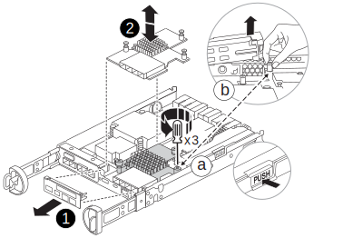

= 메자닌 카드(FAS2820)를 교체합니다
:allow-uri-read: 
:icons: font
:imagesdir: ../media/

[role="lead"]
카드에 장애가 발생한 경우 FAS2820 시스템의 메자닌 카드를 교체하거나 새 카드를 설치하여 다른 프로토콜로 업그레이드하십시오.

* 시스템에서 지원하는 모든 ONTAP 버전에서 이 절차를 사용하십시오.
* 메자닌 카드를 동일한 유형 또는 다른 유형으로 교체하십시오.
* 컨트롤러를 종료하기 전에 ifgrp 및 VLAN 정보를 기록해 두십시오.
* 메자닌 카드 유형을 변경하는 경우 컨트롤러를 재시작한 후 LIF 및 포트 설정을 변경하십시오.
* 다른 시스템 구성 요소가 모두 정상적으로 작동하는지 확인하십시오. 문제가 지속되면 기술 지원 부서에 문의하십시오.

.애니메이션 - 메자닌 카드를 교체합니다
video::a8ec891d-f6f6-4479-9ca2-af47017254ff[panopto]

== 1단계: 손상된 컨트롤러를 종료합니다

.시작하기 전에
* 메자닌 카드 유형을 변경하는 경우 장애가 발생한 노드의 ifgrp 및 VLAN 정보를 캡처하십시오.
+
[source, cli]
----
network port vlan show -node _impaired_node_name_
network port ifgrp show -node _impaired_node_name_
----

손상된 컨트롤러의 기능을 인계받아 중지시키면 정상적인 컨트롤러가 손상된 컨트롤러의 스토리지에서 데이터를 계속 제공할 수 있습니다. 이를 위해 AutoSupport에서 자동 케이스 생성을 억제하고 자동 반환 기능을 비활성화한 다음 손상된 컨트롤러를 LOADER 프롬프트로 전환합니다. LOADER 프롬프트는 FRU를 교체할 수 있는 안전한 중지 상태입니다.

노드가 2개 이상인 클러스터가 있는 경우 쿼럼에 있어야 합니다. 클러스터가 쿼럼에 없거나 정상 컨트롤러에 자격 및 상태에 대해 FALSE가 표시되는 경우 손상된 컨트롤러를 종료하기 전에 문제를 해결해야 합니다(참조) link:https://docs.netapp.com/us-en/ontap/system-admin/synchronize-node-cluster-task.html?q=Quorum["노드를 클러스터와 동기화합니다"^].

.단계
. AutoSupport가 활성화된 경우 'system node AutoSupport invoke -node * -type all-message MAINT=_number_of_hours_down_h' AutoSupport 메시지를 호출하여 자동 케이스 생성을 억제합니다
+
다음 AutoSupport 메시지는 두 시간 동안 자동 케이스 생성을 억제합니다: ' cluster1: * > system node AutoSupport invoke - node * -type all-message MAINT=2h'

. 손상된 컨트롤러가 HA 쌍의 일부인 경우 정상 컨트롤러의 콘솔에서 '스토리지 페일오버 수정-노드 로컬-자동 반환 거짓'을 자동 반환하도록 해제합니다
. 손상된 컨트롤러를 로더 프롬프트로 가져가십시오.
+
[cols="1,2"]
|===
| 손상된 컨트롤러가 표시되는 경우... | 그러면... 

 a| 
LOADER 메시지가 표시됩니다
 a| 
컨트롤러 모듈 제거 로 이동합니다.

 a| 
반환 대기 중...
 a| 
Ctrl+C를 누른 다음 y를 누릅니다.

 a| 
시스템 프롬프트 또는 암호 프롬프트(시스템 암호 입력)
 a| 
정상적인 컨트롤러 'storage failover takeover -ofnode_impaired_node_name_'에서 손상된 컨트롤러를 인수하거나 중단합니다

손상된 컨트롤러에 기브백을 기다리는 중... 이 표시되면 Ctrl-C를 누른 다음 y를 응답합니다.

|===

== 2단계: 컨트롤러 모듈을 분리합니다

컨트롤러 모듈과 그 덮개를 제거하십시오.

.단계
. 아직 접지되지 않은 경우 올바르게 접지하십시오.
. 후크 및 루프 스트랩을 풀고 케이블이 연결된 위치를 확인한 다음 시스템 케이블과 SFP(필요한 경우)를 분리합니다.
+
케이블을 정리된 상태로 유지하려면 케이블 관리 장치에 그대로 두십시오.

. 컨트롤러 모듈의 왼쪽과 오른쪽에서 케이블 관리 장치를 분리하여 한쪽에 둡니다.
. 캠 핸들 래치를 풀고 완전히 열어서 컨트롤러 모듈을 섀시에서 빼냅니다.
+
image::../media/drw_2850_pcm_remove_install_IEOPS-694.svg[컨트롤러를 분리합니다]

. 컨트롤러를 뒤집어서 평평하고 안정적인 표면에 놓으세요.
. 컨트롤러 모듈 측면에 있는 파란색 버튼을 눌러 덮개를 분리하세요. 덮개를 위로 돌려 컨트롤러 모듈에서 분리합니다.
+
image::../media/drw_2850_open_controller_module_cover_IEOPS-695.svg[컨트롤러를 엽니다]

[cols="1,3"]
|===

 a| 
image::../media/icon_round_1.png[설명선 번호 1]
 a| 
컨트롤러 모듈 덮개 분리 단추

|===

== 3단계: 메자닌 카드를 교체합니다

메자닌 카드를 교체합니다.

. 아직 접지되지 않은 경우 올바르게 접지하십시오.
. 다음 그림 또는 컨트롤러 모듈의 FRU 맵을 사용하여 메자닌 카드를 분리합니다.
+

+
[cols="1,3"]
|===

 a| 
image::../media/icon_round_1.png[설명선 번호 1]
 a| 
IO 플레이트

 a| 
image::../media/icon_round_2.png[설명선 번호 2]
 a| 
PCIe 메자닌 카드

|===
+
.. 컨트롤러 모듈에서 IO Plate를 똑바로 밀어 꺼냅니다.
.. 메자닌 카드의 손잡이 나사를 풀고 메자닌 카드를 위로 들어올립니다.
+

NOTE: 손가락이나 드라이버로 나비나사를 풀 수 있습니다. 손가락을 사용하는 경우, NV 배터리를 위로 돌려 옆에 있는 손나사를 보다 잘 구입할 수 있습니다.

. 메자닌 카드를 재설치합니다.
+
.. 교체용 메자닌 카드의 커넥터를 마더보드의 소켓에 맞춘 다음, 카드를 소켓에 조심스럽게 제대로 장착하십시오.
.. 메자닌 카드에 있는 3개의 손잡이 나사를 조입니다.
.. IO Plate를 다시 설치합니다.

. 컨트롤러 모듈 덮개를 다시 씌우고 잠급니다.

== 4단계: 컨트롤러 모듈 설치 및 재부팅

컨트롤러 모듈을 재설치하고 재부팅하십시오.

.단계
. 아직 접지되지 않은 경우 올바르게 접지하십시오.
. 컨트롤러 모듈을 뒤집어 섀시의 입구에 맞춥니다.
. 컨트롤러 모듈을 섀시에 절반 정도 부드럽게 밀어 넣습니다.
+

NOTE: 지시가 있을 때까지 컨트롤러 모듈을 섀시에 완전히 삽입하지 마십시오.

. 필요에 따라 시스템 케이블을 다시 연결하십시오.
+
미디어 컨버터(QSFP 또는 SFP)를 분리한 경우 광섬유 케이블을 사용하는 경우 다시 설치해야 합니다.

. 컨트롤러 모듈 재설치를 완료합니다.
+
.. 캠 핸들을 연 상태에서 컨트롤러 모듈을 완전히 장착될 때까지 단단히 밀어 넣으십시오. 캠 핸들을 닫아 잠그십시오.
+

NOTE: 커넥터가 손상되지 않도록 컨트롤러 모듈을 섀시에 밀어 넣을 때 과도한 힘을 가하지 마십시오.

+
컨트롤러가 섀시에 장착되면 바로 부팅이 시작됩니다.

.. 아직 설치하지 않은 경우 케이블 관리 장치를 다시 설치하십시오.
.. 후크 및 루프 스트랩을 사용하여 케이블을 케이블 관리 장치에 고정하십시오. == 5단계: 메자닌 카드 재구성(유형이 변경된 경우)

컨트롤러가 재시작되면 다른 유형의 카드로 교체한 경우 메자닌 카드 설정을 새 카드에 맞게 변경하십시오.

[role="tabbed-block"]
====
.옵션 1: Fibre Channel-이더넷 메자닌 카드
--
필요에 따라 LIF 및 포트 설정을 업데이트하여 이더넷 교체 메자닌 카드를 구성하십시오.

.단계
.  `network port show` 명령을 사용하여 새 포트 이름과 링크 상태를 확인합니다.
. 새 이더넷 메자닌 포트에서 ifgrp 및 VLAN을 재구축하십시오.
. 새 포트 또는 ifgrp/VLAN 포트를 올바른 브로드캐스트 도메인과 IPspace에 배치하고 MTU 값을 설정하십시오.
. 영향을 받는 LIF 홈 포트 및 페일오버 설정을 업데이트합니다.
. 더 이상 필요하지 않은 LIF를 삭제합니다.

ONTAP에서 이더넷 구성에 대한 자세한 내용은 link:https://docs.netapp.com/us-en/ontap/networking/configure_network_ports_cluster_administrators_only_overview.html["ONTAP 네트워크 포트 구성에 대해 알아보십시오"]을 참조하십시오.

--
.옵션 2: Ethernet-Fibre Channel 메자닌 카드
--
필요에 따라 LIF 및 포트 설정을 업데이트하여 교체용 FC 메자닌 카드를 구성하십시오.

.단계
. 관련 SVM에서 FCP를 활성화합니다. 새 데이터 LIF를 생성합니다.
. 패브릭 영역 설정 및 호스트 경로를 업데이트합니다. 필요에 따라 포트셋, igroup 및 LUN 매핑을 업데이트합니다.
. 호스트 다중 경로를 확인합니다. 오래된 경로가 없고 최적화된 경로와 최적화되지 않은 경로 간에 균형이 맞춰져 있는지 확인합니다.
. 제거된 이더넷 포트에 LIF가 연결되어 있지 않은지, 모든 FC LIF가 작동 중이며 I/O를 처리하고 있는지, AutoSupport 모니터링에 새 구성이 반영되는지 확인합니다.

ONTAP에서 Fibre Channel 구성에 대한 자세한 내용은 link:https://docs.netapp.com/us-en/ontap/san-admin/index.html["SAN 관리 개요"]을 참조하십시오.

--
====

== 6단계: 컨트롤러를 정상 작동 상태로 되돌리십시오

손상된 컨트롤러에 스토리지를 반환하고, 자동 반환을 복원하고, AutoSupport 유지보수 윈도우를 종료합니다.

. 정상 컨트롤러 또는 클러스터 관리자 프롬프트에서 스토리지를 복원하여 컨트롤러를 정상 작동으로 되돌립니다. `storage failover giveback -ofnode _impaired_node_name_`
. 를 사용하여 자동 반환 복원 `storage failover modify -node local -auto-giveback true` 명령.
. AutoSupport 유지보수 윈도우가 트리거된 경우 를 사용하여 윈도우를 종료합니다 `system node autosupport invoke -node * -type all -message MAINT=END` 명령.

== 7단계: 장애가 발생한 부품을 NetApp에 반환

키트와 함께 제공된 RMA 지침에 설명된 대로 오류가 발생한 부품을 NetApp에 반환합니다.  https://mysupport.netapp.com/site/info/rma["부품 반환 및 교체"]자세한 내용은 페이지를 참조하십시오.
