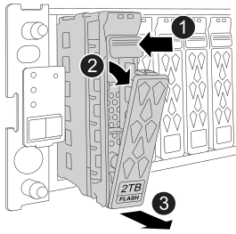

= 캐싱 모듈-FAS50을 핫 스왑합니다
:allow-uri-read: 
:icons: font
:imagesdir: ../media/

[role="lead"]
지원되는 동일 또는 다른 공급업체에서 제공하는 동일한 용량의 NVMe SSD 캐싱 모듈(Flash Cache 모듈)을 핫 스왑할 수 있습니다.

.시작하기 전에
스토리지 시스템은 상황에 따라 특정 기준을 충족해야 합니다.

* 스토리지 시스템에 설치할 캐싱 모듈에 적합한 운영 체제가 있어야 합니다.
* 대체 캐싱 모듈의 용량은 실패한 캐싱 모듈과 동일해야 하지만 지원되는 다른 공급업체에서 제공하는 것이어야 합니다.
* 스토리지 시스템의 다른 모든 구성 요소가 올바르게 작동해야 합니다. 그렇지 않은 경우 계속하기 전에 에 문의하십시오 https://mysupport.netapp.com/site/global/dashboard["NetApp 지원"].

.단계
. 적절하게 접지합니다.
. 캐싱 모듈 전면에 있는 황색 주의 LED를 통해 장애가 발생한 캐싱 모듈을 찾습니다.
+
캐시 모듈은 드라이브 베이 0 또는 23에 있을 수 있습니다.

. 캐싱 모듈을 제거합니다.
+

+
[cols="20%,80%"]
|===

 a| 
image::../media/icon_round_1.png[설명선 번호 1]
 a| 
모듈 면의 분리 버튼을 눌러 캠 핸들을 엽니다.

 a| 
image::../media/icon_round_2.png[설명선 번호 2]
 a| 
캠 핸들을 아래로 돌려 모듈을 중앙판에서 분리합니다.

 a| 
image::../media/icon_round_3.png[설명선 번호 3]
 a| 
다른 손으로 모듈을 지지하고 캠 핸들을 사용하여 드라이브 베이에서 모듈을 밀어 꺼냅니다.

모듈을 분리할 때는 항상 두 손으로 무게를 지탱하십시오.

|===
. 교체용 캐싱 모듈을 삽입하기 전에 최소 70초 동안 기다립니다.
. 교체용 캐싱 모듈을 설치합니다.
+
.. 캠 핸들이 열린 위치에 있는 상태에서 양손으로 모듈을 삽입합니다.
.. 모듈이 멈출 때까지 부드럽게 누릅니다.
.. 모듈이 미드플레인에 완전히 장착되고 핸들이 딸깍 소리를 내며 제자리에 고정되도록 캠 핸들을 닫습니다.
+
캠 핸들이 모듈의 면과 올바르게 정렬되도록 천천히 닫아야 합니다.

. 모듈의 작동 상태(녹색) LED가 켜져 있는지 확인합니다.
. 키트와 함께 제공된 RMA 지침에 설명된 대로 오류가 발생한 부품을 NetApp에 반환합니다.  https://mysupport.netapp.com/site/info/rma["부품 반환 및 교체"^]자세한 내용은 페이지를 참조하십시오.

