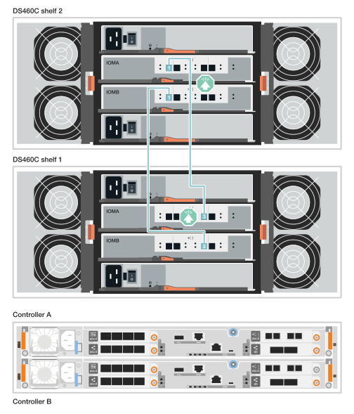

= 하드웨어 FAS50 케이블 연결
:allow-uri-read: 
:icons: font
:imagesdir: ../media/

[role="lead"]
FAS50 스토리지 시스템 하드웨어를 설치한 후 컨트롤러를 네트워크 및 쉘프에 케이블로 연결합니다.

.시작하기 전에
스토리지 시스템을 네트워크 스위치에 연결하는 방법에 대한 자세한 내용은 네트워크 관리자에게 문의하십시오.

.이 작업에 대해
* 클러스터/HA 및 호스트 네트워크 케이블 연결 절차는 일반적인 구성을 보여줍니다. 특정 케이블 연결은 스토리지 시스템에 대해 주문된 구성 요소에 따라 다릅니다. 포괄적인 구성 및 슬롯 우선 순위에 대한 자세한 내용은 을 link:https://hwu.netapp.com["NetApp Hardware Universe를 참조하십시오"^]참조하십시오.
* 케이블 연결 그래픽에는 포트에 커넥터를 삽입할 때 케이블 커넥터 당김 탭의 올바른 방향(위 또는 아래)을 나타내는 화살표 아이콘이 있습니다.
+
커넥터를 삽입할 때 딸깍 소리가 들려야 합니다. 딸깍 소리가 안 되면 커넥터를 제거하고 뒤집은 다음 다시 시도하십시오.

+
image:../media/drw_cable_pull_tab_direction_ieops-1699.svg["케이블 당김 탭 방향"]

* 광 스위치에 케이블로 연결하는 경우 광 트랜시버를 컨트롤러 포트에 삽입한 후 스위치 포트에 연결합니다.

== 1단계: 클러스터/HA 연결 케이블 연결

컨트롤러에 케이블을 연결하여 ONTAP 클러스터 연결을 생성합니다.

[role="tabbed-block"]
====
.스위치가 없는 클러스터 케이블 연결
--
.2포트 40/100 GbE 입출력 모듈 1개가 있는 FAS50
[%collapsible]
=====
.단계
. 클러스터/HA 인터커넥트 연결 케이블 연결:
+

NOTE: 클러스터 인터커넥트 트래픽과 HA 트래픽은 동일한 물리적 포트(슬롯 4의 I/O 모듈)를 공유합니다. 포트는 40/100 GbE입니다.

+
.. 컨트롤러 A 포트 e4a를 컨트롤러 B 포트 e4a에 케이블로 연결합니다.
.. 컨트롤러 A 포트 e4b를 컨트롤러 B 포트 e4b에 케이블 연결
+
* 100 GbE 클러스터/HA 인터커넥트 케이블 *

+
image::../media/oie_cable100_gbe_qsfp28.png[클러스터 HA 100GbE 케이블]

+
image::../media/drw_isi_fas50_switchless_2p_100gbe_cabling_ieops-1937.svg[하나의 100GbE IO 모듈을 사용하는 fas50 스위치가 없는 클러스터 케이블 연결 다이어그램]

=====
--
.스위치 클러스터 케이블링
--
.2포트 40/100 GbE 입출력 모듈 1개가 있는 FAS50
[%collapsible]
=====
. 컨트롤러를 클러스터 네트워크 스위치에 케이블 연결합니다.
+

NOTE: 클러스터 인터커넥트 트래픽과 HA 트래픽은 동일한 물리적 포트(슬롯 4의 I/O 모듈)를 공유합니다. 포트는 40/100 GbE입니다.

+
.. 컨트롤러 A 포트 e4a를 클러스터 네트워크 스위치 A에 케이블 연결
.. 컨트롤러 A 포트 e4b를 클러스터 네트워크 스위치 B에 케이블 연결
.. 컨트롤러 B 포트 e4a를 클러스터 네트워크 스위치 A에 케이블 연결
.. 컨트롤러 B 포트 e4b를 클러스터 네트워크 스위치 B에 케이블 연결
+
* 40/100 GbE 클러스터/HA 인터커넥트 케이블 *

+
image::../media/oie_cable100_gbe_qsfp28.png[클러스터 HA 40/100 GbE 케이블]

+
image:../media/drw_isi_fas50_2p_100gbe_switched_cluster_cabling_ieops-1936.svg["하나의 100GbE IO 모듈을 사용하는 fas50 스위치 클러스터 케이블 연결 다이어그램"]

=====
--
====

== 2단계: 호스트 네트워크 연결 케이블 연결

컨트롤러를 이더넷 또는 FC 호스트 네트워크에 케이블로 연결합니다.

[role="tabbed-block"]
====
.이더넷 호스트 케이블 연결
--
.4포트 10/25 GbE 입출력 모듈 1개가 포함된 FAS50
[%collapsible]
=====
.단계
. 각 컨트롤러에서 이더넷 호스트 네트워크 스위치에 케이블 포트 e2a, e2b, E2C 및 e2D를 연결합니다.
+
* 10/25 GbE 케이블 *

+
image:../media/oie_cable_sfp_gbe_copper.png["GbE SFP 구리 커넥터, 폭 = 100px"]

+
image::../media/drw_isi_fas50_4p_25gbe_optional_cabling_ieops-1934.svg[케이블 fas50과 10/25GbE 이더넷 호스트 네트워크 스위치]

=====
--
.FC 호스트 케이블링
--
.4포트 64Gb/s FC 입출력 모듈 1개가 포함된 FAS50
[%collapsible]
=====
.단계
. 각 컨트롤러에서 포트 1a, 1b, 1c 및 1d를 FC 호스트 네트워크 스위치에 연결합니다.
+
* 64 Gb/s FC 케이블 *

+
image:../media/oie_cable_sfp_gbe_copper.png["64Gb FC 케이블, 폭 = 100px"]

+
image::../media/drw_isi_fas50_4p_64gb_fc_optional_cabling_ieops-1935.svg[64GB FC 호스트 네트워크 스위치에 대한 케이블 연결]

=====
--
====

== 3단계: 관리 네트워크 연결 케이블 연결

컨트롤러를 관리 네트워크에 케이블로 연결합니다.

. 각 컨트롤러의 관리(렌치) 포트를 관리 네트워크 스위치에 연결합니다.
+
* 1000BASE-T RJ-45 케이블 *

+
image::../media/oie_cable_rj45.png[RJ-45 케이블]

+
image::../media/drw_isi_fas50_wrench_cabling_ieops-1938.svg[관리 네트워크에 연결합니다]

IMPORTANT: 아직 전원 코드를 연결하지 마십시오.

== 4단계: 선반 연결 케이블 연결

다음 절차에서는 하나 또는 두 개의 DS460C 쉘프에 컨트롤러를 연결하는 방법을 보여 줍니다.

.이 작업에 대해
* 케이블 연결 예제에 DS460C 쉘프가 표시되어 있지만, 추가 SAS 쉘프는 지원됩니다. 를 참조하십시오.link:https://hwu.netapp.com["NetApp Hardware Universe를 참조하십시오"^]
+
지원되는 다른 SAS 쉘프의 케이블 연결도 유사합니다. 을 link:../sas3/install-new-system.html["새 시스템 설치를 위해 쉘프를 설치하고 케이블을 연결합니다"^]참조하십시오. 을 참조할 수도 link:../sas3/overview-cabling-rules-examples.html["SAS 케이블 연결 문제, 워크시트 및 예제 개요"^]있습니다.

* 스토리지 시스템에 지원되는 최대 쉘프 수와 광, 스위치 연결 등 모든 케이블 연결 옵션은 을 참조하십시오.link:https://hwu.netapp.com["NetApp Hardware Universe를 참조하십시오"^]
* 그래픽은 컨트롤러 A 케이블을 파란색으로, 컨트롤러 B 케이블은 노란색으로 표시합니다.
* 스토리지 시스템과 함께 제공된 스토리지 케이블을 사용합니다. 케이블 유형은 다음과 같습니다.
+
* 미니 SAS HD 케이블 *

+
image::../media/oie_cable_mini_sas_hd_to_mini_sas_hd.svg[미니 SAS HD 케이블]

[role="tabbed-block"]
====
.옵션 1: DS460C 쉘프 1개
--
각 컨트롤러를 DS460C 쉘프의 각 IOM12 모듈에 연결합니다.

.단계
. 컨트롤러 A를 쉘프에 연결:
+
.. 케이블 컨트롤러 A 포트 3a를 IOMA 포트 1에 연결합니다.
.. 케이블 컨트롤러 A 포트 3D - IOMB 포트 3.
+
image:../media/drw_isi_fas50_1_ds460c_controller_a_cabling_ieops-2167.svg["하나의 DS460C 쉘프에 컨트롤러 A 포트 3a 및 3D 케이블 연결"]

. 컨트롤러 B를 쉘프에 연결:
+
.. 케이블 컨트롤러 B 포트 3a와 IOMB 포트 1을 연결합니다.
.. 케이블 컨트롤러 B 포트 3D - IOMA 포트 3.
+
image:../media/drw_isi_fas50_1_ds460c_controller_b_cabling_ieops-2169.svg["하나의 DS460C 쉘프에 컨트롤러 B 포트 3A 및 3D 케이블 연결"]

--
.옵션 2: DS460C 선반 2개
--
각 컨트롤러를 두 DS460C 쉘프의 IOM12 모듈에 연결합니다.

. 쉘프-쉘프 연결 케이블 연결:
+
.. 케이블 선반 1 IOMA 포트 3 - 셸프 2 IOMA 포트 1
.. 케이블 선반 1 IOMB 포트 3 - 셸프 2 IOMB 포트 1
+

. 컨트롤러 A를 쉘프에 연결:
+
.. 케이블 컨트롤러 A 포트 3a를 쉘프 1 IOMA 포트 1에 연결합니다.
.. 케이블 컨트롤러 A 포트 3D-셸프 2 IOMB 포트 3.
+
image:../media/drw_isi_fas50_2_ds460c_controller_a_cabling_ieops-2170.svg["2개의 DS460C 쉘프에 케이블 연결된 컨트롤러 A 포트 3a 및 3D"]

. 컨트롤러 B를 쉘프에 연결:
+
.. 컨트롤러 B 포트 3A를 쉘프 1 IOMB 포트 1에 연결합니다.
.. 케이블 컨트롤러 B 포트 3D-셸프 2 IOMA 포트 3.
+
image:../media/drw_isi_fas50_2_ds460c_controller_b_cabling_ieops-2171.svg["컨트롤러 B 포트 3a 및 3D를 두 DS460C 쉘프에 케이블로 연결합니다"]

--
====
.다음 단계
스토리지 시스템용 하드웨어를 케이블로 연결한 후link:install-power-hardware.html["스토리지 시스템의 전원을 켭니다"],
