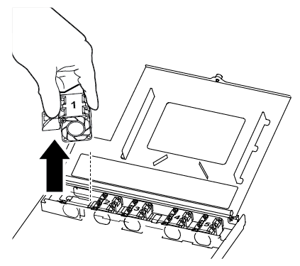

= 팬 교체 - FAS500f
:allow-uri-read: 
:icons: font
:imagesdir: ../media/

[role="lead"]
장애가 발생하면 팬을 새 팬 모듈로 교체합니다.

== 1단계: 손상된 컨트롤러를 종료합니다

손상된 컨트롤러를 종료하려면 컨트롤러 상태를 확인하고, 필요한 경우 정상적인 컨트롤러가 손상된 컨트롤러 스토리지에서 데이터를 계속 제공할 수 있도록 컨트롤러를 인수해야 합니다.

.이 작업에 대해
* NetApp 스토리지 암호화를 사용하는 경우_ONTAP 9 NetApp 암호화 전원 가이드 _ 의 "'SED를 보호되지 않는 모드로 복귀' 섹션에 나와 있는 지침에 따라 MSID를 재설정해야 합니다.
+
https://docs.netapp.com/ontap-9/topic/com.netapp.doc.pow-nve/home.html["ONTAP 9 NetApp 암호화 기능 가이드"^]

* SAN 시스템을 사용하는 경우 손상된 컨트롤러 SCSI 블레이드의 이벤트 메시지('이벤트 로그 표시')를 확인해야 합니다.
+
각 SCSI 블레이드 프로세스는 클러스터의 다른 노드와 함께 쿼럼에 있어야 합니다. 교체를 진행하기 전에 모든 문제를 해결해야 합니다.

* 노드가 2개 이상인 클러스터가 있는 경우 쿼럼에 있어야 합니다. 클러스터가 쿼럼에 없거나 정상 컨트롤러에 자격 및 상태에 대해 FALSE가 표시되는 경우 손상된 컨트롤러를 종료하기 전에 문제를 해결해야 합니다. 을 참조하십시오 link:https://docs.netapp.com/us-en/ontap/system-admin/index.html["CLI를 사용한 관리 개요"^].
* MetroCluster 설정이 있는 경우 MetroCluster 설정 상태가 구성되어 있고 해당 노드가 설정 및 정상 상태('MetroCluster node show')인지 확인해야 합니다.

.단계
. AutoSupport가 활성화된 경우 'system node AutoSupport invoke -node * -type all-message MAINT=number_of_hours_downh' AutoSupport 메시지를 호출하여 자동 케이스 생성을 억제합니다
+
다음 AutoSupport 메시지는 두 시간 동안 자동 케이스 생성을 억제합니다: ' cluster1: * > system node AutoSupport invoke - node * -type all-message MAINT=2h'

. 정상적인 컨트롤러의 콘솔에서 'Storage failover modify – node local - auto-반환 false'를 자동으로 반환합니다
+

NOTE: 자동 반환을 비활성화하시겠습니까?_가 표시되면 'y'를 입력합니다.

. 손상된 컨트롤러를 로더 프롬프트로 가져가십시오.
+
[cols="1,2"]
|===
| 손상된 컨트롤러가 표시되는 경우... | 그러면... 

 a| 
LOADER 메시지가 표시됩니다
 a| 
컨트롤러 모듈 제거 로 이동합니다.

 a| 
반환 대기 중...
 a| 
Ctrl-C를 누른 다음 메시지가 나타나면 y를 누릅니다.

 a| 
시스템 프롬프트 또는 암호 프롬프트(시스템 암호 입력)
 a| 
정상적인 컨트롤러 'storage failover takeover -ofnode_impaired_node_name_'에서 손상된 컨트롤러를 인수하거나 중단합니다

손상된 컨트롤러에 기브백을 기다리는 중... 이 표시되면 Ctrl-C를 누른 다음 y를 응답합니다.

|===

== 2단계: 컨트롤러 모듈을 분리합니다

팬 모듈을 교체할 때 섀시에서 컨트롤러 모듈을 분리해야 합니다.

케이블을 어디에 연결했는지 알 수 있도록 케이블에 레이블을 지정해야 합니다.

. 아직 접지되지 않은 경우 올바르게 접지하십시오.
. 전원에서 컨트롤러 모듈 전원 공급 장치를 분리합니다.
. 전원 케이블 고정 장치를 분리한 다음 전원 공급 장치에서 케이블을 분리합니다.
. 컨트롤러 모듈 양쪽에 있는 래치 장치에 검지를 넣고 엄지 손가락으로 레버를 누른 다음 섀시에서 몇 인치 정도 조심스럽게 컨트롤러를 당깁니다.
+

NOTE: 컨트롤러 모듈을 분리하는 데 어려움이 있는 경우, 검지 손가락을 안쪽의 손가락 구멍을 통과하도록 합니다(팔을 교차함).

+
image::../media/drw_a250_pcm_remove_install.png[drw A250 PCM 제거 설치]

+
|===

 a| 
image:../media/legend_icon_01.png[""]
| 레버 

 a| 
image:../media/legend_icon_02.png[""]
 a| 
래치 메커니즘

|===
. 양손으로 컨트롤러 모듈 측면을 잡고 섀시에서 조심스럽게 당겨 평평하고 안정적인 표면에 놓습니다.
. 컨트롤러 모듈 앞면의 손잡이 나사를 시계 반대 방향으로 돌려 컨트롤러 모듈 덮개를 엽니다.
+
image::../media/drw_a250_open_controller_module_cover.png[drw A250 열린 컨트롤러 모듈 덮개]

+
|===

 a| 
image:../media/legend_icon_01.png[""]
| 나비 나사 

 a| 
image:../media/legend_icon_02.png[""]
 a| 
컨트롤러 모듈 덮개

|===

== 3단계: 팬을 교체합니다

팬을 교체하려면 장애가 발생한 팬 모듈을 분리하고 새 팬 모듈로 교체합니다.

다음 비디오 또는 표 형식 단계를 사용하여 팬을 교체할 수 있습니다.

.애니메이션 - 팬을 교체합니다
video::ccfa6665-2c2b-4571-ae79-ac5b015c19fc[panopto]
. 콘솔 오류 메시지를 확인하거나 마더보드에서 팬 모듈에 대해 표시등이 켜진 LED를 찾아 교체해야 하는 팬 모듈을 식별합니다.
. 팬 모듈의 측면을 잡고 팬 모듈을 컨트롤러 모듈에서 똑바로 들어 올려 팬 모듈을 분리합니다.
+

+
|===

 a| 
image:../media/legend_icon_01.png[""]
| 팬 모듈 
|===
. 교체용 팬 모듈의 가장자리를 컨트롤러 모듈의 입구에 맞춘 다음 교체용 팬 모듈을 컨트롤러 모듈에 밀어 넣습니다.

== 4단계: 컨트롤러 모듈을 재설치합니다

컨트롤러 모듈 내에서 구성 요소를 교체한 후 시스템 섀시에 컨트롤러 모듈을 다시 설치하고 부팅해야 합니다.

. 컨트롤러 모듈 덮개를 닫고 손잡이 나사를 조입니다.
+
image::../media/drw_a250_close_controller_module_cover.png[drw A250 컨트롤러 모듈 덮개를 닫습니다]

+
|===

 a| 
image:../media/legend_icon_01.png[""]
| 컨트롤러 모듈 덮개 

 a| 
image:../media/legend_icon_02.png[""]
 a| 
나비 나사

|===
. 컨트롤러 모듈을 섀시에 삽입합니다.
+
.. 래칭 메커니즘 암이 완전히 확장된 위치에 잠겨 있는지 확인합니다.
.. 양손을 사용하여 컨트롤러 모듈이 멈출 때까지 잠금 장치 암에 맞춰 부드럽게 밀어 넣습니다.
.. 잠금 장치 내부의 손가락 구멍을 통해 검지 손가락을 넣습니다.
.. 잠금 장치 상단의 주황색 탭을 엄지 손가락으로 누르고 정지 장치 위로 컨트롤러 모듈을 부드럽게 밉니다.
.. 래칭 메커니즘의 상단에서 엄지 손가락을 떼고 래칭 메커니즘이 제자리에 고정될 때까지 계속 밉니다.
+
컨트롤러 모듈이 섀시에 완전히 장착되면 바로 부팅이 시작됩니다. 부트 프로세스를 중단할 준비를 하십시오.

+
컨트롤러 모듈을 완전히 삽입하고 섀시의 모서리와 같은 높이가 되도록 해야 합니다.

. 필요에 따라 시스템을 다시 연결합니다.
. 스토리지 'storage failover back-ofnode_impaired_node_name_'을 제공하여 컨트롤러를 정상 작동 상태로 되돌립니다
. 자동 반환이 비활성화된 경우 'Storage failover modify -node local -auto-반환 true'를 다시 설정합니다

== 5단계: 장애가 발생한 부품을 NetApp에 반환

키트와 함께 제공된 RMA 지침에 설명된 대로 오류가 발생한 부품을 NetApp에 반환합니다. 를 참조하십시오 https://mysupport.netapp.com/site/info/rma["부품 반품 및 앰프, 교체"] 페이지를 참조하십시오.
