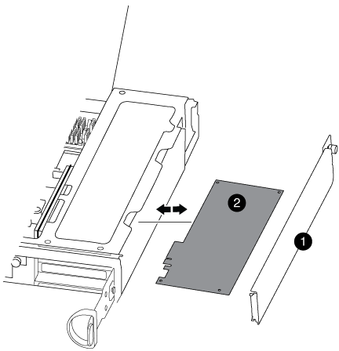

= PCIe 카드 교체 - FAS8200
:allow-uri-read: 
:icons: font
:imagesdir: ../media/

[role="lead"]
PCIe 카드를 교체하려면 특정 작업 순서를 수행해야 합니다.

* 이 절차는 시스템에서 지원하는 모든 버전의 ONTAP에서 사용할 수 있습니다
* 시스템의 다른 모든 구성 요소가 올바르게 작동해야 합니다. 그렇지 않은 경우 기술 지원 부서에 문의해야 합니다.

== 1단계: 손상된 컨트롤러를 종료합니다

스토리지 시스템 하드웨어 구성에 따라 다른 절차를 사용하여 손상된 컨트롤러를 종료하거나 인수할 수 있습니다.

[role="tabbed-block"]
====
.옵션 1: 대부분의 구성
--
손상된 컨트롤러를 종료하려면 컨트롤러 상태를 확인하고, 필요한 경우 정상적인 컨트롤러가 손상된 컨트롤러 스토리지에서 데이터를 계속 제공할 수 있도록 컨트롤러를 인수해야 합니다.

.이 작업에 대해
* SAN 시스템을 사용하는 경우 손상된 컨트롤러 SCSI 블레이드에 대한 이벤트 메시지를 확인해야  `cluster kernel-service show`합니다.  `cluster kernel-service show`priv advanced 모드에서 명령을 실행하면 노드 이름, 해당 노드의 쿼럼 상태, 해당 노드의 가용성 상태 및 해당 노드의 작동 상태가 표시됩니다.
+
각 SCSI 블레이드 프로세스는 클러스터의 다른 노드와 함께 쿼럼에 있어야 합니다. 교체를 진행하기 전에 모든 문제를 해결해야 합니다.

* 노드가 2개 이상인 클러스터가 있는 경우 쿼럼에 있어야 합니다. 클러스터가 쿼럼에 없거나 정상 컨트롤러에 자격 및 상태에 대해 FALSE가 표시되는 경우 손상된 컨트롤러를 종료하기 전에 문제를 해결해야 합니다(참조) link:https://docs.netapp.com/us-en/ontap/system-admin/synchronize-node-cluster-task.html?q=Quorum["노드를 클러스터와 동기화합니다"^].

.단계
. AutoSupport가 활성화된 경우 AutoSupport 메시지를 호출하여 자동 케이스 생성을 억제합니다. `system node autosupport invoke -node * -type all -message MAINT=<# of hours>h`
+
다음 AutoSupport 메시지는 2시간 동안 자동 케이스 생성을 억제합니다. `cluster1:> system node autosupport invoke -node * -type all -message MAINT=2h`

. 정상적인 컨트롤러의 콘솔에서 'Storage failover modify – node local - auto-반환 false'를 자동으로 반환합니다
+

NOTE: 자동 반환을 비활성화하시겠습니까?_가 표시되면 'y'를 입력합니다.

. 손상된 컨트롤러를 로더 프롬프트로 가져가십시오.
+
[cols="1,2"]
|===
| 손상된 컨트롤러가 표시되는 경우... | 그러면... 

 a| 
LOADER 메시지가 표시됩니다
 a| 
다음 단계로 이동합니다.

 a| 
반환 대기 중...
 a| 
Ctrl-C를 누른 다음 메시지가 나타나면 y를 누릅니다.

 a| 
시스템 프롬프트 또는 암호 프롬프트
 a| 
정상적인 컨트롤러 'storage failover takeover -ofnode_impaired_node_name_'에서 손상된 컨트롤러를 인수하거나 중단합니다

손상된 컨트롤러에 기브백을 기다리는 중... 이 표시되면 Ctrl-C를 누른 다음 y를 응답합니다.

|===

--
.옵션 2: 컨트롤러가 2노드 MetroCluster에 있습니다
--
손상된 컨트롤러를 종료하려면 컨트롤러 상태를 확인하고, 필요한 경우 컨트롤러 전원을 전환하여 정상적인 컨트롤러가 손상된 컨트롤러 스토리지에서 데이터를 계속 제공하도록 해야 합니다.

.이 작업에 대해
* 정상 컨트롤러에 전원을 공급하려면 이 절차의 마지막에 전원 공급 장치를 켜 두어야 합니다.

.단계
. MetroCluster 상태를 확인하여 장애가 있는 컨트롤러가 자동으로 정상 컨트롤러(MetroCluster show)로 전환되었는지 확인합니다
. 자동 절체가 발생했는지 여부에 따라 다음 표에 따라 진행합니다.
+
[cols="1,2"]
|===
| 컨트롤러 손상 여부 | 그러면... 

 a| 
가 자동으로 전환되었습니다
 a| 
다음 단계를 진행합니다.

 a| 
가 자동으로 전환되지 않았습니다
 a| 
정상 컨트롤러 MetroCluster 절체 기능을 통해 계획된 절체 동작을 수행한다

 a| 
가 자동으로 전환되지 않고, 'MetroCluster switchover' 명령으로 전환을 시도했으며, 스위치오버가 거부되었습니다
 a| 
거부권 메시지를 검토하고 가능한 경우 문제를 해결한 후 다시 시도하십시오. 문제를 해결할 수 없는 경우 기술 지원 부서에 문의하십시오.

|===
. 정상적인 클러스터에서 'MetroCluster 환원 단계 집계' 명령을 실행하여 데이터 애그리게이트를 재동기화합니다.
+
[listing]
----
controller_A_1::> metrocluster heal -phase aggregates
[Job 130] Job succeeded: Heal Aggregates is successful.
----
+
치유가 거부되면 '-override-vetoes' 매개 변수를 사용하여 'MetroCluster 환원' 명령을 재실행할 수 있습니다. 이 선택적 매개 변수를 사용하는 경우 시스템은 복구 작업을 방지하는 모든 소프트 베인을 재정의합니다.

. MetroCluster operation show 명령을 사용하여 작업이 완료되었는지 확인합니다.
+
[listing]
----
controller_A_1::> metrocluster operation show
    Operation: heal-aggregates
      State: successful
Start Time: 7/25/2016 18:45:55
   End Time: 7/25/2016 18:45:56
     Errors: -
----
. 'storage aggregate show' 명령을 사용하여 애그리게이트의 상태를 확인하십시오.
+
[listing]
----
controller_A_1::> storage aggregate show
Aggregate     Size Available Used% State   #Vols  Nodes            RAID Status
--------- -------- --------- ----- ------- ------ ---------------- ------------
...
aggr_b2    227.1GB   227.1GB    0% online       0 mcc1-a2          raid_dp, mirrored, normal...
----
. MetroCluster 환원 단계 루트 애그리게이트( heal-phase root-aggregate) 명령을 사용하여 루트 애그리게이트를 수정합니다.
+
[listing]
----
mcc1A::> metrocluster heal -phase root-aggregates
[Job 137] Job succeeded: Heal Root Aggregates is successful
----
+
치유가 거부되면 -override-vetoes 매개변수를 사용하여 'MetroCluster 환원' 명령을 재실행할 수 있습니다. 이 선택적 매개 변수를 사용하는 경우 시스템은 복구 작업을 방지하는 모든 소프트 베인을 재정의합니다.

. 대상 클러스터에서 'MetroCluster operation show' 명령을 사용하여 환원 작업이 완료되었는지 확인합니다.
+
[listing]
----

mcc1A::> metrocluster operation show
  Operation: heal-root-aggregates
      State: successful
 Start Time: 7/29/2016 20:54:41
   End Time: 7/29/2016 20:54:42
     Errors: -
----
. 손상된 컨트롤러 모듈에서 전원 공급 장치를 분리합니다.

--
====

== 2단계: 컨트롤러 모듈을 엽니다

컨트롤러 내의 구성 요소에 액세스하려면 먼저 시스템에서 컨트롤러 모듈을 분리한 다음 컨트롤러 모듈의 덮개를 분리해야 합니다.

. 아직 접지되지 않은 경우 올바르게 접지하십시오.
. 케이블을 케이블 관리 장치에 연결하는 후크 및 루프 스트랩을 푼 다음, 케이블이 연결된 위치를 추적하면서 컨트롤러 모듈에서 시스템 케이블과 SFP(필요한 경우)를 분리합니다.
+
케이블 관리 장치에 케이블을 남겨 두면 케이블 관리 장치를 다시 설치할 때 케이블이 정리됩니다.

. 컨트롤러 모듈의 왼쪽과 오른쪽에서 케이블 관리 장치를 분리하여 한쪽에 둡니다.
+
image::../media/drw_32xx_cbl_mgmt_arm.png[케이블 관리 암 분리][]

. 컨트롤러 모듈의 캠 핸들에 있는 손잡이 나사를 풉니다.
+
image::../media/drw_8020_cam_handle_thumbscrew.png[손잡이 나사를 풀어 캠 핸들을 엽니다]

+
[cols="1,3"]
|===

 a| 
image:../media/legend_icon_01.png["설명선 번호 1"]
| 나비 나사 

 a| 
image:../media/legend_icon_02.png["설명선 번호 2"]
 a| 
캠 핸들

|===
. 캠 핸들을 아래로 당기고 컨트롤러 모듈을 섀시 밖으로 밀어냅니다.
+
컨트롤러 모듈 하단을 섀시 밖으로 밀어낼 때 지지하는지 확인합니다.

== 3단계: PCIe 카드를 교체합니다

PCIe 카드를 교체하려면 컨트롤러 내에서 카드를 찾은 후 특정 단계를 따르십시오.

. 컨트롤러 모듈 측면 패널의 손잡이 나사를 풉니다.
. 측면 패널을 컨트롤러 모듈에서 돌려 냅니다.
+

+
[cols="1,3"]
|===

 a| 
image:../media/legend_icon_01.png["설명선 번호 1"]
| 측면 패널 

 a| 
image:../media/legend_icon_02.png["설명선 번호 2"]
 a| 
PCIe 카드

|===
. 컨트롤러 모듈에서 PCIe 카드를 분리하여 한쪽에 둡니다.
. 교체용 PCIe 카드를 설치합니다.
+
카드를 슬롯에 제대로 맞추고 소켓에 장착할 때 카드에 힘을 고르게 하십시오. PCIe 카드는 슬롯에 완전히 균일하게 장착되어 있어야 합니다.

+

NOTE: 하단 슬롯에 카드를 설치할 때 카드 소켓이 제대로 보이지 않으면 상단 카드를 제거하여 카드 소켓을 확인하고 카드를 설치한 다음 상단 슬롯에서 분리한 카드를 다시 설치합니다.

. 측면 패널을 닫고 나비나사를 조입니다.

== 4단계: 컨트롤러를 다시 설치합니다

컨트롤러 모듈 내에서 구성 요소를 교체한 후 시스템 섀시에 컨트롤러 모듈을 다시 설치하고 부팅해야 합니다.

. 컨트롤러 모듈의 끝을 섀시의 입구에 맞춘 다음 컨트롤러 모듈을 반쯤 조심스럽게 시스템에 밀어 넣습니다.
+

NOTE: 지시가 있을 때까지 컨트롤러 모듈을 섀시에 완전히 삽입하지 마십시오.

. 필요에 따라 시스템을 다시 연결합니다.
+
미디어 컨버터(QSFP 또는 SFP)를 분리한 경우 광섬유 케이블을 사용하는 경우 다시 설치해야 합니다.

. 컨트롤러 모듈 재설치를 완료합니다.
+
컨트롤러 모듈이 섀시에 완전히 장착되면 바로 부팅이 시작됩니다.

+
[cols="1,3"]
|===
| 시스템이 다음 상태인 경우: | 그런 다음 다음 다음 단계를 수행하십시오. 

 a| 
HA 쌍
 a| 
.. 캠 핸들을 열린 위치에 둔 상태에서 컨트롤러 모듈이 중앙판과 완전히 맞닿고 완전히 장착될 때까지 단단히 누른 다음 캠 핸들을 잠금 위치로 닫습니다. 컨트롤러 모듈 후면의 캠 핸들에 있는 나비 나사를 조입니다.
+

NOTE: 커넥터가 손상되지 않도록 컨트롤러 모듈을 섀시에 밀어 넣을 때 과도한 힘을 가하지 마십시오.

.. 아직 설치하지 않은 경우 케이블 관리 장치를 다시 설치하십시오.
.. 아직 연결하지 않은 경우 케이블을 컨트롤러 모듈에 다시 연결하십시오.
.. 케이블을 후크와 루프 스트랩으로 케이블 관리 장치에 연결합니다.

 a| 
2노드 MetroCluster 구성
 a| 
.. 캠 핸들을 열린 위치에 둔 상태에서 컨트롤러 모듈이 중앙판과 완전히 맞닿고 완전히 장착될 때까지 단단히 누른 다음 캠 핸들을 잠금 위치로 닫습니다. 컨트롤러 모듈 후면의 캠 핸들에 있는 나비 나사를 조입니다.
+

NOTE: 커넥터가 손상되지 않도록 컨트롤러 모듈을 섀시에 밀어 넣을 때 과도한 힘을 가하지 마십시오.

.. 아직 설치하지 않은 경우 케이블 관리 장치를 다시 설치하십시오.
.. 아직 연결하지 않은 경우 케이블을 컨트롤러 모듈에 다시 연결하십시오.
.. 케이블을 후크와 루프 스트랩으로 케이블 관리 장치에 연결합니다.
.. 전원 케이블을 전원 공급 장치와 전원에 다시 연결한 다음 전원을 켜서 부팅 프로세스를 시작합니다.

|===
. 시스템이 10GbE 클러스터 상호 연결 및 40GbE NIC 또는 온보드 포트에서 데이터 연결을 지원하도록 구성된 경우 유지보수 모드에서 nicadmin 변환 명령을 사용하여 이러한 포트를 10GbE 연결로 변환합니다.
+

NOTE: 변환을 완료한 후 유지보수 모드를 종료해야 합니다.

. 컨트롤러를 정상 작동 상태로 되돌립니다.
+
[cols="1,3"]
|===
| 시스템이 다음 상태인 경우: | 파트너의 콘솔에서 이 명령을 실행합니다... 

 a| 
HA 쌍
 a| 
'Storage failover 반환 - ofnode_impaired_node_name_'

 a| 
2노드 MetroCluster 구성
 a| 
다음 단계를 진행합니다. MetroCluster 스위치백 절차는 교체 프로세스의 다음 작업에서 수행됩니다.

|===
. 자동 반환이 비활성화된 경우 'Storage failover modify -node local -auto-반환 true'를 다시 설정합니다

== 5단계(2노드 MetroCluster만 해당): 후면 애그리게이트 전환

2노드 MetroCluster 구성에서 FRU 교체를 완료한 후에는 MetroCluster 스위치백 작업을 수행할 수 있습니다. 그러면 이전 사이트의 SVM(Sync-Source Storage Virtual Machine)이 활성 상태이고 로컬 디스크 풀에서 데이터를 제공하는 구성을 정상 운영 상태로 되돌릴 수 있습니다.

이 작업은 2노드 MetroCluster 구성에만 적용됩니다.

.단계
. 모든 노드가 "enabled" 상태(MetroCluster node show)에 있는지 확인합니다
+
[listing]
----
cluster_B::>  metrocluster node show

DR                           Configuration  DR
Group Cluster Node           State          Mirroring Mode
----- ------- -------------- -------------- --------- --------------------
1     cluster_A
              controller_A_1 configured     enabled   heal roots completed
      cluster_B
              controller_B_1 configured     enabled   waiting for switchback recovery
2 entries were displayed.
----
. 모든 SVM에서 재동기화가 완료되었는지 확인합니다. 'MetroCluster vserver show'
. 복구 작업에 의해 수행되는 자동 LIF 마이그레이션이 'MetroCluster check lif show'에 성공적으로 완료되었는지 확인합니다
. 정상적인 클러스터에 있는 모든 노드에서 'MetroCluster 스위치백' 명령을 사용하여 스위치백을 수행합니다.
. 스위치백 작업이 완료되었는지 확인합니다. 'MetroCluster show'
+
클러스터가 "대기 중 - 스위치백" 상태에 있으면 스위치백 작업이 여전히 실행 중입니다.

+
[listing]
----
cluster_B::> metrocluster show
Cluster              Configuration State    Mode
--------------------	------------------- 	---------
 Local: cluster_B configured       	switchover
Remote: cluster_A configured       	waiting-for-switchback
----
+
클러스터가 '정상' 상태에 있으면 스위치백 작업이 완료됩니다.

+
[listing]
----
cluster_B::> metrocluster show
Cluster              Configuration State    Mode
--------------------	------------------- 	---------
 Local: cluster_B configured      		normal
Remote: cluster_A configured      		normal
----
+
스위치백을 완료하는 데 시간이 오래 걸리는 경우 MetroCluster config-replication resync resync-status show 명령을 사용하여 진행 중인 기준선의 상태를 확인할 수 있습니다.

. SnapMirror 또는 SnapVault 구성을 다시 설정합니다.

== 6단계: 장애가 발생한 부품을 NetApp에 반환

키트와 함께 제공된 RMA 지침에 설명된 대로 오류가 발생한 부품을 NetApp에 반환합니다.  https://mysupport.netapp.com/site/info/rma["부품 반환 및 교체"]자세한 내용은 페이지를 참조하십시오.
