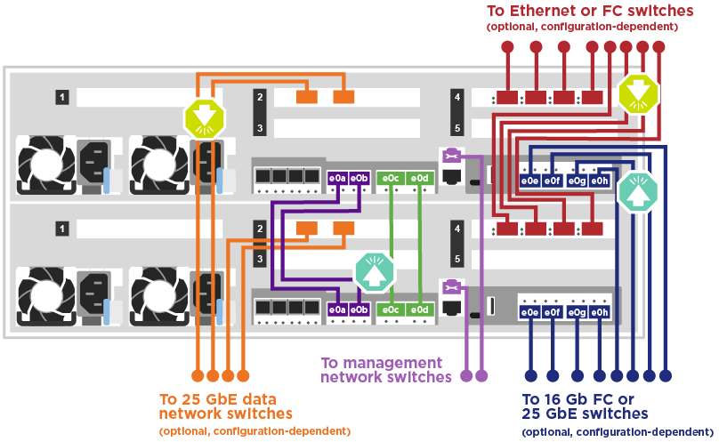
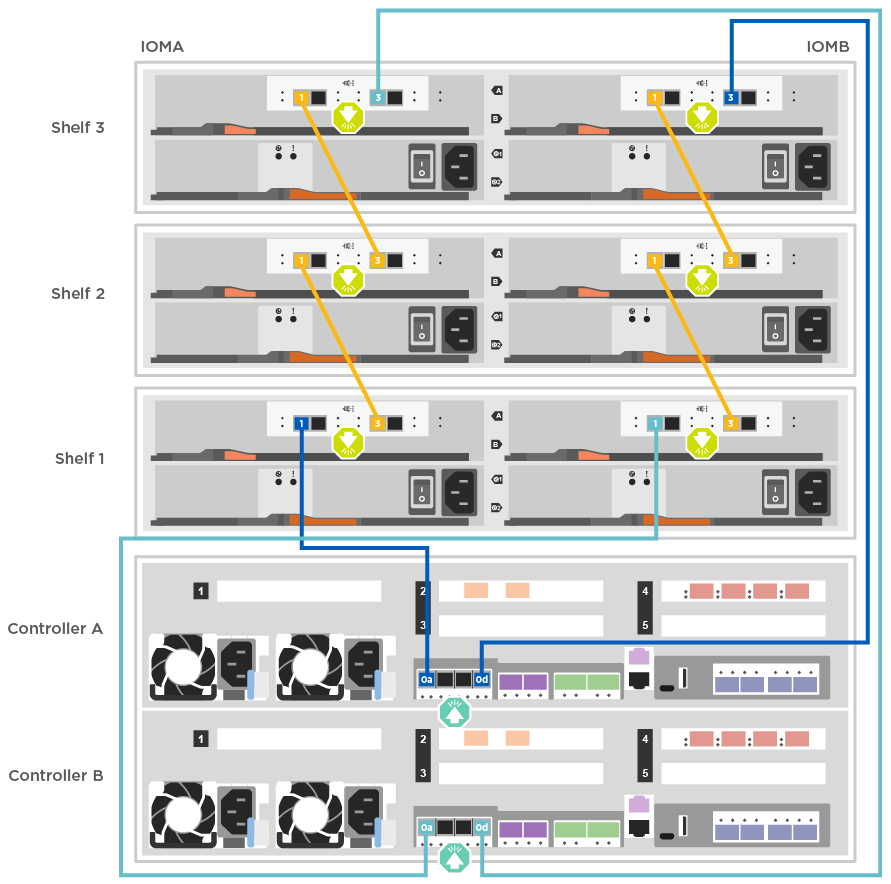

= 상세 가이드 - FAS8300 및 FAS8700
:allow-uri-read: 
:icons: font
:imagesdir: ../media/

[role="lead"]
이 가이드에서는 일반적인 NetApp 시스템 설치를 위한 단계별 지침을 제공합니다. 자세한 설치 지침을 보려면 이 가이드를 사용하십시오.

== 1단계: 설치 준비

시스템을 설치하려면 계정을 만들고 시스템을 등록하고 라이센스 키를 받아야 합니다. 또한 시스템에 맞는 케이블 수와 유형을 확인하고 특정 네트워크 정보를 수집해야 합니다.

사이트 요구 사항에 대한 정보와 구성된 시스템에 대한 추가 정보를 보려면 Hardware Universe에 액세스할 수 있어야 합니다. 이 시스템에 대한 자세한 내용은 사용 중인 ONTAP 버전의 릴리즈 노트에 액세스할 수도 있습니다.

https://hwu.netapp.com["NetApp Hardware Universe를 참조하십시오"^]

http://mysupport.netapp.com/documentation/productlibrary/index.html?productID=62286["사용 중인 ONTAP 9 버전에 대한 릴리즈 노트를 참조하십시오"^]

사이트에서 다음을 제공해야 합니다.

* 스토리지 시스템의 랙 공간입니다
* Phillips #2 드라이버
* 웹 브라우저를 사용하여 시스템을 네트워크 스위치 및 랩톱 또는 콘솔에 연결하는 추가 네트워킹 케이블

.단계
. 모든 상자의 내용물을 풉니다.
. 컨트롤러에서 시스템 일련 번호를 기록합니다.
+
image::../media/drw_ssn_label.png[번호 위치를 보여 주는 시스템 일련 번호의 예입니다]

. 받은 케이블의 수와 유형을 확인하고 기록합니다.
+
다음 표에서는 수신할 수 있는 케이블 유형을 보여 줍니다. 표에 나와 있지 않은 케이블을 받은 경우 를 참조하십시오 https://hwu.netapp.com["NetApp Hardware Universe를 참조하십시오"^] 케이블을 찾아 사용 여부를 확인합니다.

+
[cols="1,2,1,2"]
|===
| 케이블 유형... | 부품 번호 및 길이 | 커넥터 유형 | 대상... 

 a| 
100 GbE 케이블(QSF(28)
 a| 
X66211A-05(112-00595), 0.5m

X66211A-1(112-00573), 1m

X66211A-2(112-00574), 2m

X66211A-5(112-00574), 5m
 a| 
image:../media/oie_cable100_gbe_qsfp28.png["100 GbE QSFP28 커넥터"]
 a| 
스토리지, 클러스터 인터커넥트/HA 및 이더넷 데이터(주문 종속)

 a| 
25 GbE 케이블(SFP 28s)
 a| 
X66240-2(112-00598), 2m

X66240-5(112-00639), 5m
 a| 
image:../media/oie_cable_sfp_gbe_copper.png["GbE SFP 구리 커넥터"]
 a| 
GbE 네트워크 연결(순서에 따라 다름)

 a| 
32 Gb FC(SFP+ Op)
 a| 
X66250-2(112-00342), 2m

X66250-5(112-00344), 5m

X66250-15(112-00346), 15m
 a| 
image:../media/oie_cable_sfp_gbe_copper.png["GbE SFP 구리 커넥터"]
 a| 
FC 네트워크 연결입니다

 a| 
보관 케이블
 a| 
X66030A(112-00435), .5m

X66031A(112-00436), 1m

X66032A(112-00437), 2m

X66033A(112-00438), 3m
 a| 
image:../media/oie_cable_mini_sas_hd_to_mini_sas_hd.png["미니 SAS - 미니 SAS 커넥터"]
 a| 
미니 SAS HD-미니 SAS HD 케이블(주문 종속)

 a| 
광 케이블
 a| 
X66250-2-N-C(112-00342)
 a| 
image:../media/oie_cable_fiber_lc_connector.png["광섬유 LC 커넥터를 보여 주는 그림"]
 a| 
메자닌 카드용 16Gb FC 또는 25GbE 케이블(주문 종속)

 a| 
RJ-45(주문에 따라 다름)
 a| 
X6585-R6(112-00291), 3m

X6562-R6(112-00196), 5m
 a| 
image:../media/oie_cable_rj45.png["RJ-45 케이블 커넥터"]
 a| 
관리 네트워크

 a| 
마이크로 USB 콘솔 케이블
 a| 
해당 없음
 a| 
image:../media/oie_cable_micro_usb.png["마이크로 USB 커넥터를 보여 주는 그림"]
 a| 
노트북 또는 콘솔이 네트워크 검색을 지원하지 않는 경우 소프트웨어 설치 중에 콘솔 연결이 사용됩니다.

 a| 
전원 케이블
 a| 
해당 없음
 a| 
image:../media/oie_cable_power.png["전원 케이블"]
 a| 
시스템 전원을 켭니다

|===
. NetApp ONTAP 구성 가이드_를 검토하고 해당 가이드에 나열된 필수 정보를 수집합니다.
+
https://library.netapp.com/ecm/ecm_download_file/ECMLP2862613["ONTAP 구성 가이드 를 참조하십시오"]

== 2단계: 하드웨어 설치

필요에 따라 4-포스트 랙 또는 NetApp 시스템 캐비닛에 시스템을 설치해야 합니다.

.단계
. 필요에 따라 레일 키트를 설치합니다.
. 레일 키트에 포함된 지침에 따라 시스템을 설치하고 고정합니다.
+

NOTE: 시스템 무게와 관련된 안전 문제를 알고 있어야 합니다.

+
image::../media/drw_katana_lifting_restriction_icon.png[2인 리프트 주의]

. 케이블 관리 장치를 연결합니다(그림 참조).
+
image::../media/drw_a320_cable_management_arms.png[케이블 관리 암 분리 또는 설치]

. 시스템 전면에 베젤을 부착합니다.

== 3단계: 컨트롤러를 네트워크에 케이블로 연결합니다

스위치가 없는 2노드 클러스터 방법을 사용하거나 클러스터 인터커넥트 네트워크를 사용하여 컨트롤러를 네트워크에 케이블로 연결할 수 있습니다.

NOTE: 카드의 포트 레이블이 보이지 않으면 카드 설치 방향(PCIe 커넥터 소켓이 A400 및 FAS8300/8700의 카드 슬롯 왼쪽에 있음)을 확인한 다음 에서 카드를 찾은 후 부품 번호로 카드를 찾습니다 https://hwu.netapp.com["NetApp Hardware Universe를 참조하십시오"^] 포트 레이블을 표시할 베젤의 그래픽입니다. 카드 부품 번호는 를 사용하여 찾을 수 있습니다 `sysconfig -a` 명령 또는 시스템 포장 목록에서 선택합니다.

=== 옵션 1: 스위치가 없는 2노드 클러스터를 케이블로 연결합니다

컨트롤러 모듈의 옵션 데이터 포트, 옵션 NIC 카드 및 관리 포트는 스위치에 연결됩니다. 클러스터 인터커넥트 및 HA 포트는 두 컨트롤러 모듈에 모두 케이블로 연결됩니다.

시스템에 스위치를 연결하는 방법에 대한 자세한 내용은 네트워크 관리자에게 문의해야 합니다.

포트에 케이블을 삽입할 때 케이블 당김 탭의 방향을 확인하십시오. 케이블 당김 탭은 모든 온보드 포트에 대해 위로, 확장(NIC) 카드에서는 아래로 이동합니다.

image::../media/oie_cable_pull_tab_up.png[상단의 당김 탭이 있는 케이블 커넥터]

image::../media/oie_cable_pull_tab_down.png[당김 탭이 있는 케이블 커넥터]

NOTE: 커넥터를 삽입할 때 딸깍 소리가 들려야 합니다. 딸깍 소리가 안 되면 커넥터를 제거하고 회전했다가 다시 시도하십시오.

.단계
. 애니메이션이나 그림을 사용하여 컨트롤러와 스위치 사이의 케이블 연결을 완료합니다.
+
.애니메이션 - 스위치가 없는 2노드 클러스터 케이블링
video::80c4701e-8e4a-408e-96e6-ab1b00666d3f[panopto]
+

. 로 이동합니다 <<4단계: 컨트롤러 케이블을 드라이브 쉘프에 연결합니다>> 드라이브 쉘프 케이블링 지침:

=== 옵션 2: 스위치 클러스터 케이블 연결

컨트롤러 모듈의 옵션 데이터 포트, 옵션 NIC 카드, 메자닌 카드 및 관리 포트는 스위치에 연결됩니다. 클러스터 인터커넥트 및 HA 포트는 클러스터/HA 스위치에 케이블로 연결됩니다.

시스템에 스위치를 연결하는 방법에 대한 자세한 내용은 네트워크 관리자에게 문의해야 합니다.

포트에 케이블을 삽입할 때 케이블 당김 탭의 방향을 확인하십시오. 케이블 당김 탭은 모든 온보드 포트에 대해 위로, 확장(NIC) 카드에서는 아래로 이동합니다.

image::../media/oie_cable_pull_tab_up.png[상단의 당김 탭이 있는 케이블 커넥터]

image::../media/oie_cable_pull_tab_down.png[당김 탭이 있는 케이블 커넥터]

NOTE: 커넥터를 삽입할 때 딸깍 소리가 들려야 합니다. 딸깍 소리가 안 되면 커넥터를 제거하고 회전했다가 다시 시도하십시오.

.단계
. 애니메이션이나 그림을 사용하여 컨트롤러와 스위치 사이의 케이블 연결을 완료합니다.
+
.애니메이션 - 스위치 방식 클러스터 케이블 연결
video::5893b7d4-6f67-4a64-ad89-ab1b006658d1[panopto]
+
image::../media/drw_fas8300_switched_network_cabling.png[스위치 클러스터 네트워크 케이블 연결 다이어그램]

. 로 이동합니다 <<4단계: 컨트롤러 케이블을 드라이브 쉘프에 연결합니다>> 드라이브 쉘프 케이블링 지침:

== 4단계: 컨트롤러 케이블을 드라이브 쉘프에 연결합니다

=== 옵션 1: SAS 드라이브 쉘프에 컨트롤러 케이블을 연결합니다

각 컨트롤러를 두 SAS 드라이브 쉘프의 IOM 모듈에 연결해야 합니다.

그림 화살표에 올바른 케이블 커넥터 당김 탭 방향이 있는지 확인하십시오. DS224-C의 케이블 당김 탭이 내려졌습니다.

image::../media/oie_cable_pull_tab_down.png[당김 탭이 있는 케이블 커넥터]

NOTE: 커넥터를 삽입할 때 딸깍 소리가 들려야 합니다. 딸깍 소리가 안 되면 커넥터를 제거하고 회전했다가 다시 시도하십시오.

.단계
. 다음 애니메이션 또는 그림을 사용하여 컨트롤러를 2개 드라이브 쉘프에 케이블을 연결하십시오.
+
.애니메이션 - SAS 드라이브 쉘프에 컨트롤러 케이블을 연결합니다
video::46c0da0b-6842-449f-b28c-ab1b0066584b[panopto]
+

. 로 이동합니다 <<5단계: 시스템 설치 및 구성을 완료합니다>> 시스템 설치 및 구성을 완료합니다.

== 5단계: 시스템 설치 및 구성을 완료합니다

스위치 및 랩톱에 대한 연결만 제공하는 클러스터 검색을 사용하거나 시스템의 컨트롤러에 직접 연결한 다음 관리 스위치에 연결하여 시스템 설치 및 구성을 완료할 수 있습니다.

=== 옵션 1: 네트워크 검색이 활성화된 경우 시스템 설치 및 구성 완료

랩톱에서 네트워크 검색을 사용하도록 설정한 경우 자동 클러스터 검색을 사용하여 시스템 설정 및 구성을 완료할 수 있습니다.

.단계
. 다음 애니메이션을 사용하여 하나 이상의 드라이브 쉘프 ID를 설정합니다.
+
.애니메이션 - 드라이브 쉘프 ID를 설정합니다
video::c600f366-4d30-481a-89d9-ab1b0066589b[panopto]
. 전원 코드를 컨트롤러 전원 공급 장치에 연결한 다음 다른 회로의 전원 공급 장치에 연결합니다.
. 랩톱에 네트워크 검색이 활성화되어 있는지 확인합니다.
+
자세한 내용은 노트북의 온라인 도움말을 참조하십시오.

. 다음 애니메이션을 사용하여 랩톱을 관리 스위치에 연결합니다.
+
.애니메이션 - 노트북을 관리 스위치에 연결합니다
video::d61f983e-f911-4b76-8b3a-ab1b0066909b[panopto]
. 나열된 ONTAP 아이콘을 선택하여 다음을 검색합니다.
+
image::../media/drw_autodiscovery_controler_select.png[ONTAP 아이콘을 선택합니다]

+
.. 파일 탐색기를 엽니다.
.. 왼쪽 창에서 네트워크를 클릭합니다.
.. 마우스 오른쪽 버튼을 클릭하고 새로 고침을 선택합니다.
.. ONTAP 아이콘을 두 번 클릭하고 화면에 표시된 인증서를 수락합니다.
+

NOTE: xxxxx는 대상 노드의 시스템 일련 번호입니다.

+
System Manager가 열립니다.

. System Manager의 안내에 따라 setup을 사용하여 _NetApp ONTAP 구성 가이드_에서 수집한 데이터를 사용하여 시스템을 구성하십시오.
+
https://library.netapp.com/ecm/ecm_download_file/ECMLP2862613["ONTAP 구성 가이드 를 참조하십시오"]

. 계정 설정 및 Active IQ Config Advisor 다운로드:
+
.. 기존 계정에 로그인하거나 계정을 만듭니다.
+
https://mysupport.netapp.com/eservice/public/now.do["NetApp 지원 등록"]

.. 시스템을 등록합니다.
+
https://mysupport.netapp.com/eservice/registerSNoAction.do?moduleName=RegisterMyProduct["NetApp 제품 등록"]

.. Active IQ Config Advisor를 다운로드합니다.
+
https://mysupport.netapp.com/site/tools/tool-eula/activeiq-configadvisor["NetApp 다운로드: Config Advisor"]

. Config Advisor을 실행하여 시스템의 상태를 확인하십시오.
. 초기 구성을 완료한 후 로 이동합니다 https://www.netapp.com/data-management/oncommand-system-documentation/["ONTAP 및 amp; ONTAP 시스템 관리자 설명서 리소스"] 페이지에서 ONTAP의 추가 기능 구성에 대한 정보를 얻을 수 있습니다.

=== 옵션 2: 네트워크 검색이 활성화되지 않은 경우 시스템 설치 및 구성 완료

랩톱에서 네트워크 검색을 사용하지 않는 경우 이 작업을 사용하여 구성 및 설정을 완료해야 합니다.

.단계
. 랩톱 또는 콘솔 케이블 연결 및 구성:
+
.. 노트북 또는 콘솔의 콘솔 포트를 N-8-1을 사용하여 115,200보드 로 설정합니다.
+

NOTE: 콘솔 포트를 구성하는 방법은 랩톱 또는 콘솔의 온라인 도움말을 참조하십시오.

.. 시스템과 함께 제공된 콘솔 케이블을 사용하여 콘솔 케이블을 랩톱 또는 콘솔에 연결한 다음 랩톱을 관리 서브넷의 관리 스위치에 연결합니다.
.. 관리 서브넷에 있는 TCP/IP 주소를 사용하여 랩톱 또는 콘솔에 할당합니다.

. 다음 애니메이션을 사용하여 하나 이상의 드라이브 쉘프 ID를 설정합니다.
+
.애니메이션 - 드라이브 쉘프 ID를 설정합니다
video::c600f366-4d30-481a-89d9-ab1b0066589b[panopto]
. 전원 코드를 컨트롤러 전원 공급 장치에 연결한 다음 다른 회로의 전원 공급 장치에 연결합니다.
+
FAS8300 및 FAS8700이 표시됩니다.

+
.애니메이션 - 컨트롤러의 전원을 켭니다
video::50cdf200-ede1-45a9-b4b5-ab1b006698d7[panopto]
+

NOTE: 초기 부팅에는 최대 8분이 소요될 수 있습니다.

. 노드 중 하나에 초기 노드 관리 IP 주소를 할당합니다.
+
[cols="1,3"]
|===
| 관리 네트워크에 DHCP가 있는 경우... | 그러면... 

 a| 
구성됨
 a| 
새 컨트롤러에 할당된 IP 주소를 기록합니다.

 a| 
구성되지 않았습니다
 a| 
.. PuTTY, 터미널 서버 또는 해당 환경에 해당하는 를 사용하여 콘솔 세션을 엽니다.
+

NOTE: PuTTY 구성 방법을 모르는 경우 노트북 또는 콘솔의 온라인 도움말을 확인하십시오.

.. 스크립트에 메시지가 표시되면 관리 IP 주소를 입력합니다.

|===
. 랩톱 또는 콘솔에서 System Manager를 사용하여 클러스터를 구성합니다.
+
.. 브라우저에서 노드 관리 IP 주소를 가리킵니다.
+

NOTE: 주소의 형식은 +https://x.x.x.x.+ 입니다

.. NetApp ONTAP 구성 가이드 _ 에서 수집한 데이터를 사용하여 시스템을 구성합니다.
+
https://library.netapp.com/ecm/ecm_download_file/ECMLP2862613["ONTAP 구성 가이드 를 참조하십시오"]

. 계정 설정 및 Active IQ Config Advisor 다운로드:
+
.. 기존 계정에 로그인하거나 계정을 만듭니다.
+
https://mysupport.netapp.com/eservice/public/now.do["NetApp 지원 등록"]

.. 시스템을 등록합니다.
+
https://mysupport.netapp.com/eservice/registerSNoAction.do?moduleName=RegisterMyProduct["NetApp 제품 등록"]

.. Active IQ Config Advisor를 다운로드합니다.
+
https://mysupport.netapp.com/site/tools/tool-eula/activeiq-configadvisor["NetApp 다운로드: Config Advisor"]

. Config Advisor을 실행하여 시스템의 상태를 확인하십시오.
. 초기 구성을 완료한 후 로 이동합니다 https://www.netapp.com/data-management/oncommand-system-documentation/["ONTAP 및 amp; ONTAP 시스템 관리자 설명서 리소스"] 페이지에서 ONTAP의 추가 기능 구성에 대한 정보를 얻을 수 있습니다.

