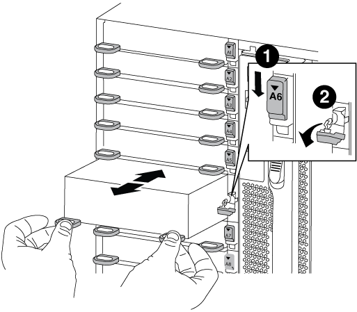

= NVRAM 모듈 또는 NVRAM DIMM-FAS9000을 교체합니다
:allow-uri-read: 
:icons: font
:imagesdir: ../media/

[role="lead"]
NVRAM 모듈은 NVRAM10 및 DIMM과 NVRAM 모듈당 최대 2개의 NVMe SSD Flash Cache 모듈(FlashCache 또는 캐싱 모듈)로 구성됩니다. 장애가 발생한 NVRAM 모듈 또는 NVRAM 모듈 내부의 DIMM을 교체할 수 있습니다.

장애가 발생한 NVRAM 모듈을 교체하려면 섀시에서 모듈을 제거하고, NVRAM 모듈에서 FlashCache 모듈을 제거하고, DIMM을 교체 모듈로 이동하고, FlashCache 모듈을 다시 설치하고, 교체 NVRAM 모듈을 섀시에 설치해야 합니다.

시스템 ID는 NVRAM 모듈에서 파생되므로 모듈을 교체할 경우 시스템에 속한 디스크가 새 시스템 ID로 재할당됩니다.

* 시작하기 전에 *

* 모든 디스크 쉘프가 올바로 작동하고 있어야 합니다.
* 시스템이 HA 쌍 내에 있는 경우 파트너 노드가 교체할 NVRAM 모듈과 연결된 노드를 인수할 수 있어야 합니다.
* 이 절차에서는 다음과 같은 용어를 사용합니다.
+
** impaired_node는 유지 관리를 수행하는 노드입니다.
** healy_node는 장애가 발생한 노드의 HA 파트너입니다.

* 이 절차에는 새 NVRAM 모듈과 연결된 컨트롤러 모듈에 디스크를 자동 또는 수동으로 재할당하는 단계가 포함되어 있습니다. 이 절차에서 로 지정된 경우 디스크를 재할당해야 합니다. 반환 전에 디스크 재할당을 완료하면 문제가 발생할 수 있습니다.
* 오류가 발생한 구성 요소를 공급업체로부터 받은 교체 FRU 구성 요소로 교체해야 합니다.
* 이 절차의 일부로 디스크 또는 디스크 쉘프를 변경할 수 없습니다.

== 1단계: 손상된 컨트롤러를 종료합니다

다음 옵션 중 하나를 사용하여 컨트롤러를 종료하거나 손상된 컨트롤러를 인수합니다.

[role="tabbed-block"]
====
.옵션 1: 대부분의 시스템
--
손상된 컨트롤러를 종료하려면 컨트롤러 상태를 확인하고, 필요한 경우 정상적인 컨트롤러가 손상된 컨트롤러 스토리지에서 데이터를 계속 제공할 수 있도록 컨트롤러를 인수해야 합니다.

.이 작업에 대해
* NetApp Storage Encryption을 사용하는 경우 의 지침에 따라 MSID를 재설정해야 합니다 link:https://docs.netapp.com/us-en/ontap/encryption-at-rest/return-seds-unprotected-mode-task.html["SED를 보호되지 않는 모드로 되돌리는 중입니다"].
* SAN 시스템을 사용하는 경우 이벤트 메시지를 확인해야 합니다  `cluster kernel-service show`) 손상된 컨트롤러 SCSI 블레이드의 경우. 를 클릭합니다 `cluster kernel-service show` 명령은 노드 이름, 해당 노드의 쿼럼 상태, 해당 노드의 가용성 상태 및 해당 노드의 작동 상태를 표시합니다.
+
각 SCSI 블레이드 프로세스는 클러스터의 다른 노드와 함께 쿼럼에 있어야 합니다. 교체를 진행하기 전에 모든 문제를 해결해야 합니다.

* 노드가 2개 이상인 클러스터가 있는 경우 쿼럼에 있어야 합니다. 클러스터가 쿼럼에 없거나 정상 컨트롤러에 자격 및 상태에 대해 FALSE가 표시되는 경우 손상된 컨트롤러를 종료하기 전에 문제를 해결해야 합니다(참조) link:https://docs.netapp.com/us-en/ontap/system-admin/synchronize-node-cluster-task.html?q=Quorum["노드를 클러스터와 동기화합니다"^].

.단계
. AutoSupport가 활성화된 경우 'system node AutoSupport invoke -node * -type all-message MAINT=number_of_hours_downh' AutoSupport 메시지를 호출하여 자동 케이스 생성을 억제합니다
+
다음 AutoSupport 메시지는 2시간 동안 자동 케이스 생성을 억제합니다. `cluster1:> system node autosupport invoke -node * -type all -message MAINT=2h`

. 정상적인 컨트롤러의 콘솔에서 'Storage failover modify – node local - auto-반환 false'를 자동으로 반환합니다
+

NOTE: 자동 반환을 비활성화하시겠습니까?_가 표시되면 'y'를 입력합니다.

. 손상된 컨트롤러를 로더 프롬프트로 가져가십시오.
+
[cols="1,2"]
|===
| 손상된 컨트롤러가 표시되는 경우... | 그러면... 

 a| 
LOADER 메시지가 표시됩니다
 a| 
컨트롤러 모듈 제거 로 이동합니다.

 a| 
반환 대기 중...
 a| 
Ctrl-C를 누른 다음 메시지가 나타나면 y를 누릅니다.

 a| 
시스템 프롬프트 또는 암호 프롬프트
 a| 
정상적인 컨트롤러 'storage failover takeover -ofnode_impaired_node_name_'에서 손상된 컨트롤러를 인수하거나 중단합니다

손상된 컨트롤러에 기브백을 기다리는 중... 이 표시되면 Ctrl-C를 누른 다음 y를 응답합니다.

|===

--
.옵션 2: 컨트롤러가 2노드 MetroCluster에 있습니다
--
손상된 컨트롤러를 종료하려면 컨트롤러 상태를 확인하고, 필요한 경우 컨트롤러 전원을 전환하여 정상적인 컨트롤러가 손상된 컨트롤러 스토리지에서 데이터를 계속 제공하도록 해야 합니다.

.이 작업에 대해
* NetApp Storage Encryption을 사용하는 경우 의 "FIPS 드라이브 또는 SED를 보호되지 않는 모드로 되돌리기" 섹션의 지침에 따라 MSID를 재설정해야 합니다 link:https://docs.netapp.com/us-en/ontap/encryption-at-rest/return-seds-unprotected-mode-task.html["CLI를 통한 NetApp 암호화 개요"^].
* 정상 컨트롤러에 전원을 공급하려면 이 절차의 마지막에 전원 공급 장치를 켜 두어야 합니다.

.단계
. MetroCluster 상태를 확인하여 장애가 있는 컨트롤러가 자동으로 정상 컨트롤러(MetroCluster show)로 전환되었는지 확인합니다
. 자동 절체가 발생했는지 여부에 따라 다음 표에 따라 진행합니다.
+
[cols="1,2"]
|===
| 컨트롤러 손상 여부 | 그러면... 

 a| 
가 자동으로 전환되었습니다
 a| 
다음 단계를 진행합니다.

 a| 
가 자동으로 전환되지 않았습니다
 a| 
정상 컨트롤러 MetroCluster 절체 기능을 통해 계획된 절체 동작을 수행한다

 a| 
가 자동으로 전환되지 않고, 'MetroCluster switchover' 명령으로 전환을 시도했으며, 스위치오버가 거부되었습니다
 a| 
거부권 메시지를 검토하고 가능한 경우 문제를 해결한 후 다시 시도하십시오. 문제를 해결할 수 없는 경우 기술 지원 부서에 문의하십시오.

|===
. 정상적인 클러스터에서 'MetroCluster 환원 단계 집계' 명령을 실행하여 데이터 애그리게이트를 재동기화합니다.
+
[listing]
----
controller_A_1::> metrocluster heal -phase aggregates
[Job 130] Job succeeded: Heal Aggregates is successful.
----
+
치유가 거부되면 '-override-vetoes' 매개 변수를 사용하여 'MetroCluster 환원' 명령을 재실행할 수 있습니다. 이 선택적 매개 변수를 사용하는 경우 시스템은 복구 작업을 방지하는 모든 소프트 베인을 재정의합니다.

. MetroCluster operation show 명령을 사용하여 작업이 완료되었는지 확인합니다.
+
[listing]
----
controller_A_1::> metrocluster operation show
    Operation: heal-aggregates
      State: successful
Start Time: 7/25/2016 18:45:55
   End Time: 7/25/2016 18:45:56
     Errors: -
----
. 'storage aggregate show' 명령을 사용하여 애그리게이트의 상태를 확인하십시오.
+
[listing]
----
controller_A_1::> storage aggregate show
Aggregate     Size Available Used% State   #Vols  Nodes            RAID Status
--------- -------- --------- ----- ------- ------ ---------------- ------------
...
aggr_b2    227.1GB   227.1GB    0% online       0 mcc1-a2          raid_dp, mirrored, normal...
----
. MetroCluster 환원 단계 루트 애그리게이트( heal-phase root-aggregate) 명령을 사용하여 루트 애그리게이트를 수정합니다.
+
[listing]
----
mcc1A::> metrocluster heal -phase root-aggregates
[Job 137] Job succeeded: Heal Root Aggregates is successful
----
+
치유가 거부되면 -override-vetoes 매개변수를 사용하여 'MetroCluster 환원' 명령을 재실행할 수 있습니다. 이 선택적 매개 변수를 사용하는 경우 시스템은 복구 작업을 방지하는 모든 소프트 베인을 재정의합니다.

. 대상 클러스터에서 'MetroCluster operation show' 명령을 사용하여 환원 작업이 완료되었는지 확인합니다.
+
[listing]
----

mcc1A::> metrocluster operation show
  Operation: heal-root-aggregates
      State: successful
 Start Time: 7/29/2016 20:54:41
   End Time: 7/29/2016 20:54:42
     Errors: -
----
. 손상된 컨트롤러 모듈에서 전원 공급 장치를 분리합니다.

--
====

== 2단계: NVRAM 모듈을 교체합니다

NVRAM 모듈을 장착하려면 섀시의 슬롯 6에서 모듈을 찾은 다음 특정 단계를 따릅니다.

.단계
. 아직 접지되지 않은 경우 올바르게 접지하십시오.
. 이전 NVRAM 모듈에서 새 NVRAM 모듈로 FlashCache 모듈을 이동합니다.
+
image::../media/drw_9000_remove_flashcache.png[drw 9000이 FlashCache를 제거합니다]

+
|===

 a| 
image:../media/legend_icon_01.png["설명선 번호 1"]
 a| 
주황색 분리 단추(비어 있는 FlashCache 모듈의 경우 회색)

 a| 
image:../media/legend_icon_02.png["설명선 번호 2"]
 a| 
FlashCache 캠 핸들

|===
+
.. FlashCache 모듈 앞면에 있는 주황색 단추를 누릅니다.
+

NOTE: 비어 있는 FlashCache 모듈의 분리 단추가 회색입니다.

.. 모듈이 이전 NVRAM 모듈에서 빠져나올 때까지 캠 핸들을 바깥쪽으로 돌립니다.
.. 모듈 캠 핸들을 잡고 NVRAM 모듈에서 밀어낸 다음 새 NVRAM 모듈의 전면에 삽입합니다.
.. FlashCache 모듈을 NVRAM 모듈에 완전히 밀어 넣은 다음 모듈이 제자리에 잠길 때까지 캠 핸들을 돌려 닫습니다.

. 섀시에서 대상 NVRAM 모듈을 분리합니다.
+
.. 문자 및 번호가 매겨진 캠 버튼을 누릅니다.
+
캠 버튼이 섀시에서 멀어져 있습니다.

.. 캠 래치가 수평 위치에 올 때까지 아래로 돌립니다.
+
NVRAM 모듈은 섀시에서 분리되어 몇 인치 정도 밖으로 이동합니다.

.. 모듈 면의 측면에 있는 당김 탭을 당겨 섀시에서 NVRAM 모듈을 분리합니다.
+

+
|===

 a| 
image:../media/legend_icon_01.png["설명선 번호 1"]
 a| 
문자 및 숫자 I/O 캠 래치

 a| 
image:../media/legend_icon_02.png["설명선 번호 2"]
 a| 
I/O 래치가 완전히 잠금 해제되었습니다

|===

. NVRAM 모듈을 안정적인 표면에 놓고 덮개의 파란색 잠금 버튼을 눌러 NVRAM 모듈에서 덮개를 분리한 다음 파란색 버튼을 누른 상태에서 NVRAM 모듈의 덮개를 밀어 분리합니다.
+
image::../media/drw_9000_remove_nvram_module_contents.png[drw 9000은 NVRAM 모듈 내용을 제거합니다]

+
|===

 a| 
image:../media/legend_icon_01.png["설명선 번호 1"]
 a| 
커버 잠금 버튼

 a| 
image:../media/legend_icon_02.png["설명선 번호 2"]
 a| 
DIMM 및 DIMM 이젝터 탭

|===
. 이전 NVRAM 모듈에서 한 번에 하나씩 DIMM을 분리하여 교체용 NVRAM 모듈에 설치합니다.
. 모듈의 덮개를 닫습니다.
. 교체용 NVRAM 모듈을 섀시에 설치합니다.
+
.. 슬롯 6의 섀시 입구 가장자리에 모듈을 맞춥니다.
.. 문자 및 번호가 매겨진 I/O 캠 래치가 I/O 캠 핀과 맞물릴 때까지 모듈을 슬롯에 부드럽게 밀어 넣은 다음 I/O 캠 래치를 완전히 위로 밀어 모듈을 제자리에 고정합니다.

== 3단계: NVRAM DIMM을 교체합니다

NVRAM 모듈에서 NVRAM DIMM을 교체하려면 NVRAM 모듈을 분리하고 모듈을 연 다음 대상 DIMM을 교체해야 합니다.

.단계
. 아직 접지되지 않은 경우 올바르게 접지하십시오.
. 섀시에서 대상 NVRAM 모듈을 분리합니다.
+
.. 문자 및 번호가 매겨진 캠 버튼을 누릅니다.
+
캠 버튼이 섀시에서 멀어져 있습니다.

.. 캠 래치가 수평 위치에 올 때까지 아래로 돌립니다.
+
NVRAM 모듈은 섀시에서 분리되어 몇 인치 정도 밖으로 이동합니다.

.. 모듈 면의 측면에 있는 당김 탭을 당겨 섀시에서 NVRAM 모듈을 분리합니다.
+

+
|===

 a| 
image:../media/legend_icon_01.png["설명선 번호 1"]
 a| 
문자 및 숫자 I/O 캠 래치

 a| 
image:../media/legend_icon_02.png["설명선 번호 2"]
 a| 
I/O 래치가 완전히 잠금 해제되었습니다

|===

. NVRAM 모듈을 안정적인 표면에 놓고 덮개의 파란색 잠금 버튼을 눌러 NVRAM 모듈에서 덮개를 분리한 다음 파란색 버튼을 누른 상태에서 NVRAM 모듈의 덮개를 밀어 분리합니다.
+
image::../media/drw_9000_remove_nvram_module_contents.png[drw 9000은 NVRAM 모듈 내용을 제거합니다]

+
|===

 a| 
image:../media/legend_icon_01.png["설명선 번호 1"]
 a| 
커버 잠금 버튼

 a| 
image:../media/legend_icon_02.png["설명선 번호 2"]
 a| 
DIMM 및 DIMM 이젝터 탭

|===
. NVRAM 모듈 내부에서 교체할 DIMM을 찾은 다음 DIMM 잠금 탭을 누르고 소켓에서 DIMM을 들어올려 분리합니다.
. DIMM을 소켓에 맞추고 잠금 탭이 제자리에 잠길 때까지 DIMM을 소켓에 부드럽게 밀어 넣어 교체 DIMM을 설치합니다.
. 모듈의 덮개를 닫습니다.
. 교체용 NVRAM 모듈을 섀시에 설치합니다.
+
.. 슬롯 6의 섀시 입구 가장자리에 모듈을 맞춥니다.
.. 문자 및 번호가 매겨진 I/O 캠 래치가 I/O 캠 핀과 맞물릴 때까지 모듈을 슬롯에 부드럽게 밀어 넣은 다음 I/O 캠 래치를 완전히 위로 밀어 모듈을 제자리에 고정합니다.

== 4단계: FRU 교체 후 컨트롤러를 재부팅합니다

FRU를 교체한 후에는 컨트롤러 모듈을 재부팅해야 합니다.

.단계
. LOADER 프롬프트에서 ONTAP를 부팅하려면 bye를 입력합니다.

== 5단계: 디스크를 다시 할당합니다

HA 쌍 또는 2노드 MetroCluster 구성에 따라 디스크 재할당을 새 컨트롤러 모듈로 확인하거나 디스크를 수동으로 재할당해야 합니다.

디스크를 새 컨트롤러에 재할당하는 방법에 대한 지침을 보려면 다음 옵션 중 하나를 선택하십시오.

[role="tabbed-block"]
====
.옵션 1: ID 확인(HA 쌍)
--
.HA 시스템의 시스템 ID 변경을 확인합니다
replacement_node를 부팅할 때 시스템 ID 변경을 확인한 다음 변경이 구현되었는지 확인해야 합니다.

이 절차는 HA 쌍에서 ONTAP를 실행하는 시스템에만 적용됩니다.

.단계
. 교체 노드가 유지보수 모드("*>" 프롬프트 표시)인 경우 유지보수 모드를 종료하고 로더 프롬프트로 이동합니다
. 교체 노드의 LOADER 프롬프트에서 노드를 부팅하고 시스템 ID 불일치로 인해 시스템 ID를 재정의하라는 메시지가 표시되면 y를 입력합니다.
+
boot_ONTAP bye

+
자동 부팅이 설정된 경우 노드가 재부팅됩니다.

. replacement_node 콘솔에 'waiting for 반환...' 메시지가 표시될 때까지 기다린 후 정상적인 노드에서 새 파트너 시스템 ID가 자동으로 할당되었는지 확인합니다. 'storage failover show
+
명령 출력에는 손상된 노드에서 시스템 ID가 변경되었다는 메시지와 함께 올바른 이전 및 새 ID가 표시되어야 합니다. 다음 예제에서 node2는 교체를 거쳤으며 새 시스템 ID가 151759706입니다.

+
[listing]
----
node1> `storage failover show`
                                    Takeover
Node              Partner           Possible     State Description
------------      ------------      --------     -------------------------------------
node1             node2             false        System ID changed on partner (Old:
                                                  151759755, New: 151759706), In takeover
node2             node1             -            Waiting for giveback (HA mailboxes)
----
. 정상 노드에서 코어 덤프가 저장되었는지 확인합니다.
+
.. 고급 권한 수준 'Set-Privilege advanced'로 변경합니다
+
고급 모드로 계속 진행하라는 메시지가 나타나면 Y로 응답할 수 있습니다. 고급 모드 프롬프트가 나타납니다(*>).

.. 모든 코어 덤프를 저장합니다. 'system node run-node_local-node-name_partner savecore'
.. 반환 명령을 실행하기 전에 'avecore' 명령이 완료될 때까지 기다리십시오.
+
다음 명령을 입력하여 savecore 명령의 진행 상태를 모니터링할 수 있습니다. 'system node run-node_local-node-name_partner savecore -s'

.. admin 권한 수준으로 복귀:'et-Privilege admin'입니다

. 노드를 돌려줍니다.
+
.. 정상 노드에서 교체된 노드의 스토리지, 즉 'storage failover 반환 - ofnode_replacement_node_name_'을 반환하십시오
+
replacement_node는 스토리지를 다시 가져와 부팅을 완료합니다.

+
시스템 ID 불일치로 인해 시스템 ID를 무시하라는 메시지가 나타나면 y를 입력해야 합니다.

+

NOTE: 기브백이 거부되면 거부권을 재정의할 수 있습니다.

+
http://mysupport.netapp.com/documentation/productlibrary/index.html?productID=62286["사용 중인 ONTAP 9 버전에 대한 고가용성 구성 가이드를 찾아보십시오"]

.. 기브백이 완료된 후 HA 쌍이 정상 작동 중인지, 그리고 테이크오버가 가능한지, 즉 '스토리지 페일오버 표시'인지 확인합니다
+
'storage failover show' 명령의 출력에는 'system ID changed on partner' 메시지가 포함되지 않아야 한다.

. 디스크가 제대로 할당되었는지 확인합니다. '스토리지 디스크 표시-소유권'
+
replacement_node에 속한 디스크는 새 시스템 ID를 표시해야 합니다. 다음 예에서는 노드 1이 소유한 디스크에 새 시스템 ID 1873775277이 표시됩니다.

+
[listing]
----
node1> `storage disk show -ownership`

Disk  Aggregate Home  Owner  DR Home  Home ID    Owner ID  DR Home ID Reserver  Pool
----- ------    ----- ------ -------- -------    -------    -------  ---------  ---
1.0.0  aggr0_1  node1 node1  -        1873775277 1873775277  -       1873775277 Pool0
1.0.1  aggr0_1  node1 node1           1873775277 1873775277  -       1873775277 Pool0
.
.
.
----
. 시스템이 MetroCluster 구성인 경우 'MetroCluster node show' 노드의 상태를 모니터링한다
+
MetroCluster 구성을 정상 상태로 되돌리려면 교체 후 몇 분 정도 걸리며, 이때 각 노드에 구성된 상태가 표시되며 DR 미러링이 활성화되고 정상 모드가 표시됩니다. MetroCluster node show-fields node-systemid 명령 출력은 MetroCluster 구성이 정상 상태로 돌아갈 때까지 이전 시스템 ID를 표시합니다.

. 노드가 MetroCluster 구성에 있는 경우 MetroCluster 상태에 따라 원래 소유자가 재해 사이트의 노드인 경우 DR 홈 ID 필드에 디스크의 원래 소유자가 표시되는지 확인합니다.
+
다음 두 조건이 모두 참인 경우 이 작업이 필요합니다.

+
** MetroCluster 구성이 전환 상태입니다.
** replacement_node는 재해 사이트에 있는 디스크의 현재 소유자입니다.
+
https://docs.netapp.com/us-en/ontap-metrocluster/manage/concept_understanding_mcc_data_protection_and_disaster_recovery.html#disk-ownership-changes-during-ha-takeover-and-metrocluster-switchover-in-a-four-node-metrocluster-configuration["4노드 MetroCluster 구성에서 HA 테이크오버 및 MetroCluster 스위치오버 중에 디스크 소유권이 변경됩니다"]

. 시스템이 MetroCluster 구성인 경우 각 노드가 'MetroCluster node show-fields configuration-state'로 구성되어 있는지 확인합니다
+
[listing]
----
node1_siteA::> metrocluster node show -fields configuration-state

dr-group-id            cluster node           configuration-state
-----------            ---------------------- -------------- -------------------
1 node1_siteA          node1mcc-001           configured
1 node1_siteA          node1mcc-002           configured
1 node1_siteB          node1mcc-003           configured
1 node1_siteB          node1mcc-004           configured

4 entries were displayed.
----
. 각 노드에 대해 예상되는 볼륨이 'vol show-node-name'인지 확인합니다
. 재부팅 시 자동 테이크오버 기능을 비활성화한 경우 정상 노드인 'storage failover modify -node replacement -node -name -onreboot true'에서 활성화하십시오

--
.옵션 2: ID 재할당(MetroCluster 구성)
--
.2노드 MetroCluster 구성에서 시스템 ID를 재할당합니다
ONTAP를 실행하는 2노드 MetroCluster 구성에서는 시스템을 정상 운영 상태로 되돌리기 전에 디스크를 새 컨트롤러의 시스템 ID로 수동으로 재할당해야 합니다.

.이 작업에 대해
이 절차는 ONTAP를 실행하는 2노드 MetroCluster 구성의 시스템에만 적용됩니다.

이 절차에서 올바른 노드에 대한 명령을 실행해야 합니다.

* impaired_node는 유지 관리를 수행하는 노드입니다.
* replacement_node는 이 절차의 일부로 손상된 노드를 교체한 새 노드입니다.
* healthy_node는 손상된 노드의 DR 파트너입니다.

.단계
. 아직 재부팅하지 않았다면 _replacement_node를 재부팅하고 "Ctrl-C"를 입력하여 부팅 프로세스를 중단한 다음 표시된 메뉴에서 유지보수 모드로 부팅하는 옵션을 선택하십시오.
+
시스템 ID 불일치로 인해 시스템 ID를 무시하라는 메시지가 나타나면 Y를 입력해야 합니다.

. 정상 노드의 기존 시스템 ID를 보면 MetroCluster node show-fields node-systemid, dr-partner-systemid가 보입니다
+
이 예에서 Node_B_1은 이전 시스템 ID가 11807329인 이전 노드입니다.

+
[listing]
----
dr-group-id cluster         node                 node-systemid dr-partner-systemid
 ----------- --------------------- -------------------- ------------- -------------------
 1           Cluster_A             Node_A_1             536872914     118073209
 1           Cluster_B             Node_B_1             118073209     536872914
 2 entries were displayed.
----
. 손상된 노드의 유지보수 모드 프롬프트에서 새 시스템 ID를 확인합니다. "디스크 쇼"
+
이 예에서 새 시스템 ID는 118065481입니다.

+
[listing]
----
Local System ID: 118065481
    ...
    ...
----
. disk show 명령인 'disk reassign-s old system ID'에서 얻은 시스템 ID 정보를 사용하여 디스크 소유권(FAS 시스템의 경우) 또는 LUN 소유권(FlexArray 시스템의 경우)을 재할당합니다
+
위의 예시에서 명령어의 내용은 '디스크 재할당-s 118073209'이다

+
계속하라는 메시지가 나타나면 Y로 응답할 수 있습니다.

. 디스크(또는 FlexArray LUN)가 올바르게 할당되었는지 확인합니다. disk show-a입니다
+
replacement_node에 속한 디스크에 _replacement_node의 새 시스템 ID가 표시되는지 확인합니다. 다음 예에서는 system-1에서 소유한 디스크에 새 시스템 ID 118065481이 표시됩니다.

+
[listing]
----
*> disk show -a
Local System ID: 118065481

  DISK     OWNER                 POOL   SERIAL NUMBER  HOME
-------    -------------         -----  -------------  -------------
disk_name   system-1  (118065481) Pool0  J8Y0TDZC       system-1  (118065481)
disk_name   system-1  (118065481) Pool0  J8Y09DXC       system-1  (118065481)
.
.
.
----
. 정상 노드에서 코어 덤프가 저장되었는지 확인합니다.
+
.. 고급 권한 수준 'Set-Privilege advanced'로 변경합니다
+
고급 모드로 계속 진행하라는 메시지가 나타나면 Y로 응답할 수 있습니다. 고급 모드 프롬프트가 나타납니다(*>).

.. 코어 덤프가 저장되었는지 확인합니다. 'system node run-node_local-node-name_partner savecore'
+
명령 출력에 savecore가 진행 중임을 나타내는 경우 savecore가 완료될 때까지 기다린 다음 반환 명령을 실행합니다. 'system node run-node_local-node-name_partner savecore -s command'를 사용하여 savecore의 진행률을 모니터링할 수 있습니다.</info>

.. admin 권한 수준으로 복귀:'et-Privilege admin'입니다

. replacement_node가 유지보수 모드(*> 프롬프트 표시)인 경우 유지보수 모드를 종료하고 로더 프롬프트인 "halt"로 이동합니다
. replacement_node: boot_ontap를 부팅합니다
. replacement_node가 완전히 부팅된 후 스위치백(MetroCluster 스위치백)을 수행합니다
. MetroCluster 설정 'MetroCluster node show-fields configuration-state'를 확인한다
+
[listing]
----
node1_siteA::> metrocluster node show -fields configuration-state

dr-group-id            cluster node           configuration-state
-----------            ---------------------- -------------- -------------------
1 node1_siteA          node1mcc-001           configured
1 node1_siteA          node1mcc-002           configured
1 node1_siteB          node1mcc-003           configured
1 node1_siteB          node1mcc-004           configured

4 entries were displayed.
----
. Data ONTAP에서 MetroCluster 구성 작동을 확인합니다.
+
.. 두 클러스터에 대한 상태 경고 '시스템 상태 알림 표시'를 확인합니다
.. MetroCluster가 구성되어 있고 'MetroCluster show'(정상 모드)로 설정되어 있는지 확인합니다
.. 'MetroCluster check run'이라는 MetroCluster check을 수행한다
.. MetroCluster 체크 표시 결과를 MetroCluster check show로 출력한다
.. Config Advisor를 실행합니다. NetApp Support 사이트 의 Config Advisor 페이지로 이동합니다 http://support.netapp.com/NOW/download/tools/config_advisor/["support.netapp.com/NOW/download/tools/config_advisor/"].
+
Config Advisor를 실행한 후 도구의 출력을 검토하고 출력에서 권장 사항을 따라 발견된 문제를 해결하십시오.

. 스위치오버 작업 시뮬레이션:
+
.. 노드 프롬프트에서 고급 권한 레벨 'Set-Privilege Advanced'로 변경합니다
+
고급 모드로 계속 진행하고 고급 모드 프롬프트(*>)를 보려면 "y"로 응답해야 합니다.

.. simulate parameter: MetroCluster switchover-simulate로 스위치백 동작을 수행한다
.. admin 권한 수준으로 복귀:'et-Privilege admin'입니다

--
====

== 6단계: 스토리지 및 볼륨 암호화 기능 복원

이전에 스토리지 또는 볼륨 암호화를 사용하도록 구성한 스토리지 시스템의 경우 무중단 암호화 기능을 제공하기 위해 추가 단계를 수행해야 합니다. 스토리지 또는 볼륨 암호화가 설정되지 않은 스토리지 시스템에서 이 작업을 건너뛸 수 있습니다.

NOTE: DIMM을 교체할 때는 이 단계가 필요하지 않습니다.

.단계
. 온보드 키 관리를 사용하는지 또는 외부 키 관리를 사용하는지 여부에 따라 다음 절차 중 하나를 사용하십시오.
+
** https://docs.netapp.com/us-en/ontap/encryption-at-rest/restore-onboard-key-management-encryption-keys-task.html["온보드 키 관리 암호화 키를 복원합니다"^]
** https://docs.netapp.com/us-en/ontap/encryption-at-rest/restore-external-encryption-keys-93-later-task.html["외부 키 관리 암호화 키를 복원합니다"^]

. SED MSID를 재설정합니다

== 7단계: 장애가 발생한 부품을 NetApp에 반환

키트와 함께 제공된 RMA 지침에 설명된 대로 오류가 발생한 부품을 NetApp에 반환합니다. 를 참조하십시오 https://mysupport.netapp.com/site/info/rma["부품 반품 및 앰프, 교체"] 페이지를 참조하십시오.
