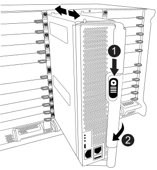
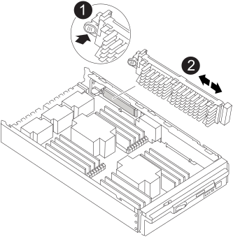
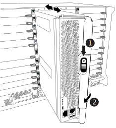

= 컨트롤러 모듈 하드웨어 FAS9500을 교체합니다
:allow-uri-read: 
:icons: font
:imagesdir: ../media/

[role="lead"]
컨트롤러 모듈 하드웨어를 교체하려면 손상된 노드를 제거하고, FRU 구성 요소를 교체 컨트롤러 모듈로 이동한 다음, 교체 컨트롤러 모듈을 섀시에 설치하고, 시스템을 유지보수 모드로 부팅해야 합니다.

다음 애니메이션은 손상된 부품을 교체 컨트롤러로 이동하는 전체 과정을 보여줍니다.

.애니메이션 - 컨트롤러 모듈 교체, 프로세스 완료
video::dc8d4acb-e061-45dd-8a0e-ae78004b6974[panopto]

== 1단계: 컨트롤러 모듈을 분리합니다

컨트롤러 내의 구성 요소에 액세스하려면 먼저 시스템에서 컨트롤러 모듈을 분리한 다음 컨트롤러 모듈의 덮개를 분리해야 합니다.

. 아직 접지되지 않은 경우 올바르게 접지하십시오.
. 손상된 컨트롤러 모듈에서 케이블을 뽑고 케이블이 연결된 위치를 추적합니다.
. 캠 핸들의 테라코타 버튼이 잠금 해제될 때까지 아래로 밉니다.
+
.애니메이션 - 컨트롤러 모듈을 제거합니다
video::5e029a19-8acc-4fa1-be5d-ae78004b365a[panopto]
+

+
[cols="20%,80%"]
|===

 a| 
image::../media/icon_round_1.png[설명선 번호 1]
 a| 
캠 핸들 해제 버튼

 a| 
image::../media/icon_round_2.png[설명선 번호 2]
 a| 
캠 핸들

|===
. 캠 핸들을 돌려 컨트롤러 모듈을 섀시에서 완전히 분리한 다음 컨트롤러 모듈을 섀시 밖으로 밉니다.
+
컨트롤러 모듈 하단을 섀시 밖으로 밀어낼 때 지지하는지 확인합니다.

. 컨트롤러 모듈 덮개를 평평하고 안정적인 곳에 놓고 덮개의 파란색 단추를 누르고 덮개를 컨트롤러 모듈 뒤쪽으로 민 다음 덮개를 위로 돌려 컨트롤러 모듈에서 들어올립니다.
+
image::../media/drw_9500_PCM_open.svg[컨트롤러를 엽니다]

[cols="20%,80%"]
|===

 a| 
image::../media/icon_round_1.png[설명선 번호 1]
 a| 
컨트롤러 모듈 커버 잠금 버튼

|===

== 2단계: 부팅 미디어를 이동합니다

부팅 미디어를 찾아 지침에 따라 이전 컨트롤러에서 제거한 다음 새 컨트롤러에 삽입해야 합니다.

. 다음 그림 또는 컨트롤러 모듈의 FRU 맵을 사용하여 부팅 미디어를 찾습니다.
+

+
[cols="20%,80%"]
|===

 a| 
image::../media/icon_round_1.png[설명선 번호 1]
 a| 
분리 탭을 누릅니다

 a| 
image::../media/icon_round_2.png[설명선 번호 2]
 a| 
미디어를 부팅합니다

|===
. 부트 미디어 하우징의 파란색 버튼을 눌러 하우징에서 부트 미디어를 분리한 다음 부트 미디어 소켓에서 조심스럽게 똑바로 당겨 빼냅니다.
+

NOTE: 부트 미디어가 소켓 또는 부트 미디어를 손상시킬 수 있으므로 비틀거나 위로 잡아 당기지 마십시오.

. 부트 미디어를 새 컨트롤러 모듈로 옮기고 부트 미디어의 가장자리를 소켓 하우징에 맞춘 다음 소켓에 부드럽게 밀어 넣습니다.
. 부팅 미디어가 소켓에 똑바로 완전히 장착되었는지 확인합니다.
+
필요한 경우 부팅 미디어를 분리하고 소켓에 재장착합니다.

. 부트 미디어를 아래로 눌러 부트 미디어 하우징의 잠금 버튼을 누릅니다.

== 3단계: 시스템 DIMM을 이동합니다

DIMM을 이동하려면 이전 컨트롤러에서 교체 컨트롤러로 이동하여 특정 단계를 따릅니다.

NOTE: VER2 컨트롤러에는 DIMM 소켓이 적습니다. 지원되는 DIMM의 수를 줄이거나 DIMM 소켓 번호 지정에 변화가 없습니다. DIMM을 새 컨트롤러 모듈로 이동할 때 손상된 컨트롤러 모듈과 동일한 소켓 번호/위치에 DIMM을 설치합니다.  DIMM 소켓 위치는 VER2 컨트롤러 모듈의 FRU 맵 다이어그램을 참조하십시오.

. 아직 접지되지 않은 경우 올바르게 접지하십시오.
. 컨트롤러 모듈에서 DIMM을 찾습니다.
. DIMM을 올바른 방향으로 교체 컨트롤러 모듈에 삽입할 수 있도록 소켓에 있는 DIMM의 방향을 기록해 두십시오.
. DIMM의 양쪽에 있는 두 개의 DIMM 이젝터 탭을 천천히 밀어 슬롯에서 DIMM을 꺼낸 다음 슬롯에서 DIMM을 밀어 꺼냅니다.
+

IMPORTANT: DIMM 회로 보드의 구성 요소에 압력이 가해질 수 있으므로 DIMM의 가장자리를 조심스럽게 잡으십시오.

+
image::../media/drw_9500_replace_PCM_dimms.svg[DIMM을 이동합니다]

+
[cols="20%,80%"]
|===

 a| 
image::../media/icon_round_1.png[설명선 번호 1]
 a| 
DIMM 이젝터 탭

 a| 
image::../media/icon_round_2.png[설명선 번호 2]
 a| 
DIMM

|===
. DIMM을 설치할 슬롯을 찾습니다.
. 커넥터의 DIMM 이젝터 탭이 열린 위치에 있는지 확인한 다음 DIMM을 슬롯에 똑바로 삽입합니다.
+
DIMM은 슬롯에 단단히 장착되지만 쉽게 장착할 수 있습니다. 그렇지 않은 경우 DIMM을 슬롯에 재정렬하고 다시 삽입합니다.

+

IMPORTANT: DIMM이 균일하게 정렬되어 슬롯에 완전히 삽입되었는지 육안으로 검사합니다.

. DIMM을 슬롯에 똑바로 삽입합니다.
+
DIMM은 슬롯에 단단히 장착되지만 쉽게 장착할 수 있습니다. 그렇지 않은 경우 DIMM을 슬롯에 재정렬하고 다시 삽입합니다.

+

IMPORTANT: DIMM이 균일하게 정렬되어 슬롯에 완전히 삽입되었는지 육안으로 검사합니다.

. 이젝터 탭이 DIMM 끝 부분의 노치 위에 끼워질 때까지 DIMM의 상단 가장자리를 조심스럽게 단단히 누릅니다.
. 나머지 DIMM에 대해 이 단계를 반복합니다.

== 4단계: 컨트롤러를 설치합니다

구성 요소를 교체 컨트롤러 모듈에 설치한 후 교체 컨트롤러 모듈을 시스템 섀시에 설치하고 운영 체제를 부팅해야 합니다.

동일한 섀시에 2개의 컨트롤러 모듈이 있는 HA 쌍의 경우, 컨트롤러 모듈을 설치하는 순서는 섀시에 완전히 장착되자마자 재부팅을 시도하기 때문에 특히 중요합니다.

NOTE: 시스템이 부팅될 때 시스템 펌웨어를 업데이트할 수 있습니다. 이 프로세스를 중단하지 마십시오. 이 절차를 수행하려면 부팅 프로세스를 중단해야 합니다. 이 과정은 일반적으로 부팅 프로세스를 중단하라는 메시지가 표시된 후 언제든지 수행할 수 있습니다. 그러나 시스템이 부팅될 때 시스템 펌웨어를 업데이트하는 경우 업데이트가 완료될 때까지 기다린 후 부팅 프로세스를 중단해야 합니다.

. 아직 접지되지 않은 경우 올바르게 접지하십시오.
. 아직 설치하지 않은 경우 컨트롤러 모듈의 덮개를 다시 끼우십시오.
. 컨트롤러 모듈의 끝을 섀시의 입구에 맞춘 다음 컨트롤러 모듈을 반쯤 조심스럽게 시스템에 밀어 넣습니다.
+
.애니메이션 - 컨트롤러 모듈을 설치합니다
video::f2aa14b4-0d95-4109-b410-ae78004b35c9[panopto]
+

+
[cols="20%,80%"]
|===

 a| 
image::../media/icon_round_1.png[설명선 번호 1]
 a| 
캠 핸들 해제 버튼

 a| 
image::../media/icon_round_2.png[설명선 번호 2]
 a| 
캠 핸들

|===
+

NOTE: 지시가 있을 때까지 컨트롤러 모듈을 섀시에 완전히 삽입하지 마십시오.

. 다음 섹션의 작업을 수행하기 위해 시스템에 액세스할 수 있도록 관리 포트와 콘솔 포트에만 케이블을 연결합니다.
+

NOTE: 이 절차의 뒷부분에서 나머지 케이블을 컨트롤러 모듈에 연결합니다.

. 컨트롤러 모듈 재설치를 완료합니다.
+
.. 아직 설치하지 않은 경우 케이블 관리 장치를 다시 설치하십시오.
.. 컨트롤러 모듈이 중앙판과 만나 완전히 장착될 때까지 섀시 안으로 단단히 밀어 넣습니다.
+

IMPORTANT: 커넥터가 손상되지 않도록 컨트롤러 모듈을 섀시에 밀어 넣을 때 과도한 힘을 가하지 마십시오.

+
컨트롤러 모듈이 섀시에 완전히 장착되면 바로 부팅이 시작됩니다. 부트 프로세스를 중단할 준비를 하십시오.

.. 컨트롤러 모듈 캠 핸들을 잠금 위치로 돌립니다.
.. Press Ctrl-C for Boot Menu가 표시되면 Ctrl-C를 눌러 부팅 프로세스를 중단합니다.
.. 로더로 부팅하는 옵션을 선택합니다.

