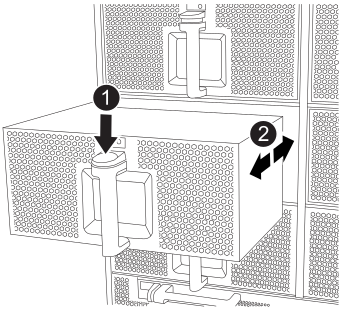

= FAN-FAS9500으로 바꿉니다
:allow-uri-read: 
:icons: font
:imagesdir: ../media/

[role="lead"]
서비스를 중단하지 않고 팬 모듈을 바꾸려면 특정 작업 순서를 수행해야 합니다.

IMPORTANT: 섀시에서 전원 공급 장치를 분리한 후 2분 이내에 전원 공급 장치를 교체하는 것이 좋습니다. 시스템이 계속 작동하지만 ONTAP에서는 전원 공급 장치를 교체할 때까지 성능이 저하된 전원 공급 장치에 대한 메시지를 콘솔에 보냅니다.

.단계
. 아직 접지되지 않은 경우 올바르게 접지하십시오.
. 베젤의 양 측면에 있는 입구를 잡은 다음 섀시 프레임의 볼 스터드에서 베젤이 분리될 때까지 양손으로 베젤을 분리합니다(필요한 경우).
. 콘솔 오류 메시지를 확인하고 각 팬 모듈의 주의 LED를 확인하여 교체해야 하는 팬 모듈을 식별합니다.
. 팬 모듈의 테라코타 단추를 누르고 팬 모듈을 섀시에서 똑바로 당겨 빼냅니다.
+

IMPORTANT: 팬 모듈이 단락되었습니다. 팬 모듈이 갑자기 섀시에서 떨어져 다치지 않도록 항상 다른 손으로 팬 모듈의 하단을 지지하십시오.

+
.애니메이션 - 팬 제거/설치
video::86b0ed39-1083-4b3a-9e9c-ae78004c2ffc[panopto]
+

+
[cols="20%,80%"]
|===

 a| 
image::../media/legend_icon_01.svg[범례 아이콘 01]
 a| 
테라 코타 해제 버튼

 a| 
image::../media/legend_icon_02.svg[범례 아이콘 02]
 a| 
팬을 섀시 안쪽으로/밖으로 밉니다

|===
. 팬 모듈을 따로 보관해 둡니다.
. 교체용 팬 모듈의 가장자리를 섀시의 입구에 맞춘 다음 제자리에 고정될 때까지 섀시에 밀어 넣습니다.
+
활성 시스템에 팬 모듈이 성공적으로 섀시에 삽입되면 황색 주의 LED가 네 번 깜박입니다.

. 베젤을 볼 스터드에 맞춘 다음 베젤을 볼 스터드에 부드럽게 밀어 넣습니다.
. 키트와 함께 제공된 RMA 지침에 설명된 대로 오류가 발생한 부품을 NetApp에 반환합니다. 를 참조하십시오 https://["부품 반품 및 앰프, 교체"^] 페이지를 참조하십시오.

