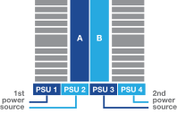
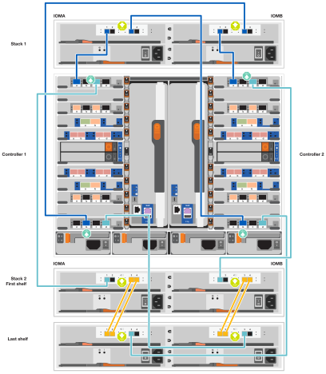

= 세부 단계 - FAS9500
:allow-uri-read: 
:icons: font
:imagesdir: ../media/

[role="lead"]
이 문서에서는 일반적인 NetApp 시스템 설치를 위한 단계별 지침을 제공합니다. 자세한 설치 지침을 보려면 이 문서를 사용하십시오.

== 1단계: 설치 준비

시스템을 설치하려면 NetApp Support 사이트에서 계정을 만들고, 시스템을 등록하고, 라이센스 키를 받아야 합니다. 또한 시스템에 맞는 케이블 수와 유형을 확인하고 특정 네트워크 정보를 수집해야 합니다.

에 대한 액세스 권한이 있어야 합니다 https://hwu.netapp.com["NetApp Hardware Universe를 참조하십시오"^] 사이트 요구 사항 및 구성된 시스템에 대한 추가 정보를 확인하십시오.

.필요한 것
에 대한 액세스 권한을 가질 수도 있습니다 http://mysupport.netapp.com/documentation/productlibrary/index.html?productID=62286["ONTAP 9 릴리즈 노트"^] 해당 버전의 ONTAP에서 이 시스템에 대한 자세한 내용을 확인하십시오.

사이트에서 다음을 제공해야 합니다.

* 스토리지 시스템의 랙 공간입니다
* Phillips #2 드라이버
* 웹 브라우저를 사용하여 시스템을 네트워크 스위치 및 랩톱 또는 콘솔에 연결하는 추가 네트워킹 케이블

.단계
. 모든 상자의 내용물을 풉니다.
. 컨트롤러에서 시스템 일련 번호를 기록합니다.
+
image::../media/drw_ssn_label.svg[시스템 일련 번호의 예]

. 받은 케이블의 수와 유형을 확인하고 기록합니다.
+
다음 표에서는 수신할 수 있는 케이블 유형을 보여 줍니다. 표에 나와 있지 않은 케이블을 받은 경우 Hardware Universe를 참조하여 케이블을 찾고 해당 케이블의 사용 여부를 확인하십시오.

+
https://hwu.netapp.com["NetApp Hardware Universe를 참조하십시오"^]

+
[cols="1,2,1,2"]
|===
| 케이블 유형... | 부품 번호 및 길이 | 커넥터 유형 | 대상... 

 a| 
25GbE 데이터 케이블
 a| 
X66240A-05(112-00639), 0.5m

X66240A-2(112-00598), 2m

X66240A-5(112-00600), 5m
 a| 
image::../media/oie_cable_sfp_gbe_copper.png[GbE SFP 구리 커넥터]
 a| 
네트워크 케이블

 a| 
32 Gb FC(SFP+ Op)
 a| 
X66250-2(112-00342), 2m

X66250-5(112-00344), 5m

X66250-15(112-00346), 15m
 a| 
image::../media/oie_cable_sfp_gbe_copper.png[GbE SFP 구리 커넥터]
 a| 
FC 광 네트워크 케이블

 a| 
40GbE 네트워크 케이블
 a| 
X66100-1(112-00542), 1m

X66100-3(112-00543), 3m

X66100-5(112-00544), 5m
 a| 
image::../media/oie_cable100_gbe_qsfp28.png[100 GbE QSFP 커넥터]
 a| 
이더넷 데이터, 클러스터 네트워크

 a| 
100GbE 케이블
 a| 
X66211B-1(112-00573), 1m

X66211B-2(112-00574), 2m

X66211B-5(112-00576), 5m
 a| 
image::../media/oie_cable100_gbe_qsfp28.png[100 GbE QSFP 커넥터]
 a| 
네트워크,

이더넷 데이터

클러스터 네트워크

 a| 
광 케이블
 a| 
X66031A(112-00436), 1m

X66032A(112-00437), 2m

X66033A(112-00438), 3m
 a| 
image::../media/oie_cable_fiber_lc_connector.png[LC 광 커넥터]
 a| 
FC 광 네트워크

 a| 
CAT 6, RJ-45(주문 종속)
 a| 
부품 번호 X6585-R6(112-00291), 3m

X6562-R6(112-00196), 5m
 a| 
image::../media/oie_cable_rj45.png[RJ-45 커넥터]
 a| 
관리 네트워크 및 이더넷 데이터

 a| 
스토리지
 a| 
X66031A(112-00436), 1m

X66032A(112-00437), 2m

X66033A(112-00438), 3m
 a| 
image::../media/oie_cable_mini_sas_hd_to_mini_sas_hd.png[미니 SAS 커넥터]
 a| 
스토리지

 a| 
마이크로 USB 콘솔 케이블
 a| 
해당 없음
 a| 
image::../media/oie_cable_micro_usb.png[마이크로 USB 커넥터]
 a| 
Windows 또는 Mac 랩톱/콘솔에서 소프트웨어를 설치하는 동안 콘솔 연결

 a| 
전원 케이블
 a| 
해당 없음
 a| 
image::../media/oie_cable_power.png[전원 케이블]
 a| 
시스템 전원을 켭니다

|===
. 를 검토합니다 https://library.netapp.com/ecm/ecm_download_file/ECMLP2862613["ONTAP 구성 가이드 를 참조하십시오"^] 그런 다음 해당 가이드에 나열된 필수 정보를 수집합니다.

== 2단계: 하드웨어 설치

필요에 따라 4-포스트 랙 또는 NetApp 시스템 캐비닛에 시스템을 설치해야 합니다.

.단계
. 필요에 따라 레일 키트를 설치합니다.
. 레일 키트에 포함된 지침에 따라 시스템을 설치하고 고정합니다.
+

NOTE: 시스템 무게와 관련된 안전 문제를 알고 있어야 합니다.

+
왼쪽에 있는 레이블은 빈 섀시를 나타내고, 오른쪽에 있는 레이블은 완전히 채워진 시스템을 나타냅니다.

+
image::../media/drw_9500_lifting_icon.svg[무게 인양 주의 레이블]

. 케이블 관리 장치를 연결합니다(그림 참조).
+
image::../media/drw_9500_cable_management_arms.svg[인양 핸들 및 케이블 관리 장치]

. 시스템 전면에 베젤을 부착합니다.

== 3단계: 컨트롤러를 네트워크에 케이블로 연결합니다

스위치가 없는 2노드 클러스터 방법을 사용하거나 클러스터 인터커넥트 네트워크를 사용하여 컨트롤러를 네트워크에 케이블로 연결할 수 있습니다.

[role="tabbed-block"]
====
.옵션 1: 스위치가 없는 2노드 클러스터
--
컨트롤러의 관리 네트워크, 데이터 네트워크 및 관리 포트는 스위치에 연결됩니다. 클러스터 인터커넥트 포트는 두 컨트롤러에 케이블로 연결됩니다.

.시작하기 전에
시스템에 스위치를 연결하는 방법에 대한 자세한 내용은 네트워크 관리자에게 문의해야 합니다.

포트에 케이블을 삽입할 때 케이블 당김 탭의 방향을 확인하십시오. 케이블 당김 탭은 모든 네트워킹 모듈 포트에 대해 위로 들어 있습니다.

image::../media/oie_cable_pull_tab_up.png[케이블 당김 탭 방향]

NOTE: 커넥터를 삽입할 때 딸깍 소리가 들려야 합니다. 딸깍 소리가 안 되면 커넥터를 제거하고 뒤집은 다음 다시 시도하십시오.

.단계
. 애니메이션이나 그림을 사용하여 컨트롤러와 스위치 사이의 케이블 연결을 완료합니다.
+
.애니메이션 2노드 스위치리스 클러스터 케이블링
video::da08295f-ba8c-4de7-88c3-ae7c0170408d[panopto]
+
image::../media/drw_9500_tnsc_network_cabling.svg[TNSC 네트워크 케이블링 다이어그램]

+
[cols="20%,80%"]
|===
| 단계 | 각 컨트롤러에서 수행합니다 

 a| 
image::../media/icon_square_1_green.png[설명선 아이콘 1]
 a| 
케이블 클러스터 인터커넥트 포트:

** 슬롯 A4 및 B4(e4a)
** 슬롯 A8 및 B8(e8a)

image::../media/oie_cable100_gbe_qsfp28.png[100 GbE QSFP 커넥터]

 a| 

 a| 
케이블 컨트롤러 관리(렌치) 포트

image::../media/oie_cable_rj45.png[RJ-45 커넥터]

 a| 
image::../media/icon_square_3_orange.png[설명선 아이콘 3]
 a| 
케이블 32 Gb FC 네트워크 스위치:

슬롯 A3 및 B3(e3a 및 e3c) 및 슬롯 A9 및 B9(e9a 및 e9c)의 포트를 32Gb FC 네트워크 스위치에 연결합니다.

image::../media/oie_cable_sfp_gbe_copper.png[GbE SFP 구리 커넥터]

40GbE 호스트 네트워크 스위치:

슬롯 A4 및 B4(e4b)의 호스트 측 b 포트와 슬롯 A8 및 B8(e8b)을 호스트 스위치에 케이블로 연결합니다.

image::../media/oie_cable100_gbe_qsfp28.png[100 GbE QSFP 커넥터]

 a| 

 a| 
케이블 25GbE 연결:

슬롯 A5 및 B5(5a, 5b, 5c 및 5d)와 슬롯 A7 및 B7(7a, 7b, 7c 및 7d)의 케이블 포트를 25GbE 네트워크 스위치에 연결합니다.

image::../media/oie_cable_sfp_gbe_copper.png[GbE SFP 구리 커넥터]

 a| 

 a| 
** 케이블을 케이블 관리 암에 연결합니다(그림 없음).
** 전원 케이블을 PSU에 연결하고 다른 전원에 연결합니다(표시되지 않음). PSU 1과 3은 모든 측면 A 구성 요소에 전원을 공급하고 PSU2 및 PSU4는 모든 측면 B 구성 요소에 전원을 공급합니다.

image::../media/oie_cable_power.png[전원 케이블]

|===

--
.옵션 2: 스위치 클러스터
--
컨트롤러의 관리 네트워크, 데이터 네트워크 및 관리 포트는 스위치에 연결됩니다. 클러스터 인터커넥트 및 HA 포트는 클러스터/HA 스위치에 케이블로 연결됩니다.

.시작하기 전에
시스템에 스위치를 연결하는 방법에 대한 자세한 내용은 네트워크 관리자에게 문의해야 합니다.

포트에 케이블을 삽입할 때 케이블 당김 탭의 방향을 확인하십시오. 케이블 당김 탭은 모든 네트워킹 모듈 포트에 대해 위로 들어 있습니다.

image::../media/oie_cable_pull_tab_up.png[케이블 당김 탭 방향]

NOTE: 커넥터를 삽입할 때 딸깍 소리가 들려야 합니다. 딸깍 소리가 안 되면 커넥터를 제거하고 뒤집은 다음 다시 시도하십시오.

.단계
. 애니메이션이나 그림을 사용하여 컨트롤러와 스위치 사이의 케이블 연결을 완료합니다.
+
.애니메이션 스위치 클러스터 케이블링
video::3ad3f118-8339-4683-865f-ae7c0170400c[panopto]
+
image::../media/drw_9500_switched_network_cabling.svg[스위치 클러스터 네트워크 케이블 연결]

+
[cols="20%,80%"]
|===
| 단계 | 각 컨트롤러에서 수행합니다 

 a| 
image::../media/icon_square_1_green.png[설명선 번호 1]
 a| 
케이블 클러스터 인터커넥트 A 포트:

** 클러스터 네트워크 스위치에 대한 슬롯 A4 및 B4(e4a).
** 클러스터 네트워크 스위치에 대한 슬롯 A8 및 B8(e8a)

image::../media/oie_cable100_gbe_qsfp28.png[100 GbE QSFP 커넥터]

 a| 

 a| 
케이블 컨트롤러 관리(렌치) 포트

image::../media/oie_cable_rj45.png[RJ-45 커넥터]

 a| 
image::../media/icon_square_3_orange.png[설명선 아이콘 3]
 a| 
케이블 32 Gb FC 네트워크 스위치:

슬롯 A3 및 B3(e3a 및 e3c) 및 슬롯 A9 및 B9(e9a 및 e9c)의 포트를 32Gb FC 네트워크 스위치에 연결합니다.

image::../media/oie_cable_sfp_gbe_copper.png[GbE SFP 구리 커넥터]

40GbE 호스트 네트워크 스위치:

슬롯 A4 및 B4(e4b)의 호스트 측 b 포트와 슬롯 A8 및 B8(e8b)을 호스트 스위치에 케이블로 연결합니다.

image::../media/oie_cable100_gbe_qsfp28.png[100 GbE QSFP 커넥터]

 a| 

 a| 
케이블 25GbE 연결:

슬롯 A5 및 B5(5a, 5b, 5c 및 5d)와 슬롯 A7 및 B7(7a, 7b, 7c 및 7d)의 케이블 포트를 25GbE 네트워크 스위치에 연결합니다.

image::../media/oie_cable_sfp_gbe_copper.png[100 GbE 구리 커넥터]

 a| 

 a| 
** 케이블을 케이블 관리 암에 연결합니다(그림 없음).
** 전원 케이블을 PSU에 연결하고 다른 전원에 연결합니다(표시되지 않음). PSU 1과 3은 모든 측면 A 구성 요소에 전원을 공급하고 PSU2 및 PSU4는 모든 측면 B 구성 요소에 전원을 공급합니다.

image::../media/oie_cable_power.png[전원 케이블]

|===

--
====

== 4단계: 컨트롤러 케이블을 드라이브 쉘프에 연결합니다

DS212C 또는 DS224C 드라이브 쉘프를 컨트롤러에 연결합니다.

NOTE: SAS 케이블 연결에 대한 자세한 정보 및 워크시트는 를 참조하십시오 link:../sas3/overview-cabling-rules-examples.html["SAS 케이블 연결 규칙, 워크시트 및 예제 개요 - IOM12 모듈이 포함된 선반"]

.시작하기 전에
* 시스템에 대한 SAS 케이블 연결 워크시트를 작성합니다. 을 link:../sas3/overview-cabling-rules-examples.html["SAS 케이블 연결 규칙, 워크시트 및 예제 개요 - IOM12 모듈이 포함된 선반"]참조하십시오.
* 그림 화살표에 올바른 케이블 커넥터 당김 탭 방향이 있는지 확인하십시오. 스토리지 모듈의 케이블 풀 탭은 위쪽, 쉘프의 풀 탭은 아래쪽 입니다.

image::../media/oie_cable_pull_tab_up.png[케이블 당김 탭 방향]

image::../media/oie_cable_pull_tab_down.png[케이블 당김 탭 방향]

NOTE: 커넥터를 삽입할 때 딸깍 소리가 들려야 합니다. 딸깍 소리가 안 되면 커넥터를 제거하고 뒤집은 다음 다시 시도하십시오.

.단계
. 다음 애니메이션 또는 그림을 사용하여 컨트롤러를 3개(드라이브 쉘프 1개 스택 및 드라이브 쉘프 2개 스택) DS224C 드라이브 쉘프 에 연결합니다.
+
.애니메이션 케이블로 드라이브 선반을 연결하세요
video::c958aae6-9d08-4d3d-a213-ae7c017040cd[panopto]
+

+
[cols="20%,80%"]
|===
| 단계 | 각 컨트롤러에서 수행합니다 

 a| 
image::../media/icon_square_1_blue.png[설명선 아이콘 1]
 a| 
드라이브 쉘프 스택 1을 컨트롤러에 연결합니다. 참고로 사용하십시오.

* 미니 SAS 케이블 *

image::../media/oie_cable_mini_sas_hd_to_mini_sas_hd.png[미니-SAS HD 케이블]

 a| 
image::../media/icon_square_2_yellow.png[설명선 아이콘 2]
 a| 
그래픽을 사용하여 스택 2의 드라이브 쉘프를 서로 연결합니다.

* 미니 SAS 케이블 *

image::../media/oie_cable_mini_sas_hd_to_mini_sas_hd.png[미니-SAS HD 케이블]

 a| 
image::../media/icon_square_3_tourquoise.png[설명선 아이콘 3]
 a| 
드라이브 쉘프 스택 2를 컨트롤러에 연결합니다. 참고로 사용합니다.

* 미니 SAS 케이블 *

image::../media/oie_cable_mini_sas_hd_to_mini_sas_hd.png[미니-SAS HD 케이블]

|===

== 5단계: 시스템 설치 및 구성을 완료합니다

스위치 및 랩톱에 대한 연결만 제공하는 클러스터 검색을 사용하거나 시스템의 컨트롤러에 직접 연결한 다음 관리 스위치에 연결하여 시스템 설치 및 구성을 완료할 수 있습니다.

[role="tabbed-block"]
====
.옵션 1: 네트워크 검색이 활성화된 경우
--
랩톱에서 네트워크 검색을 사용하도록 설정한 경우 자동 클러스터 검색을 사용하여 시스템 설정 및 구성을 완료할 수 있습니다.

.단계
. 다음 애니메이션 또는 그리기를 사용하여 하나 이상의 드라이브 쉘프 ID를 설정합니다.
+
.애니메이션 선반 ID 설정
video::95a29da1-faa3-4ceb-8a0b-ac7600675aa6[panopto]
+
image::../media/drw_power-on_set_shelf_ID_set.svg[전원을 켜고 선반 ID를 설정하세요]

+
[cols="20%,80%"]
|===

 a| 
image::../media/icon_round_1.png[설명선 번호 1]
 a| 
엔드 캡을 탈거하십시오.

 a| 
image::../media/icon_round_2.png[설명선 번호 2]
 a| 
첫 번째 숫자가 깜박일 때까지 쉘프 ID 버튼을 누른 후 을 눌러 0-9로 이동합니다.

NOTE: 첫 번째 숫자가 계속 깜박입니다

 a| 
image::../media/icon_round_2.png[설명선 번호 2]
 a| 
쉘프 ID 버튼을 두 번째 숫자가 깜박일 때까지 길게 누른 다음 을 눌러 0-9로 이동합니다.

NOTE: 첫 번째 숫자의 깜박임이 멈추고 두 번째 숫자의 깜박임이 계속됩니다.

 a| 
image::../media/icon_round_4.png[설명선 번호 4]
 a| 
엔드 캡을 교체합니다.

 a| 
image::../media/icon_round_5.png[설명선 번호 5]
 a| 
황색 LED(!)가 나타날 때까지 10초 동안 기다립니다. 쉘프 ID를 설정한 후 드라이브 쉘프의 전원을 껐다가 다시 켭니다.

|===
. 두 노드에 대한 전원 공급 장치의 전원 스위치를 켭니다.
+
.애니메이션 컨트롤러의 전원을 켜세요
video::a905e56e-c995-4704-9673-adfa0005a891[panopto]
+
image::../media/drw_a900_power-on_IEOPS-941.svg[시스템 전원을 켭니다]

+

NOTE: 초기 부팅에는 최대 8분이 소요될 수 있습니다.

. 랩톱에 네트워크 검색이 활성화되어 있는지 확인합니다.
+
자세한 내용은 노트북의 온라인 도움말을 참조하십시오.

. 다음 애니메이션을 사용하여 랩톱을 관리 스위치에 연결합니다.
+
.애니메이션 노트북을 관리 스위치에 연결하세요
video::d61f983e-f911-4b76-8b3a-ab1b0066909b[panopto]
+
image::../media/dwr_laptop_to_switch_only.svg[노트북에서 케이블로 전환]

. 나열된 ONTAP 아이콘을 선택하여 다음을 검색합니다.
+
image::../media/drw_autodiscovery_controler_select_ieops-1849.svg[Windows 파일 탐색기로 컨트롤러를 검색하는 방법]

+
.. 파일 탐색기를 엽니다.
.. 왼쪽 창에서 * 네트워크 * 를 클릭하고 마우스 오른쪽 버튼을 클릭한 후 * 새로 고침 * 을 선택합니다.
.. ONTAP 아이콘을 두 번 클릭하고 화면에 표시된 인증서를 수락합니다.
+

NOTE: xxxxx는 대상 노드의 시스템 일련 번호입니다.

+
System Manager가 열립니다.

. System Manager의 안내에 따라 설정을 사용하여 에서 수집한 데이터를 사용하여 시스템을 구성합니다 https://library.netapp.com/ecm/ecm_download_file/ECMLP2862613["ONTAP 구성 가이드 를 참조하십시오"^].
. 계정 설정 및 Active IQ Config Advisor 다운로드:
+
.. 기존 계정에 로그인하거나 계정을 만듭니다.
+
https://mysupport.netapp.com/eservice/public/now.do["NetApp 지원 등록"^]

.. 시스템을 등록합니다.
+
https://mysupport.netapp.com/eservice/registerSNoAction.do?moduleName=RegisterMyProduct["NetApp 제품 등록"^]

.. Active IQ Config Advisor를 다운로드합니다.
+
https://mysupport.netapp.com/site/tools/tool-eula/activeiq-configadvisor["NetApp 다운로드: Config Advisor"^]

. Config Advisor을 실행하여 시스템의 상태를 확인하십시오.
. 초기 구성을 완료한 후 ONTAP의 추가 기능 구성에 대한 자세한 내용은 을 https://docs.netapp.com/us-en/ontap/index.html["ONTAP 9 설명서"^] 참조하십시오.

--
.옵션 2: 네트워크 검색이 활성화되지 않은 경우
--
Windows 또는 Mac 기반 랩톱 또는 콘솔을 사용하고 있지 않거나 자동 검색을 사용하지 않는 경우 이 작업을 사용하여 구성 및 설정을 완료해야 합니다.

.단계
. 랩톱 또는 콘솔 케이블 연결 및 구성:
+
.. 노트북 또는 콘솔의 콘솔 포트를 N-8-1을 사용하여 115,200보드 로 설정합니다.
+

NOTE: 콘솔 포트를 구성하는 방법은 랩톱 또는 콘솔의 온라인 도움말을 참조하십시오.

.. 시스템과 함께 제공된 콘솔 케이블을 사용하여 콘솔 케이블을 랩톱 또는 콘솔에 연결한 다음 랩톱을 관리 서브넷의 스위치에 연결합니다.
+
image::../media/drw_9500_cable_console_switch_controller.svg[연결을 전환하기 위한 콘솔]

.. 관리 서브넷에 있는 TCP/IP 주소를 사용하여 랩톱 또는 콘솔에 할당합니다.

. 다음 애니메이션을 사용하여 하나 이상의 드라이브 쉘프 ID를 설정합니다.
+
.애니메이션 선반 ID 설정
video::95a29da1-faa3-4ceb-8a0b-ac7600675aa6[panopto]
+
image::../media/drw_power-on_set_shelf_ID_set.svg[전원을 켜고 선반 ID를 설정하세요]

+
[cols="20%,80%"]
|===

 a| 
image::../media/icon_round_1.png[설명선 번호 1]
 a| 
엔드 캡을 탈거하십시오.

 a| 
image::../media/icon_round_2.png[설명선 번호 2]
 a| 
첫 번째 숫자가 깜박일 때까지 쉘프 ID 버튼을 누른 후 을 눌러 0-9로 이동합니다.

NOTE: 첫 번째 숫자가 계속 깜박입니다

 a| 
image::../media/icon_round_2.png[설명선 번호 2]
 a| 
쉘프 ID 버튼을 두 번째 숫자가 깜박일 때까지 길게 누른 다음 을 눌러 0-9로 이동합니다.

NOTE: 첫 번째 숫자의 깜박임이 멈추고 두 번째 숫자의 깜박임이 계속됩니다.

 a| 
image::../media/icon_round_4.png[설명선 번호 4]
 a| 
엔드 캡을 교체합니다.

 a| 
image::../media/icon_round_5.png[설명선 번호 5]
 a| 
황색 LED(!)가 나타날 때까지 10초 동안 기다립니다. 쉘프 ID를 설정한 후 드라이브 쉘프의 전원을 껐다가 다시 켭니다.

|===
. 두 노드에 대한 전원 공급 장치의 전원 스위치를 켭니다.
+
.애니메이션 컨트롤러의 전원을 켜세요
video::a905e56e-c995-4704-9673-adfa0005a891[panopto]
+
image::../media/drw_9500_power-on.svg[시스템 전원을 켭니다]

+

NOTE: 초기 부팅에는 최대 8분이 소요될 수 있습니다.

. 노드 중 하나에 초기 노드 관리 IP 주소를 할당합니다.
+
[cols="1,2"]
|===
| 관리 네트워크에 DHCP가 있는 경우... | 그러면... 

 a| 
구성됨
 a| 
새 컨트롤러에 할당된 IP 주소를 기록합니다.

 a| 
구성되지 않았습니다
 a| 
.. PuTTY, 터미널 서버 또는 해당 환경에 해당하는 를 사용하여 콘솔 세션을 엽니다.
+

NOTE: PuTTY 구성 방법을 모르는 경우 노트북 또는 콘솔의 온라인 도움말을 확인하십시오.

.. 스크립트에 메시지가 표시되면 관리 IP 주소를 입력합니다.

|===
. 랩톱 또는 콘솔에서 System Manager를 사용하여 클러스터를 구성합니다.
+
.. 브라우저에서 노드 관리 IP 주소를 가리킵니다.
+

NOTE: 주소의 형식은 +https://x.x.x.x+ 입니다.

.. 에서 수집한 데이터를 사용하여 시스템을 구성합니다 https://library.netapp.com/ecm/ecm_download_file/ECMLP2862613["ONTAP 구성 가이드 를 참조하십시오"^] .

. 계정 설정 및 Active IQ Config Advisor 다운로드:
+
.. 기존 계정에 로그인하거나 계정을 만듭니다.
+
https://mysupport.netapp.com/eservice/public/now.do["NetApp 지원 등록"^]

.. 시스템을 등록합니다.
+
https://mysupport.netapp.com/eservice/registerSNoAction.do?moduleName=RegisterMyProduct["NetApp 제품 등록"^]

.. Active IQ Config Advisor를 다운로드합니다.
+
https://mysupport.netapp.com/site/tools/tool-eula/activeiq-configadvisor["NetApp 다운로드: Config Advisor"^]

. Config Advisor을 실행하여 시스템의 상태를 확인하십시오.
. 초기 구성을 완료한 후 ONTAP의 추가 기능 구성에 대한 자세한 내용은 을 https://docs.netapp.com/us-en/ontap/index.html["ONTAP 9 설명서"^] 참조하십시오.

--
====