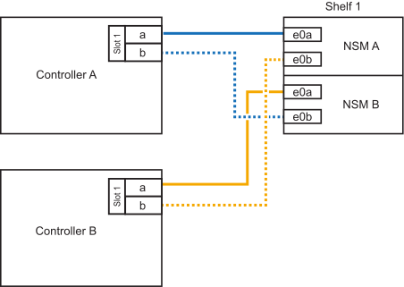

= NS224 쉘프를 ASA A250 시스템에 케이블로 연결합니다
:allow-uri-read: 
:icons: font
:imagesdir: ../media/

[role="lead"]
NS224 쉘프를 ASA A250 시스템에 케이블로 연결하여 각 쉘프가 HA 쌍의 각 컨트롤러에 두 개의 연결을 갖도록 하십시오.

.이 작업에 대해
플랫폼 섀시 뒷면에서 확인할 수 있는 RoCE 지원 카드 포트는 왼쪽 포트 "A"(E1A)이며 오른쪽 포트는 포트 "b"(e1b)입니다.

.단계
. 쉘프 연결 케이블 연결:
+
.. 쉘프 NSM A 포트 e0a를 컨트롤러 A 슬롯 1 포트 A(E1A)에 케이블로 연결합니다.
.. 케이블 쉘프 NSM A 포트 e0b를 컨트롤러 B 슬롯 1 포트 b(e1b)에 연결합니다.
.. 케이블 쉘프 NSM B 포트 e0a를 컨트롤러 B 슬롯 1 포트 A(E1A)에 연결합니다.
.. 컨트롤러 A 슬롯 1 포트 b(e1b)에 쉘프 NSM B 포트 e0b를 케이블로 연결합니다. + 다음 그림에서는 완료 시 쉘프 케이블 연결을 보여 줍니다.
+

. 를 사용하여 핫 애드 쉘프가 올바르게 연결되었는지 확인합니다 https://mysupport.netapp.com/site/tools/tool-eula/activeiq-configadvisor["Active IQ Config Advisor"^].
+
케이블 연결 오류가 발생하면 제공된 수정 조치를 따르십시오.

.다음 단계
이 절차를 준비하는 과정에서 자동 드라이브 할당을 비활성화한 경우, 드라이브 소유권을 수동으로 할당한 다음 필요한 경우 자동 드라이브 할당을 다시 활성화해야 합니다. link:hot-add-asa-complete.html["핫 애드 완료"]로 이동하세요.

그렇지 않으면 핫 애드 쉘프 절차가 완료됩니다.
