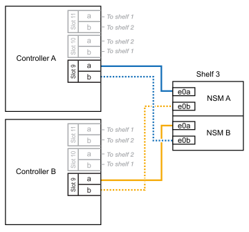

= 쉘프-NS224 쉘프 핫 추가
:allow-uri-read: 
:icons: font
:imagesdir: ../media/

[role="lead"]
HA 쌍이 특정 요구사항을 충족하고 HA 쌍에 적용할 수 있는 준비 작업이 완료된 후에 NS224 드라이브 쉘프를 핫 추가할 수 있습니다.

== 핫 애드 요구 사항

NS224 드라이브 쉘프를 핫 추가하기 전에 HA 쌍이 특정 요구사항을 충족해야 합니다.

* 사용 중인 플랫폼 모델과 ONTAP 버전은 NS224 쉘프와 핫 추가 중인 드라이브를 지원해야 합니다.
+
https://hwu.netapp.com["NetApp Hardware Universe를 참조하십시오"^]

* 쉘프를 연결하려면 올바른 개수의 케이블이 있어야 합니다.
+
https://hwu.netapp.com["NetApp Hardware Universe를 참조하십시오"^]

* HA 쌍에서 핫 추가할 쉘프 수를 지원하기에 충분한 RoCE 지원 이더넷 포트가 있어야 합니다.
+
핫 애드할 각 쉘프에 각 컨트롤러에 RoCE 지원 포트 2개가 필요합니다. 이들 포트는 플랫폼 모델에서 지원하는 대로 컨트롤러, RoCE 지원 PCIe 카드, 두 가지를 결합한 포트 또는 RoCE 지원 I/O 모듈 상에 추가할 수 있습니다.

+
HA 쌍에 사용 가능한 RoCE 가능 포트가 충분하지 않으며 플랫폼 모델에서 RoCE 지원 PCIe 카드 또는 I/O 모듈 사용을 지원하는 경우, 플랫폼 모델에서 지원하는 대로 추가 카드 또는 I/O 모듈을 올바른 컨트롤러 슬롯에 설치해야 합니다.

+
** 사용 중인 플랫폼 모델에 적합한 컨트롤러 슬롯을 식별합니다.
+
https://hwu.netapp.com["NetApp Hardware Universe를 참조하십시오"^]

** PCIe 카드 또는 I/O 모듈 설치 지침은 플랫폼 모델 설명서를 참조하십시오.
+
https://docs.netapp.com/us-en/ontap-systems/index.html["ONTAP 하드웨어 시스템 설명서"]

+
[NOTE]
====
비전용 RoCE 지원 포트는 스토리지용으로 구성해야 합니다(네트워킹 사용 안 함).

<<Prepare non-dedicated RoCE-capable ports for a hot-add>>

====

* AFF A700 HA 쌍이 있고 초기 NS224 드라이브 쉘프(HA 쌍에 NS224 드라이브 쉘프가 없음)를 핫 추가하는 경우, 코어 덤프(코어 파일 저장)를 지원하기 위해 각 컨트롤러에 코어 덤프 모듈(X9170A, NVMe 1TB SSD)을 설치해야 합니다.
+
link:../fas9000/caching-module-and-core-dump-module-replace.html["캐싱 모듈을 교체하거나 코어 덤프 모듈(AFF A700 및 FAS9000)을 추가/교체합니다"^]

* HA 쌍의 쉘프 수는 지원되는 최대 쉘프 수보다 작아야 합니다.
+
쉘프를 핫 추가한 후에는 HA 쌍에서 지원하는 최대 쉘프 수를 초과할 수 없습니다.

+
https://hwu.netapp.com["NetApp Hardware Universe를 참조하십시오"^]

* NS224 쉘프가 이미 있는 HA 쌍에 쉘프를 핫 추가하는 경우, HA 쌍에 스토리지 케이블 연결 오류 메시지가 있을 수 없으며 다중 경로 HA로 케이블로 연결되어야 합니다.
+
Active IQ Config Advisor를 실행하여 스토리지 케이블 연결 오류 메시지와 필요한 수정 조치를 확인할 수 있습니다.

+
https://mysupport.netapp.com/site/tools/tool-eula/activeiq-configadvisor["NetApp 다운로드: Config Advisor"^]

* 한쪽 면을 곧게 편 종이 클립 또는 좁은 볼펜이 필요합니다.
+
쉘프 ID를 변경하려면 종이 클립이나 볼펜을 사용하여 ODP(Operator Display Panel) 뒤의 쉘프 ID 버튼에 액세스합니다.

== 핫 애드 고려 사항

NS224 드라이브 쉘프를 핫 추가하기 전에 이 절차의 모범 사례와 측면을 숙지해야 합니다.

* NS224 쉘프를 지원하는 ASA HA 쌍이 있는 경우 이 절차를 사용할 수 있습니다.
* * 모범 사례:* 가장 좋은 방법은 쉘프를 핫 추가하기 전에 최신 버전의 디스크 검증 패키지(DQP)를 설치하는 것입니다.
+
현재 버전의 DQP를 설치하면 시스템이 새로 인증된 드라이브를 인식하고 사용할 수 있습니다. 이렇게 하면 드라이브가 인식되지 않으므로 최신 드라이브 정보가 없는 경우 및 드라이브 파티셔닝 예방에 대한 시스템 이벤트 메시지가 표시되지 않습니다. 또한 DQP는 최신 버전이 아닌 드라이브 펌웨어에 대해서도 알려줍니다.

+
https://mysupport.netapp.com/site/downloads/firmware/disk-drive-firmware/download/DISKQUAL/ALL/qual_devices.zip["NetApp 다운로드: 디스크 검증 패키지"^]

* * 모범 사례: * 가장 좋은 방법은 쉘프를 핫 추가하기 전과 후에 Active IQ Config Advisor를 실행하는 것입니다.
+
쉘프를 핫 추가하기 전에 Active IQ Config Advisor를 실행하면 기존 ENET(셸프 이더넷) 연결의 스냅샷이 제공되며, NSM(NVMe 쉘프 모듈) 펌웨어 버전을 확인하고, HA 쌍에서 이미 사용 중인 쉘프 ID를 확인할 수 있습니다. 쉘프를 핫 추가한 후 Active IQ Config Advisor를 실행하면 쉘프가 올바로 연결되었는지, 쉘프 ID가 HA 쌍 내에서 고유한지 확인할 수 있습니다.

+
https://mysupport.netapp.com/site/tools/tool-eula/activeiq-configadvisor["NetApp 다운로드: Config Advisor"^]

* * 모범 사례: * 모범 사례는 새 쉘프를 추가하기 전에 시스템에 최신 버전의 NVMe 쉘프 모듈(NSM) 펌웨어 및 드라이브 펌웨어를 사용하는 것입니다.
+
https://mysupport.netapp.com/site/downloads/firmware/disk-shelf-firmware["NetApp 다운로드: 디스크 쉘프 펌웨어"^]

+
https://mysupport.netapp.com/site/downloads/firmware/disk-drive-firmware["NetApp 다운로드: 디스크 드라이브 펌웨어"^]

+

NOTE: 펌웨어를 쉘프와 해당 구성요소를 지원하지 않는 버전으로 되돌리지 마십시오.

* 핫 추가 쉘프를 케이블로 연결한 후 ONTAP에서 쉘프를 인식합니다.
+
** 드라이브 소유권은 자동 드라이브 할당이 활성화된 경우 할당됩니다.
** 필요한 경우 NSM 셸프 펌웨어 및 드라이브 펌웨어를 자동으로 업데이트해야 합니다.
+

NOTE: 펌웨어 업데이트는 최대 30분 정도 걸릴 수 있습니다.

== 핫 애드 준비

NS224 드라이브 쉘프를 핫 추가하기 전에 HA 쌍에 적용할 수 있는 준비 작업을 완료해야 합니다.

=== 핫 추가에 사용할 비전용 RoCE 지원 이더넷 포트를 준비합니다

HA 쌍에 NS224 드라이브 쉘프를 핫 추가하는 데 사용할 수 없는 전용 RoCE 지원 이더넷 포트가 있는 경우, 포트가 스토리지용으로 구성되었는지(네트워킹용이 아님) 확인해야 합니다.

.시작하기 전에
각 컨트롤러에 RoCE 지원 PCIe 카드를 추가로 설치하는 것을 포함하여 스토리지 시스템 요구사항을 충족해야 합니다.

<<핫 애드 요구 사항>>

.이 작업에 대해
* 일부 플랫폼 모델의 경우, RoCE 지원 PCIe 카드 또는 I/O 모듈을 컨트롤러의 지원 슬롯에 설치하면 기본적으로 스토리지가 사용됩니다(네트워킹 대신). 하지만 이 절차를 완료하여 저장소용으로 RoCE 가능 포트가 구성되었는지 확인하는 것이 좋습니다.
* HA 쌍에서 비전용 RoCE 지원 포트를 스토리지로 구성되지 않음을 확인할 경우 무중단 구성 절차를 통해 포트를 구성할 수 있습니다.
+

NOTE: HA 쌍이 ONTAP 9.6 버전을 실행 중인 경우 컨트롤러를 한 번에 하나씩 재부팅해야 합니다.

+

NOTE: HA 9.7 ONTAP 이상을 실행 중인 경우 하나 또는 두 컨트롤러가 유지보수 모드가 아닌 한 컨트롤러를 재부팅하지 않아도 됩니다. 이 절차에서는 두 컨트롤러가 유지보수 모드에 있지 않다고 가정합니다.

+

NOTE: 스토리지 사용에서 네트워킹 사용으로 포트를 변경하려면, 명령을 입력합니다 `storage port modify -node _node_name_ -port _port_name_ -mode network`.

.단계
. SSH 또는 시리얼 콘솔 포트를 사용하여 클러스터에 로그인합니다.
. HA 쌍의 비전용 포트가 스토리지에 사용하도록 구성되었는지 확인합니다. 'Storage port show
+
HA 쌍이 ONTAP 9.8 이상을 실행 중인 경우 비전용 포트는 "모드" 열에 "저장"을 표시합니다.

+
HA 쌍이 ONTAP 9.7 또는 9.6을 실행 중인 경우, '전용 여부'에 '거짓'을 표시하는 비전용 포트는 무엇입니까 '상태' 열에 '활성화됨'도 표시됩니다.

. 비전용 포트가 스토리지에 사용하도록 구성된 경우 이 절차를 수행합니다.
+
그렇지 않으면 4-7단계를 완료하여 포트를 구성해야 합니다.

+
[NOTE]
====
비전용 포트가 스토리지 용도로 구성되지 않은 경우 명령 출력에 다음이 표시됩니다.

HA 쌍이 ONTAP 9.8 이상을 실행 중인 경우 비전용 포트는 Mode 열에 network를 표시합니다.

HA 쌍이 ONTAP 9.7 또는 9.6을 실행 중인 경우, 'Dedicated'에 'false'를 표시하는 비전용 포트가 표시됩니다 칼럼은 또한 '상태' 칼럼에 '비활성화'를 표시합니다.

====
. 컨트롤러 모듈 중 하나에서 스토리지용으로 비전용 포트를 구성합니다.
+
구성할 각 포트에 대해 해당 명령을 반복해야 합니다.

+
[cols="1,3"]
|===
| HA 쌍이 실행 중인 경우... | 그러면... 

 a| 
ONTAP 9.8 이상
 a| 
`storage port modify -node _node_name_ -port _port_name_ -mode storage`

 a| 
ONTAP 9.7 또는 9.6
 a| 
`storage port enable -node _node_name_ -port _port_name_`

|===
. HA 쌍에서 ONTAP 9.6를 실행 중인 경우 포트 변경 사항이 적용되도록 컨트롤러 모듈을 재부팅합니다. `system node reboot -node _node_name_ -reason _reason_for_the_reboot_`
+
그렇지 않으면 다음 단계로 이동합니다.

+

NOTE: 재부팅에는 최대 15분이 소요될 수 있습니다.

. 두 번째 컨트롤러 모듈에 대해 단계를 반복합니다.
+
[cols="1,3"]
|===
| HA 쌍이 실행 중인 경우... | 그러면... 

 a| 
ONTAP 9.7 이상
 a| 
.. 4단계를 반복합니다.
.. 7단계로 이동합니다.

 a| 
ONTAP 9.6
 a| 
.. 4단계와 5단계를 반복합니다.
+

NOTE: 첫 번째 컨트롤러의 재부팅이 이미 완료되어 있어야 합니다.

.. 7단계로 이동합니다.

|===
. 두 컨트롤러 모듈에 있는 비전용 포트가 스토리지를 사용하도록 구성되었는지 확인합니다. 'Storage port show
+
두 컨트롤러 모듈 중 하나에서 명령을 입력할 수 있습니다.

+
HA 쌍이 ONTAP 9.8 이상을 실행 중인 경우 비전용 포트는 "모드" 열에 "저장"을 표시합니다.

+
HA 쌍이 ONTAP 9.7 또는 9.6을 실행 중인 경우, '전용 여부'에 '거짓'을 표시하는 비전용 포트는 무엇입니까 '상태' 열에 '활성화됨'도 표시됩니다.

=== 추가 쉘프를 핫 추가하기 전에 기존 쉘프의 연결을 준비합니다

쉘프를 핫 추가하기 전에 플랫폼 모델에 따라 다른 슬롯에 있는 두 개의 포트 세트에 걸쳐 기존 쉘프를 다시 장착할 수 있습니다(RoCE 지원 PCIe 카드 또는 I/O 모듈을 추가로 설치한 후). 이렇게 하면 슬롯 장애에 대한 복원력을 확보할 수 있습니다.

.시작하기 전에
* 각 컨트롤러에 추가 RoCE 지원 PCIe 카드 또는 I/O 모듈을 설치하는 것을 포함하여 시스템 요구사항을 충족해야 합니다.
+
<<핫 애드 요구 사항>>

* RoCE 지원 PCIe 카드의 비전용 포트 또는 설치한 I/O 모듈이 스토리지용으로 구성되었는지 확인해야 합니다.
+
<<Prepare non-dedicated RoCE-capable ports for a hot-add>>

.이 작업에 대해
* 재연결은 쉘프에 다중 경로-HA 연결이 있는 경우 중단 없는 절차입니다.
* 이 절차 중에는 항상 쉘프와의 연결을 유지할 수 있도록 한 번에 하나의 케이블을 이동합니다.
+

NOTE: 케이블을 한 포트에서 분리하여 다른 포트에 꽂는 시간 사이에는 케이블을 이동할 필요가 없습니다.

* AFF A1K HA 쌍이 있고 세 번째 쉘프를 핫 추가하고 각 컨트롤러에 세 번째 또는 네 번째 RoCE 지원 I/O 모듈을 설치하는 경우, 세 번째 쉘프는 세 번째 또는 세 번째/세 번째 I/O 모듈에만 케이블로 연결됩니다. 기존 쉘프를 재장착할 필요가 없습니다.

.단계
. 플랫폼 모델에 해당하는 경우 서로 다른 슬롯에 있는 RoCE 지원 포트 2세트에서 기존 셸프의 연결을 재연결할 수 있습니다.
+
[cols="1,3"]
|===
| 다음 중 어떤 것이 있는 경우 | 그러면... 

 a| 
AFF A70 또는 AFF A90 HA 쌍, 두 번째 쉘프 추가
 a| 
RoCE 지원 두 개의 I/O 모듈 모두에서 첫 번째 쉘프 재배열:

NOTE: 하위 단계에서는 기존 쉘프가 각 컨트롤러의 슬롯 11에 있는 RoCE 지원 I/O 모듈에 케이블로 연결되어 있다고 가정합니다.

.. 컨트롤러 A에서 슬롯 11 포트 b(e11b)에서 슬롯 8 포트 b(e8b)로 케이블을 이동합니다.
.. 컨트롤러 B에서 동일한 케이블 이동을 반복합니다
+
[NOTE]
====
필요한 경우 기존 단일 쉘프와 재연결된 쉘프를 2쉘프 구성으로 보여주는 케이블 연결 그림을 참조할 수 있습니다.

<<AFF A70 또는 AFF A90 HA 2노드에 대해 핫 추가 쉘프를 케이블 연결>>

====

 a| 
AFF A1K HA 쌍, 두 번째 쉘프 핫 추가
 a| 
RoCE 지원 두 개의 I/O 모듈 모두에서 첫 번째 쉘프 재배열:

NOTE: 하위 단계에서는 기존 쉘프가 각 컨트롤러의 슬롯 11에 있는 RoCE 지원 I/O 모듈에 케이블로 연결되어 있다고 가정합니다.

.. 컨트롤러 A에서 슬롯 11 포트 b(e11b)에서 슬롯 10 포트 b(e10b)로 케이블을 이동합니다.
.. 컨트롤러 B에서 동일한 케이블 이동을 반복합니다
+
[NOTE]
====
필요한 경우 기존 단일 쉘프와 재연결된 쉘프를 2쉘프 구성으로 보여주는 케이블 연결 그림을 참조할 수 있습니다.

<<AFF A1K HA 쌍을 위한 핫 추가 쉘프에 케이블을 연결합니다>>

====

 a| 
AFF A1K HA 2노드를 지원하며 핫 추가할 수 있습니다
 a| 
각 컨트롤러의 슬롯 9에 있는 R0CE 지원 I/O 모듈에서 세 번째 셸프를 재장착할 수 있습니다.

.. 컨트롤러 A에서 슬롯 9 포트 b(e9b)에서 슬롯 8 포트 b(e8b)로 케이블을 이동합니다.
.. 컨트롤러 B에서 동일한 케이블 이동을 반복합니다
+
[NOTE]
====
필요한 경우 기존 단일 쉘프와 재연결된 쉘프를 2쉘프 구성으로 보여주는 케이블 연결 그림을 참조할 수 있습니다.

<<AFF A1K HA 쌍을 위한 핫 추가 쉘프에 케이블을 연결합니다>>

====

 a| 
AFF C400 HA 쌍, 그리고 두 번째 쉘프를 핫 추가할 수 있습니다
 a| 
각 컨트롤러의 RoCE 지원 포트 세트 모두에서 첫 번째 쉘프를 재배열:

.. 컨트롤러 A에서 슬롯 4 포트 A(e4a)에서 슬롯 5 포트 b(e5b)로 케이블을 이동합니다.
.. 컨트롤러 B에서 동일한 케이블 이동을 반복합니다
+
[NOTE]
====
필요한 경우 2개의 쉘프 구성에서 기존 단일 쉘프와 사용 가능한 쉘프를 보여주는 케이블 연결 그림을 참조할 수 있습니다.

<<AFF C400 HA 쌍을 위한 핫 추가 쉘프에 케이블을 연결합니다>>

====

 a| 
AFF A800 또는 AFF C800 HA 2노드, 두 번째 쉘프를 추가할 경우
 a| 
각 컨트롤러의 RoCE 지원 포트 세트 모두에서 첫 번째 쉘프를 재배열:

NOTE: 하위 단계에서는 기존 쉘프가 각 컨트롤러의 슬롯 5에 있는 RoCE 가능 PCIe 카드에 연결되어 있다고 가정합니다.

.. 컨트롤러 A에서 슬롯 5 포트 b(e5b)에서 슬롯 3 포트 b(e3b)로 케이블을 이동합니다.
.. 컨트롤러 B에서 동일한 케이블 이동을 반복합니다
+
[NOTE]
====
필요한 경우 2개의 쉘프 구성에서 기존 단일 쉘프와 사용 가능한 쉘프를 보여주는 케이블 연결 그림을 참조할 수 있습니다.

<<AFF A800 또는 AFF C800 HA 2노드에 대해 핫 추가 쉘프를 케이블 연결>>

====

 a| 
AFF A400 HA 쌍 및 보조 쉘프 추가
 a| 
각 컨트롤러의 RoCE 지원 포트 세트 모두에서 첫 번째 쉘프를 재배열:

.. 컨트롤러 A에서 포트 e0d를 슬롯 5 포트 b(e5b)로 케이블을 이동합니다.
.. 컨트롤러 B에서 동일한 케이블 이동을 반복합니다
+
[NOTE]
====
필요한 경우 2개의 쉘프 구성에서 기존 단일 쉘프와 사용 가능한 쉘프를 보여주는 케이블 연결 그림을 참조할 수 있습니다.

<<AFF A400 HA 쌍을 위한 핫 추가 쉘프에 케이블을 연결합니다>>

====

 a| 
AFF A700 HA 쌍, 그리고 보조 쉘프 추가 기능이 있습니다
 a| 
각 컨트롤러의 RoCE 지원 포트 세트 모두에서 첫 번째 쉘프를 재배열:

NOTE: 하위 단계에서는 기존 쉘프가 각 컨트롤러의 슬롯 3에 있는 RoCE 가능 I/O 모듈에 케이블로 연결되어 있다고 가정합니다.

.. 컨트롤러 A에서 슬롯 3 포트 b(e3b)에서 슬롯 7 포트 b(e7b)로 케이블을 이동합니다.
.. 컨트롤러 B에서 동일한 케이블 이동을 반복합니다
+
[NOTE]
====
필요한 경우 2개의 쉘프 구성에서 기존 단일 쉘프와 사용 가능한 쉘프를 보여주는 케이블 연결 그림을 참조할 수 있습니다.

<<AFF A700 HA 쌍의 핫 추가 쉘프에 케이블을 연결합니다>>

====

|===
. 레이블이 붙은 쉘프가 올바로 연결되었는지 확인합니다.
+
케이블 연결 오류가 발생하면 제공된 수정 조치를 따르십시오.

+
https://mysupport.netapp.com/site/tools/tool-eula/activeiq-configadvisor["NetApp 다운로드: Config Advisor"^]

=== 핫 애드인에 대해 드라이브 소유권을 수동으로 할당할 준비를 합니다

핫 추가할 NS224 드라이브 쉘프에 드라이브 소유권을 수동으로 할당하는 경우 자동 드라이브 할당을 사용하도록 설정한 경우 이를 비활성화해야 합니다.

.시작하기 전에
시스템 요구 사항을 충족해야 합니다.

<<핫 애드 요구 사항>>

.이 작업에 대해
드라이브 소유권을 수동으로 할당해야 하는지 또는 스토리지 시스템에 대한 드라이브 소유권 정책의 자동 할당을 이해하려는 경우 을 참조하십시오 https://docs.netapp.com/us-en/ontap/disks-aggregates/disk-autoassignment-policy-concept.html["디스크 소유권 자동 할당 정보"^]

.단계
. 자동 드라이브 할당이 설정되었는지 'Storage disk option show'를 확인합니다
+
두 노드 중 하나에서 명령을 입력할 수 있습니다.

+
자동 드라이브 할당이 활성화된 경우 출력이 각 노드에 대해 열에 표시됩니다 `on` `Auto Assign` .

. 자동 드라이브 할당이 설정된 경우 'storage disk option modify -node_node_name_-autostassign off'를 비활성화합니다
+
두 노드 모두에서 자동 드라이브 할당을 해제해야 합니다.

== 핫 애드용 쉘프를 설치합니다

새 NS224 쉘프를 설치하려면 랙 또는 캐비닛에 쉘프를 설치하고 전원 코드를 연결한(쉘프에 자동으로 전원 켜기), 쉘프 ID를 설정해야 합니다.

.시작하기 전에
* 한 면이 곧게 펴진 종이 클립이나 끝이 좁은 볼펜 클립이 있는지 확인하십시오.
+
선반 ID 변경 단계 중에 종이 클립이나 볼펜 펜을 사용하여 ODP(오퍼레이터 디스플레이 패널) 뒤에 있는 선반 ID 버튼에 액세스할 수 있습니다.

.단계
. 키트 상자에 들어 있는 설치 안내물을 사용하여 선반과 함께 제공된 레일 마운트 키트를 설치합니다.
+

NOTE: 쉘프를 플랜지 장착 하지 마십시오.

. 설치 안내물을 사용하여 지지 브래킷과 랙 또는 캐비닛에 쉘프를 설치하고 고정합니다.
+

NOTE: 완전히 장착된 NS224 선반은 최대 30.29kg(66.78lbs)의 중량을 지탱할 수 있으며, 유압 리프트를 들거나 사용하려면 2명이 필요합니다. 선반 무게가 불균형하게 되므로 선반 무게를 줄이기 위해 선반 구성 요소(선반 전면 또는 후면의)를 제거하지 마십시오.

. 전원 코드를 선반에 연결한 다음 AC 전원 공급 장치인 경우 전원 코드 고정쇠로 고정하거나 DC 전원 공급 장치인 경우 두 개의 나비 나사로 고정한 다음 전원 코드를 다른 전원에 연결하여 복원성을 확인합니다.
+
선반이 전원에 연결되면 전원이 켜지고 전원 스위치가 없습니다. 올바르게 작동하면 전원 공급 장치의 이중 LED가 녹색으로 켜집니다.

. 쉘프 ID를 HA 쌍 내의 고유 번호로 설정합니다.
+
자세한 지침은 다음과 같습니다.

+
link:change-shelf-id.html["쉘프 ID-NS224 쉘프를 변경합니다"^]

+
.. 왼쪽 엔드 캡을 제거하고 LED 오른쪽에 있는 작은 구멍을 찾습니다.
.. 종이 클립 또는 유사한 도구의 끝을 작은 구멍에 삽입하여 선반 ID 버튼에 닿게 합니다.
.. 디지털 디스플레이의 첫 번째 숫자가 깜박일 때까지 단추를 최대 15초 동안 누른 다음 버튼에서 손을 뗍니다.
+

NOTE: ID가 깜빡이는 데 15초 이상 걸리는 경우 버튼을 다시 길게 눌러 완전히 누르십시오.

.. 버튼을 눌렀다가 놓으면 0에서 9 사이의 원하는 번호에 도달할 때까지 숫자가 앞으로 이동합니다.
.. 4c 및 4D의 하위 단계를 반복하여 쉘프 ID의 두 번째 번호를 설정합니다.
+
숫자가 깜박이려면 최대 3초(15초 대신)가 걸릴 수 있습니다.

.. 두 번째 숫자의 깜박임이 멈출 때까지 버튼을 누르고 있습니다.
+
약 5초 후 두 숫자가 깜박이기 시작하고 ODP의 황색 LED가 켜집니다.

.. 쉘프 전원을 껐다가 다시 켜 쉘프 ID가 적용되도록 합니다.
+
선반에서 두 전원 코드를 모두 뽑고 10초 정도 기다린 다음 다시 연결해야 합니다.

+
전원 공급 장치로 전원이 복원되면 두 색 LED가 녹색으로 켜집니다.

== 핫 애드용 선반에 케이블을 연결합니다

핫 애드되는 각 NS224 쉘프를 케이블로 연결하면 각 쉘프가 HA 쌍의 각 컨트롤러에 2개의 연결이 가능합니다.

=== 핫 애드 케이블 연결 시 고려 사항

케이블 커넥터의 방향이 올바른지 숙지하고, NS224 NSM 셸프 모듈의 포트 위치 및 레이블 지정은 핫애드 셸프를 케이블로 연결하기 전에 도움이 될 수 있습니다.

* 케이블은 커넥터 당김 탭이 위를 향하도록 삽입됩니다.
+
케이블이 올바르게 삽입되면 딸깍 소리가 나면서 제자리에 고정됩니다.

+
케이블의 양쪽 끝을 연결한 후 쉘프 및 컨트롤러 포트 LNK(녹색) LED가 켜집니다. 포트 LNK LED가 켜지지 않으면 케이블을 다시 연결합니다.

+
image::../media/oie_cable_pull_tab_up.png[상단의 당김 탭이 있는 케이블 커넥터]

* 다음 그림을 사용하면 쉘프 NSM100 포트, e0a 및 e0b를 물리적으로 식별할 수 있습니다.
+
NS224 쉘프에는 NSM100 모듈 2개가 포함되어 있습니다. 상단 모듈은 슬롯 A(NSM A)에 있고 하단 모듈은 슬롯 B(NSM B)에 들어갑니다.

+
각 NSM100 모듈에는 100GbE QSFP28 포트 e0a 및 e0b 2개가 포함되어 있습니다.

+
image::../media/drw_ns224_back_ports.png[NS224 NSM100 모듈 포트 e0a 및 e0b]

=== AFF A70 또는 AFF A90 HA 2노드에 대해 핫 추가 쉘프를 케이블 연결

추가 스토리지가 필요한 경우(내부 쉘프에 최대 2개의 NS224 쉘프를 AFF A70 또는 AFF A90 HA 쌍에 핫 추가할 수 있습니다.

.시작하기 전에
* 스토리지 시스템 요구 사항을 충족해야 합니다.

<<핫 애드 요구 사항>>

* 해당 준비 절차를 완료해야 합니다.

<<핫 애드 준비>>

* 쉘프를 설치하고 전원을 켠 다음 쉘프 ID를 설정해야 합니다.

<<핫 애드용 쉘프를 설치합니다>>

.이 작업에 대해
* 이 절차에서는 HA 쌍에 내부 스토리지만 있고(외부 쉘프 없음), 각 컨트롤러에 최대 2개의 추가 쉘프와 RoCE 지원 I/O 모듈 2개를 핫 추가한다고 가정합니다.
* 이 절차에서는 다음과 같은 핫 애드 시나리오에 대해 설명합니다.
+
** 각 컨트롤러에 RoCE 지원 I/O 모듈 1개를 통해 첫 번째 쉘프를 HA 쌍에 핫 추가할 수 있습니다.
** 각 컨트롤러에 RoCE 지원 I/O 모듈 2개를 통해 첫 번째 쉘프를 HA 쌍에 핫 추가할 수 있습니다.
** 각 컨트롤러에 RoCE 지원 I/O 모듈 2개를 통해 두 번째 쉘프를 HA 쌍에 핫 추가할 수 있습니다.

.단계
. 각 컨트롤러 모듈에서 RoCE 지원 포트 한 세트(RoCE 지원 I/O 모듈 1개)를 사용하여 쉘프 하나를 핫 추가할 때, HA 쌍에서 유일한 NS224 쉘프인 경우, 다음 하위 단계를 완료하십시오.
+
그렇지 않으면 다음 단계로 이동합니다.

+

NOTE: 이 단계에서는 슬롯 11에 RoCE 지원 I/O 모듈을 설치했다고 가정합니다.

+
.. 쉘프 NSM A 포트 e0a를 컨트롤러 A 슬롯 11 포트 A(e11a)에 케이블로 연결합니다.
.. 케이블 쉘프 NSM A 포트 e0b를 컨트롤러 B 슬롯 11 포트 b(e11b)에 연결합니다.
.. 케이블 쉘프 NSM B 포트 e0a를 컨트롤러 B 슬롯 11 포트 A(e11a)에 연결합니다.
.. 컨트롤러 A 슬롯 11 포트 b(e11b)에 쉘프 NSM B 포트 e0b를 케이블로 연결합니다.
+
다음 그림에서는 각 컨트롤러 모듈에 1개의 RoCE 가능 I/O 모듈을 사용한 1개의 핫 추가 쉘프에 대한 케이블 연결을 보여 줍니다.

+
image::../media/drw_ns224_vino_i_1shelf_1card_ieops-1639.svg[셸프 1개와 입출력 모듈 1개로 AFF A70 또는 A90의 케이블 연결]

. 각 컨트롤러 모듈에서 2개의 RoCE 가능 포트 세트(RoCE 가능 I/O 모듈 2개)를 사용하여 하나 또는 2개의 쉘프를 핫 추가할 경우, 해당 하위 단계를 완료하십시오.
+

NOTE: 이 단계에서는 슬롯 11 및 8에 RoCE 지원 I/O 모듈을 설치했다고 가정합니다.

+
[cols="1,3"]
|===
| 쉘프 | 케이블 연결 

 a| 
쉘프 1
 a| 
.. NSM A 포트 e0a를 컨트롤러 A 슬롯 11 포트 A(e11a)에 케이블로 연결합니다.
.. NSM A 포트 e0b를 컨트롤러 B 슬롯 8 포트 b(e8b)에 연결합니다.
.. NSM B 포트 e0a를 컨트롤러 B 슬롯 11 포트 A(e11a)에 케이블로 연결합니다.
.. NSM B 포트 e0b를 컨트롤러 A 슬롯 8 포트 b(e8b)에 연결합니다.
.. 두 번째 쉘프를 핫 추가하는 경우 "shelf 2" 하위 단계를 완료하고, 그렇지 않으면 3단계로 이동합니다.

다음 그림은 각 컨트롤러 모듈에서 RoCE 지원 I/O 모듈 2개를 사용하는 핫 애드 쉘프 1개의 케이블 연결을 보여줍니다.

image::../media/drw_ns224_vino_i_1shelf_2cards_ieops-1640.svg[1개의 셸프 및 2개의 IO 모듈로 AFF A70 또는 A90의 케이블 연결]

 a| 
쉘프 2
 a| 
.. NSM A 포트 e0a를 컨트롤러 A 슬롯 8 포트 A(e8a)에 케이블로 연결합니다.
.. NSM A 포트 e0b를 컨트롤러 B 슬롯 11 포트 b(e11b)에 연결합니다.
.. NSM B 포트 e0a를 컨트롤러 B 슬롯 8 포트 A(e8a)에 케이블로 연결합니다.
.. NSM B 포트 e0b를 컨트롤러 A 슬롯 11 포트 b(e11b)에 연결합니다.
.. 3단계로 이동합니다.

다음 그림은 각 컨트롤러 모듈에 있는 RoCE 지원 I/O 모듈 2개를 사용하여 2개의 핫 애드 쉘프용 케이블 연결을 보여줍니다.

image::../media/drw_ns224_vino_i_2shelves_2cards_ieops-1641.svg[2개의 쉘프와 2개의 IO 모듈로 AFF A70 또는 A90의 케이블 연결]

|===
. 핫 애드 쉘프가 올바로 연결되었는지 확인합니다.
+
케이블 연결 오류가 발생하면 제공된 수정 조치를 따르십시오.

+
https://mysupport.netapp.com/site/tools/tool-eula/activeiq-configadvisor["NetApp 다운로드: Config Advisor"^]

. 이 절차를 준비하는 과정에서 자동 드라이브 할당을 사용하지 않도록 설정한 경우 드라이브 소유권을 수동으로 할당하고 필요한 경우 자동 드라이브 할당을 다시 활성화해야 합니다.
+
그렇지 않으면 이 절차를 수행합니다.

+
<<핫 애드 완료>>

=== AFF A1K HA 쌍을 위한 핫 추가 쉘프에 케이블을 연결합니다

AFF A1K HA 쌍에 최대 3개의 NS224 쉘프(총 4개 쉘프)를 핫 추가할 수 있습니다.

.시작하기 전에
* 스토리지 시스템 요구 사항을 충족해야 합니다.

<<핫 애드 요구 사항>>

* 해당 준비 절차를 완료해야 합니다.

<<핫 애드 준비>>

* 쉘프를 설치하고 전원을 켠 다음 쉘프 ID를 설정해야 합니다.

<<핫 애드용 쉘프를 설치합니다>>

.이 작업에 대해
* 이 절차는 HA 쌍에 기존 NS224 쉘프가 하나 이상 있다고 가정합니다.
* 이 절차에서는 다음과 같은 핫 애드 시나리오에 대해 설명합니다.
+
** 각 컨트롤러에 RoCE 지원 I/O 모듈 2개를 통해 두 번째 쉘프를 HA 쌍에 핫 추가할 수 있습니다. (두 번째 I/O 모듈을 설치하고 첫 번째 쉘프를 두 개의 I/O 모듈에 다시 연결했거나 첫 번째 쉘프를 이미 두 개의 I/O 모듈에 케이블로 연결했습니다. 두 번째 쉘프는 두 번째 I/O 모듈에 모두 케이블로 연결됩니다.
** 각 컨트롤러에 RoCE 지원 I/O 모듈 3개를 통해 HA 쌍에 세 번째 쉘프를 핫 추가합니다. (세 번째 I/O 모듈을 설치했으며 세 번째 I/O 모듈에만 세 번째 쉘프를 연결합니다.)
** 각 컨트롤러에 RoCE 지원 I/O 모듈 4개를 통해 HA 쌍에 세 번째 쉘프를 핫 추가합니다. (세 번째 및 네 번째 I/O 모듈을 설치했으며 세 번째 셸프를 세 번째 및 네 번째 I/O 모듈에 연결합니다.)
** 각 컨트롤러에 RoCE 지원 I/O 모듈 4개를 통해 HA 쌍에 4번째 쉘프를 핫 추가합니다. (네 번째 I/O 모듈을 설치하고 세 번째 쉘프를 세 번째 및 네 번째 I/O 모듈에 다시 연결했거나 세 번째 쉘프를 세 번째 및 네 번째 I/O 모듈에 케이블로 연결했습니다. 네 번째 셸프는 세 번째 및 네 번째 입출력 모듈 모두에 케이블로 연결됩니다.)

.단계
. 핫애더하는 NS224 쉘프가 HA 쌍의 두 번째 NS224 셸프가 될 경우 다음 하위 단계를 완료합니다.
+
그렇지 않으면 다음 단계로 이동합니다.

+
.. 컨트롤러 A 슬롯 10 포트 A에 케이블 쉘프 NSM A 포트 e0a(e10a).
.. 케이블 쉘프 NSM A 포트 e0b를 컨트롤러 B 슬롯 11 포트 b(e11b)에 연결합니다.
.. 케이블 쉘프 NSM B 포트 e0a를 컨트롤러 B 슬롯 10 포트 A(e10A)에 연결합니다.
.. 컨트롤러 A 슬롯 11 포트 b(e11b)에 쉘프 NSM B 포트 e0b를 케이블로 연결합니다.
+
다음 그림에서는 HA 쌍의 두 번째 쉘프에 대한 케이블 연결과 각 컨트롤러에 RoCE 지원 I/O 모듈 2개를 보여 줍니다.

+
image::../media/drw_ns224_vino_m_2shelves_2cards_ieops-1642.svg[2개의 쉘프와 2개의 IO 모듈이 포함된 AFF A1K의 케이블 연결]

. 핫 애드할 NS224 쉘프가 각 컨트롤러에 RoCE 지원 I/O 모듈 3개와 함께 HA 쌍의 세 번째 NS224 쉘프가 될 경우, 다음 하위 단계를 완료하십시오. 그렇지 않으면 다음 단계로 이동합니다.
+
.. 쉘프 NSM A 포트 e0a를 컨트롤러 A 슬롯 9 포트 A(e9a)에 케이블로 연결합니다.
.. 케이블 쉘프 NSM A 포트 e0b를 컨트롤러 B 슬롯 9 포트 b(e9b)에 연결합니다.
.. 케이블 쉘프 NSM B 포트 e0a를 컨트롤러 B 슬롯 9 포트 A(e9A)에 연결합니다.
.. 컨트롤러 A 슬롯 9 포트 b(e9b)에 쉘프 NSM B 포트 e0b를 케이블로 연결합니다.
+
다음 그림에서는 HA 쌍의 세 번째 쉘프에 대한 케이블 연결과 각 컨트롤러에 RoCE 지원 I/O 모듈 3개를 보여 줍니다.

+

. 핫 애드할 NS224 쉘프가 HA 쌍의 세 번째 NS224 쉘프가 각 컨트롤러에 RoCE 지원 I/O 모듈 4개와 함께 제공되는 경우, 다음 하위 단계를 완료하십시오. 그렇지 않으면 다음 단계로 이동합니다.
+
.. 쉘프 NSM A 포트 e0a를 컨트롤러 A 슬롯 9 포트 A(e9a)에 케이블로 연결합니다.
.. 케이블 쉘프 NSM A 포트 e0b를 컨트롤러 B 슬롯 8 포트 b(e8b)에 연결합니다.
.. 케이블 쉘프 NSM B 포트 e0a를 컨트롤러 B 슬롯 9 포트 A(e9A)에 연결합니다.
.. 컨트롤러 A 슬롯 8 포트 b(e8b)에 쉘프 NSM B 포트 e0b를 케이블로 연결합니다.
+
다음 그림에서는 HA 쌍의 세 번째 쉘프에 대한 케이블 연결과 각 컨트롤러에 RoCE 지원 I/O 모듈 4개를 보여 줍니다.

+
image::../media/drw_ns224_vino_m_3shelves_4cards_ieops-1644.svg[3개의 셸프 및 4개의 IO 모듈로 AFF A1K의 케이블 연결]

. 핫 애드할 NS224 쉘프가 HA 쌍의 4번째 NS224 쉘프가 각 컨트롤러에 RoCE 지원 I/O 모듈 4개와 함께 사용되는 경우, 다음 하위 단계를 완료하십시오.
+
.. 쉘프 NSM A 포트 e0a를 컨트롤러 A 슬롯 8 포트 A(e8a)에 케이블로 연결합니다.
.. 케이블 쉘프 NSM A 포트 e0b를 컨트롤러 B 슬롯 9 포트 b(e9b)에 연결합니다.
.. 케이블 쉘프 NSM B 포트 e0a를 컨트롤러 B 슬롯 8 포트 A(e8A)에 연결합니다.
.. 컨트롤러 A 슬롯 9 포트 b(e9b)에 쉘프 NSM B 포트 e0b를 케이블로 연결합니다.
+
다음 그림에서는 HA 쌍의 4번째 쉘프에 있는 각 컨트롤러에 RoCE 지원 I/O 모듈 4개와 케이블 연결을 보여 줍니다.

+
image::../media/drw_ns224_vino_m_4shelves_4cards_ieops-1645.svg[4개의 쉘프 및 4개의 IO 모듈로 구성된 AFF A1K의 케이블 연결]

. 핫 애드 쉘프가 올바로 연결되었는지 확인합니다.
+
케이블 연결 오류가 발생하면 제공된 수정 조치를 따르십시오.

+
https://mysupport.netapp.com/site/tools/tool-eula/activeiq-configadvisor["NetApp 다운로드: Config Advisor"^]

. 이 절차를 준비하는 과정에서 자동 드라이브 할당을 사용하지 않도록 설정한 경우 드라이브 소유권을 수동으로 할당하고 필요한 경우 자동 드라이브 할당을 다시 활성화해야 합니다.
+
그렇지 않으면 이 절차를 수행합니다.

+
<<핫 애드 완료>>

=== AFF A900 HA 쌍의 핫 추가 쉘프에 케이블을 연결합니다

추가 스토리지가 필요한 경우 AFF A900 HA 쌍에 최대 3개의 NS224 드라이브 쉘프(총 4개의 쉘프)를 추가로 핫 추가할 수 있습니다.

.시작하기 전에
* 시스템 요구 사항을 충족해야 합니다.
+
<<핫 애드 요구 사항>>

* 해당 준비 절차를 완료해야 합니다.
+
<<핫 애드 준비>>

* 쉘프를 설치하고 전원을 켠 다음 쉘프 ID를 설정해야 합니다.
+
<<Install a drive shelf for a hot-add>>

.이 작업에 대해
* 이 절차에서는 HA 쌍에 기존 NS224 쉘프가 하나 이상 있으며 추가로 최대 3개의 쉘프를 핫 추가하고 있다고 가정합니다.
* HA 쌍에 기존 NS224 쉘프가 하나 있는 경우, 이 절차에서는 각 컨트롤러에 있는 두 개의 RoCE 가능 100GbE I/O 모듈에 케이블이 연결되어 있다고 가정합니다.

.단계
. 핫애더하는 NS224 쉘프가 HA 쌍의 두 번째 NS224 셸프가 될 경우 다음 하위 단계를 완료합니다.
+
그렇지 않으면 다음 단계로 이동합니다.

+
.. 컨트롤러 A 슬롯 10 포트 A에 케이블 쉘프 NSM A 포트 e0a(e10a).
.. 케이블 쉘프 NSM A 포트 e0b를 컨트롤러 B 슬롯 2 포트 b(e2b)에 연결합니다.
.. 케이블 쉘프 NSM B 포트 e0a를 컨트롤러 B 슬롯 10 포트 A(e10A)에 연결합니다.
.. 컨트롤러 A 슬롯 2 포트 b(e2b)에 쉘프 NSM B 포트 e0b를 케이블로 연결합니다.

+
다음 그림에서는 두 번째 쉘프 케이블링(및 첫 번째 쉘프)를 보여 줍니다.

+
image::../media/drw_ns224_a900_2shelves.png[drw ns224 a900 2개 쉘프]

. 핫애더하는 NS224 쉘프가 HA 쌍의 세 번째 NS224 쉘프로 사용될 경우 다음 하위 단계를 완료하십시오.
+
그렇지 않으면 다음 단계로 이동합니다.

+
.. 쉘프 NSM A 포트 e0a를 컨트롤러 A 슬롯 1 포트 A(E1A)에 케이블로 연결합니다.
.. 케이블 쉘프 NSM A 포트 e0b를 컨트롤러 B 슬롯 11 포트 b(e11b)에 연결합니다.
.. 케이블 쉘프 NSM B 포트 e0a를 컨트롤러 B 슬롯 1 포트 A(E1A)에 연결합니다.
.. 컨트롤러 A 슬롯 11 포트 b(e11b)에 쉘프 NSM B 포트 e0b를 케이블로 연결합니다.
+
다음 그림에서는 세 번째 쉘프 케이블링을 보여 줍니다.

+
image::../media/drw_ns224_a900_3shelves.png[drw ns224 a900 3쉘프]

. 핫애더하는 NS224 쉘프가 HA 쌍의 네 번째 NS224 셸프가 될 경우 다음 하위 단계를 완료합니다.
+
그렇지 않으면 다음 단계로 이동합니다.

+
.. 쉘프 NSM A 포트 e0a를 컨트롤러 A 슬롯 11 포트 A(e11a)에 케이블로 연결합니다.
.. 케이블 쉘프 NSM A 포트 e0b를 컨트롤러 B 슬롯 1 포트 b(e1b)에 연결합니다.
.. 케이블 쉘프 NSM B 포트 e0a를 컨트롤러 B 슬롯 11 포트 A(e11a)에 연결합니다.
.. 컨트롤러 A 슬롯 1 포트 b(e1b)에 쉘프 NSM B 포트 e0b를 케이블로 연결합니다.
+
다음 그림에서는 네 번째 쉘프 케이블링을 보여 줍니다.

+
image::../media/drw_ns224_a900_4shelves.png[drw ns224 a900 4개 쉘프]

. 핫 애드 쉘프가 올바로 연결되었는지 확인합니다.
+
케이블 연결 오류가 발생하면 제공된 수정 조치를 따르십시오.

+
https://mysupport.netapp.com/site/tools/tool-eula/activeiq-configadvisor["NetApp 다운로드: Config Advisor"]

. 이 절차를 준비하는 과정에서 자동 드라이브 할당을 사용하지 않도록 설정한 경우 드라이브 소유권을 수동으로 할당하고 필요한 경우 자동 드라이브 할당을 다시 활성화해야 합니다.
+
그렇지 않으면 이 절차를 수행합니다.

+
<<핫 애드 완료>>

=== AFF A250, AFF C250 또는 FAS500f HA 쌍에 대한 핫 애드 쉘프를 연결합니다

추가 스토리지가 필요할 경우 NS224 드라이브 쉘프를 FAS500f 또는 AFF A250 HA 쌍에 핫 추가할 수 있습니다.

.시작하기 전에
* 시스템 요구 사항을 충족해야 합니다.
+
<<핫 애드 요구 사항>>

* 해당 준비 절차를 완료해야 합니다.
+
<<핫 애드 준비>>

* 쉘프를 설치하고 전원을 켠 다음 쉘프 ID를 설정해야 합니다.
+
<<Install a drive shelf for a hot-add>>

.이 작업에 대해
플랫폼 섀시 뒷면에서 확인할 수 있는 RoCE 지원 카드 포트는 왼쪽 포트 "A"(E1A)이며 오른쪽 포트는 포트 "b"(e1b)입니다.

.단계
. 쉘프 연결 케이블 연결:
+
.. 쉘프 NSM A 포트 e0a를 컨트롤러 A 슬롯 1 포트 A(E1A)에 케이블로 연결합니다.
.. 케이블 쉘프 NSM A 포트 e0b를 컨트롤러 B 슬롯 1 포트 b(e1b)에 연결합니다.
.. 케이블 쉘프 NSM B 포트 e0a를 컨트롤러 B 슬롯 1 포트 A(E1A)에 연결합니다.
.. 컨트롤러 A 슬롯 1 포트 b(e1b)에 쉘프 NSM B 포트 e0b를 케이블로 연결합니다. + 다음 그림에서는 완료 시 쉘프 케이블 연결을 보여 줍니다.
+
image::../media/drw_ns224_a250_c250_f500f_1shelf_IEOPS-963.svg[drw ns224 A250 c250 f500f 1쉘프 IEOPS 963]

. 핫 애드 쉘프가 올바로 연결되었는지 확인합니다.
+
케이블 연결 오류가 발생하면 제공된 수정 조치를 따르십시오.

+
https://mysupport.netapp.com/site/tools/tool-eula/activeiq-configadvisor["NetApp 다운로드: Config Advisor"^]

. 이 절차를 준비하는 과정에서 자동 드라이브 할당을 사용하지 않도록 설정한 경우 드라이브 소유권을 수동으로 할당하고 필요한 경우 자동 드라이브 할당을 다시 활성화해야 합니다.
+
그렇지 않으면 이 절차를 수행합니다.

+
<<핫 애드 완료>>

=== AFF A700 HA 쌍의 핫 추가 쉘프에 케이블을 연결합니다

AFF A700 HA 쌍에서 NS224 드라이브 쉘프의 케이블을 연결하는 방법은 핫 추가할 쉘프 수와 컨트롤러 모듈에서 사용하고 있는 RoCE 가능 포트 세트(하나 또는 두 개)의 수에 따라 달라집니다.

.시작하기 전에
* 시스템 요구 사항을 충족해야 합니다.
+
<<핫 애드 요구 사항>>

* 해당 준비 절차를 완료해야 합니다.
+
<<핫 애드 준비>>

* 쉘프를 설치하고 전원을 켠 다음 쉘프 ID를 설정해야 합니다.
+
<<Install a drive shelf for a hot-add>>

.단계
. 각 컨트롤러 모듈에서 하나의 RoCE 가능 포트 세트(하나의 RoCE 가능 I/O 모듈)를 사용하여 하나의 쉘프를 핫 추가할 경우, HA 쌍에서 유일한 NS224 쉘프인 경우 다음 하위 단계를 완료하십시오.
+
그렇지 않으면 다음 단계로 이동합니다.

+

NOTE: 이 단계에서는 각 컨트롤러 모듈에 슬롯 7이 아닌 슬롯 3에 RoCE 가능 I/O 모듈을 설치했다고 가정합니다.

+
.. 쉘프 NSM A 포트 e0a를 컨트롤러 A 슬롯 3 포트 a에 케이블로 연결합니다
.. 케이블 쉘프 NSM A 포트 e0b를 컨트롤러 B 슬롯 3 포트 b에 연결합니다
.. 컨트롤러 B 슬롯 3 포트 A에 쉘프 NSM B 포트 e0a를 케이블로 연결합니다
.. 컨트롤러 A 슬롯 3 포트 b에 케이블 쉘프 NSM B 포트 e0b
+
다음 그림에서는 각 컨트롤러 모듈에 1개의 RoCE 가능 I/O 모듈을 사용한 1개의 핫 추가 쉘프에 대한 케이블 연결을 보여 줍니다.

+
image::../media/drw_ns224_a700_1shelf.png[HA 쌍을 단일 드라이브 쉘프에 케이블 연결]

. 각 컨트롤러 모듈에서 2개의 RoCE 가능 포트 세트(RoCE 가능 I/O 모듈 2개)를 사용하여 하나 또는 2개의 쉘프를 핫 추가할 경우, 해당 하위 단계를 완료하십시오.
+
[cols="1,3"]
|===
| 쉘프 | 케이블 연결 

 a| 
쉘프 1
 a| 

NOTE: 다음 하위 단계에서는 슬롯 7 대신 슬롯 3의 RoCE 가능 I/O 모듈에 쉘프 포트 e0a를 케이블로 연결하여 케이블 연결을 시작한다고 가정합니다.

.. NSM A 포트 e0a를 컨트롤러 A 슬롯 3 포트 a에 케이블로 연결합니다
.. NSM A 포트 e0b를 컨트롤러 B 슬롯 7 포트 b에 연결합니다
.. NSM B 포트 e0a를 컨트롤러 B 슬롯 3 포트 a. 에 케이블로 연결합니다
.. NSM B 포트 e0b를 컨트롤러 A 슬롯 7 포트 b에 연결합니다
.. 두 번째 쉘프를 핫 추가하는 경우 "shelf 2" 하위 단계를 완료하고, 그렇지 않으면 3단계로 이동합니다.

 a| 
쉘프 2
 a| 

NOTE: 다음 하위 단계에서는 슬롯 3(쉘프 1의 케이블링 하위 단계와 상관됨) 대신 쉘프 포트 e0a를 슬롯 7의 RoCE 가능 I/O 모듈에 케이블로 연결하여 케이블 연결을 시작한다고 가정합니다.

.. NSM A 포트 e0a를 컨트롤러 A 슬롯 7 포트 a에 케이블로 연결합니다
.. NSM A 포트 e0b를 컨트롤러 B 슬롯 3 포트 b에 연결합니다
.. NSM B 포트 e0a를 컨트롤러 B 슬롯 7 포트 a에 케이블로 연결합니다
.. NSM B 포트 e0b를 컨트롤러 A 슬롯 3 포트 b에 연결합니다
.. 3단계로 이동합니다.

|===
+
다음 그림에서는 첫 번째 및 두 번째 핫 애드 쉘프의 케이블 연결을 보여줍니다.

+
image::../media/drw_ns224_a700_2shelves.png[2개의 드라이브 쉘프에 HA 쌍을 케이블로 연결]

. 핫 애드 쉘프가 올바로 연결되었는지 확인합니다.
+
케이블 연결 오류가 발생하면 제공된 수정 조치를 따르십시오.

+
https://mysupport.netapp.com/site/tools/tool-eula/activeiq-configadvisor["NetApp 다운로드: Config Advisor"^]

. 이 절차를 준비하는 과정에서 자동 드라이브 할당을 사용하지 않도록 설정한 경우 드라이브 소유권을 수동으로 할당하고 필요한 경우 자동 드라이브 할당을 다시 활성화해야 합니다.
+
그렇지 않으면 이 절차를 수행합니다.

+
<<핫 애드 완료>>

=== AFF A800 또는 AFF C800 HA 2노드에 대해 핫 추가 쉘프를 케이블 연결

AFF A800 또는 AFF C800 HA 쌍에서 NS224 드라이브 쉘프의 케이블을 연결하는 방법은 핫 추가할 쉘프 수와 컨트롤러 모듈에서 사용 중인 RoCE 가능 포트 세트(1~2개)의 수에 따라 달라집니다.

.시작하기 전에
* 시스템 요구 사항을 충족해야 합니다.
+
<<핫 애드 요구 사항>>

* 해당 준비 절차를 완료해야 합니다.
+
<<핫 애드 준비>>

* 쉘프를 설치하고 전원을 켠 다음 쉘프 ID를 설정해야 합니다.
+
<<Install a drive shelf for a hot-add>>

.단계
. 각 컨트롤러 모듈에서 하나의 RoCE 가능 포트 세트(RoCE 가능 PCIe 카드 1개)를 사용하여 하나의 쉘프를 핫 추가할 경우, HA 쌍에서 유일한 NS224 쉘프인 경우 다음 하위 단계를 완료하십시오.
+
그렇지 않으면 다음 단계로 이동합니다.

+

NOTE: 이 단계에서는 슬롯 5에 RoCE 가능 PCIe 카드를 설치했다고 가정합니다.

+
.. 쉘프 NSM A 포트 e0a를 컨트롤러 A 슬롯 5 포트 A(e5a)에 케이블로 연결합니다.
.. 케이블 쉘프 NSM A 포트 e0b를 컨트롤러 B 슬롯 5 포트 b(e5b)에 연결합니다.
.. 케이블 쉘프 NSM B 포트 e0a를 컨트롤러 B 슬롯 5 포트 A(e5A)에 연결합니다.
.. 컨트롤러 A 슬롯 5 포트 b(e5b)에 쉘프 NSM B 포트 e0b를 케이블로 연결합니다.
+
다음 그림에서는 각 컨트롤러 모듈에 1개의 RoCE 가능 PCIe 카드를 사용한 1개의 핫 추가 쉘프에 대한 케이블 연결을 보여 줍니다.

+
image::../media/drw_ns224_a800_c800_1shelf_IEOPS-964.svg[drw ns224 A800 C800 1쉘프 IEOPS 964]

. 각 컨트롤러 모듈에서 2개의 RoCE 가능 포트 세트(RoCE 가능 PCIe 카드 2개)를 사용하여 하나 또는 2개의 쉘프를 핫 추가하려면 해당 하위 단계를 완료하십시오.
+

NOTE: 이 단계에서는 슬롯 5 및 슬롯 3에 RoCE 가능 PCIe 카드를 설치했다고 가정합니다.

+
[cols="1,3"]
|===
| 쉘프 | 케이블 연결 

 a| 
쉘프 1
 a| 

NOTE: 다음 하위 단계에서는 슬롯 3 대신 슬롯 5의 RoCE 가능 PCIe 카드에 쉘프 포트 e0a를 케이블로 연결하여 케이블 연결을 시작한다고 가정합니다.

.. NSM A 포트 e0a를 컨트롤러 A 슬롯 5 포트 A(e5a)에 케이블로 연결합니다.
.. NSM A 포트 e0b를 컨트롤러 B 슬롯 3 포트 b(e3b)에 연결합니다.
.. NSM B 포트 e0a를 컨트롤러 B 슬롯 5 포트 A(e5a)에 케이블로 연결합니다.
.. NSM B 포트 e0b를 컨트롤러 A 슬롯 3 포트 b(e3b)에 연결합니다.
.. 두 번째 쉘프를 핫 추가하는 경우 "shelf 2" 하위 단계를 완료하고, 그렇지 않으면 3단계로 이동합니다.

 a| 
쉘프 2
 a| 

NOTE: 다음 하위 단계에서는 슬롯 5(쉘프 1의 케이블링 하위 단계와 상관됨) 대신 쉘프 포트 e0a를 슬롯 3의 RoCE 가능 PCIe 카드에 케이블로 연결한 것으로 가정합니다.

.. NSM A 포트 e0a를 컨트롤러 A 슬롯 3 포트 A(e3a)에 케이블로 연결합니다.
.. NSM A 포트 e0b를 컨트롤러 B 슬롯 5 포트 b(e5b)에 연결합니다.
.. NSM B 포트 e0a를 컨트롤러 B 슬롯 3 포트 A(e3a)에 케이블로 연결합니다.
.. NSM B 포트 e0b를 컨트롤러 A 슬롯 5 포트 b(e5b)에 연결합니다.
.. 3단계로 이동합니다.

|===
+
다음 그림에서는 두 개의 핫 애드 쉘프를 위한 케이블 연결을 보여 줍니다.

+
image::../media/drw_ns224_a800_c800_2shelves_IEOPS-966.svg[drw ns224 A800 C800 2쉘프 IEOPS 966]

. 핫 애드 쉘프가 올바로 연결되었는지 확인합니다.
+
케이블 연결 오류가 발생하면 제공된 수정 조치를 따르십시오.

+
https://mysupport.netapp.com/site/tools/tool-eula/activeiq-configadvisor["NetApp 다운로드: Config Advisor"^]

. 이 절차를 준비하는 과정에서 자동 드라이브 할당을 사용하지 않도록 설정한 경우 드라이브 소유권을 수동으로 할당하고 필요한 경우 자동 드라이브 할당을 다시 활성화해야 합니다.
+
그렇지 않으면 이 절차를 수행합니다.

+
<<핫 애드 완료>>

=== AFF A400 HA 쌍을 위한 핫 추가 쉘프에 케이블을 연결합니다

AFF A400 HA 쌍에서 NS224 드라이브 쉘프의 케이블을 연결하는 방법은 핫 추가할 쉘프 수와 컨트롤러 모듈에서 사용하고 있는 RoCE 가능 포트 세트(하나 또는 두 개)의 수에 따라 다릅니다.

.시작하기 전에
* 시스템 요구 사항을 충족해야 합니다.
+
<<핫 애드 요구 사항>>

* 해당 준비 절차를 완료해야 합니다.
+
<<핫 애드 준비>>

* 쉘프를 설치하고 전원을 켠 다음 쉘프 ID를 설정해야 합니다.
+
<<Install a drive shelf for a hot-add>>

.단계
. 각 컨트롤러 모듈에서 하나의 RoCE 가능 포트 세트(온보드 RoCE 가능 포트)를 사용하여 하나의 쉘프를 핫 추가할 경우, HA 쌍에서 유일한 NS224 쉘프인 경우 다음 하위 단계를 완료하십시오.
+
그렇지 않으면 다음 단계로 이동합니다.

+
.. 케이블 쉘프 NSM A 포트 e0a를 컨트롤러 A 포트 e0c에 연결합니다.
.. 케이블 쉘프 NSM A 포트 e0b를 컨트롤러 B 포트 e0d에 연결합니다.
.. 케이블 쉘프 NSM B 포트 e0a와 컨트롤러 B 포트 e0c.
.. 케이블 쉘프 NSM B 포트 e0b를 컨트롤러 A 포트 e0d에 연결합니다.
+
다음 그림에서는 각 컨트롤러 모듈에 있는 RoCE 가능 포트 세트 하나를 사용하여 핫 추가한 쉘프 1개의 케이블 연결을 보여 줍니다.

+
image::../media/drw_ns224_a400_1shelf.png[drw ns224 a400 1쉘프]

. 각 컨트롤러 모듈에서 2개의 RoCE 가능 포트 세트(온보드 및 PCIe 카드 RoCE 가능 포트)를 사용하여 하나 또는 2개의 쉘프를 핫 추가하려면 다음 하위 단계를 완료하십시오.
+
[cols="1,3"]
|===
| 쉘프 | 케이블 연결 

 a| 
쉘프 1
 a| 
.. NSM A 포트 e0a를 컨트롤러 A 포트 e0c에 케이블로 연결합니다.
.. NSM A 포트 e0b를 컨트롤러 B 슬롯 5 포트 2(e5b)에 연결합니다.
.. NSM B 포트 e0a를 컨트롤러 B 포트 e0c에 케이블로 연결합니다.
.. NSM B 포트 e0b를 컨트롤러 A 슬롯 5 포트 2(e5b)에 연결합니다.
.. 두 번째 쉘프를 핫 추가하는 경우 "shelf 2" 하위 단계를 완료하고, 그렇지 않으면 3단계로 이동합니다.

 a| 
쉘프 2
 a| 
.. NSM A 포트 e0a를 컨트롤러 A 슬롯 5 포트 1(e5a)에 케이블로 연결합니다.
.. NSM A 포트 e0b를 컨트롤러 B 포트 e0d에 연결합니다.
.. NSM B 포트 e0a를 컨트롤러 B 슬롯 5 포트 1(e5a)에 케이블로 연결합니다.
.. NSM B 포트 e0b를 컨트롤러 A 포트 e0d에 연결합니다.
.. 3단계로 이동합니다.

|===
+
다음 그림에서는 두 개의 핫 애드 쉘프를 위한 케이블 연결을 보여 줍니다.

+
image::../media/drw_ns224_a400_2shelves_IEOPS-983.svg[drw ns224 a400 2쉘프 IEOPS 983]

. 핫 애드 쉘프가 올바로 연결되었는지 확인합니다.
+
케이블 연결 오류가 발생하면 제공된 수정 조치를 따르십시오.

+
https://mysupport.netapp.com/site/tools/tool-eula/activeiq-configadvisor["NetApp 다운로드: Config Advisor"^]

. 이 절차를 준비하는 과정에서 자동 드라이브 할당을 사용하지 않도록 설정한 경우 드라이브 소유권을 수동으로 할당하고 필요한 경우 자동 드라이브 할당을 다시 활성화해야 합니다.
+
그렇지 않으면 이 절차를 수행합니다.

+
<<핫 애드 완료>>

=== AFF C400 HA 쌍을 위한 핫 추가 쉘프에 케이블을 연결합니다

AFF C400 HA 쌍에서 NS224 드라이브 쉘프의 케이블을 연결하는 방법은 핫 추가할 쉘프 수와 컨트롤러 모듈에서 사용하고 있는 RoCE 가능 포트 세트(하나 또는 두 개)의 수에 따라 달라집니다.

.시작하기 전에
* 시스템 요구 사항을 충족해야 합니다.
+
<<핫 애드 요구 사항>>

* 해당 준비 절차를 완료해야 합니다.
+
<<핫 애드 준비>>

* 쉘프를 설치하고 전원을 켠 다음 쉘프 ID를 설정해야 합니다.
+
<<Install a drive shelf for a hot-add>>

.단계
. 각 컨트롤러 모듈에서 하나의 RoCE 가능 포트 세트를 사용하여 하나의 쉘프를 핫 추가할 경우, HA 쌍에서 유일한 NS224 쉘프인 경우 다음 하위 단계를 완료하십시오.
+
그렇지 않으면 다음 단계로 이동합니다.

+
.. 쉘프 NSM A 포트 e0a를 컨트롤러 A 슬롯 4 포트 1(e4a)에 케이블로 연결합니다.
.. 케이블 쉘프 NSM A 포트 e0b를 컨트롤러 B 슬롯 4 포트 2(e4b)에 연결합니다.
.. 케이블 쉘프 NSM B 포트 e0a를 컨트롤러 B 슬롯 4 포트 1(e4a)에 연결합니다.
.. 컨트롤러 A 슬롯 4 포트 2(e4b)에 쉘프 NSM B 포트 e0b를 케이블로 연결합니다.
+
다음 그림에서는 각 컨트롤러 모듈에 있는 RoCE 가능 포트 세트 하나를 사용하여 핫 추가한 쉘프 1개의 케이블 연결을 보여 줍니다.

+
image::../media/drw_ns224_c400_1shelf_IEOPS-985.svg[drw ns224 C400 1쉘프 IEOPS 985]

. 각 컨트롤러 모듈에서 2개의 RoCE 가능 포트 세트를 사용하여 하나 또는 2개의 쉘프를 핫 추가하려면 다음 하위 단계를 완료하십시오.
+
[cols="1,3"]
|===
| 쉘프 | 케이블 연결 

 a| 
쉘프 1
 a| 
.. NSM A 포트 e0a를 컨트롤러 A 슬롯 4 포트 1(e4a)에 케이블로 연결합니다.
.. NSM A 포트 e0b를 컨트롤러 B 슬롯 5 포트 2(e5b)에 연결합니다.
.. NSM B 포트 e0a를 컨트롤러 B 포트 슬롯 4 포트 1(e4a)에 연결합니다.
.. NSM B 포트 e0b를 컨트롤러 A 슬롯 5 포트 2(e5b)에 연결합니다.
.. 두 번째 쉘프를 핫 추가하는 경우 "shelf 2" 하위 단계를 완료하고, 그렇지 않으면 3단계로 이동합니다.

 a| 
쉘프 2
 a| 
.. NSM A 포트 e0a를 컨트롤러 A 슬롯 5 포트 1(e5a)에 케이블로 연결합니다.
.. NSM A 포트 e0b를 컨트롤러 B 슬롯 4 포트 2(e4b)에 연결합니다.
.. NSM B 포트 e0a를 컨트롤러 B 슬롯 5 포트 1(e5a)에 케이블로 연결합니다.
.. NSM B 포트 e0b를 컨트롤러 A 슬롯 4 포트 2(e4b)에 연결합니다.
.. 3단계로 이동합니다.

|===
+
다음 그림에서는 두 개의 핫 애드 쉘프를 위한 케이블 연결을 보여 줍니다.

+
image::../media/drw_ns224_c400_2shelves_IEOPS-984.svg[drw ns224 C400 2쉘프 IEOPS 984]

. 핫 애드 쉘프가 올바로 연결되었는지 확인합니다.
+
케이블 연결 오류가 발생하면 제공된 수정 조치를 따르십시오.

+
https://mysupport.netapp.com/site/tools/tool-eula/activeiq-configadvisor["NetApp 다운로드: Config Advisor"^]

. 이 절차를 준비하는 과정에서 자동 드라이브 할당을 사용하지 않도록 설정한 경우 드라이브 소유권을 수동으로 할당하고 필요한 경우 자동 드라이브 할당을 다시 활성화해야 합니다.
+
그렇지 않으면 이 절차를 수행합니다.

+
<<핫 애드 완료>>

=== AFF A320 HA 쌍의 핫 추가 쉘프에 케이블을 연결합니다

추가 스토리지가 필요할 경우 두 번째 NS224 드라이브 쉘프를 기존 HA 쌍에 연결할 수 있습니다.

.시작하기 전에
* 시스템 요구 사항을 충족해야 합니다.
+
<<핫 애드 요구 사항>>

* 해당 준비 절차를 완료해야 합니다.
+
<<핫 애드 준비>>

* 쉘프를 설치하고 전원을 켠 다음 쉘프 ID를 설정해야 합니다.
+
<<Install a drive shelf for a hot-add>>

.이 작업에 대해
이 절차에서는 AFF A320 HA 쌍에 기존 NS224 쉘프가 있으며 보조 쉘프를 핫 추가하고 있다고 가정합니다.

.단계
. 컨트롤러 모듈에 쉘프를 연결합니다.
+
.. NSM A 포트 e0a를 컨트롤러 A 포트 e0e에 케이블로 연결합니다.
.. NSM A 포트 e0b를 컨트롤러 B 포트 e0b에 연결합니다.
.. NSM B 포트 e0a를 컨트롤러 B 포트 e0e에 케이블로 연결합니다.
.. NSM B 포트 e0b를 컨트롤러 A 포트 e0b에 연결합니다. + 다음 그림에서는 핫 애드 셸프(셸프 2)의 케이블 연결을 보여 줍니다.
+
image::../media/drw_ns224_a320_2shelves_direct_attached.png[drw n224 A320 2Shelf 직접 연결]

. 핫 애드 쉘프가 올바로 연결되었는지 확인합니다.
+
케이블 연결 오류가 발생하면 제공된 수정 조치를 따르십시오.

+
https://mysupport.netapp.com/site/tools/tool-eula/activeiq-configadvisor["NetApp 다운로드: Config Advisor"^]

. 이 절차를 준비하는 과정에서 자동 드라이브 할당을 사용하지 않도록 설정한 경우 드라이브 소유권을 수동으로 할당하고 필요한 경우 자동 드라이브 할당을 다시 활성화해야 합니다.
+
그렇지 않으면 이 절차를 수행합니다.

+
<<핫 애드 완료>>

== 핫 애드 완료

NS224 드라이브 쉘프 핫 애드 준비의 일부로 자동 드라이브 할당을 사용하지 않도록 설정한 경우, 드라이브 소유권을 수동으로 할당하고 필요한 경우 자동 드라이브 할당을 다시 활성화해야 합니다.

.시작하기 전에
HA 쌍의 지침에 따라 이미 쉘프의 케이블을 연결해야 합니다.

<<Cable a drive shelf for a hot-add>>

.단계
. 소유되지 않은 모든 드라이브:'스토리지 디스크 표시 - 컨테이너 유형 지정안함'을 표시합니다
+
두 컨트롤러 모듈 중 하나에서 명령을 입력할 수 있습니다.

. 각 드라이브에 스토리지 디스크 할당 - disk disk_name - owner owner_name'을 할당합니다
+
두 컨트롤러 모듈 중 하나에서 명령을 입력할 수 있습니다.

+
와일드 카드 문자를 사용하여 한 번에 두 개 이상의 드라이브를 할당할 수 있습니다.

. 필요한 경우 자동 드라이브 할당을 다시 활성화합니다. 'storage disk option modify -node_name -autostassign on'
+
두 컨트롤러 모듈 모두에서 자동 드라이브 할당을 다시 활성화해야 합니다.

